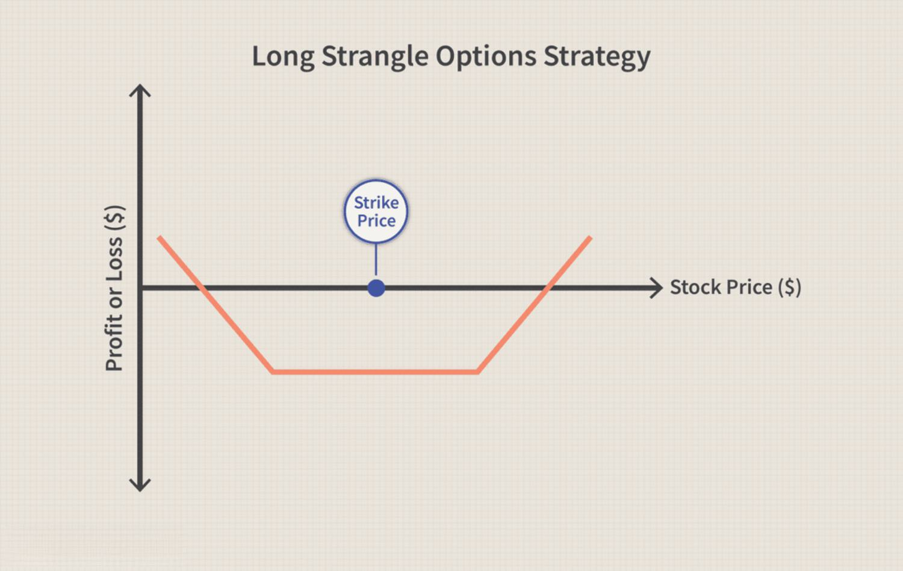

Options trading is a versatile strategy utilized by traders to profit from market volatility. Among the numerous strategies available, the strangle is widely recognized for its efficacy in scenarios where significant price swings are anticipated without a clear directional bias. The essence of the strangle strategy is the simultaneous purchase of call and put options on the same underlying asset, albeit with different strike prices. This dual-option approach makes the strangle particularly effective when major market movements are expected, but the direction of the move is uncertain.

The mechanics of a strangle strategy involve buying a call option and a put option with varying strike prices yet identical expiration dates. This configuration positions traders to capitalize on significant price movements as long as these movements surpass the combined cost of the options, thus achieving profitability regardless of whether the market moves up or down. Importantly, a strangle is generally less expensive compared to a straddle, given that it often involves buying out-of-the-money options that have lower premiums than their at-the-money counterparts.



This article offers a comprehensive analysis of the strangle strategy, including a comparison with the straddle strategy and insights into its implementation within algorithmic trading frameworks. The discussion will elucidate how traders can harness market volatility through strangles, highlighting the significant potential this strategy offers when executed effectively in volatile markets.

## Table of Contents

## What Is a Strangle?

A strangle is a strategic approach in options trading in which the trader simultaneously holds positions in both a call option and a put option on the same underlying asset. The critical aspect of a strangle is that these options have different strike prices but share the same expiration date. The primary objective of employing a strangle strategy is to capitalize on significant price movements in the underlying asset, regardless of whether the price increases or decreases.

This strategy employs out-of-the-money options, which are options with strike prices that are not favorable relative to the current market price of the underlying asset. For instance, in a long strangle, a trader may purchase a call option with a strike price above the current market price and a put option with a strike price below the current market price. This approach makes strangles generally less costly than straddles. Straddles involve purchasing both a call and a put option at the same strike price, effectively positioning them at-the-money.

The economic appeal of a strangle is rooted in its ability to profit from volatility. By selecting out-of-the-money options, traders can minimize upfront costs (the premiums paid for the options), although this comes with the necessity of needing a more significant price movement to achieve profitability. The cost-effectiveness of a strangle compared to a straddle can be mathematically expressed as follows:

$$
\text{Cost of Strangle} = \text{Premium of Call} + \text{Premium of Put}
$$

Since out-of-the-money options have lower premiums than at-the-money options, the cost of implementing a strangle is often lower, providing a budget-friendly alternative for speculating on [volatility](/wiki/volatility-trading-strategies). The trader's breakeven points are critical and are calculated by adding and subtracting the total premium paid for both options from their respective strike prices. The profit potential is theoretically unlimited on the upside and considerable on the downside, with the maximum loss capped at the premiums paid for both options.

In conclusion, a strangle is a versatile strategy for traders anticipating substantial volatility. By balancing the cost benefits of out-of-the-money options with the requisite for larger market movements, it provides a compelling option for dynamic market conditions.

## How Does a Strangle Work?

There are two main types of strangles: long strangle and short strangle.

In a long strangle, the trader purchases an out-of-the-money call option and an out-of-the-money put option on the same underlying asset. This strategy is designed to capitalize on anticipated significant volatility, regardless of the direction in which the price moves. The primary advantage of this approach is that the risk is limited to the total premiums paid for the call and put options. As such, if the price of the underlying asset remains stable or does not move sufficiently beyond the breakeven points, the trader's loss is limited to the option premiums. The potential for profit, however, arises when there is a substantial move in the price, either upwards or downwards, enabling the trader to sell the profitable option at a gain that exceeds the combined costs of both options. This setup can be particularly attractive when historical data or market sentiment suggests impending volatility.

A short strangle, conversely, involves the trader selling both an out-of-the-money call and an out-of-the-money put option. This strategy is typically implemented in markets exhibiting low volatility, as it profits from the stability of the underlying's price range. The primary objective is to retain the premium received from selling the options, capitalizing on the expectation that neither option will move significantly in-the-money by expiration. While the maximum profit is equivalent to the premium collected from both options, the risk is theoretically unlimited. Should the underlying asset's price experience a sharp increase or decrease beyond the strike prices, the trader is exposed to significant losses far exceeding the premiums received. Thus, a short strangle requires careful market analysis and monitoring, often incorporating a robust risk management plan to mitigate potential adverse movements.

## Strangle vs. Straddle

Both strangle and straddle options strategies are designed to capitalize on market volatility, but they differ fundamentally in their configuration. 

A straddle strategy involves purchasing both a call and a put option at the same strike price and expiration date. This means that the trader expects substantial price movement, but is uncertain about the direction. With a straddle, the break-even points can be calculated using the formula:

$$
\text{Break-even Points} = (\text{Strike Price} \pm \text{Total Premium})
$$

where the total premium is the sum of the call and put premiums. The costs associated with straddles are typically higher due to the use of at-the-money options, where both call and put options are closer to the current price of the underlying asset, therefore incurring higher premiums.

On the other hand, a strangle strategy involves buying an out-of-the-money call and an out-of-the-money put, which have different strike prices. This setup results in a lower cost compared to a straddle since the options are cheaper when purchased away from the current market price. However, to achieve profitability, the underlying asset must exhibit larger price swings. With a strangle, the break-even points are calculated as:

$$
\text{Lower Break-even} = \text{Put Strike Price} - \text{Total Premium}
$$
$$
\text{Upper Break-even} = \text{Call Strike Price} + \text{Total Premium}
$$

The choice between a strangle and a straddle will depend on the expected volatility and the trader’s budget for option premiums. Strangles offer a cost-effective alternative but require the underlying asset to move more substantially than straddles to realize profits.

## Real-World Example

Consider a stock currently trading at $50. A trader implementing a strangle strategy may decide to buy a call option with a strike price of $55 and a put option with a strike price of $45. Both options have the same expiration date. This positional setup capitalizes on anticipated volatility in the stock price without the necessity for a directional bias.

To understand how this works, consider the costs involved: assume the call option premium is $2 and the put option premium is $3. Hence, the total investment for the strangle is $5 per share.

The breakeven points for the strangle are calculated as follows:

1. **Breakeven for the Call Option** = Strike Price of Call + Total Premium Paid  
$$
   = 55 + 5 = 60 \text{ (in dollars)}

$$

2. **Breakeven for the Put Option** = Strike Price of Put – Total Premium Paid  
$$
   = 45 - 5 = 40 \text{ (in dollars)}

$$

For the strangle to be profitable, the stock price must move beyond these breakeven points by expiration. Any movement above $60 or below $40 results in a net positive return for the trader, assuming they either sell the options in the market or exercise them, depending on which option is in-the-money.

Let's consider a scenario where the stock price jumps to $60. Here, the call option can be exercised to buy the stock at $55 and sell it at the market price of $60, yielding a $5 profit per share above the premium. Mathematically, this translates to:

- **Profit from Call** = (Market Price at Expiration - Strike Price of Call) - Total Premium Paid  
$$
  = (60 - 55) - 5 = 0 \text{ (in dollars)}

$$

In this case, the trader would break even, since the profit from the exercise of the call option equals the initial cost of establishing the strangle position.

This example illustrates the potential for gains with a strangle when significant stock price volatility occurs, as increases beyond the $60 mark or decreases below the $40 mark would lead to profits after accounting for the initial premium expenses.

## Implementing Strangle Strategy in Algorithmic Trading

Algorithmic trading systems that incorporate strangles are programmed to execute trades based on predefined parameters and real-time market conditions. These systems are designed to capitalize on the volatility that the strangle strategy seeks to exploit. By continuously monitoring market variables, algorithmic setups can identify optimal moments to enter or [exit](/wiki/exit-strategy) a strangle position.

One key component of these systems is the use of volatility indices, such as the CBOE Volatility Index (VIX), which provides a quantitative measure of expected market volatility. By analyzing such indices, algorithms can determine when market conditions are ripe for a strangle strategy, as high volatility can lead to significant price movements favorable for strangle positions.

Moreover, specific stock metrics like moving averages or Relative Strength Index (RSI) are also utilized to enhance decision-making. For instance, an algorithm may be programmed to initiate a strangle trade when a stock’s volatility surpasses a certain threshold or when it crosses moving average lines, indicating potential price fluctuations.

Python, due to its extensive libraries such as NumPy for numerical computations and Pandas for data analysis, is commonly used to develop these algorithms. A basic outline for an [algorithmic trading](/wiki/algorithmic-trading) script employing a strangle strategy might look like this:

```python
import numpy as np
import pandas as pd
from scipy.stats import norm

def calculate_volatility(df, window=30):
    return df['Close'].rolling(window=window).std() * np.sqrt(window)

def execute_strangle_trade(df, call_strike, put_strike, expiry):
    # Determine when to enter trade based on volatility and other parameters
    volatility = calculate_volatility(df)
    for index, row in df.iterrows():
        if volatility[index] > threshold:
            # Entering strangle: Buy call and put options
            buy_call = max(row['Close'] - call_strike, 0)
            buy_put = max(put_strike - row['Close'], 0)
            # Implement more complex logic as required
    # Monitor and execute exit strategy on expiry or conditions met
```

Algorithmic trading effectively eliminates emotional biases that can hinder decision-making in manual trading. It provides a systematic approach to identifying entry and exit points based on statistical calculations and predetermined conditions. This precision keeps strangle traders agile in dynamic markets, maximizing the potential to harness significant price swings while maintaining risk management protocols.

Ultimately, the fusion of strangle strategies with algorithmic trading techniques can empower traders to efficiently navigate and exploit market volatility, enabling a more consistent and strategic trading performance.

## Conclusion

The strangle strategy remains a robust mechanism for traders aiming to exploit market volatility. By understanding its mechanics—namely, simultaneously holding both call and put options with different strike prices—traders can anticipate and profit from significant price movements in either direction. Proper alignment of this strategy with prevailing market conditions is crucial to maximize its profitability. Volatile markets provide the ideal backdrop where the price swings surpass the breakeven points calculated from the option premiums and strike prices involved.

Incorporating strangles into algorithmic trading systems further enhances their potential. This approach leverages automated systems to execute trades based on pre-specified criteria, thereby optimizing entry and exit points while eliminating emotional biases that might cloud judgement. For instance, traders can program algorithms to trigger strangle trades when volatility indices hit a certain threshold, ensuring timely execution in rapidly changing markets.

Overall, the adept application of strangles, whether through manual trades or algorithmic strategies, provides a valuable edge for traders adept at navigating volatile environments. By applying sound logic and precise execution, this strategy can yield significant returns from market fluctuations.

## References & Further Reading

[1]: Natenberg, S. (1994). ["Option Volatility & Pricing: Advanced Trading Strategies and Techniques"](https://www.amazon.com/Option-Volatility-Pricing-Strategies-Techniques/dp/0071818774). McGraw-Hill Education.

[2]: Kolb, R. W., & Overdahl, J. A. (2010). ["Financial Derivatives: Pricing and Risk Management."](https://books.google.com/books/about/Financial_Derivatives.html?id=NJ5mBgAAQBAJ) Wiley.

[3]: Hull, J. C. (2017). ["Options, Futures, and Other Derivatives."](https://www.semanticscholar.org/paper/Options%2C-Futures%2C-and-Other-Derivatives-Hull/89bdee500c8623864fc9eb7a471546aa713acc44) Pearson.

[4]: Taleb, N. N. (2010). ["Dynamic Hedging: Managing Vanilla and Exotic Options."](https://www.amazon.com/Dynamic-Hedging-Managing-Vanilla-Options/dp/0471152803) Wiley.

[5]: "CBOE Volatility Index (VIX)." [Chicago Board Options Exchange](https://www.cboe.com/tradable_products/vix/).