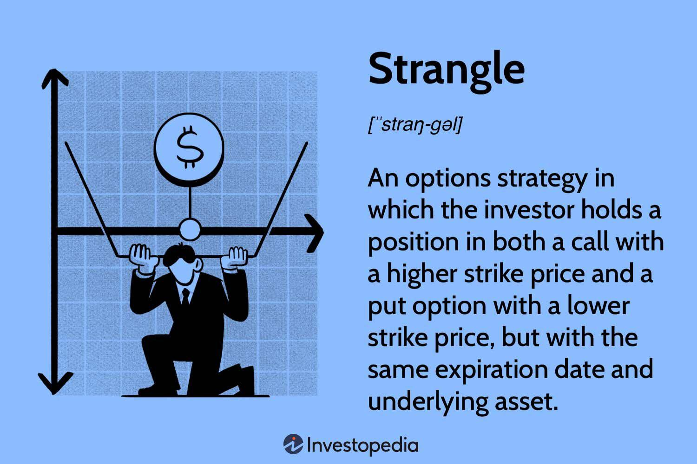

## Table of Contents

## What is the Strangle Strategy in finance?

The Strangle Strategy in finance is an options trading technique used by investors to profit from significant price movements in a stock, regardless of whether the price goes up or down. It involves buying both a call option and a put option on the same underlying asset with the same expiration date, but with different strike prices. The call option has a higher strike price, while the put option has a lower strike price. This setup allows the investor to make money if the stock price moves a lot in either direction, but it requires the stock to move more than the combined cost of the options for the strategy to be profitable.

The main advantage of the Strangle Strategy is that it can be less expensive than a similar strategy called the Straddle, which uses options with the same strike price. Because the options in a Strangle are out-of-the-money (meaning the stock price is not currently at the strike price), they are cheaper to buy. However, this also means that the stock needs to move more significantly for the strategy to be profitable. The Strangle is best used when an investor expects a big move in the stock price but is unsure of the direction. It's a way to bet on volatility without having to predict whether the stock will go up or down.

## How does a Strangle differ from a Straddle?

A Strangle and a Straddle are both options trading strategies that let you make money if a stock price moves a lot. The main difference is in how you set them up. In a Straddle, you buy a call option and a put option with the same expiration date and the same strike price. This means you think the stock will move a lot, but you're not sure if it will go up or down. In a Strangle, you also buy a call and a put with the same expiration date, but they have different strike prices. The call's strike price is higher than the current stock price, and the put's strike price is lower.

The Strangle is usually cheaper to set up than a Straddle because the options you buy are out-of-the-money, meaning they are less likely to be profitable right away. This makes each option cheaper to buy. However, because of this, the stock needs to move more for you to make money with a Strangle compared to a Straddle. So, you use a Strangle when you expect a big move in the stock but aren't sure which way it will go, and you want to spend less money upfront.

## What are the key components of a Strangle?

A Strangle is a strategy in options trading where you buy two options on the same stock that will expire at the same time. One option is a call, which you can use if the stock price goes up. The other is a put, which you can use if the stock price goes down. The important thing about a Strangle is that the call option has a higher price point (strike price) than the current stock price, and the put option has a lower price point than the current stock price.

The main idea behind a Strangle is to make money if the stock price moves a lot, no matter if it goes up or down. Because the options you buy are not at the current stock price, they are cheaper to buy. But, this also means the stock has to move a lot more for you to make money compared to other strategies. You use a Strangle when you think the stock will have a big change but you're not sure which way it will go, and you want to spend less money to start.

## When is it appropriate to use a Strangle Strategy?

You should use a Strangle Strategy when you think a stock will move a lot but you're not sure if it will go up or down. This strategy is good for times when there's a big event coming up, like a company earnings report or a product launch. These events can make the stock price jump around a lot, and a Strangle lets you make money no matter which way it goes.

A Strangle is also a good choice if you want to spend less money upfront. Because the options you buy are not at the current stock price, they cost less than other strategies like a Straddle. But remember, the stock needs to move more for you to make money with a Strangle. So, it's best when you expect a big move and you're okay with waiting for it to happen.

## What are the potential risks associated with using a Strangle?

Using a Strangle Strategy comes with some risks. The biggest one is that the stock might not move enough to make the strategy profitable. Since you're buying options that are out-of-the-money, they are cheaper, but they also need the stock to move more to be worth anything. If the stock stays pretty much where it is or only moves a little bit, you could lose all the money you spent on the options.

Another risk is time decay. Options lose value as they get closer to their expiration date. If the big move you're expecting doesn't happen quickly enough, the value of your options could drop to zero before the stock moves enough. This means you need to be right about not just the direction of the move, but also when it will happen. So, it's important to keep an eye on the timing and be ready to adjust your strategy if things aren't going as planned.

## How can a Strangle be used to hedge against market volatility?

A Strangle can be used to hedge against market [volatility](/wiki/volatility-trading-strategies) by allowing you to make money if the market moves a lot, no matter which way it goes. If you're worried that the market might swing wildly because of some big news or event, you can buy a Strangle. This means you buy a call option with a higher strike price and a put option with a lower strike price on the same stock or index. If the market goes up a lot, the call option will make money. If it goes down a lot, the put option will make money. This way, you're protected no matter what happens.

The key to using a Strangle as a hedge is to understand that it's not about making a lot of money, but about protecting yourself from big losses. The cost of the options is your insurance premium. If the market stays calm and doesn't move much, you might lose the money you spent on the options, but your main investments will be safe. If the market does move a lot, the gains from the Strangle can help offset any losses in your other investments. So, it's a way to sleep better at night knowing you're covered if things get crazy.

## What are the profit and loss scenarios for a Strangle?

When you use a Strangle, you can make money if the stock moves a lot in either direction. Let's say you buy a call option with a higher strike price and a put option with a lower strike price. If the stock price goes up a lot and is above the call's strike price at expiration, the call option becomes valuable and you can sell it for a profit. The put option will expire worthless, but the profit from the call can be more than enough to cover the cost of both options. On the other hand, if the stock price drops a lot and is below the put's strike price at expiration, the put option becomes valuable and you can sell it for a profit. The call option will expire worthless, but again, the profit from the put can cover the cost of both options and then some.

However, there's also a risk that you could lose money. If the stock price doesn't move much and stays between the two strike prices until the options expire, both the call and the put will be worthless. You'll lose the money you spent to buy the options. This is the break-even point, where the stock price would need to move outside of a certain range for you to start making money. The bigger the move in the stock price, the more profit you can make, but if the stock doesn't move enough, you'll be out the cost of the options.

## Can you explain the break-even points for a Strangle?

A Strangle has two break-even points because you buy both a call option and a put option with different strike prices. The first break-even point is the call option's strike price plus the total cost of the options you bought. If the stock price goes above this point by the time the options expire, you start making money. The second break-even point is the put option's strike price minus the total cost of the options. If the stock price drops below this point by the time the options expire, you also start making money.

The space between these two break-even points is where you lose money. If the stock price stays within this range until the options expire, both the call and the put will be worthless, and you'll lose the money you spent on them. So, for a Strangle to be profitable, the stock price needs to move a lot in either direction, beyond these break-even points.

## How does time decay affect a Strangle position?

Time decay, or theta, is the loss of value in options as they get closer to their expiration date. This is bad news for a Strangle because you're buying options that are out-of-the-money, meaning they have no value right now and need the stock to move a lot to be worth something. As time goes by, these options lose value every day, making it harder for them to become profitable. If the big move in the stock price you're waiting for doesn't happen quickly enough, the options can become worthless before the stock moves enough.

To handle time decay, you need to be careful about when you set up your Strangle. If you think the big move will happen soon, like before an earnings report or a big news event, a Strangle might work well. But if you're not sure when the move will happen, you might want to think about other strategies or be ready to adjust your Strangle as time goes on. Time decay is something you always have to keep in mind when using a Strangle.

## What are some advanced techniques for adjusting a Strangle?

One advanced technique for adjusting a Strangle is to roll the options. If the stock isn't moving as much as you expected and time is running out, you can sell your current options and buy new ones with a later expiration date. This gives the stock more time to make a big move. You might also choose to adjust the strike prices of the new options, either moving them closer to the current stock price to make it easier to profit or further away if you think the stock will make an even bigger move.

Another technique is to close out one side of the Strangle if the stock starts moving in one direction. If the stock goes up a lot, the put option might not be worth much anymore, so you can sell it and keep the call option open. This way, you can use the money from selling the put to lower your costs or even make a profit. If the stock goes down a lot, you can do the same thing with the call option. This helps you manage your risk and make the most of the move in the stock price.

A third technique is to add more options to your Strangle, turning it into a more complex strategy like an Iron Condor or a Butterfly. For example, if the stock isn't moving much, you can sell an out-of-the-money call and put to bring in more money. This can help cover the cost of the original Strangle, but it also limits your potential profit if the stock does make a big move. Adjusting a Strangle like this requires a good understanding of options and a clear plan for what you want to achieve.

## How do implied volatility and historical volatility influence the effectiveness of a Strangle?

Implied volatility and historical volatility can both affect how well a Strangle works. Implied volatility is what people think the stock will do in the future, and it's built into the price of the options you buy. If implied volatility is high, it means people expect the stock to move a lot, so the options will be more expensive. This can make it harder for a Strangle to be profitable because you have to pay more upfront. But if you're right and the stock does move a lot, the high implied volatility can help you make more money. On the other hand, if implied volatility is low, the options are cheaper, making it easier to set up a Strangle. But if the stock doesn't move as much as you hoped, the low implied volatility might mean you don't make as much money.

Historical volatility is about how much the stock has moved in the past. If a stock has a history of big moves, it might be a good choice for a Strangle because you expect it to keep moving a lot. But if the stock usually doesn't move much, a Strangle might not be the best choice because you need a big move to make money. Knowing the historical volatility can help you pick the right stocks for your Strangle and set your expectations for how much the stock might move. Both implied and historical volatility are important to think about when you're deciding if a Strangle is a good strategy for you.

## What are real-world examples of successful Strangle Strategies?

One real-world example of a successful Strangle Strategy was during the 2008 financial crisis. Many investors expected big moves in the stock market but were unsure which way it would go. Some smart traders bought Strangles on major indexes like the S&P 500. When the market crashed, the put options they bought became very valuable, helping them make money even as the market fell. This showed how a Strangle can work well when you expect a big move but don't know the direction.

Another example happened around the time of the Brexit vote in 2016. The uncertainty about whether the UK would leave the European Union made the market very volatile. Some traders used Strangles on the British pound and major European stock indexes. When the vote results came in and the pound dropped sharply, those who had put options on the pound made a lot of money. This example shows how Strangles can be useful during times of big news or events that could shake up the market.

## What are the factors affecting the strangle strategy?

Market conditions such as volatility, time decay, and delta significantly influence the profitability and risk management of the strangle strategy. Understanding these elements is crucial for traders aiming to optimize their strategies.

### Volatility

Volatility is one of the primary factors affecting the strangle strategy. As a measure of an asset's price fluctuations, higher volatility indicates that significant price movements are more likely, which benefits long strangle positions. Conversely, low volatility tends to benefit short strangles, which aim to profit from minimal price movement. The Option Greeks, particularly Vega, measure sensitivity to volatility changes:

$$
\Delta \text{Option Price} = \text{Vega} \times \Delta \text{Volatility}
$$

A rise in implied volatility typically increases option premiums, enhancing the value of a long strangle due to the ownership of both call and put options. Traders must, therefore, monitor volatility forecasts and implied volatility indices to adjust their positions appropriately.

### Time Decay

Time decay, represented by the Greek Theta, refers to the reduction in the value of options as they approach their expiration date. This decay is a critical consideration for strangle strategies because it affects long and short positions differently. Long strangles, which involve purchasing options, suffer from erosion in option value due to time decay, as each day reduces the option's extrinsic value:

$$
\Delta \text{Option Price} = \Theta \times \Delta \text{Time}
$$

Short strangles, on the other hand, benefit from time decay because they involve selling options. As expiration nears, the options' time value diminishes, aiding profit realization if market prices stabilize. Effective management of time decay involves selecting appropriate expiration dates and considering the pace of theta decay across different time horizons.

### Delta and Strike Choice

Delta represents the sensitivity of an option's price to changes in the underlying asset's price. In strangle strategies, delta is crucial in selecting the right strike prices. Out-of-the-money (OTM) options generally have lower deltas, meaning they are less sensitive to underlying price movements, while at-the-money (ATM) options have deltas around 0.5 for calls and -0.5 for puts, indicating higher sensitivity.

Choosing between OTM and ATM options depends on the trader's market outlook and risk appetite:
- **OTM options**: Usually cheaper, lower premium cost, potential for significant percentage gains, but require more substantial asset movements to become profitable.
- **ATM options**: Higher premium, more expensive, greater probability of profitability with relatively smaller movements in the underlying asset.

Selecting the optimal strike prices involves balancing these factors alongside expected volatility and market conditions. Assessing these elements with precision supports the optimization of strangle strategies for enhanced profitability.

By understanding how volatility, time decay, and delta affect the strangle strategy, traders can make informed decisions to adopt and adjust their trading approaches for maximum effectiveness in varying market environments.

## References & Further Reading

[1]: Natenberg, S. (1994). ["Option Volatility and Pricing: Advanced Trading Strategies and Techniques."](https://www.amazon.com/Option-Volatility-Pricing-Strategies-Techniques/dp/0071818774) McGraw-Hill Education.

[2]: Hull, J. C. (2017). ["Options, Futures, and Other Derivatives."](https://www.semanticscholar.org/paper/Options%2C-Futures%2C-and-Other-Derivatives-Hull/89bdee500c8623864fc9eb7a471546aa713acc44) Pearson.

[3]: Taleb, N. N. (1997). ["Dynamic Hedging: Managing Vanilla and Exotic Options."](https://www.amazon.com/Dynamic-Hedging-Managing-Vanilla-Options/dp/0471152803) Wiley.

[4]: Chan, E. P. (2009). ["Quantitative Trading: How to Build Your Own Algorithmic Trading Business."](https://github.com/ftvision/quant_trading_echan_book) Wiley.

[5]: Jansen, S. (2020). ["Machine Learning for Algorithmic Trading: Predictive models to extract signals from market and alternative data for systematic trading strategies with Python."](https://www.amazon.com/Machine-Learning-Algorithmic-Trading-alternative/dp/1839217715) Packt Publishing.

[6]: Lopez de Prado, M. (2018). ["Advances in Financial Machine Learning."](https://www.amazon.com/Advances-Financial-Machine-Learning-Marcos/dp/1119482089) Wiley.

[7]: Black, F., & Scholes, M. (1973). ["The Pricing of Options and Corporate Liabilities."](https://www.cs.princeton.edu/courses/archive/fall09/cos323/papers/black_scholes73.pdf) Journal of Political Economy, 81(3), 637-654.

[8]: Bodie, Z., Kane, A., & Marcus, A. J. (2019). ["Investments."](https://www.mheducation.com/highered/product/Investments-Bodie.html) McGraw-Hill Education. 

[9]: Aronson, D. R. (2006). ["Evidence-Based Technical Analysis: Applying the Scientific Method and Statistical Inference to Trading Signals."](https://onlinelibrary.wiley.com/doi/book/10.1002/9781118268315) Wiley.