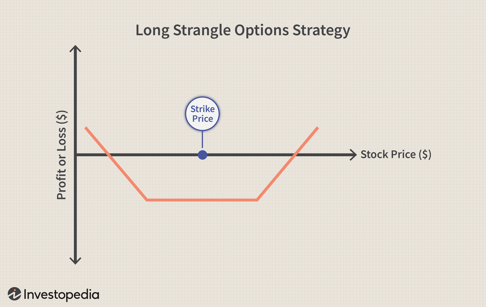

Options trading offers a vast array of strategies tailored to varying market conditions and risk appetites. Among these, the strangle strategy stands out as a flexible technique aimed at capitalizing on substantial price shifts, regardless of direction. A strangle involves simultaneously holding positions in both a call and a put option with different strike prices, typically out-of-the-money. This strategy is particularly advantageous in volatile markets where significant price movements are anticipated but the direction is uncertain.

In this article, we will uncover the mechanics behind the strangle strategy and explore how it can be leveraged through algorithmic trading to optimize execution and outcomes. Algorithmic trading has revolutionized financial markets by providing tools to automate and enhance trading strategies, reducing the potential for human error and allowing traders to focus on strategy development rather than execution minutiae.



We will further differentiate between long and short strangles, highlighting how traders can decide on the appropriate approach based on their market outlook and risk tolerance. Long strangles aim to benefit from increased volatility, whereas short strangles profit from stable market conditions within a defined range. The effectiveness of either type is influenced by a variety of factors, including volatility levels and options expiration dates.

Additionally, the integration of financial algorithms can significantly elevate the execution of strangle strategies. Algorithms can handle complex calculations and facilitate prompt decision-making, offering the precision and speed that manual trading might lack. This synergy between strangle strategies and algorithmic trading holds potential for enhancing the strategy's efficiency and execution in real-world applications, especially in unpredictable and fast-moving market environments.

## Table of Contents

## Understanding the Strangle Strategy

A strangle is an options strategy designed to profit from significant price movements of an underlying asset, regardless of the movement's direction. This strategy involves holding a position in both a call option and a put option with different strike prices but with the same expiration date. Typically, both options are out-of-the-money (OTM), which makes the strangle a cost-effective approach for traders expecting high volatility but not a particular directional bias.

The primary goal of executing a strangle is to benefit from significant swings in the asset's price. The potential for profit arises from either the increase in the asset's value, potentially benefiting the call option, or a decrease, favoring the put option. At the outset, the cost to set up this strategy is usually lower compared to its counterpart, the straddle, where both options strike prices are set at-the-money (ATM).

### Comparing Strangle and Straddle Strategies

The strangle strategy's flexibility and reduced initial cost make it an attractive choice compared to the straddle. In a straddle, both call and put options are purchased at the same strike price, typically close to the current price of the underlying asset, leading to higher premiums paid upfront due to the symmetrical positioning. While straddles can potentially yield higher profit margins when the asset price moves considerably ATM options in a straddle have higher [volatility](/wiki/volatility-trading-strategies) sensitivity (Vega), making them more expensive.

On the other hand, strangles, with their different strike prices, provide a cheaper alternative with flexibility in terms of strike selection. The differential in strike prices allows traders to set their profit zone further from the ATM, thereby reducing premium costs. However, for a strangle to be profitable, the asset's price movement must be significant enough to surpass the combined cost of both option premiums, plus any transaction costs.

### Key Components of a Strangle

Implementing a strangle strategy effectively requires careful consideration of two key components: the selection of strike prices and the expiration dates. 

**Strike Prices:** When selecting strike prices, the goal is to align them with the expected volatility and movement potential of the underlying asset. The call option strike is set above the current asset price, while the put option strike is set below. The decision on how far OTM these strikes should be depends on the trader's anticipation of the market movement range and their risk tolerance.

**Expiration Dates:** The strategy's success is also contingent on choosing suitable expiration dates. Longer expiration periods offer more time for the asset's price movement to materialize but come at the cost of higher premium expenditures due to increased time value. In contrast, shorter expirations are cost-effective but require the anticipated price movement to occur quickly.

Overall, the strangle strategy is well-suited for traders looking to exploit volatility without committing to a specific price direction. Its attractiveness stems from the balance between cost efficiency and potential profits, contingent on strategic strike price selection and optimal timing of contract expiration.

## Types of Strangles: Long and Short

Long and short strangles represent two distinct approaches in options trading, each catering to different market expectations and risk profiles. 

### Long Strangles

A long strangle strategy involves purchasing both call and put options with the same expiration date but different strike prices, usually out-of-the-money. This strategy is predicated on the anticipation of significant volatility in the underlying asset. The investor does not need to predict whether the price movement will be upward or downward, only that it will be substantial enough to exceed the total premium paid for the options.

**Benefits of Long Strangles:**

1. **Volatility Advantage**: Long strangles profit from increased volatility, making them suitable when traders expect significant price swings but are uncertain of the direction. This is particularly advantageous around earnings announcements or major economic events.

2. **Limited Risk**: The maximum loss for a long strangle is confined to the total premium paid for the call and put options, making it less risky than other strategies where losses can be theoretically unlimited.

**Risks of Long Strangles:**

1. **Time Decay**: As time passes, the value of the options erodes, which can be detrimental if the expected price movement does not occur rapidly.

2. **Need for Substantial Movement**: The underlying asset must move significantly in either direction to surpass the break-even points for the strategy to be profitable.

**Example Scenario:**
An investor might implement a long strangle on a stock trading at $100 by buying a 105 call and a 95 put. If the stock moves beyond $110 or below $90, the investor stands to profit.

### Short Strangles

In contrast, a short strangle involves selling a call and a put option with the same expiration date and different strike prices, also usually out-of-the-money. This strategy aims to capitalize on minimal price movement, allowing the seller to profit from the premiums received.

**Benefits of Short Strangles:**

1. **Income Generation**: By selling options, traders receive premium income upfront. This strategy benefits when the market remains stable, and options expire worthless.

2. **High Probability of Success**: As most options expire without being exercised, the strategy can be successful more often than not, provided volatility remains low.

**Risks of Short Strangles:**

1. **Unlimited Risk**: Potential losses are theoretically unlimited for the call side if the market moves significantly upwards and substantial on the put side if it moves sharply downwards.

2. **Exposure to Volatility**: A sudden increase in volatility or unexpected market news can lead to significant losses.

**Example Scenario:**
A trader might write a short strangle on the same $100 stock by selling a 105 call and a 95 put. If the stock stays between these two levels, both options expire worthless, and the trader retains the premium.

In summary, choosing between a long or short strangle depends largely on market expectations. Long strangles are advantageous in volatile environments where large movements are anticipated, whereas short strangles favor periods of market stability where significant price shifts are not expected. Selecting the appropriate strategy requires careful consideration of volatility forecasts, market conditions, and risk tolerance.

## Factors Affecting Strangle Strategy

Market conditions such as volatility, time decay, and delta significantly influence the profitability and risk management of the strangle strategy. Understanding these elements is crucial for traders aiming to optimize their strategies.

### Volatility

Volatility is one of the primary factors affecting the strangle strategy. As a measure of an asset's price fluctuations, higher volatility indicates that significant price movements are more likely, which benefits long strangle positions. Conversely, low volatility tends to benefit short strangles, which aim to profit from minimal price movement. The Option Greeks, particularly Vega, measure sensitivity to volatility changes:

$$
\Delta \text{Option Price} = \text{Vega} \times \Delta \text{Volatility}
$$

A rise in implied volatility typically increases option premiums, enhancing the value of a long strangle due to the ownership of both call and put options. Traders must, therefore, monitor volatility forecasts and implied volatility indices to adjust their positions appropriately.

### Time Decay

Time decay, represented by the Greek Theta, refers to the reduction in the value of options as they approach their expiration date. This decay is a critical consideration for strangle strategies because it affects long and short positions differently. Long strangles, which involve purchasing options, suffer from erosion in option value due to time decay, as each day reduces the option's extrinsic value:

$$
\Delta \text{Option Price} = \Theta \times \Delta \text{Time}
$$

Short strangles, on the other hand, benefit from time decay because they involve selling options. As expiration nears, the options' time value diminishes, aiding profit realization if market prices stabilize. Effective management of time decay involves selecting appropriate expiration dates and considering the pace of theta decay across different time horizons.

### Delta and Strike Choice

Delta represents the sensitivity of an option's price to changes in the underlying asset's price. In strangle strategies, delta is crucial in selecting the right strike prices. Out-of-the-money (OTM) options generally have lower deltas, meaning they are less sensitive to underlying price movements, while at-the-money (ATM) options have deltas around 0.5 for calls and -0.5 for puts, indicating higher sensitivity.

Choosing between OTM and ATM options depends on the trader's market outlook and risk appetite:
- **OTM options**: Usually cheaper, lower premium cost, potential for significant percentage gains, but require more substantial asset movements to become profitable.
- **ATM options**: Higher premium, more expensive, greater probability of profitability with relatively smaller movements in the underlying asset.

Selecting the optimal strike prices involves balancing these factors alongside expected volatility and market conditions. Assessing these elements with precision supports the optimization of strangle strategies for enhanced profitability.

By understanding how volatility, time decay, and delta affect the strangle strategy, traders can make informed decisions to adopt and adjust their trading approaches for maximum effectiveness in varying market environments.

## Integrating Algorithmic Trading

Algorithmic trading, often referred to as algo-trading, involves the use of computer programs to execute trades based on a defined set of instructions. In the context of strangle strategies, algorithms greatly enhance execution by managing complexities and minimizing human error, a crucial [factor](/wiki/factor-investing) given the fast-paced nature of financial markets.

### Advantages of Algorithmic Trading in Strangle Strategies

1. **Efficiency and Speed**: Algorithms are capable of executing trades at a speed and frequency that a human trader cannot achieve, which is crucial for capturing short-lived market opportunities that can arise in strangle strategies.

2. **Consistency and Precision**: By adhering strictly to pre-specified rules, algorithms eliminate human emotions from trading decisions, strengthening the consistency and precision of trade execution. This is particularly beneficial for strangles where timing and accurate execution are vital.

3. **Complex Calculations**: Algorithms can perform complex calculations rapidly, which is essential in determining optimal entry and exit points in a strangle setup. This includes evaluating parameters such as implied volatility, option Greeks (Delta, Gamma, Theta, Vega), and the volatility skew between different strike prices.

4. **Backtesting and Optimization**: Algorithms allow traders to backtest strangle strategies against historical data, helping identify conditions under which the strategies perform best. This aids in optimizing parameters like strike prices and expiration dates, critical decisions in a strangle execution.

### Algorithmic Implementation Examples

A simple algorithmic approach to execute a strangle strategy could involve the automatic placement of orders for both call and put options when specific market conditions are met. Below is a Python snippet utilizing a simplified trading algorithm for implementing a strangle strategy:

```python
import numpy as np

# Hypothetical market conditions and strategy parameters
underlying_price = 100  # Current price of the underlying asset
call_strike = 110       # Strike price for the call option
put_strike = 90         # Strike price for the put option
target_volatility = 0.2  # Desired market volatility condition

def place_order(option_type, strike_price):
    # Placeholder function to simulate order placement
    print(f"Placing {option_type} order at strike {strike_price}")

# Simulate market volatility fetching
current_volatility = np.random.uniform(0, 0.5)  # Randomized for demonstration

# Algorithm to execute strangle strategy based on volatility condition
if current_volatility > target_volatility:
    place_order('Call', call_strike)
    place_order('Put', put_strike)
```

In this basic illustration, the algorithm checks if the current market volatility exceeds a target threshold and, if so, executes a long strangle by placing a buy order for both a call and a put option around the current price of the underlying asset.

### Sophisticated Algorithmic Techniques

Advanced algorithms may integrate [machine learning](/wiki/machine-learning) models to predict market movements more accurately and dynamically adjust the strangle strategy parameters. For instance, [reinforcement learning](/wiki/reinforcement-learning) models can optimize the strategy execution by continuously learning from market feedback and adjusting actions to maximize a defined payoff.

Moreover, the use of complex statistical techniques like Monte Carlo simulations can help in assessing risk and potential returns, providing a probabilistic forecast of various outcomes in volatile markets typical for strangles.

### Conclusion

Incorporating [algorithmic trading](/wiki/algorithmic-trading) in strangle strategies enhances their execution by leveraging technology's speed, accuracy, and analytical power. These capabilities not only improve the tactical implementation of strangles but also allow traders to craft more sophisticated strategies that can adapt to diverse market conditions effectively. This underscores the importance of continuous learning and technological integration for sustained success in modern options trading.

## Real-World Applications and Case Studies

In real-world trading, strangle strategies are often employed during periods of high market volatility, which increases the likelihood of significant price movements. This part of the article will highlight examples of successful implementation of strangles and illustrate how algorithmic trading can enhance these strategies.

### Example 1: Earnings Announcements
One of the most common applications of the strangle strategy is during corporate earnings announcements. Companies often experience significant price fluctuations when they release earnings reports due to unpredictability surrounding the financial results. Traders can use the strangle strategy to capitalize on these volatile swings without needing to anticipate the direction of the movement.

For instance, consider a company XYZ, which is known for major stock price movements on its earnings day. A trader might purchase a long strangle by buying a call option with a strike price slightly above the current market value and a put option with a strike price slightly below the current market value. The trader's profitability hinges on the magnitude of the price movement post-announcement, regardless of the direction.

### Case Study: Algorithmic Strangle Trading
Algorithmic trading can significantly improve the execution of strangle strategies by automating processes, managing risks, and ensuring timely trades. For example, an algorithm can be programmed to enter a strangle position only when certain pre-defined volatility thresholds or other market conditions are met, thereby optimizing entry timing and reducing human error.

To illustrate with a simple Python-based algorithm:
```python
import yfinance as yf  # For more datasets, visit: https://paperswithbacktest.com/datasets
from datetime import datetime, timedelta

# Parameters
ticker = "XYZ"
expiry_date = datetime.today() + timedelta(days=30)
call_strike = 105
put_strike = 95

# Fetch historical volatility and calculate implied volatility thresholds
data = yf.Ticker(ticker)
if data.history(period="1mo").volatility > 0.3:  # Volatility threshold
    # Place a long strangle trade
    # Buy a call option
    call_option = data.option_chain(expire=expiry_date)['calls'].set_index('strike').loc[call_strike]
    # Buy a put option
    put_option = data.option_chain(expire=expiry_date)['puts'].set_index('strike').loc[put_strike]

    # Algorithm initiates purchase
    print("Initiated Strangle Trade: Buy Call at", call_option['lastPrice'], "and Put at", put_option['lastPrice'])
```

This algorithm evaluates the implied volatility and only initiates a long strangle trade if the volatility exceeds a specified threshold. Such strategies are deployed by hedge funds and institutional traders to execute large quantities of trades cohesively and efficiently.

### Outcome Analysis
In practice, the success of algorithmic strangle strategies depends on accurately forecasting volatility and managing the risk of time decay and market stability. Performance can be analyzed by evaluating the premiums paid for the options against the ensuing price movements of the underlying asset. Algorithms can be backtested using historical data to ensure profitability over time.

For instance, in a backtest, if the underlying asset frequently moved beyond breakeven points (i.e., beyond the total premium paid for both options), the strategy would be classified as successful, demonstrating the power of strangles in volatile markets.

These applications underscore the versatility and potential profitability of strangle strategies, especially when enhanced with cutting-edge algorithmic solutions.

## Benefits and Challenges

The strangle strategy in options trading offers several notable benefits. One of its primary advantages is flexibility. Because strangles involve holding both a call and a put option with different strike prices, traders can profit from significant price movements regardless of the direction. This makes strangles particularly useful in highly volatile markets where price directions are unpredictable. 

Strangles generally cost less than straddles. While both strategies aim to benefit from large price swings, a straddle requires purchasing both options at the same strike price, often leading to higher premiums, especially when measured against at-the-money options. In contrast, the strangle uses out-of-the-money options, which tend to be cheaper, making it a cost-effective alternative.

The potential for high returns is another compelling benefit of the strangle strategy. When market movements are substantial, and the underlying asset price moves past the breakeven points, traders can achieve significant gains. The breakeven points for a long strangle can be calculated as:
$$
\text{Upper Breakeven} = \text{Strike Price of Call} + \text{Total Premium Paid}
$$
$$
\text{Lower Breakeven} = \text{Strike Price of Put} - \text{Total Premium Paid}
$$

However, trading strangles also involves challenges. Managing risk is crucial, especially in short strangles where potential losses are theoretically unlimited if the market moves sharply against the sold options. Unlike long strangles where maximum risk is limited to the premium paid, short strangles expose traders to significant risks if the market deviates significantly from the anticipated stable range.

Precise execution timing is another challenge with strangles. The effectiveness of this strategy heavily depends on entering and exiting trades at optimal times. Misjudging market conditions or volatility can lead to unfavorable outcomes.

To overcome these challenges, strategic planning and consistent risk management are essential. Traders should:

1. Employ volatility forecasting tools to gauge market movements accurately.
2. Set predefined entry and exit points based on risk tolerance and market analysis.
3. Use stop-loss orders to cap potential losses in adverse conditions.
4. Regularly reassess positions to adjust for changing market conditions.
5. Consider algorithmic trading to enhance timing precision and mitigate human error in execution.

By balancing the strangle strategy's inherent flexibility with prudent risk management, traders can better navigate its complexities and harness its potential rewards.

## Conclusion

The strangle strategy presents notable opportunities for options traders aiming to capitalize on significant market movements without predicting a specific direction. This versatility permits investors to potentially profit in various market conditions by employing both call and put options with different strike prices. Through its inherent flexibility and cost advantages compared to the straddle strategy, strangle trading can be an attractive option for experienced market participants.

Enhancing the efficiency and accuracy of the strangle strategy through algorithmic trading is increasingly prevalent. By using automated systems to execute trades, traders can overcome the difficulties of managing complex options positions and minimize the risk of human error. Algorithms enable traders to swiftly adjust their strategies in response to market conditions, tailoring their approaches based on predefined criteria like volatility thresholds or specific price movements. For example, Python libraries such as `pandas` and `numpy` can assist in building algorithms to backtest strangle strategies, assessing historical data to optimize parameters such as strike prices and expiration dates.

```python
import pandas as pd
import numpy as np

def backtest_strangle_strategy(prices, call_strike, put_strike):
    # Example function to simulate profits from a strangle strategy
    call_profits = np.maximum(prices - call_strike, 0)
    put_profits = np.maximum(put_strike - prices, 0)
    total_profits = call_profits + put_profits
    return total_profits.mean()

prices = pd.Series([105, 110, 99, 112, 95])
call_strike = 100
put_strike = 100
average_profit = backtest_strangle_strategy(prices, call_strike, put_strike)
print("Average Profit:", average_profit)
```

The dynamic nature of financial markets and the inherent risks in options trading underscore the necessity for continuous learning and adaptation by traders. Market conditions, particularly volatility and [interest rate](/wiki/interest-rate-trading-strategies) changes, require constant monitoring to align trading strategies with current realities. Furthermore, adopting a disciplined approach informed by a thorough understanding of the factors influencing strangle strategies can lead to more decisive and timely decision-making. A robust risk management framework, including appropriate position sizing and diversification, is vital to mitigate potential losses, especially concerning the unlimited risk associated with short strangles.

In conclusion, while the strangle strategy offers significant potential for profit, it also demands a comprehensive understanding and careful execution. By integrating algorithmic trading techniques and maintaining a commitment to ongoing education, traders can enhance their prospects for success in the options market.

## References & Further Reading

[1]: Natenberg, S. (1994). ["Option Volatility and Pricing: Advanced Trading Strategies and Techniques."](https://www.amazon.com/Option-Volatility-Pricing-Strategies-Techniques/dp/0071818774) McGraw-Hill Education.

[2]: Hull, J. C. (2017). ["Options, Futures, and Other Derivatives."](https://www.semanticscholar.org/paper/Options%2C-Futures%2C-and-Other-Derivatives-Hull/89bdee500c8623864fc9eb7a471546aa713acc44) Pearson.

[3]: Taleb, N. N. (1997). ["Dynamic Hedging: Managing Vanilla and Exotic Options."](https://www.amazon.com/Dynamic-Hedging-Managing-Vanilla-Options/dp/0471152803) Wiley.

[4]: Chan, E. P. (2009). ["Quantitative Trading: How to Build Your Own Algorithmic Trading Business."](https://github.com/ftvision/quant_trading_echan_book) Wiley.

[5]: Jansen, S. (2020). ["Machine Learning for Algorithmic Trading: Predictive models to extract signals from market and alternative data for systematic trading strategies with Python."](https://www.amazon.com/Machine-Learning-Algorithmic-Trading-alternative/dp/1839217715) Packt Publishing.

[6]: Lopez de Prado, M. (2018). ["Advances in Financial Machine Learning."](https://www.amazon.com/Advances-Financial-Machine-Learning-Marcos/dp/1119482089) Wiley.

[7]: Black, F., & Scholes, M. (1973). ["The Pricing of Options and Corporate Liabilities."](https://www.cs.princeton.edu/courses/archive/fall09/cos323/papers/black_scholes73.pdf) Journal of Political Economy, 81(3), 637-654.

[8]: Bodie, Z., Kane, A., & Marcus, A. J. (2019). ["Investments."](https://www.mheducation.com/highered/product/Investments-Bodie.html) McGraw-Hill Education. 

[9]: Aronson, D. R. (2006). ["Evidence-Based Technical Analysis: Applying the Scientific Method and Statistical Inference to Trading Signals."](https://onlinelibrary.wiley.com/doi/book/10.1002/9781118268315) Wiley.