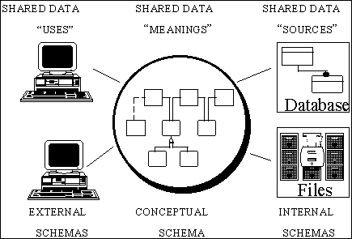

## Table of Contents

## What is a strap?

A strap is a long, narrow piece of material that is used to hold something in place or to carry things. It can be made from different materials like leather, cloth, or plastic. People use straps for many things, like holding bags on their shoulders, keeping things secure on a vehicle, or even as part of clothing, like a belt.

Straps are very useful because they are strong and flexible. They can be adjusted to fit different sizes or to hold things tightly. For example, a backpack has straps that you can make longer or shorter so it fits well on your back. Straps are important in many areas of life because they help keep things organized and safe.

## What are the basic materials used to make straps?

Straps can be made from many different materials. Some common ones are leather, cloth, and plastic. Leather straps are strong and look nice. They are often used for belts and watch straps. Cloth straps are soft and comfortable. They are good for things like backpack straps or seat belts. Plastic straps are very strong and can be used for heavy things. They are often used in construction or to tie things down on vehicles.

Each material has its own good points. Leather is durable and gets better with age, but it can be expensive. Cloth is cheaper and easy to wash, but it might not last as long as leather. Plastic is the cheapest and very strong, but it might not be as comfortable against the skin. The choice of material depends on what the strap will be used for and how much money someone wants to spend.

## What are the common uses of straps in everyday life?

Straps are very important in our daily lives. They help us carry things easily. For example, the straps on a backpack let us carry our books and other things on our back. This makes it easy to walk around with our hands free. Straps are also used on bags and purses. They let us carry these over our shoulder or across our body. This way, we can keep our things close and safe.

Straps are also used to keep things secure. For example, seat belts in cars use straps to keep us safe while driving. They hold us in place if there is an accident. Straps are also used to tie down things on a bike or car. This keeps them from falling off while we are moving. In sports, straps on helmets and other gear keep them in place so we can play safely.

In clothing, straps are used in many ways. Belts are straps that hold up our pants. They can also be a fashion item. Straps on shoes help keep them on our feet. Some clothes, like dresses or tank tops, use straps to stay on our shoulders. Straps are very useful and help us in many parts of our daily life.

## How do straps function in different applications?

Straps help us carry and hold things in many ways. For example, the straps on a backpack go over our shoulders and help us carry books and other items easily. They can be adjusted to fit different sizes, so the backpack stays comfortable and secure. Straps on bags and purses let us carry them over our shoulder or across our body. This keeps our hands free and our things safe. In sports, straps on helmets and other gear keep everything in place, so we can play without worrying about our equipment.

Straps also keep things secure and safe. In cars, seat belts use straps to protect us during accidents. They hold us tightly in our seats to prevent injury. Straps are used to tie down things on bikes or cars, so they don't fall off while we are moving. In construction, strong straps made of plastic or nylon are used to hold heavy materials securely. In clothing, belts are straps that keep our pants up, and straps on shoes and dresses help them stay in place. Straps are very important because they help us in many different ways every day.

## What are the different types of straps and their specific uses?

There are many types of straps, each with special uses. Backpack straps help us carry our things on our back. They are usually made of cloth and can be adjusted to fit right. Shoulder straps are used on bags and purses. They let us carry these over our shoulder or across our body. Seat belts in cars use strong straps to keep us safe during accidents. They hold us in place and can save our lives.

Other types of straps include watch straps, which go around our wrist and hold our watch in place. They can be made of leather, metal, or rubber. Belts are straps that keep our pants up and can also be a fashion item. They are often made of leather or cloth. In sports, helmet straps keep our helmets on our head so we can play safely. Tie-down straps, often made of strong plastic or nylon, are used to secure heavy things on vehicles or in construction. Each type of strap has a special job that helps us in our daily life.

## How has the design of straps evolved over time?

The design of straps has changed a lot over time. In the past, straps were simple and made from natural materials like leather or cloth. They were used for basic things like carrying bags or holding up pants. As time went on, people started using new materials like nylon and plastic. These materials made straps stronger and more flexible. People also started adding features like adjustable buckles and quick-release clips. These made straps easier to use and more comfortable.

Today, straps are designed for many different uses. They can be very strong for heavy work, or soft and comfortable for everyday use. Many straps now have special features like padding for comfort, reflective material for safety, or even smart technology that can tell you if something is too tight or loose. The design of straps keeps changing to meet our needs better and to make our lives easier and safer.

## What are the key factors to consider when choosing a strap for a particular application?

When choosing a strap for a particular job, it's important to think about what the strap will be used for. If you need a strap to carry a heavy load, you should pick one made from a strong material like nylon or leather. For example, if you're using a strap to secure things on a truck, it needs to be very strong and not stretch too much. On the other hand, if you need a strap for something like a backpack, you might want one that is comfortable and easy to adjust. The material and the strength of the strap are very important to make sure it can do the job well.

Another thing to think about is how the strap will be used. If it's for a bag that you carry every day, you might want a strap that is soft and feels good against your skin. Some straps have padding or are made from materials like cloth that are more comfortable. Also, think about if you need special features like quick-release clips or reflective material for safety. The right strap will make your job easier and keep you safe, so it's good to take your time and pick the best one for what you need.

## How do you properly maintain and care for different types of straps?

Taking care of straps depends on what they are made of. For leather straps, like belts or watch straps, you should clean them with a soft cloth and use special leather conditioner to keep them soft and prevent cracks. Try not to get leather wet, and if it does get wet, let it dry slowly away from heat. Cloth straps, like those on backpacks, can be washed with soap and water. Make sure to let them dry completely before using them again. If the straps have any metal parts, check them for rust and clean them with a cloth to keep them working well.

Plastic or nylon straps are easy to take care of. You can clean them with a damp cloth and some mild soap. Make sure to rinse off any soap and let them dry fully. These straps are strong, but too much sun or heat can make them weak over time, so keep them out of direct sunlight when you can. For straps with adjustable parts or buckles, make sure to keep these clean and working smoothly. A little bit of oil on the moving parts can help them last longer. By taking good care of your straps, they will stay strong and work well for a long time.

## What are the latest innovations in strap technology?

The latest innovations in strap technology focus on making straps smarter and more comfortable. One big change is the use of smart materials. These materials can change shape or size based on temperature or pressure. This makes straps more comfortable because they can fit better on different bodies. Another cool thing is straps with sensors. These sensors can tell if the strap is too tight or too loose. This is really helpful for things like medical braces or sports gear, where the right fit is important for safety and performance.

There are also new ways to make straps stronger and last longer. Some companies are using new kinds of fibers, like carbon fiber or Kevlar, to make straps that can handle heavy loads without breaking. These materials are also lighter, which is great for things like backpacks or climbing gear. Another innovation is self-healing materials. These materials can fix small tears or cuts on their own, which means the straps last longer and don't need to be replaced as often. All these new ideas are making straps better and more useful in our daily lives.

## How do straps contribute to safety in industrial and sports applications?

In industrial settings, straps are very important for keeping things safe. They are used to hold heavy things in place, like on trucks or at construction sites. These straps are made from strong materials like nylon or polyester, which can handle a lot of weight without breaking. This helps prevent accidents where things might fall and hurt someone. Straps also help keep workers safe by securing them to harnesses when they are working high up. This way, if they slip, the strap will catch them and stop them from falling.

In sports, straps are key for safety too. They keep important gear like helmets and pads in place so athletes can focus on the game without worrying about their equipment. For example, the straps on a football helmet make sure it stays on during a tackle. In activities like rock climbing, straps on harnesses and carabiners keep climbers safe if they fall. These straps are designed to be strong and reliable, so athletes can trust them to keep them safe while they play or compete.

## What are the environmental impacts of strap production and disposal?

Making straps can affect the environment in different ways. If straps are made from materials like leather, it means animals are used, and that can harm the environment. Also, making leather uses a lot of water and chemicals, which can pollute rivers and the air. When straps are made from plastic or nylon, it uses a lot of energy and can release gases that are bad for the air. Cutting down trees for cloth straps can hurt forests too. All these things can have a big impact on the environment.

Throwing away straps can also be bad for the environment. Plastic and nylon straps do not break down easily, so they can stay in landfills for a very long time. If these straps end up in the ocean, they can hurt sea animals. Burning old straps can release harmful smoke into the air. To help the environment, it's good to recycle straps or use ones made from materials that are better for the earth, like recycled plastic or organic cotton. By being careful about what we use and throw away, we can help keep the environment safe.

## How can straps be customized for specialized or niche markets?

Straps can be made special for different groups of people who need them for specific things. For example, people who do sports or outdoor activities might want straps that are strong and light. They can get straps with special materials like carbon fiber or Kevlar, which are very strong but don't weigh much. These straps can also have padding to make them more comfortable. Some straps can even have reflective parts to help people see them better at night, which is important for safety.

Another way straps can be made special is for people who need them for medical reasons. For example, someone who uses a brace might need a strap that can be adjusted easily and has sensors to make sure it's not too tight or too loose. These straps can be made from soft materials that are good for the skin. Companies can also add colors or patterns to make the straps look nice, which can be important for people who want their gear to look a certain way. By making straps special for different needs, they can help people do their jobs or activities better and more safely.

## What is the Strap Strategy and how can it be understood?

The strap strategy in options trading is a sophisticated technique that involves the purchase of three options in total: two at-the-money (ATM) call options and one ATM put option. This combination creates a bullish bias, which means that the strategy is designed to benefit more from upward market movements. The rationale behind this setup is to capitalize on the potential for higher profits if the underlying asset's price increases, as the extra call option amplifies gains from such market movements.

In contrast to the straddle, which is another popular options strategy involving an equal number of call and put options to profit from volatility regardless of direction, the strap leans more heavily towards an upward trajectory. The upward potential in a strap strategy is due to the additional call option which provides extra leverage if the market appreciates. Hence, traders who anticipate significant positive shifts in market prices may find the strap strategy particularly appealing.

However, the financial commitment required for a strap strategy is substantial because it involves purchasing three separate options contracts. The cost of these options, and thus the initial outlay, can be quite high. Therefore, traders must weigh this expense against the prospective gains when considering the strap strategy.

The mathematical representation of the payoff for a strap strategy can be expressed as follows:

$$

\text{Payoff} = 2 \times \max(S_T - K, 0) + \max(K - S_T, 0) - \text{Initial Cost}
$$

where $S_T$ is the stock price at expiration, $K$ is the strike price of the options, and $\text{Initial Cost}$ is the total cost of purchasing the two call options and one put option.

Implementing the strap strategy requires a deep understanding of market behavior and a strategic forecast of potential price movements. Traders employing this strategy often need to closely monitor market indicators to optimize their entry points and manage costs effectively. Despite its added complexity and cost, the strap's potential for substantial returns in bullish markets makes it a valuable tool for risk-tolerant investors.

## References & Further Reading

[1]: Bergstra, J., Bardenet, R., Bengio, Y., & Kégl, B. (2011). ["Algorithms for Hyper-Parameter Optimization."](https://dl.acm.org/doi/10.5555/2986459.2986743) Advances in Neural Information Processing Systems 24.

[2]: ["Advances in Financial Machine Learning"](https://www.amazon.com/Advances-Financial-Machine-Learning-Marcos/dp/1119482089) by Marcos Lopez de Prado

[3]: ["Evidence-Based Technical Analysis: Applying the Scientific Method and Statistical Inference to Trading Signals"](https://www.amazon.com/Evidence-Based-Technical-Analysis-Scientific-Statistical/dp/0470008741) by David Aronson

[4]: ["Machine Learning for Algorithmic Trading"](https://github.com/stefan-jansen/machine-learning-for-trading) by Stefan Jansen

[5]: ["Quantitative Trading: How to Build Your Own Algorithmic Trading Business"](https://www.amazon.com/Quantitative-Trading-Build-Algorithmic-Business/dp/1119800064) by Ernest P. Chan