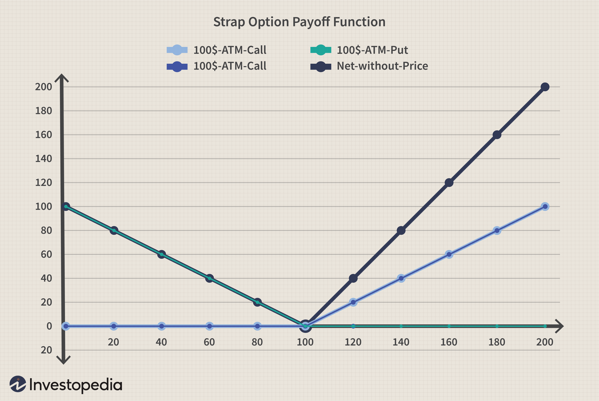

## Table of Contents

## What is a market neutral strategy?

A market neutral strategy is an investment approach that aims to make money regardless of whether the overall stock market goes up or down. The goal is to have a portfolio where the gains from some investments are balanced out by losses in others, so the overall performance is not affected by market movements. This is often achieved by taking long positions in some stocks (expecting them to go up) and short positions in others (expecting them to go down), in a way that the net exposure to the market is zero.

To implement a market neutral strategy, investors often use pairs trading, where they buy one stock and short sell another from the same industry. For example, if an investor believes that Company A will outperform Company B, they might buy shares of Company A and short sell shares of Company B. By doing this, the investor hopes to profit from the difference in performance between the two stocks, rather than from the overall market direction. This strategy requires careful analysis and can be complex, but it's designed to reduce risk and provide steady returns.

## What are bullish strategies in trading?

Bullish strategies in trading are used when a person thinks that the price of something, like a stock, will go up. One common bullish strategy is buying stocks directly. When you buy a stock, you hope its price will increase so you can sell it later for a profit. Another strategy is buying call options. A call option gives you the right to buy a stock at a set price before a certain date. If the stock's price goes up, the call option becomes more valuable, and you can make money by selling the option or buying the stock at the lower set price.

Another bullish strategy is going long on futures contracts. Futures are agreements to buy or sell something at a future date for a price set today. If you think the price of the thing you're buying will be higher in the future, you can make money when you buy it at the agreed-upon price. Lastly, there's a strategy called buying on margin, where you borrow money to buy more stocks. This can increase your potential profits if the stock price goes up, but it also increases your risk because you have to pay back the borrowed money plus interest.

These strategies all aim to take advantage of rising prices. They can be more or less risky depending on how you use them. It's important to understand the risks and have a good plan before using any trading strategy.

## How do strap options work in general?

A strap option is a type of options strategy that investors use when they think a stock's price will go up a lot. It's made up of two call options and one put option, all with the same expiration date and strike price. The call options let you buy the stock at a set price, and the put option lets you sell it at that same price. When you use a strap, you're betting that the stock will go up more than it will go down. If the stock's price goes way up, the two call options can make you a lot of money because they'll be worth more.

But, if the stock's price doesn't go up as much as you hoped, or if it stays the same, the strap can still help you. The put option in the strap gives you a bit of protection. If the stock's price goes down, the put option can make you some money because it becomes more valuable. So, a strap is good for when you're really sure the stock will go up a lot, but you also want some protection if it doesn't.

## What are the basic components of a strap option?

A strap option is made up of two call options and one put option. All these options have the same expiration date and the same strike price. The call options give you the right to buy the stock at the strike price, and the put option gives you the right to sell the stock at that same price. When you use a strap, you're hoping the stock's price will go up a lot.

If the stock's price does go up a lot, the two call options can make you a lot of money because they become more valuable. But if the stock's price doesn't go up as much as you hoped, or if it stays the same, the put option can help protect you. The put option becomes more valuable if the stock's price goes down, so it can make you some money even if the stock doesn't go up as much as you wanted.

## How can strap options be used in a market neutral bullish strategy?

Strap options can be used in a market neutral bullish strategy by balancing out the potential gains and losses from the stock market's movements. In this strategy, you use strap options to bet that a specific stock will go up a lot. At the same time, you might use other investments to balance out the risk if the overall market doesn't go up. For example, you could short sell other stocks or use other options to make money if the market goes down. This way, you're trying to make money from the big rise in the stock you chose, while not losing money if the overall market doesn't do well.

To set up this strategy, you would buy two call options and one put option on the stock you think will go up a lot. These options all have the same expiration date and strike price. The two call options will make you money if the stock goes up a lot, while the put option will give you some protection if the stock doesn't go up as much as you hoped or even goes down a bit. By combining the strap options with other investments that benefit from a falling market, you can create a market neutral strategy where your overall gains and losses are not affected by the general direction of the market. This approach lets you focus on the big potential gains from the stock you're bullish on, while keeping your overall risk lower.

## What are the key differences between a strap and a strip option?

A strap option and a strip option are both types of options strategies, but they are used for different situations. A strap option is used when you think a stock's price will go up a lot. It's made up of two call options and one put option, all with the same expiration date and strike price. The call options let you buy the stock at the strike price, and the put option lets you sell it at that same price. This means you're betting that the stock will go up more than it will go down, but you also have some protection if it doesn't.

On the other hand, a strip option is used when you think a stock's price will go down a lot. It's made up of two put options and one call option, all with the same expiration date and strike price. The put options let you sell the stock at the strike price, and the call option lets you buy it at that same price. This means you're betting that the stock will go down more than it will go up, but you also have some protection if it doesn't. So, the main difference is that a strap is for when you're very bullish, and a strip is for when you're very bearish.

## What are the potential risks and rewards of using strap options in a market neutral bullish strategy?

Using strap options in a market neutral bullish strategy can lead to big rewards if things go your way. If the stock you chose goes up a lot, the two call options in your strap can make you a lot of money. They become more valuable as the stock price rises. At the same time, because you're using other investments to balance out the risk, you're not as affected by the overall market going down. This means you can focus on the big potential gains from the stock you're betting on, while keeping your overall risk lower.

However, there are also risks to this strategy. If the stock you chose doesn't go up as much as you hoped, or if it goes down, you might lose money on the strap options. The put option in the strap can help a bit if the stock goes down, but it might not be enough to cover your losses from the call options. Also, balancing out the risk with other investments can be tricky. If you don't get it right, you could still lose money even if the stock you chose does well. So, while strap options in a market neutral bullish strategy can offer big rewards, they also come with significant risks that you need to manage carefully.

## How do you calculate the break-even point for a strap option in a market neutral bullish strategy?

To calculate the break-even point for a strap option in a market neutral bullish strategy, you need to consider the costs of the options and how the stock price changes. A strap option has two call options and one put option, all with the same expiration date and strike price. The break-even point is the stock price at which the gains from the options equal the total cost of buying them. To find this, you add the cost of the strap to the strike price of the options.

For example, let's say the strike price of the options is $50, and you paid $5 for the strap (this includes the cost of the two calls and one put). The first break-even point is calculated by adding the cost of the strap to the strike price: $50 + $5 = $55. This means the stock needs to go up to at least $55 for you to break even on the strap. If the stock goes above $55, you start making a profit. However, because you're using other investments to balance out the risk in a market neutral strategy, you also need to consider how those other investments affect your overall break-even point. This can make the calculation more complex, but the basic idea is the same: you need the stock to go up enough to cover the cost of the strap and any losses from your other investments.

## What are some advanced techniques for adjusting strap options positions in response to market movements?

When using strap options in a market neutral bullish strategy, you might need to adjust your positions as the market moves. One way to do this is by rolling the options. This means you can close your current options and open new ones with different expiration dates or strike prices. If the stock isn't going up as fast as you hoped, you might roll to a later expiration date to give it more time. Or, if the stock is going up a lot, you might roll to a higher strike price to keep making money as the stock keeps rising.

Another technique is to adjust the ratio of the options. You can start with a strap that has two call options and one put option, but you might change this if the market changes. If you think the stock will go up even more, you could add more call options to your position. If you're getting worried about the stock going down, you could add more put options to give you more protection. This way, you can keep your strategy flexible and respond to what's happening in the market.

Lastly, you might use delta hedging to manage your risk. Delta is a measure of how much the price of an option changes when the stock price changes. By buying or selling shares of the stock, you can balance out the delta of your strap options. This can help keep your overall position neutral to the market's movements. If the delta of your strap is too high, meaning it's too sensitive to the stock price, you can sell some shares of the stock to lower the delta. If the delta is too low, you can buy more shares to increase it. This way, you can keep your strategy market neutral while still betting on the stock going up a lot.

## How does volatility affect the performance of strap options in market neutral bullish strategies?

Volatility, which is how much a stock's price goes up and down, can really change how well strap options work in a market neutral bullish strategy. When a stock is more volatile, the price can move a lot more, which can be good or bad for your strap options. If the stock goes up a lot because of high volatility, your two call options can make you a lot of money. But if the stock goes down a lot, the put option in your strap can help protect you, but it might not be enough to cover all your losses from the call options.

In a market neutral bullish strategy, you're trying to make money from the stock going up a lot while not losing money if the overall market goes down. High volatility can make this harder because it can make the stock move in ways you didn't expect. If the stock is very volatile, you might need to adjust your strap options more often to keep your strategy working well. This means you might need to change the expiration dates or strike prices of your options, or even add more call or put options to your position to keep it balanced.

## Can you provide a case study of a successful implementation of strap options in a market neutral bullish strategy?

In early 2020, an investor named Sarah believed that a tech company called TechGrow would see a significant rise in its stock price due to a new product launch. She decided to use a strap option strategy to bet on this big move, while also using other investments to keep her overall strategy market neutral. Sarah bought two call options and one put option on TechGrow stock, all with a strike price of $100 and an expiration date three months out. She paid $6 in total for the strap. To balance out her risk, she also short sold shares of another tech company that she thought would not do as well.

As the product launch approached, TechGrow's stock started to rise. By the time the product was released, the stock had gone up to $120. Sarah's two call options became much more valuable, and she made a big profit from them. The put option she bought didn't lose much value because the stock didn't go down. At the same time, her other investments helped balance out any losses from the general market movements. In the end, Sarah made a nice profit from her strap options on TechGrow, while her market neutral strategy kept her overall risk low. This case shows how strap options can be used successfully in a market neutral bullish strategy when you have a strong belief in a stock's potential to rise significantly.

## What are the regulatory and tax considerations when using strap options in market neutral bullish strategies?

When you use strap options in a market neutral bullish strategy, you need to think about the rules that the government has for trading options. Different countries have different rules, but usually, you need to have a certain level of trading experience and money in your account before you can trade options. Also, you have to report your options trading to the tax office. If you make money from your strap options, you might have to pay taxes on that money. The tax rules can be complicated, so it's a good idea to talk to a tax expert to make sure you're doing everything right.

Another thing to think about is how the tax office treats the money you make or lose from strap options. In some places, the money you make from options is treated as capital gains, which might be taxed at a different rate than your regular income. If you lose money, you might be able to use those losses to lower your taxes. But, you need to keep good records of all your trades and talk to a tax expert to make sure you're following the rules and getting the best tax treatment for your situation.

## How can one construct a Strap Options Strategy?

To construct a strap options strategy, an investor purchases two at-the-money (ATM) call options and one ATM put option. This combination allows the strategy to take advantage of significant upward price movements while still benefiting from potential downward shifts in the price of the underlying asset.

In this strategy, the investor selects an underlying asset with options available for trading. The asset can be a stock, index, or any other optionable security, offering flexibility based on both market conditions and individual investor preferences. The key is that all options—both calls and the put—are purchased with the same expiration date and strike price, which is at-the-money at the time of purchase. This means the strike price is close to or equal to the current market price of the underlying asset.

By constructing a strap with two call options and one put option, the strategy gains exposure to upward price movements with a higher weighting toward potential gains from rising prices. Specifically, the two call options mean that profits from upward movements can be substantial, as profits are magnified for every unit increase past the strike price. In contrast, the put option provides a safety net by offering limited downside protection, ensuring that the investor is not overly exposed to declines in asset price.

The payoff function for the strap options strategy therefore can be expressed as:

$$
\text{Payoff} = 2 \times \max(S_T - K, 0) + \max(K - S_T, 0) - \text{Total Premium}
$$

Where:
- $S_T$ is the price of the underlying asset at expiration,
- $K$ is the strike price,
- $\max(S_T - K, 0)$ corresponds to the payoff from each call option,
- $\max(K - S_T, 0)$ corresponds to the payoff from the put option,
- $\text{Total Premium}$ is the sum of the premiums paid for all three options.

This approach results in higher profitability from upward movements while maintaining a level of protection from downward movements. The flexibility to select any optionable security means investors can tailor the strategy to suit anticipated market conditions and personal risk tolerance.

## What is the relationship between the Payoff Function and various Profit Scenarios?

The strap option strategy offers a distinctive payoff structure characterized by two breakeven points, resulting in a unique profit scenario based on the movement of the underlying asset. This strategy, involving the purchase of two call options and one put option with identical strike prices and expiration dates, provides investors with an asymmetrical profit potential that is skewed towards upward market movements.

### Payoff Structure

The payoff for a strap option can be expressed mathematically as:

$$

\text{Payoff} = 
\begin{cases} 
2 \times \max(S - K, 0) + \max(K - S, 0) - 3 \times \text{Premium} - \text{Costs}, & \text{if } S \leq \text{Lower Breakeven} \\ 
S - K - \text{Premium} - \text{Costs}, & \text{if } \text{Lower Breakeven} < S < \text{Upper Breakeven} \\
2S - 2K -3 \times \text{Premium} - \text{Costs}, & \text{if } S \geq \text{Upper Breakeven} 
\end{cases} 
$$

Where:
- $S$ is the price of the underlying asset at expiration.
- $K$ is the strike price of the options.
- $\text{Premium}$ is the total premium paid for the options.
- $\text{Costs}$ are the associated trading costs.

### Profit Scenarios

1. **Two Breakeven Points**: 
   - The strategy has two breakeven points owing to its construction. The first breakeven point is at a lower asset price, while the second is higher. This dual breakeven point structure allows the strap to profit from significant price movements in either direction, with a distinct advantage in favor of a bullish outlook.

2. **Upward Movements**:
   - Profit potential is maximized when the underlying asset price rises significantly beyond the upper breakeven point. This is due to the presence of two call options, which leverage gains as the asset price increases, compared to the single put option that offers downside protection.

3. **Downward Movements**:
   - If the underlying asset moves below the lower breakeven point, the strategy still offers limited profit potential, capitalizing on the decrease in asset price through the put option. However, this profit is substantially less than what would be achieved in a strong upward movement.

4. **Capped Risk**:
   - The risk associated with a strap option is confined to the total premiums paid for the options, along with any execution costs incurred during the trade setup. This fixed risk is a significant advantage, providing clarity on the maximum potential loss involved with executing the strategy.

In summary, the strap option strategy's payoff structure is uniquely tailored to benefit from substantial market movements, particularly in an upward direction. By ensuring that risk is capped to the initial premium and costs, traders have a clear understanding of their potential financial exposure while maximizing opportunities for profit.

## References & Further Reading

[1]: ["Options, Futures, and Other Derivatives"](https://www.amazon.com/Options-Futures-Other-Derivatives-10th/dp/013447208X) by John C. Hull

[2]: Nassim Nicholas Taleb, "Dynamic Hedging: Managing Vanilla and Exotic Options," John Wiley & Sons, 1997.

[3]: ["Algorithmic Trading: Winning Strategies and Their Rationale"](https://books.google.com/books/about/Algorithmic_Trading.html?id=WAlFDwAAQBAJ) by Ernest P. Chan

[4]: Wilmott, P., "Paul Wilmott Introduces Quantitative Finance," Wiley, 2007.

[5]: Euan Sinclair, ["Volatility Trading"](https://www.amazon.com/Volatility-Trading-Website-Euan-Sinclair/dp/1118347137), 2nd Edition, Wiley & Sons.