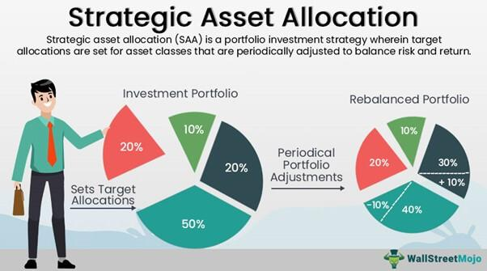

## Table of Contents

## What is strategic asset allocation?

Strategic asset allocation is a long-term investment strategy where you decide how to spread your money across different types of investments, like stocks, bonds, and cash. The goal is to balance risk and reward according to your financial goals, how long you plan to invest, and how much risk you're willing to take. Once you set up your initial mix of investments, you usually stick with it, making only small adjustments over time to keep your portfolio on track.

This approach is based on the idea that different types of investments perform differently over time. By spreading your money across various assets, you can reduce the impact of a poor performance in any single investment. It's like not putting all your eggs in one basket. Over time, as markets change, you might need to rebalance your portfolio to maintain your original asset mix, but the overall strategy remains focused on long-term goals rather than reacting to short-term market changes.

## How does strategic asset allocation differ from tactical asset allocation?

Strategic asset allocation is like setting a long-term plan for your investments. You decide how much of your money goes into different types of investments, like stocks, bonds, and cash, based on your goals, how long you'll invest, and how much risk you're okay with. Once you set this plan, you mostly stick to it, only making small changes now and then to keep your investments balanced. It's about playing the long game and not getting too worried about short-term ups and downs in the market.

Tactical asset allocation, on the other hand, is more about making short-term moves. You still have a long-term plan, but you're willing to change it based on what's happening in the market right now. If you think stocks are going to do well soon, you might put more money into them for a while. It's like trying to take advantage of opportunities as they come up, but it can be riskier because you're trying to guess what the market will do next. So, while strategic asset allocation is about sticking to your plan, tactical asset allocation is about being ready to shift your plan when you think it makes sense.

## What are the main asset classes typically included in strategic asset allocation?

The main asset classes typically included in strategic asset allocation are stocks, bonds, and cash. Stocks, also known as equities, represent ownership in a company. They can offer high returns but come with higher risk because their value can go up and down a lot. Bonds are like loans you give to a government or company, and they usually pay you back with interest. They are generally less risky than stocks but also offer lower returns. Cash, or cash equivalents like money market funds, is the safest but also gives the lowest returns. It's good for money you might need soon.

Sometimes, other asset classes are also included, like real estate and commodities. Real estate can mean investing in property or real estate investment trusts (REITs). Commodities include things like gold, oil, and agricultural products. These can help spread out risk even more because they often don't move in the same way as stocks and bonds. By mixing these different types of investments, you can create a balanced portfolio that matches your goals and how much risk you're willing to take.

## Why is strategic asset allocation important for long-term investment planning?

Strategic asset allocation is important for long-term investment planning because it helps you set up a plan that matches your goals and how much risk you're okay with. When you decide how to split your money between different types of investments like stocks, bonds, and cash, you're making a plan that should work well over many years. This way, you're not just guessing or chasing quick wins in the market. Instead, you're thinking about the big picture and trying to build wealth slowly and steadily.

Another reason it's important is that it helps you manage risk. By spreading your money across different kinds of investments, you reduce the chance that a bad year for one type of investment will hurt your whole plan. This is called diversification. Over time, even if some parts of your portfolio don't do well, others might do better, which can help balance things out. By sticking to your strategic asset allocation, you're more likely to reach your long-term goals without getting too worried about short-term ups and downs in the market.

## How do you determine the right asset allocation mix for your investment portfolio?

To determine the right asset allocation mix for your investment portfolio, you need to think about your financial goals, how long you plan to invest, and how much risk you're comfortable with. If you're saving for something far in the future, like retirement, you might be okay with putting more money into stocks because they can grow a lot over time, even though they're riskier. But if you need the money sooner, you might want to put more into bonds or cash, which are safer but don't grow as much. Your comfort with risk is also important. If big ups and downs in your investments make you nervous, you'll want a mix that's more on the safe side.

Once you've thought about these things, you can start to figure out the right mix. A common rule of thumb is to subtract your age from 100 to get the percentage of your portfolio that should be in stocks. For example, if you're 30, you might put 70% in stocks and the rest in bonds and cash. But this is just a starting point. You might need to adjust it based on your specific goals and how the market is doing. Over time, you'll need to check your portfolio and make small changes to keep it balanced, but the main idea is to stick to your long-term plan.

## What role does risk tolerance play in strategic asset allocation?

Risk tolerance is really important when you're figuring out your strategic asset allocation. It's all about how much you can handle your investments going up and down. If you don't like taking big risks and get nervous when the market drops, you'll want to put more of your money into safer things like bonds and cash. But if you're okay with the ups and downs and want to grow your money a lot over time, you might put more into stocks, which can be riskier but also offer bigger rewards.

Your risk tolerance helps you decide the right mix of investments for your portfolio. If you're young and saving for something far away, like retirement, you might be able to take more risk because you have time to recover from any dips in the market. But if you're closer to needing the money, you'll want to be more careful and choose a mix that's less risky. By matching your asset allocation to your risk tolerance, you can feel more comfortable with your investment plan and stick to it over the long term.

## Can you explain how rebalancing works in the context of strategic asset allocation?

Rebalancing is a way to keep your investment plan on track. When you set up your strategic asset allocation, you pick a mix of stocks, bonds, and cash that fits your goals and how much risk you're okay with. Over time, the value of these investments can change. If stocks do really well, you might end up with more of your money in stocks than you planned. Rebalancing means you sell some of the stocks that have grown a lot and buy more of the other investments to get back to your original mix. This helps you stick to your plan and manage risk.

You don't need to rebalance all the time. Most people do it once or twice a year, or when their portfolio gets too far away from their target mix. For example, if you wanted 60% of your money in stocks and it grows to 70%, you might sell some stocks and buy bonds or cash to get back to 60%. Rebalancing keeps your investments balanced and helps you stay on track with your long-term goals, instead of letting short-term changes in the market mess up your plan.

## What are some common strategies for implementing strategic asset allocation?

One common strategy for implementing strategic asset allocation is to use a target-date fund. These funds automatically adjust the mix of investments over time based on when you plan to use the money. For example, if you're saving for retirement in 2050, you'd pick a 2050 target-date fund. When you're younger, the fund might have more stocks because you can handle more risk. As you get closer to 2050, it shifts more into bonds and cash to be safer. This way, you don't have to worry about making changes yourself.

Another strategy is to use a robo-advisor. Robo-advisors are online services that use computer programs to manage your investments. You tell them about your goals and how much risk you're okay with, and they set up a mix of investments for you. They also rebalance your portfolio automatically to keep it on track. It's a good option if you want help but don't want to pay for a human financial advisor.

You can also do it yourself by choosing your own mix of stocks, bonds, and cash. You might start with a rule like the "100 minus your age" rule to decide how much to put in stocks. Then, you check your investments every year or so and make small changes to keep your mix the same. This way, you have control over your investments, but it takes more work and you need to know what you're doing.

## How does age and investment horizon affect strategic asset allocation decisions?

Age and how long you plan to invest, or your investment horizon, are really important when you're deciding on your strategic asset allocation. If you're young and you won't need the money for a long time, you can put more of your money into stocks. Stocks can go up and down a lot, but over many years, they usually grow more than other investments. This means you can take more risk because you have time to wait out any bad times in the market. As you get older and closer to needing the money, you might want to shift more into bonds and cash. These are safer and don't go up and down as much, so they're better if you need the money soon.

Your investment horizon also changes how you think about risk. If you're saving for something like buying a house in a few years, you'll want to be more careful with your money. You might put more into bonds and cash because you don't want to lose money right before you need it. But if you're saving for retirement that's 30 years away, you can handle more ups and downs because you have time to recover if things don't go well. So, younger people with long investment horizons usually have more stocks in their portfolio, while older people or those with shorter horizons have more bonds and cash.

## What are the potential benefits and drawbacks of using a strategic asset allocation approach?

Using a strategic asset allocation approach has some big benefits. It helps you make a plan that matches your goals and how much risk you're okay with. By spreading your money across different types of investments like stocks, bonds, and cash, you can lower the risk that one bad investment will hurt your whole plan. This is called diversification. Over time, even if some parts of your portfolio don't do well, others might do better, which can help balance things out. It also keeps you from making quick decisions based on what's happening in the market right now, which can be a good thing because it's hard to guess what the market will do next.

But there are also some drawbacks to think about. One big one is that sticking to a set plan means you might miss out on chances to make more money if the market changes in a big way. If you're not willing to change your plan, you might not take advantage of new opportunities. Also, it takes some work to keep your portfolio balanced. You need to check it every so often and make small changes to keep your mix of investments the same. If you don't do this, your plan might not work as well as you hoped. So, while strategic asset allocation can help you reach your long-term goals, it's not perfect and you need to be ready to put in some effort to make it work.

## How can strategic asset allocation be adjusted in response to changing market conditions?

Even though strategic asset allocation is about sticking to a long-term plan, you can still make some changes if the market changes a lot. If you see that one type of investment, like stocks, is doing much better or worse than you expected, you might want to change your plan a little bit. For example, if stocks are doing really well and you think they'll keep going up, you might decide to put a bit more money into them. But you don't want to change your whole plan just because of what's happening right now. The idea is to make small changes to keep your plan working well over time.

Rebalancing is one way to adjust your strategic asset allocation. When you rebalance, you sell some of the investments that have grown a lot and buy more of the ones that haven't done as well. This helps you get back to your original mix of investments. You might do this once or twice a year, or when your portfolio gets too far away from your target mix. By doing this, you can keep your plan on track even when the market changes. It's all about making sure your investments still match your goals and how much risk you're okay with.

## What advanced techniques can be used to optimize strategic asset allocation for expert investors?

For expert investors looking to optimize their strategic asset allocation, one advanced technique is to use [factor](/wiki/factor-investing)-based investing. This means you choose investments based on certain characteristics, or factors, like size, value, [momentum](/wiki/momentum), and quality. By focusing on these factors, you can try to get better returns than just [picking](/wiki/asset-class-picking) a mix of stocks, bonds, and cash. For example, you might put more money into small companies if you think they'll do better than big ones. This way, you can fine-tune your portfolio to match your ideas about what will do well in the market.

Another technique is to use dynamic asset allocation, which is a bit more flexible than regular strategic asset allocation. Instead of sticking to a set mix of investments, you change it based on what's happening in the economy and the market. You might use computer models and data to help you decide when to put more money into stocks or bonds. This can help you take advantage of opportunities as they come up, but it needs a lot of work and knowledge to do it right. By using these advanced techniques, expert investors can try to get better results from their long-term investment plans.

## References & Further Reading

[1]: Bergstra, J., Bardenet, R., Bengio, Y., & Kégl, B. (2011). ["Algorithms for Hyper-Parameter Optimization."](https://dl.acm.org/doi/10.5555/2986459.2986743) Advances in Neural Information Processing Systems 24.

[2]: ["Advances in Financial Machine Learning"](https://www.amazon.com/Advances-Financial-Machine-Learning-Marcos/dp/1119482089) by Marcos Lopez de Prado

[3]: ["Evidence-Based Technical Analysis: Applying the Scientific Method and Statistical Inference to Trading Signals"](https://www.amazon.com/Evidence-Based-Technical-Analysis-Scientific-Statistical/dp/0470008741) by David Aronson

[4]: ["Machine Learning for Algorithmic Trading"](https://github.com/stefan-jansen/machine-learning-for-trading) by Stefan Jansen

[5]: ["Quantitative Trading: How to Build Your Own Algorithmic Trading Business"](https://www.amazon.com/Quantitative-Trading-Build-Algorithmic-Business/dp/1119800064) by Ernest P. Chan