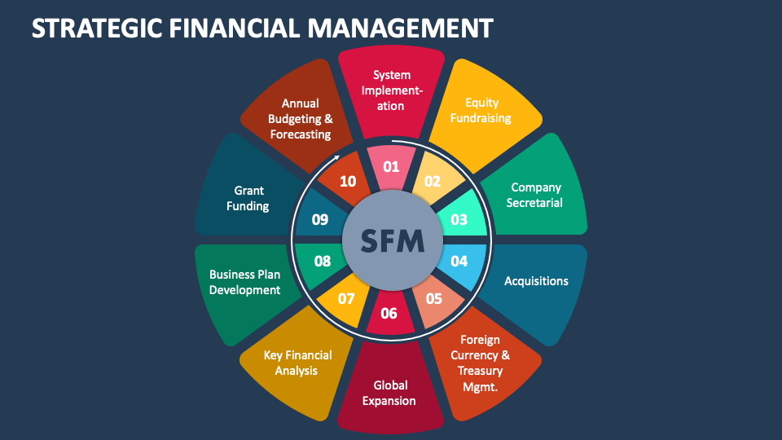

In the ever-evolving world of finance, businesses must stay ahead by integrating effective financial management and strategic planning. As organizations strive to stay competitive and achieve long-term success, understanding the interconnection between business finance, strategic planning, and algorithmic trading is crucial. These elements are not standalone concepts; rather, they work collaboratively to create innovative financial solutions that drive growth and sustainability.

Business finance entails managing a company's financial resources to accomplish its objectives, requiring comprehensive knowledge of budgeting, forecasting, investment analysis, and risk management. Effective financial management, on the other hand, involves the organized planning and controlling of these resources, ensuring that financial activities align with the company's long-term vision. In tandem, strategic planning outlines a company's financial trajectory, setting the framework for growth while navigating market fluctuations and identifying opportunities.



The recent surge in algorithmic trading has introduced a dynamic facet to this financial synergy. By employing complex computer algorithms to make trading decisions, companies can enhance their efficiency and reduce operational costs. The intersection of these financial disciplines presents a unique opportunity to harness innovative strategies.

Organizations that can skillfully integrate these key aspects are well-positioned to maintain a competitive edge. By comprehending the synergies between business finance, strategic planning, and algorithmic trading, they can achieve enhanced operational efficiencies and sustainable growth. Through continuous learning and adaptation, businesses equipped with these insights are poised for a thriving financial future.

## Table of Contents

## Understanding Business Finance

Business finance encompasses the management of a company’s financial resources with the aim of achieving its objectives and ensuring long-term viability. It is a discipline that involves a series of interconnected functions including budgeting, forecasting, investment analysis, and risk management.

### Budgeting

Budgeting is a fundamental component of business finance. It involves the creation of a plan to allocate resources effectively, balancing expected income against projected expenses. A well-crafted budget helps a company to set financial priorities, making sure that resources are available for critical operations and strategic initiatives. Proper budgeting processes allow for monitoring performance against financial goals and making necessary adjustments.

### Forecasting

Forecasting is the process of estimating future financial outcomes by analyzing historical data and market trends. It plays a crucial role in decision-making, as it provides insights into potential scenarios that a business might encounter. Accurate financial forecasting helps companies prepare for variabilities in their operations and market environments, thereby aligning short-term actions with long-term strategies. Techniques such as time series analysis and regression models are often employed to predict future sales, expenses, and capital needs.

### Investment Analysis

Investment analysis is essential for assessing potential expenditures on resources that will generate future benefits. It involves evaluating financial opportunities based on their expected returns and associated risks. Tools like Net Present Value (NPV), Internal Rate of Return (IRR), and Discounted Cash Flow (DCF) analysis are commonly used to determine the viability of projects. Here is a simple Python example to calculate NPV:

```python
def npv(rate, cash_flows):
    return sum(cash_flow / (1 + rate)**i for i, cash_flow in enumerate(cash_flows))

# Example usage:
rate = 0.1  # 10% discount rate
cash_flows = [-1000, 300, 500, 400, 300]  # Cash flows
print(npv(rate, cash_flows))  # Output: NPV value
```

### Risk Management

Risk management involves identifying, assessing, and mitigating potential financial risks that an organization may face. Effective risk management ensures that a business can sustain operations and remain resilient in the face of economic uncertainties. Techniques in this area include diversification, hedging, and insurance, helping businesses to minimize the impact of adverse events on their financial health.

Understanding these fundamentals of business finance is critical, as they form the basis upon which more sophisticated financial management techniques are built. When done effectively, these practices contribute to the sustainability and growth of an organization by ensuring prudent management of its financial resources. Robust business finance strategies are indispensable for navigating the complex financial landscapes businesses continuously encounter.

## The Role of Financial Management in Business Success

Financial management is a cornerstone of business success, encompassing the planning, organizing, and controlling of an organization’s financial resources. It plays a pivotal role in ensuring that a business can effectively acquire and allocate its financial assets, contributing significantly to its overall stability and growth.

### Financial Resource Acquisition and Allocation

The foremost responsibility in financial management is the acquisition of financial resources. This involves identifying and securing the necessary capital to support business operations and strategic initiatives. Financial managers are tasked with assessing various financing options, such as equity funding, debt instruments, or retained earnings, to determine the most cost-effective mix. Once acquired, effective allocation of these resources is critical, ensuring they are employed where they yield the highest returns. This involves prioritizing investments that enhance operational efficiency, product innovation, and market expansion.

### Key Duties: Financial Reporting, Investment Management, and Risk Assessment

1. **Financial Reporting**: Accurate and timely financial reporting is crucial for maintaining transparency and accountability within an organization. Financial managers are responsible for preparing financial statements, such as balance sheets, income statements, and cash flow statements, which reflect the company’s financial health. These reports provide insights that inform strategic decisions and are essential for stakeholders, including investors, creditors, and regulatory authorities.

2. **Investment Management**: Managing investments involves evaluating potential opportunities and making informed decisions to maximize returns on investment. Financial managers use various analytical techniques and tools to assess risk-return profiles and ensure that investments align with the company’s strategic objectives. Diversifying portfolios and adjusting investment strategies in response to market dynamics are also part of this role.

3. **Financial Risk Assessment**: Identifying and mitigating financial risks is a critical aspect of financial management. This includes assessing risks related to market fluctuations, credit liabilities, and operational uncertainties. Financial managers implement risk management strategies, such as hedging and insurance, to protect the company’s assets and ensure long-term sustainability.

### Enhancing Profitability and Securing Financial Future

Effective financial management directly impacts a company's profitability by optimizing revenue streams and minimizing costs. By employing efficient resource allocation and cost-control measures, financial managers enhance the firm’s operational efficiency, leading to improved profit margins. Additionally, prudent financial management ensures the company’s financial future by building reserves, managing debt levels, and planning for unforeseen contingencies.

### Strategies for Financial Health and Decision-Making

Financial managers can adopt several strategies to enhance financial health and decision-making:

- **Implementing Robust Budgeting and Forecasting Tools**: Utilizing advanced budgeting techniques and software aids in accurate financial projection and resource planning. This anticipates cash flow needs and helps in setting realistic financial targets.

- **Leveraging Technology and Data Analytics**: Incorporating technologies like artificial intelligence and data analytics in finance processes allows managers to gain deeper insights into financial trends and anomalies, supporting more informed decision-making.

- **Strengthening Internal Controls**: Developing strong internal control systems mitigates risks of fraud and errors, ensuring integrity and accuracy in financial reporting.

These strategies, when effectively implemented, enable financial managers to make decisions that promote long-term growth and sustainability, securing the financial health of the organization.

In summary, financial management is an integral component of a successful business strategy. Through effective resource acquisition, precise financial reporting, smart investment management, and thorough risk assessments, businesses can enhance their profitability and secure their financial future. Financial managers who adopt innovative strategies and leverage technology are better positioned to navigate the complexities of modern financial landscapes, ensuring sustained organizational success.

## Strategic Planning for Financial Growth

Strategic planning is a critical process for financial growth, involving the establishment of concrete goals, the determination of necessary actions to achieve these goals, and the effective mobilization of resources to execute these actions. This structured approach provides a comprehensive roadmap for financial growth, offering a strategic framework for navigating market fluctuations and uncertainties. By aligning a company's financial goals with its overarching mission and vision, strategic planning ensures that every financial decision supports the broader objectives of the organization.

The importance of strategic planning lies in its capability to identify opportunities and mitigate risks. A well-structured strategic plan enables organizations to anticipate changes in the market environment and adjust their tactics accordingly. This adaptability is crucial for maintaining competitive advantage and ensuring long-term sustainability. For instance, during economic downturns, companies with robust strategic plans can reallocate resources efficiently to maintain stability and prepare for future opportunities.

Moreover, strategic financial planning is essential for capitalizing on potential growth avenues. By assessing market trends and understanding consumer behavior, companies can identify emerging opportunities that align with their strategic vision. This forward-thinking approach enables businesses to invest in new technologies, enter untapped markets, or develop innovative products and services that drive revenue growth.

The transformative impact of strategic planning is evident in various case studies across different industries. For example, consider a retail company that, through strategic planning, identified a shift towards online shopping. By investing in e-commerce infrastructure and digital marketing, the company was able to expand its customer base and increase its market share significantly. Another example is a manufacturing firm that implemented strategic planning to streamline its supply chain operations, resulting in cost reductions and improved efficiency.

These examples demonstrate how strategic planning can revolutionize business financial landscapes by fostering growth and ensuring resilience against market challenges. Maintaining a strategic focus allows organizations to continually align their resources and efforts with their long-term vision, ultimately achieving sustained financial success.

## The Integration of Algorithmic Trading

Algorithmic trading employs computer algorithms to execute financial trades at optimal speeds and accuracy. This automated process is increasingly vital in modern financial management, owing to its potential to significantly reduce transaction costs and improve trading efficiency. By systematically processing large datasets, [algorithmic trading](/wiki/algorithmic-trading) enables businesses to make informed trading decisions that align with their strategic financial goals.

A primary advantage of algorithmic trading is its ability to handle extensive volumes of data efficiently. Traditional trading methodologies, which rely on human intervention, are often slower and susceptible to errors. In contrast, algorithmic trading systems analyze real-time market data, historical trends, and statistical models to execute trades that maximize financial outcomes.

Businesses incorporating algorithmic trading into their operations benefit from increased market speed and agility. These systems use predetermined criteria based on quantitative analysis, allowing companies to quickly respond to market changes and capitalize on emerging opportunities. Moreover, algorithmic trading minimizes human biases and emotional decisions, leading to more consistent trading outcomes.

Despite these advantages, the integration of algorithmic trading poses challenges. Technological infrastructure and expertise are essential for the successful implementation and maintenance of such systems. Additionally, developing algorithms that are both robust and adaptable to rapidly changing market conditions requires significant investment in research and development.

Successful firms exemplify the positive impact of algorithmic trading on business finance. Renaissance Technologies, known for its Medallion Fund, uses sophisticated mathematical algorithms to perform trades far exceeding traditional market outcomes. According to academic research, firms utilizing algorithmic trading often demonstrate heightened profitability and improved risk management capabilities, underscoring this strategy's transformative potential in financial markets (Chaboud et al., 2014).

As businesses navigate these complexities, continuous innovation and adaptation remain crucial. With emerging technologies such as [artificial intelligence](/wiki/ai-artificial-intelligence) and [machine learning](/wiki/machine-learning) enhancing algorithmic capabilities, companies are well-placed to optimize their strategic financial management through algorithmic trading solutions.

## Collaborative Synergies: Aligning Financial Management and Algo Trading

Businesses are increasingly recognizing the potential value derived from merging financial management strategies with algorithmic trading capabilities. This integration results in substantial improvements in forecasting accuracy and risk management, crucial components for maintaining a competitive edge in today’s dynamic marketplace.

One of the core benefits of aligning financial management with algorithmic trading is the enhanced ability to forecast financial outcomes. By leveraging advanced algorithms, businesses can process vast datasets to discern patterns and predict market trends with greater precision. This allows for the creation of financial models that not only reflect current market conditions but also anticipate future developments. For example, machine learning algorithms can analyze historical data to forecast future asset prices or [volatility](/wiki/volatility-trading-strategies), enabling more informed investment strategies.

Additionally, the integration facilitates superior risk management. Algorithmic trading systems can be programmed to trigger trading actions based on specific risk parameters, effectively managing exposure and protecting financial health. For example, a stop-loss order can be automatically executed when certain market conditions are met, minimizing potential losses.

The application of data analytics plays a crucial role in this integration. Businesses can utilize data analytics to construct strategic financial models that incorporate a wide range of variables, such as market data, economic indicators, and internal financial metrics. Python, with libraries such as Pandas, NumPy, and Scikit-learn, provides powerful tools for financial data analysis and modeling. Here's a sample Python snippet illustrating a simple predictive model using historical stock data:

```python
import pandas as pd
from sklearn.model_selection import train_test_split
from sklearn.linear_model import LinearRegression

# Sample data loading script; replace with actual market data source.
data = pd.read_csv('historical_stock_data.csv')
X = data[['feature1', 'feature2', 'feature3']]  # Example features
y = data['target']  # Example target variable

# Splitting data into training and testing sets
X_train, X_test, y_train, y_test = train_test_split(X, y, test_size=0.2, random_state=42)

# Integrating ML model
model = LinearRegression()
model.fit(X_train, y_train)

# Forecasting
predictions = model.predict(X_test)
```

Real-world applications of combining financial management with algorithmic trading abound. For instance, hedge funds and investment banks often deploy sophisticated algorithmic strategies to maximize returns and manage risks effectively. These firms exemplify how strategic integration drives not only financial performance but also facilitates strategic growth by tapping into new markets or financial instruments.

In conclusion, businesses that effectively integrate financial management with algorithmic trading are well-positioned to enhance their forecasting and risk management capabilities. By doing so, they create a collaborative synergy that increases operational efficiencies and drives strategic growth, making them more robust against market uncertainties.

## Challenges and Future Trends

Adopting advanced financial strategies, while beneficial, presents several challenges to businesses. Technological barriers such as outdated systems and inadequate infrastructure can impede the successful integration of sophisticated financial management techniques. Companies also encounter skill requirements, as the workforce must acquire competencies in digital literacy and data analytics to effectively utilize modern financial tools.

Common challenges include resistance to change within organizations, high implementation costs, and the complexity of aligning new strategies with existing business models. For example, integrating algorithmic trading necessitates significant investments in technology and skilled personnel, as well as changes to corporate culture and operational processes. Moreover, organizations must effectively manage cybersecurity risks to protect sensitive financial data from potential breaches.

Examining future trends is crucial for businesses aiming to thrive in an ever-evolving financial landscape. Business finance is increasingly shaped by emerging technologies like artificial intelligence (AI) and machine learning, which enhance decision-making and optimize operations. AI-powered predictive analytics, for example, can forecast market trends with greater accuracy, enabling more strategic financial planning and investment decisions.

Algorithmic trading, poised to gain further prominence, benefits from advances in machine learning algorithms that can process and analyze vast amounts of financial data in real time. These technologies offer the potential to automate complex trading strategies, reducing human error and increasing market efficiency. However, the rapid pace of technological advancement demands that companies continuously update their systems and processes to maintain a competitive edge.

As businesses look ahead, adapting to these technological innovations will be essential for sustained success. Embracing digital transformation initiatives, investing in employee training programs, and fostering a culture of continuous improvement are key strategies for remaining competitive. In a financial environment characterized by rapid change, companies well-equipped to navigate technological shifts will be better positioned to seize opportunities and mitigate risks, ensuring long-term growth and viability.

## Conclusion

Business finance, strategic planning, and algorithmic trading are crucial, interconnected components that collectively empower organizations to achieve financial success. The synthesis of these elements enhances a company’s capacity to maintain competitiveness in the dynamic financial market. Embracing novel financial management techniques allows businesses to optimize their financial strategies, thereby improving operational and financial efficiencies.

Implementing strategic planning ensures alignment with a company’s financial goals, providing a clear roadmap for navigating the complexities of market fluctuations. Simultaneously, algorithmic trading introduces a level of precision and efficiency in executing trades that manual methods cannot match. This seamless integration not only reduces costs associated with trading but also enables the efficient processing of large volumes of data, which is vital for informed decision-making.

Continuous learning and adaptation are essential as financial landscapes rapidly change due to emerging technologies like artificial intelligence and machine learning. Staying informed about future trends and overcoming technological and skill-related challenges will further empower businesses to innovate continuously.

Businesses that integrate cutting-edge financial management techniques are better positioned for financial health and sustained growth. By leveraging the synergies between financial management, strategic planning, and algorithmic trading, organizations can secure a competitive edge and drive long-term success in an ever-evolving financial environment.

## References & Further Reading

[1]: Bergstra, J., Bardenet, R., Bengio, Y., & Kégl, B. (2011). ["Algorithms for Hyper-Parameter Optimization."](https://www.semanticscholar.org/paper/Implementations-of-Algorithms-for-Hyper-Parameter-Bergstra/7911ea7743910d24b0a3408bf9856ad693fe71a4) Advances in Neural Information Processing Systems 24.

[2]: ["Advances in Financial Machine Learning"](https://www.amazon.com/Advances-Financial-Machine-Learning-Marcos/dp/1119482089) by Marcos Lopez de Prado

[3]: "Chaboud, A.P., Chiquoine, B., Hjalmarsson, E., & Vega, C. (2014). ["Rise of the Machines: Algorithmic Trading in the Foreign Exchange Market."](https://www.jstor.org/stable/43612951) International Finance Discussion Papers.

[4]: ["Evidence-Based Technical Analysis: Applying the Scientific Method and Statistical Inference to Trading Signals"](https://www.amazon.com/Evidence-Based-Technical-Analysis-Scientific-Statistical/dp/0470008741) by David Aronson

[5]: ["Machine Learning for Algorithmic Trading"](https://github.com/PacktPublishing/Machine-Learning-for-Algorithmic-Trading-Second-Edition) by Stefan Jansen

[6]: ["Quantitative Trading: How to Build Your Own Algorithmic Trading Business"](https://www.amazon.com/Quantitative-Trading-Build-Algorithmic-Business/dp/1119800064) by Ernest P. Chan