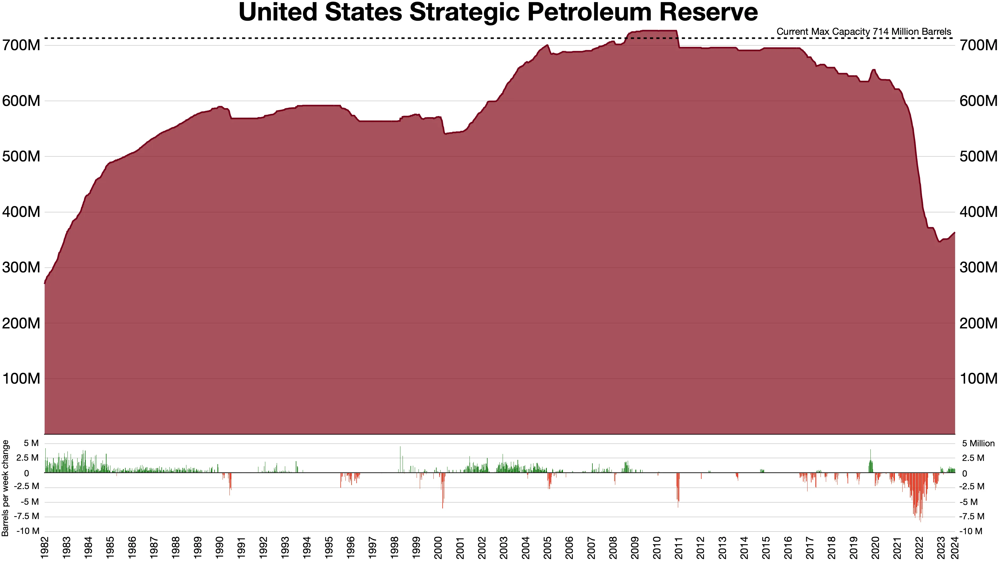

## Table of Contents

## What is a Strategic Petroleum Reserve (SPR)?

A Strategic Petroleum Reserve (SPR) is a stockpile of crude oil that a country keeps in storage for emergencies. It is like a backup plan to make sure there is enough oil if something goes wrong, like a big storm or a war that stops oil from coming in. Countries create these reserves to protect their economy and people from sudden oil shortages, which can cause prices to go up a lot and create problems.

The United States has the world's largest Strategic Petroleum Reserve, which is stored in underground salt caverns along the Gulf of Mexico. Other countries like China, Japan, and several European nations also have their own reserves. When there is a crisis, the government can release oil from the SPR to help keep the supply steady and prices from going too high. This helps to keep things running smoothly and protects the country from big problems caused by not having enough oil.

## Why are Strategic Petroleum Reserves important?

Strategic Petroleum Reserves are important because they help countries deal with sudden problems with oil supply. If there is a big storm, a war, or some other emergency that stops oil from coming in, the reserve can be used to keep things running. This means that factories, cars, and homes can still get the oil they need, and the economy doesn't get hurt too badly. Without these reserves, a sudden drop in oil supply could cause prices to go way up, which would make life harder for everyone.

These reserves also help keep oil prices stable. When there is a scare about oil supply, prices can jump quickly because people get worried. By releasing oil from the reserve, the government can calm things down and stop prices from going too high. This helps protect people from big jumps in the cost of gas and other things that use oil. In the end, Strategic Petroleum Reserves are a safety net that helps keep life normal even when big problems happen with oil.

## Which countries have Strategic Petroleum Reserves?

Many countries around the world have Strategic Petroleum Reserves to make sure they have enough oil during emergencies. The United States has the biggest one, storing millions of barrels of oil in underground salt caverns along the Gulf of Mexico. Other countries with big reserves include China and Japan. These countries keep their reserves to protect their people and economy from sudden oil shortages.

In Europe, countries like Germany, France, and the United Kingdom also have their own reserves. These reserves help keep the supply of oil steady and stop prices from going too high during crises. Some other countries, like India and South Korea, have also started building up their own reserves to be ready for emergencies. Having these reserves helps all these countries feel safer and more secure about their oil supply.

## How are Strategic Petroleum Reserves managed?

Strategic Petroleum Reserves are managed by the government of each country that has them. The government decides how much oil to keep in the reserve and when to release it. They watch the world's oil supply and prices to make sure they are ready for any problems. If there is a big storm, a war, or some other emergency that stops oil from coming in, the government can release oil from the reserve to help keep things running smoothly. They work with oil companies and other countries to make sure the reserve is always ready to use.

The reserves are stored in safe places, like underground salt caverns or special tanks. The United States, for example, keeps its oil in big salt caverns along the Gulf of Mexico. Keeping the oil in safe places helps make sure it stays good and ready to use when needed. The government also checks the oil regularly to make sure it is still good. By managing the reserves carefully, countries can protect their people and economy from big problems caused by oil shortages.

## What is the capacity of the largest Strategic Petroleum Reserves?

The largest Strategic Petroleum Reserve is in the United States. It can hold up to 714 million barrels of oil. This huge amount of oil is stored in big underground salt caverns along the Gulf of Mexico. The salt caverns are special because they keep the oil safe and ready to use when there is an emergency.

The U.S. government manages this reserve and decides when to release oil from it. They watch the world's oil supply and prices to make sure they can help if there is a big problem. If a storm, war, or some other emergency stops oil from coming in, the government can release oil from the reserve to keep things running smoothly. This helps protect the country from big problems caused by oil shortages.

## How does the release of oil from SPRs affect global oil prices?

When a country releases oil from its Strategic Petroleum Reserve, it can help lower global oil prices. This happens because the extra oil on the market makes people feel less worried about shortages. When there is more oil available, the price usually goes down because there is less competition for it. So, if there is a big problem like a storm or a war that stops oil from coming in, releasing oil from the reserve can calm things down and stop prices from going too high.

The effect on global oil prices can be big or small, depending on how much oil is released and what is happening in the world at the time. If a lot of oil is released and it is a big emergency, the price drop can be bigger. But if only a little oil is released and the problem is not so bad, the price might not change much. Governments watch the situation carefully and decide how much oil to release to help keep prices stable and protect their people from big jumps in the cost of gas and other things that use oil.

## What are the historical instances where SPRs were used?

The United States has used its Strategic Petroleum Reserve several times in the past. One big time was during the Gulf War in 1991. Iraq invaded Kuwait, and this caused a big problem with oil supply. The U.S. released oil from its reserve to help keep things running and stop prices from going too high. Another time was in 2005, after Hurricane Katrina hit. The storm damaged oil refineries and pipelines, so the U.S. released oil from the reserve to help make sure there was enough oil for everyone.

Another country that has used its reserve is Japan. In 2011, a big earthquake and tsunami hit Japan. This caused a lot of problems, including with the oil supply. Japan released oil from its reserve to help keep things going and stop prices from going up too much. These examples show how countries use their Strategic Petroleum Reserves to help during big emergencies and protect their people from oil shortages.

## What are the environmental considerations of maintaining SPRs?

Keeping Strategic Petroleum Reserves can have some effects on the environment. One thing is that storing large amounts of oil can lead to spills or leaks. If oil gets out, it can harm the land, water, and animals. The places where the oil is stored, like underground salt caverns, need to be very safe and checked often to stop these problems from happening. Also, building and running the storage places uses energy and can create pollution, which is not good for the environment.

On the other hand, having an SPR can help the environment by making sure there is enough oil during emergencies. This means that people don't have to use more dirty fuels or other bad options when there is a problem with the oil supply. By keeping things stable, SPRs can help stop big changes in how much oil people use, which can be better for the environment. So, while there are some risks, managing SPRs carefully can also have some good effects on the environment.

## How do Strategic Petroleum Reserves contribute to national energy security?

Strategic Petroleum Reserves help keep a country safe by making sure there is enough oil even when there are big problems. If there is a war, a big storm, or some other emergency that stops oil from coming in, the reserve can be used to keep things running. This means that factories, cars, and homes can still get the oil they need. Without the reserve, a sudden drop in oil supply could cause prices to go way up and make life harder for everyone. By having a backup plan, countries can protect their economy and people from big problems caused by oil shortages.

The reserves also help keep oil prices from jumping too much. When there is a scare about oil supply, people can get worried and prices can go up quickly. By releasing oil from the reserve, the government can calm things down and stop prices from going too high. This helps protect people from big jumps in the cost of gas and other things that use oil. In the end, Strategic Petroleum Reserves are like a safety net that helps keep life normal even when big problems happen with oil.

## What are the economic implications of filling and maintaining SPRs?

Filling and maintaining Strategic Petroleum Reserves can cost a lot of money. Governments have to buy the oil to put into the reserves, and they also have to pay for the places where the oil is stored, like underground salt caverns or special tanks. They need to check these places often to make sure the oil stays good and safe. All these costs add up, and the money could be used for other things like schools or hospitals. But having the reserves is important because they help keep the country safe from oil shortages, which can hurt the economy a lot.

On the other hand, having Strategic Petroleum Reserves can also save money in the long run. If there is a big problem with oil supply, like a war or a storm, the reserves can help stop oil prices from going way up. High oil prices can make everything more expensive, like gas and things that need oil to be made. By keeping prices stable, the reserves can help protect people's money and keep the economy running smoothly. So, while it costs money to fill and maintain the reserves, they can also help save money and protect the economy when big problems happen.

## How do international agreements and policies influence the operation of SPRs?

International agreements and policies can help countries work together on their Strategic Petroleum Reserves. For example, countries in the International Energy Agency (IEA) have agreed to keep oil reserves and share them if there is a big problem with oil supply. This means that if one country runs out of oil, other countries can help by sharing their reserves. This teamwork can make sure there is enough oil for everyone and stop prices from going too high. By working together, countries can feel safer and more ready for emergencies.

These agreements also set rules about how much oil countries should keep in their reserves. The IEA says that countries should have enough oil to last for 90 days of their normal use. This rule helps make sure that there is always a good backup plan. If countries follow these rules, they can be better prepared for problems with oil supply. So, international agreements and policies help countries manage their Strategic Petroleum Reserves better and keep the world's oil supply stable.

## What are the future trends and technological advancements expected in the management of SPRs?

In the future, we might see new ways to manage Strategic Petroleum Reserves better. One big change could be using new technology to store oil in safer and more efficient ways. For example, scientists are working on better ways to check the oil and the storage places to make sure there are no leaks or spills. They are also looking at using new materials and designs for the storage tanks and caverns. These new ideas could help keep the oil safe and ready to use when there is an emergency.

Another trend could be using computers and data to manage the reserves better. With new technology, governments can watch the world's oil supply and prices more closely. They can use this information to decide when to release oil from the reserve to help keep prices stable. This can make the reserves more useful and help protect people from big jumps in the cost of gas and other things that use oil. By using these new tools, countries can be better prepared for problems with oil supply and keep their economy safe.

## References & Further Reading

[1]: International Energy Agency (IEA). (2021). ["World Energy Outlook 2021."](https://www.iea.org/reports/world-energy-outlook-2021) International Energy Agency.

[2]: Yergin, D. (2020). ["The New Map: Energy, Climate, and the Clash of Nations."](https://www.amazon.com/New-Map-Energy-Climate-Nations/dp/1594206430) Penguin Press.

[3]: Lopez de Prado, M. (2018). ["Advances in Financial Machine Learning."](https://www.amazon.com/Advances-Financial-Machine-Learning-Marcos/dp/1119482089) Wiley.

[4]: Hull, J. C. (2015). ["Options, Futures, and Other Derivatives."](https://www.amazon.com/Options-Futures-Other-Derivatives-10th/dp/013447208X) Pearson.

[5]: Chan, E. P. (2013). ["Algorithmic Trading: Winning Strategies and Their Rationale."](https://github.com/ftvision/quant_trading_echan_book) Wiley.

[6]: Jansen, S. (2020). ["Machine Learning for Algorithmic Trading."](https://github.com/stefan-jansen/machine-learning-for-trading) Packt Publishing.

[7]: Aronson, D. R. (2006). ["Evidence-Based Technical Analysis: Applying the Scientific Method and Statistical Inference to Trading Signals."](https://www.amazon.com/Evidence-Based-Technical-Analysis-Scientific-Statistical/dp/0470008741) Wiley.