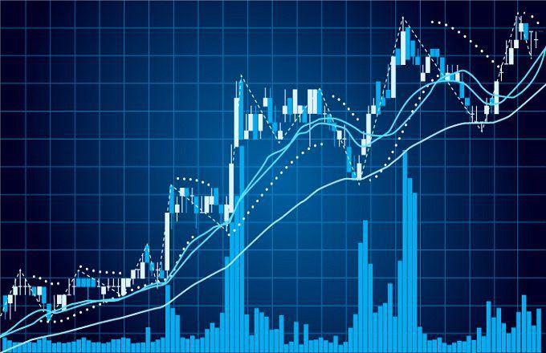

In investing, understanding market variables and leveraging data-driven strategies are crucial for success. Investors and traders continuously seek ways to optimize their decisions based on various elements such as market trends, economic indicators, and statistical data. Trading volume, a fundamental metric that represents the number of shares or contracts traded in a security or market during a given period, is a vital component in this analytical process. It is used to assess market activity and the sentiment of investors, providing actionable insights into the supply and demand dynamics of securities.

Algorithmic trading strategies, which use computer algorithms to automatically make trading decisions based on pre-set criteria, have transformed the landscape of financial markets. These strategies capitalize on mathematical models and high-speed data processing to execute trades at a pace and efficiency unattainable by human traders. By utilizing historical and real-time data, algorithmic trading enables precise and timely investment actions, minimizing human biases and emotions that often affect manual decision-making.



This article explores the intersection of trading volume analysis, investment strategies, and algorithmic trading. By examining how these critical components interact, we aim to illustrate their combined potential to enhance trading outcomes. Analyzing trading volume alongside algorithmic strategies allows for a deeper understanding of both market directions and timing—informing more profitable trades. Readers will gain insights into how these tools can be synergistically employed to navigate complex market mechanics, ultimately equipping traders and investors with enhanced foresight and strategy in their investment endeavors.

## Table of Contents

## Understanding Trading Volume

Trading volume is a fundamental metric in financial markets that provides insight into the level of market activity and the sentiment of investors. It represents the total number of shares or contracts traded for a given security or market during a specified period. By analyzing trading volume, traders can gain a better understanding of supply and demand dynamics, which can help in predicting price movements.

When trading volume is high, it often indicates strong interest in a particular security, suggesting that significant market news or developments are driving investor action. This can lead to potential shifts in market trends, as increased buying or selling pressure can drive price changes. Conversely, low trading volume may suggest a lack of interest or indecision among investors, often resulting in less pronounced price movements.

Volume analysis is crucial for confirming trends and identifying potential reversals in market behavior. For instance, a price trend accompanied by increasing volume is considered more robust than one with declining volume. If a market is experiencing an upward trend with rising volume, it suggests that the trend is supported by a growing number of participants, increasing its likelihood of continuation. Conversely, if the volume decreases as prices rise or fall, it might suggest a weakening trend or an approaching reversal.

Volume-based indicators offer additional insights into market conditions. The On-Balance Volume (OBV) indicator is a valuable tool for assessing buying and selling pressure. It calculates a running total of [volume](/wiki/volume-trading-strategy) by adding or subtracting the volume of a period, depending on whether the price closed higher or lower, respectively. This measure helps identify divergence between volume trends and price movements, which can signal potential reversals.

The Volume Weighted Average Price (VWAP) is another critical indicator that provides a more comprehensive view of average pricing relative to trading volume. VWAP is calculated by adding up the total dollars traded for each transaction (price times the number of shares traded) and dividing by the total shares traded over the period. It acts as a benchmark for comparing the average trading price with the market price, assisting traders in executing trades more efficiently and in assessing the fairness of a trade.

By effectively utilizing trading volume and its associated indicators, traders can enhance their ability to assess market conditions, develop informed trading strategies, and improve their decision-making processes.

## Market Analysis Techniques

Market analysis techniques are essential for traders and investors aiming to make informed decisions in the complex financial markets. These techniques generally fall into two primary categories: technical analysis and [fundamental analysis](/wiki/fundamental-analysis).

**Technical Analysis**

Technical analysis involves scrutinizing price movements and trading volume data to identify patterns and trends. The aim is to forecast future price movements based on historical data. Technical analysts employ various tools and indicators to analyze price charts and volume metrics. Common indicators include moving averages, Bollinger Bands, and the Relative Strength Index (RSI). For instance, moving averages can help identify trend direction and support/resistance levels, while RSI can indicate overbought or oversold conditions in a market.

One fundamental concept in technical analysis is the identification of support and resistance levels. Support is a price level where a downtrend can be expected to pause due to a concentration of demand, while resistance is a level where an uptrend can pause due to a concentration of selling interest. 

A basic Python code snippet for calculating simple moving averages (SMA) is:

```python
import pandas as pd

def calculate_sma(data, window):
    return data.rolling(window=window).mean()

# Example usage: calculate 20-day SMA
price_data = pd.Series([1.1, 1.2, 1.5, 1.4, 1.3, 1.7, 1.9])
sma_20 = calculate_sma(price_data, 20)
```

**Fundamental Analysis**

Fundamental analysis assesses a company's financial health, performance metrics, and market position to determine its intrinsic value. Analysts evaluate financial statements, such as income statements, balance sheets, and cash flow statements, to conduct this analysis. Key ratios used include the price-to-earnings ratio (P/E), earnings per share (EPS), and the debt-to-equity ratio. The purpose is to estimate a company's value and project its growth potential.

For example, the P/E ratio is calculated as:

$$
\text{P/E Ratio} = \frac{\text{Market Value per Share}}{\text{Earnings per Share (EPS)}}
$$

A P/E ratio provides insights into how much investors are willing to pay per dollar of earnings, thereby indicating market expectations of a company's future growth.

**Integrating Technical and Fundamental Analysis**

Employing both technical and fundamental analysis can enhance the accuracy of trading decisions. While technical analysis provides insight into market trends and potential entry/[exit](/wiki/exit-strategy) points, fundamental analysis offers a deeper understanding of the underlying value and long-term potential of an asset. This blended approach allows for more comprehensive decision-making.

Moreover, understanding broader economic trends and the market context is crucial. This includes analyzing macroeconomic indicators, tracking central bank policies, and assessing geopolitical factors. Aligning trading strategies with these broader trends can help ensure that trades are contextually relevant and resilient to market fluctuations. 

Conclusively, by integrating technical patterns with fundamental insights, traders can better navigate market complexities, optimize their strategies, and potentially improve trading outcomes.

## Algorithmic Trading Strategies

Algorithmic trading is the process of using computer programs to execute trades based on predetermined criteria. This method leverages algorithms to systematically analyze market data and make trade decisions with speed and precision that surpasses human capabilities. Here, we explore some of the most popular [algorithmic trading](/wiki/algorithmic-trading) strategies.

Trend following is a strategy that capitalizes on the [momentum](/wiki/momentum) of an asset's price movement. By identifying and riding on established trends, traders seek to profit from continued price advances or declines. This approach typically involves technical indicators like moving averages to signal entry and exit points. For instance, a simple moving average crossover strategy could be codified as:

```python
import pandas as pd

def moving_average_crossover(data, short_window, long_window):
    data['Short_MA'] = data['Close'].rolling(window=short_window, min_periods=1).mean()
    data['Long_MA'] = data['Close'].rolling(window=long_window, min_periods=1).mean()
    data['Signal'] = 0.0  # Default to no position
    data['Signal'][short_window:] = np.where(data['Short_MA'][short_window:] > data['Long_MA'][short_window:], 1.0, 0.0)
    data['Position'] = data['Signal'].diff()
    return data
```

Arbitrage exploits price discrepancies of identical or similar financial instruments across different markets or forms. Algorithmic trading enables nearly instantaneous execution of such trades to capture profit before the anomaly is corrected. For example, statistical [arbitrage](/wiki/arbitrage) might involve pairs trading, where an algorithm identifies two related stocks that have deviated from their historical price relationship and executes trades anticipating a return to equilibrium.

Mean reversion strategies are based on the belief that prices and returns eventually move back towards the mean or average level. This strategy works under the assumption that an asset's high and low prices are temporary and that its price will return to its historical average. Mathematical models, like Bollinger Bands, help in identifying mean reversion opportunities.

Market making is another strategy, where the algorithm provides [liquidity](/wiki/liquidity-risk-premium) to the market by simultaneously placing both buy and sell limit orders. A typical [market making](/wiki/market-making) algorithm will attempt to capture the bid-ask spread by continually updating prices in response to changing market conditions.

Algo trading eliminates human emotional biases—a significant advantage, as traders often make impulsive decisions under stress. Algorithms execute trades with consistency based on data-driven criteria, leading to more disciplined trading strategies.

However, algorithmic trading also comes with its share of risks. Technology failures can disrupt trading operations. Anomalies like the 2010 "Flash Crash" demonstrated the potential disruptions caused by rogue algorithms. Furthermore, over-optimization, where an algorithm performs exceptionally well on historical data but poorly in live markets, remains a concern. Continuous monitoring and robust [backtesting](/wiki/backtesting) using historical data are essential before deploying these algorithms.

Backtesting involves running a trading algorithm through historical market data to evaluate its effectiveness. By simulating trading operations on past data, traders can refine and optimize their strategies, reducing the risks associated with implementing a new system. It is crucial to account for transaction costs and slippage during backtesting to ensure realistic assessments.

## Integrating Trading Volume with Algo Trading

Combining trading volume data with algorithmic models is a powerful strategy for enhancing trading accuracy. Trading volume, which represents the amount of a security traded during a given period, can provide insights into market activity and investor sentiment, thereby supporting more informed decision-making within algorithmic trading frameworks.

One of the main advantages of integrating trading volume into algorithmic strategies is the ability to automate volume-based decision-making. Volume indicators, such as On-Balance Volume (OBV) and Volume Weighted Average Price (VWAP), can be programmed into algorithms to trigger trades when certain volume thresholds are met. For example, an algorithm might be designed to buy a stock when its trading volume increases by 50% compared to the previous day, indicating heightened investor interest.

This integration helps in detecting market conditions such as breakouts and reversals. A [breakout](/wiki/breakout-trading) occurs when the price of a security moves beyond a defined resistance or support level with increased volume, often signaling the start of a new trend. By incorporating volume data, algorithms can more accurately identify these opportunities, allowing traders to capitalize on potential price movements. Similarly, volume analysis can help confirm reversals, where a security's price direction changes, aiding algorithms in adjusting trading positions accordingly.

Advanced trading platforms and tools are instrumental in the seamless integration and execution of volume-based algorithms. These platforms offer sophisticated programming environments, such as Python, that support the development and testing of complex trading models. Consider the following simple Python code snippet illustrating how an algorithm might be structured to incorporate trading volume data:

```python
import pandas as pd

# Example DataFrame 'data' with columns ['price', 'volume']
data = pd.DataFrame({
    'price': [100, 102, 104, 103, 105],
    'volume': [200, 250, 300, 280, 350]
})

# Calculating the Volume Weighted Average Price (VWAP)
data['cumulative_price_volume'] = (data['price'] * data['volume']).cumsum()
data['cumulative_volume'] = data['volume'].cumsum()
data['VWAP'] = data['cumulative_price_volume'] / data['cumulative_volume']

# Simple trading logic based on VWAP
def trading_signal(row):
    if row['price'] > row['VWAP']:
        return 'Buy'
    elif row['price'] < row['VWAP']:
        return 'Sell'
    else:
        return 'Hold'

data['signal'] = data.apply(trading_signal, axis=1)
```

In this example, the VWAP is calculated to determine the average trading price of a stock, weighted by volume, over a set period. The algorithm generates a trading signal to buy, sell, or hold based on whether the current price is above or below the VWAP. 

Integrating volume data into algorithmic trading models not only enhances the precision of trade execution but also reduces reliance on emotional decision-making. As technology and data analysis tools continue to advance, traders can more effectively harness volume data to optimize their algorithmic strategies, adapting them to ever-changing market conditions.

## Case Studies and Real-World Applications

Analyzing real-world applications of trading volume and algorithmic trading strategies provides valuable insights into their effectiveness and implementation challenges. Successful traders and firms utilize these tools to optimize trading outcomes, offering lessons that can guide personal and institutional strategy development.

One example of trading volume analysis leveraged in algorithmic trading is Bridgewater Associates, a leading [hedge fund](/wiki/hedge-fund-trading-strategies). Bridgewater employs algorithms that adapt to market conditions, incorporating trading volume as a key variable in assessing market liquidity and investor sentiment. By analyzing volume spikes and troughs, the firm refines its strategies to better anticipate market movements, allowing for dynamic asset allocation based on real-time supply and demand dynamics.

Another case involves Renaissance Technologies, which famously uses quantitative models to drive trading decisions. Renaissance integrates trading volume data to enhance its high-frequency trading algorithms. The firm uses volume indicators to manage entry and exit points, thereby optimizing trade execution and reducing market impact costs. The success of these strategies is evident in their Medallion Fund's performance, often attributed to the sophisticated use of data, including volume metrics.

Despite the benefits, deploying trading volume and algorithmic strategies is not without challenges. A notable example is the "Flash Crash" of 2010, where a rapid sell-off in the U.S. stock market highlighted the risks associated with high-frequency trading. The event underscored the importance of robust risk management frameworks, as excessive reliance on algorithms without sufficient safeguards can exacerbate market [volatility](/wiki/volatility-trading-strategies).

To overcome such challenges, firms often implement backtesting and real-time monitoring systems. Backtesting algorithms against historical volume data helps identify potential flaws and optimize strategies before live deployment. Moreover, continuous real-time monitoring of trading volume ensures that algorithms adapt to sudden market shifts, thereby maintaining stability and reliability.

These case studies emphasize the importance of a nuanced approach when integrating volume analysis with algorithmic strategies. Successful application involves a balance between technical automation and human oversight, ensuring adaptability to changing market conditions. Understanding these real-world applications aids in identifying best practices, such as integrating advanced analytics, focusing on risk management, and committing to ongoing strategy refinement and innovation.

## Conclusion

The integration of trading volume analysis with algorithmic trading offers substantial benefits to investors and traders. By combining these two approaches, both individual investors and institutional traders can enhance their trading performance significantly. Trading volume serves as a vital indicator of market activity and investor sentiment, and when incorporated into algorithmic models, it helps to fine-tune trading strategies and optimize execution efficiency.

As market dynamics continue to evolve, maintaining a competitive edge requires traders to stay informed and continuously adapt their strategies. This involves not only understanding current market conditions but also anticipating future trends and shifts. Trading volume analysis, when used alongside algorithmic advancements, provides a data-driven foundation for making informed trading decisions.

Continuous learning and strategy optimization are essential to fully harness the potential of trading volume insights and algorithmic trading advances. Traders and investors must be agile, integrating new data and refining their algorithms to address changing market conditions and emerging opportunities. By focusing on these elements, market participants can improve their ability to navigate complexities and enhance overall trading outcomes. 

Incorporating advancements in technology, such as [machine learning](/wiki/machine-learning) and [artificial intelligence](/wiki/ai-artificial-intelligence), can further elevate the potential of trading strategies. These technologies can process vast amounts of volume data, identify patterns, and adjust strategies in real time, thus offering a robust framework for dealing with the fast-paced and often unpredictable nature of financial markets.

## FAQs

### FAQs

**What is trading volume and why is it important?**

Trading volume refers to the number of shares or contracts traded in a security or market during a given period. It's a critical metric as it provides insight into the level of activity and liquidity of a security. A higher trading volume often indicates stronger interest and can reflect investor sentiment towards a security. By analyzing trading volume, traders can gauge supply and demand dynamics, confirm trends, and potentially predict price movements. High trading volume typically accompanies significant price changes, either upward or downward, serving as an indicator of potential shifts in market trends.

**How does algorithmic trading work and what are its benefits?**

Algorithmic trading involves using computer algorithms to execute trades based on a set of predetermined rules, such as timing, price, or quantity. These algorithms can be programmed to analyze real-time data and execute buy or sell orders automatically, minimizing human intervention. The benefits of algorithmic trading include increased speed and accuracy of trade execution, the ability to handle large volumes of trades simultaneously, and the elimination of emotional biases, which can lead to more rational and objective decision-making. Moreover, algorithmic trading can facilitate complex strategies like arbitrage and market making with precise execution.

**Which volume indicators are most effective for traders?**

Volume indicators are tools that help traders understand the significance of trading volume in relation to price movements. Some of the most effective volume indicators include:

- **On-Balance Volume (OBV):** OBV is a cumulative indicator that adds volume on up days and subtracts volume on down days. It's used to confirm trends or to predict possible reversals by comparing price movements and OBV trends.

- **Volume Weighted Average Price (VWAP):** VWAP provides the average price of a security based on both volume and price. It helps traders identify the average trading price over a specified period, often used as a trading benchmark.

- **Accumulation/Distribution line (A/D line):** This indicator combines price and volume to assess whether a stock is being accumulated (bought in large volumes) or distributed (sold in large volumes).

These indicators can offer valuable insights when aligned with other technical analysis tools.

**What are some common pitfalls in algo trading and how can they be avoided?**

While algorithmic trading offers numerous advantages, it also comes with inherent risks and pitfalls. Common issues include:

- **Over-optimization:** Also known as "curve fitting," this occurs when an algorithm is excessively fine-tuned to perform well on historical data but fails in real-time markets. This can be avoided by validating strategies on out-of-sample data and performing robust backtesting.

- **Technology Failures:** Hardware or software glitches can lead to missed trades or incorrect executions. Implementing reliable infrastructure and having backup systems in place can mitigate such risks.

- **Market Impact:** High-frequency trading can inadvertently affect market prices. To minimize this, traders should ensure their strategies are tested for different market conditions and liquidity levels.

- **Regulatory Compliance:** Adhering to regulatory standards is crucial. Traders should stay informed about current regulations to avoid legal pitfalls.

**How do I get started with integrating volume data into my trading strategy?**

Integrating volume data into your trading strategy can enhance decision-making by providing additional market context. Here are steps to get started:

1. **Educate Yourself:** Gain a solid understanding of key volume indicators and their interpretations. Online courses and books can be valuable resources.

2. **Select Relevant Indicators:** Choose volume indicators that align with your trading style, whether it's OBV for trend confirmation or VWAP for benchmark pricing.

3. **Backtest Strategies:** Use historical data to test the effectiveness of volume indicators in your trading model. Python libraries like `pandas` and `zipline` can facilitate backtesting.

4. **Integrate with Algorithmic Systems:** If you use algorithmic trading, incorporate selected volume indicators into your algorithms. Ensure they complement other technical and fundamental analysis components.

5. **Monitor and Adjust:** Continuously monitor the performance of strategies in live markets and adjust as necessary to align with market dynamics and personal trading goals.

By systematically incorporating trading volume analysis, traders can gain deeper insights into market behaviors and enhance their overall trading strategies.

## References & Further Reading

[1]: Bergstra, J., Bardenet, R., Bengio, Y., & Kégl, B. (2011). ["Algorithms for Hyper-Parameter Optimization."](https://dl.acm.org/doi/10.5555/2986459.2986743) Advances in Neural Information Processing Systems 24.

[2]: ["Advances in Financial Machine Learning"](https://www.amazon.com/Advances-Financial-Machine-Learning-Marcos/dp/1119482089) by Marcos Lopez de Prado

[3]: ["Evidence-Based Technical Analysis: Applying the Scientific Method and Statistical Inference to Trading Signals"](https://www.amazon.com/Evidence-Based-Technical-Analysis-Scientific-Statistical/dp/0470008741) by David Aronson

[4]: ["Machine Learning for Algorithmic Trading"](https://github.com/stefan-jansen/machine-learning-for-trading) by Stefan Jansen

[5]: ["Quantitative Trading: How to Build Your Own Algorithmic Trading Business"](https://www.amazon.com/Quantitative-Trading-Build-Algorithmic-Business/dp/1119800064) by Ernest P. Chan