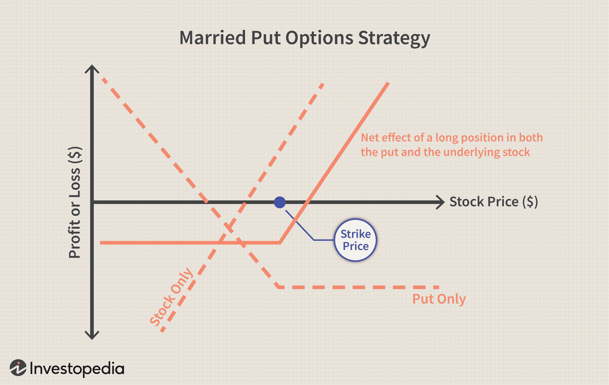

Investment strategies are essential for effective financial management, providing a structured approach to making informed decisions that align with specific financial goals. Among the myriad of options available, mutual funds and algorithmic trading have emerged as significant contributors to diversified investment portfolios. 

Mutual funds, which pool resources from numerous investors to purchase a variety of stocks, bonds, or other financial instruments, offer the advantages of diversification and professional management. This institutional foundation makes them accessible to individual investors seeking to gain exposure to broader market sectors without requiring comprehensive expertise in investment selection.



On the other hand, algorithmic trading marks a modern, technology-driven evolution in investment strategy. By employing computer algorithms to execute trades based on predetermined criteria, this approach enhances the speed and efficiency of trading activities. Algorithmic trading is particularly valued for minimizing human error, reducing transaction costs, and taking advantage of market opportunities that may not be apparent to human traders. 

Understanding the dynamics behind mutual funds and algorithmic trading can significantly enhance financial growth and mitigate risks by offering a balanced approach to investment management. This article will provide an overview of these investment strategies, examining their roles, benefits, and integration into investment portfolios for optimized financial outcomes.

## Table of Contents

## Understanding Investment Strategies

Investment strategies act as a structured blueprint guiding investors in their decision-making processes. They provide systematic approaches that align with the financial objectives, risk tolerance, and market conditions faced by the investor. A multitude of investment strategies exists, each tailored to different goals and market environments.

Growth investment strategy focuses on capital appreciation, typically targeting stocks or assets expected to outperform the market. Investors adopting this strategy prioritize reinvesting earnings over receiving income. They usually invest in companies with high potential for profit increase, even if they come with greater risk.

Value investing, conversely, emphasizes purchasing stocks or assets perceived to be undervalued relative to their intrinsic value. This strategy operates on the principle that the market often reacts to news, resulting in stock price movements that do not correspond to a company’s long-term fundamentals. Value investors seek to capitalize on such discrepancies.

Income investment strategies are designed to generate regular income for the investor, often through dividends or interest payments. These strategies are prevalent among retirees or those seeking a stable income stream. They typically focus on bonds, dividend-paying stocks, or real estate investment trusts (REITs).

Balanced, or hybrid, strategies aim to mitigate risk by combining elements of other strategies. They often involve a diversified portfolio that balances growth and income, providing investors with both security and potential for appreciation.

Selecting an appropriate strategy involves evaluating individual financial goals, such as retirement planning or wealth accumulation. Risk tolerance also plays a crucial role, as it dictates the likelihood of an investor accepting losses in exchange for potential gains. Market conditions, including economic trends and interest rates, further influence strategy choice, as they affect asset performance predictions.

In conclusion, understanding and selecting the right investment strategy is pivotal for achieving desired financial outcomes. Each strategy offers unique benefits and risks, necessitating a careful alignment with the investor's overall financial plan and market outlook.

## The Role of Mutual Funds in Investment Strategies

Mutual funds are a pivotal component of many investment strategies, as they combine resources from multiple investors to collectively invest in a diverse portfolio of stocks, bonds, or other securities. This pooled investment approach allows individuals to access a diversified portfolio that might otherwise be out of reach due to cost constraints or lack of expertise. By spreading investments across various asset classes, mutual funds inherently offer diversification, which reduces the risk associated with investing in a single security or sector.

One of the primary advantages of mutual funds is professional management. Fund managers, equipped with expertise and resources, make investment decisions on behalf of investors. This management is crucial for those who prefer to delegate the day-to-day monitoring and decision-making required in investment management. Professionals use rigorous analytical and quantitative techniques to maximize the potential for returns while managing risk, adapting to changes in market conditions as necessary.

Mutual funds cater to a wide range of investment goals, from conservative income generation to aggressive growth. For example, bond funds may appeal to investors seeking regular income with lower risk, while equity funds might attract those aiming for higher returns with a greater tolerance for risk.

Understanding the financial implications, such as cost basis tracking and capital gains taxes, is essential for optimizing mutual fund investment outcomes. The cost basis of an investment is the original value, which is used to calculate capital gains or losses upon sale. Properly tracking the cost basis helps investors accurately report taxable income and determine the appropriate amount of capital gains tax owed. Capital gains tax is imposed on the profit realized from the sale of assets or investments, with the tax rate dependent on the holding period. Long-term capital gains, applicable to assets held for more than one year, are typically taxed at a lower rate compared to short-term gains.

By focusing on these aspects, investors can enhance the effectiveness of mutual fund investments, aligning them more closely with their financial objectives. Diversification, professional management, and tax considerations all play crucial roles in leveraging mutual funds within a strategic investment framework.

## Algorithmic Trading: A Modern Approach

Algorithmic trading represents a modern innovation in the financial markets, employing computer programs to execute trades automatically based on predetermined criteria. This method leverages sophisticated algorithms to analyze market data and make trading decisions, providing significant advantages over traditional manual trading.

One of the primary benefits of [algorithmic trading](/wiki/algorithmic-trading) is its speed. Algorithms can process market data and execute trades in milliseconds, a speed unattainable by human traders. This rapid execution is crucial in capitalizing on fleeting market opportunities, particularly in high-frequency trading environments where the time advantage can translate into substantial profits.

In addition to speed, algorithmic trading also helps in reducing transaction costs. By automating the trading process, it minimizes the need for human intermediaries, thereby lowering brokerage fees and other associated costs. Furthermore, it increases market efficiency by facilitating large volumes of trades at a reduced cost, which can potentially lead to narrower bid-ask spreads.

Another advantage of algorithmic trading is the reduction of human error. Trading decisions made by humans can be influenced by emotions and psychological biases, leading to inconsistent outcomes. Algorithms, by contrast, adhere strictly to predefined rules and criteria, ensuring consistency and objectivity in trading decisions.

Common strategies employed in algorithmic trading include trend-following, [arbitrage](/wiki/arbitrage), and mean reversion. 

1. **Trend-following strategies** are designed to capitalize on the momentum of asset prices. The algorithm identifies and follows trends in the market, buying when prices are rising and selling when they are declining. This strategy assumes that assets which are trending will continue to do so for a period.

2. **Arbitrage strategies** aim to exploit price discrepancies between different markets or instruments. The algorithm identifies and executes simultaneous buy and sell trades to profit from the variance in pricing. For example, if an asset is priced differently on two exchanges, the algorithm buys at the lower price and sells at the higher price.

3. **Mean reversion strategies** are based on the statistical concept that prices will tend to return to their historical averages. The algorithm identifies when an asset's price deviates significantly from its average value and initiates trades that bet on the price returning to its norm. 

These algorithms require sophisticated mathematical models and extensive historical data to evaluate trends and make predictions. For example, a simple moving average crossover strategy can be coded in Python as follows:

```python
import pandas as pd

def sma_crossover(data, short_window=40, long_window=100):
    signals = pd.DataFrame(index=data.index)
    signals['price'] = data['Close']
    signals['short_mavg'] = data['Close'].rolling(window=short_window, min_periods=1, center=False).mean()
    signals['long_mavg'] = data['Close'].rolling(window=long_window, min_periods=1, center=False).mean()
    signals['signal'] = 0.0
    signals['signal'][short_window:] = np.where(signals['short_mavg'][short_window:] > signals['long_mavg'][short_window:], 1.0, 0.0)
    signals['positions'] = signals['signal'].diff()
    return signals

# Example of how to use this function with stock data
# data = pd.read_csv('stock_prices.csv', index_col='Date', parse_dates=True)
# signals = sma_crossover(data)
```

Overall, algorithmic trading provides a sophisticated mechanism for optimizing trading strategies, enhancing market analysis, and achieving efficient trade execution. However, the complexity involved requires a firm technical foundation and careful management to ensure alignment with investment goals and risk tolerance.

## Integrating Mutual Funds and Algo Trading in Investment Portfolios

Combining mutual funds with algorithmic trading can offer investors a robust framework for risk diversification and potential return enhancement. Mutual funds provide a foundational element of stability due to their inherent diversification across various asset classes and professional management. By pooling funds from multiple investors, mutual funds spread risk and allow individuals to gain exposure to a wide array of financial instruments, such as stocks and bonds, with relatively small capital outlays. This diversification is beneficial in mitigating systemic risks and cushioning portfolios against market volatilities.

On the other hand, algorithmic trading introduces a modern dynamic by employing automated systems to execute trades based on predefined criteria, such as price, [volume](/wiki/volume-trading-strategy), or timing. The utilization of algorithms allows for swift execution, precision in capturing trading opportunities, and a reduction in human error. To integrate these two strategies effectively, investors should be mindful of several critical considerations:

1. **Correlations and Market Conditions**: Understanding the correlation between different asset classes is crucial. Combining assets with low correlation can reduce portfolio volatility. Mutual funds inherently offer diversification, but incorporating algorithmic trading strategies that focus on uncorrelated or negatively correlated assets can further stabilize the portfolio across varying market conditions. For example, understanding how stocks within a mutual fund correlate with algorithmically traded assets can guide tactical asset allocation.

2. **Strategic Rebalancing**: Regular portfolio rebalancing is necessary to maintain desired risk levels and capitalize on market fluctuations. Algorithmic trading systems can automate this process by periodically adjusting the portfolio based on a set threshold or strategic model, ensuring the investment mix remains aligned with the investor’s objectives.

3. **Technological Integration**: Technology plays a vital role in the seamless execution of these strategies. Advanced software platforms allow for the automation and backtesting of trading algorithms, ensuring that they execute as designed under various conditions. Python, with libraries like `pandas` for data manipulation and `backtrader` for backtesting, provides an accessible framework for developing and implementing algorithmic strategies. For instance, consider the following Python snippet that demonstrates how an algorithm might be set up for backtesting a simple moving average crossover strategy:

   ```python
   import backtrader as bt

   class SmaCross(bt.SignalStrategy):
       def __init__(self):
           sma1, sma2 = bt.indicators.SMA(period=10), bt.indicators.SMA(period=30)
           self.signal_add(bt.SIGNAL_LONG, sma1 > sma2)
           self.signal_add(bt.SIGNAL_SHORT, sma1 < sma2)

   cerebro = bt.Cerebro()
   cerebro.addstrategy(SmaCross)
   # Assume data is a previously loaded DataFeed
   cerebro.adddata(data)
   cerebro.run()
   ```

Integrating mutual funds with algorithmic trading also requires investors to remain attentive to external factors such as regulatory changes and technological advancements that could impact strategy effectiveness. However, the symbiotic use of mutual funds’ stability with the agility of algorithmic trading can equip investors with a diversified, adaptive investment portfolio capable of navigating complex market landscapes.

## Case Studies and Practical Examples

Investment strategies combining mutual funds and algorithmic trading have gained traction due to their potential to enhance portfolio performance. Several case studies highlight successful integrations, offering insights into strategic decision-making.

### Case Study 1: Diversification Through Mutual Funds and Algorithmic Strategies

An illustrative case involves a mid-sized investment firm that pursued diversification by integrating algorithmic trading with mutual fund investments. The firm's objective was to achieve a balanced risk-reward profile.

**Strategy Implemented:**
- **Mutual Funds:** The firm selected a mix of equity and fixed-income mutual funds, targeting different sectors and geographical regions. This exposure aimed to provide a stable income stream while also participating in global growth opportunities.

- **Algorithmic Trading:** A trend-following algorithm was developed to capitalize on short-term market movements. The algorithm was designed to execute trades based on momentum indicators, aiming for profit in volatile market conditions.

**Impact on Portfolio Performance:**

An analysis of the firm's portfolio over a three-year period revealed:

- **Risk Reduction:** Diversification across asset classes reduced volatility. The mutual funds' stability offset the high-risk, high-reward nature of the algorithmic trades.
- **Enhanced Returns:** The algorithmic component contributed to a 15% increase in annual returns, outperforming traditional mutual fund returns.
- **Dynamic Rebalancing:** Regular reviews and rebalancing based on algorithmic insights further optimized performance.

**Lesson Learned:** Combining stable mutual fund investments with dynamic algorithmic trading can effectively manage risk while providing opportunities for enhanced returns.

### Case Study 2: Large-Scale Integration in Institutional Portfolios

A prominent [hedge fund](/wiki/hedge-fund-trading-strategies) implemented a large-scale integration of mutual funds and algo trading, aiming to maximize alpha (α) generation.

**Strategy Implemented:**
- **Mutual Funds**: The hedge fund invested in actively managed mutual funds focusing on undervalued stocks, aligning with a value investment strategy.

- **Algorithmic Trading**: They applied a sophisticated arbitrage algorithm, which identified price discrepancies between correlated assets to exploit short-term inefficiencies in the market.

**Impact on Portfolio Performance:**

- **Improved Returns**: The integration led to a 20% improvement in annual returns over a five-year period, primarily driven by the arbitrage strategy's success during periods of market turbulence.
- **Risk Management**: The mutual funds served as a buffer against market downturns, maintaining a stable investment core.

**Lesson Learned:** The synergy between algorithmic trading's agility in exploiting market inefficiencies and mutual funds' stability can boost returns while managing risks, particularly in institutional portfolios.

### Case Study 3: Individual Investors and Technology Utilization

An individual investor leveraged technology to integrate mutual funds and a basic algorithmic trading model.

**Strategy Implemented:**
- **Mutual Funds**: A focus on index funds provided a low-cost, diversified investment foundation.

- **Algorithmic Trading**: Utilizing a simple moving average crossover strategy, the investor automated trades on a popular online trading platform.

**Impact on Portfolio Performance:**

- **Cost Efficiency**: Low fees from index funds, combined with minimal trading costs thanks to technology, maximized net returns.
- **Performance Consistency**: While returns exhibited fluctuations due to algorithm underperformance in low-volatility periods, the mutual funds maintained consistent gains.

**Lesson Learned:** Technology allows individual investors to employ sophisticated strategies; however, an understanding of algorithm limitations and market conditions is crucial for sustained success.

### Conclusion

These case studies underscore that integrating mutual funds and algorithmic trading can overcome inherent limitations while maximizing benefits. The key takeaways emphasize the importance of diversification, understanding algorithm efficacy, and the strategic use of technology, all pivotal for informed investment decision-making.

## Challenges and Considerations

Algorithmic trading is a sophisticated approach that necessitates substantial technical expertise and a robust infrastructure. This complexity arises from the need for continuous system evaluation, testing, and adaptation to evolving market conditions. Here, we explore the critical challenges and considerations associated with implementing algorithmic trading strategies.

### Technical and Infrastructure Requirements
Implementing algorithmic trading systems involves setting up advanced hardware and software infrastructures. High-frequency trading, for example, demands significant computing resources due to its need for rapid data processing and low latency trade execution. This requires the deployment of cutting-edge technologies such as graphics processing units (GPUs) and field-programmable gate arrays (FPGAs) to achieve the necessary computational speeds.

Furthermore, the platforms must be robust enough to handle immense volumes of real-time data and complex algorithmic computations. Accordingly, investments in secure, high-speed internet connections and reliable data feeds are essential to minimize disruptions and ensure optimal performance.

### Regulatory Considerations
Algorithmic traders must navigate a maze of regulations designed to maintain market integrity and protect investors. Regulatory bodies such as the U.S. Securities and Exchange Commission (SEC) and similar organizations worldwide impose stringent rules on algorithmic trading practices.

Traders need to ensure compliance with regulations such as the Markets in Financial Instruments Directive (MiFID II) in Europe, which mandates transparency and fairness, and the Financial Industry Regulatory Authority (FINRA) rules in the United States, which enforce ethical behavior and market supervision. Violations can lead to severe penalties, making it crucial for traders to maintain a comprehensive understanding of these regulations and integrate compliance mechanisms within their trading systems.

### Market Volatility and Risk Management
Algorithmic trading systems must be robust enough to handle market [volatility](/wiki/volatility-trading-strategies) without unintended outcomes. The rapid pace at which these systems react to market dynamics can exacerbate price swings during turbulent times. As such, rigorous [backtesting](/wiki/backtesting) and real-time risk management strategies are vital to mitigate potential losses.

One approach is employing risk management algorithms that automatically adjust trading parameters during high volatility periods. For instance, VaR (Value at Risk) models can be used to quantify potential losses and dynamically adjust portfolio allocations to maintain acceptable risk levels.

### Data Security
The reliance on real-time data feeds makes data security paramount in algorithmic trading. Unauthorized access to sensitive trading strategies or data breaches can have devastating financial consequences. Therefore, implementing advanced cybersecurity measures is essential to protect trading algorithms and the data they utilize.

Security protocols should include encryption of data transmissions, secure authentication methods, and regular security audits to detect and address vulnerabilities within trading systems.

### Latency Management
Latency in trade execution can significantly impact the effectiveness of algorithmic trading strategies. Minimizing latency involves optimizing both hardware and software components of the trading system. Techniques such as co-location, which involves placing trading servers in close proximity to exchange data centers, can reduce the time it takes to execute trades, thereby enhancing competitiveness.

In summary, while algorithmic trading offers numerous advantages, it also presents several challenges that must be carefully managed. Attention to infrastructure, regulatory compliance, market risk, data security, and latency is crucial for successful integration into investment strategies.

## Conclusion

Investment success relies on the strategic understanding and implementation of a variety of strategies, each tailored to an investor's unique financial objectives and risk tolerance. Mutual funds and algorithmic trading have emerged as standout options within the sphere of contemporary financial management, offering distinct yet complementary benefits. 

Mutual funds present an opportunity for diversification across a broad array of asset classes, enabling investors to mitigate risk through pooled resources while benefiting from professional management. As a result, they provide a stable option for long-term growth, particularly suitable for individuals seeking to balance risk and return in their investment portfolios.

Algorithmic trading, on the other hand, leverages technology to execute trades with precision and speed, minimizing human error and reducing transaction costs. By using predetermined criteria, algorithmic trading strategies can capitalize on short-term market movements and inefficiencies, offering a dynamic and innovative approach to portfolio management.

Despite their differences, combining mutual funds with algorithmic trading strategies can enhance an investment portfolio's performance. This integration allows for diversification of risk while tapping into potential returns across different market conditions. It is crucial, however, for investors to maintain an adaptive approach, continually learning and evolving to accommodate the ever-changing market landscape. By doing so, they can harness the full potential of these investment strategies, ensuring sustained growth and resilience in their financial endeavors.

Through consistent education and re-evaluation of investment decisions, individuals and institutional investors alike can remain agile and responsive to market developments. This flexibility will not only help in optimizing the returns but also in mitigating various risks associated with market volatility and unexpected economic shifts. As the financial ecosystem continues to evolve, embracing a multifaceted approach to investing will be indispensable for achieving long-term success.

## References & Further Reading

[1]: Bergstra, J., Bardenet, R., Bengio, Y., & Kégl, B. (2011). ["Algorithms for Hyper-Parameter Optimization."](https://dl.acm.org/doi/10.5555/2986459.2986743) Advances in Neural Information Processing Systems 24.

[2]: ["Advances in Financial Machine Learning"](https://www.amazon.com/Advances-Financial-Machine-Learning-Marcos/dp/1119482089) by Marcos Lopez de Prado

[3]: ["Evidence-Based Technical Analysis: Applying the Scientific Method and Statistical Inference to Trading Signals"](https://www.amazon.com/Evidence-Based-Technical-Analysis-Scientific-Statistical/dp/0470008741) by David Aronson

[4]: ["Machine Learning for Algorithmic Trading"](https://github.com/stefan-jansen/machine-learning-for-trading) by Stefan Jansen

[5]: ["Quantitative Trading: How to Build Your Own Algorithmic Trading Business"](https://www.amazon.com/Quantitative-Trading-Build-Algorithmic-Business/dp/1119800064) by Ernest P. Chan