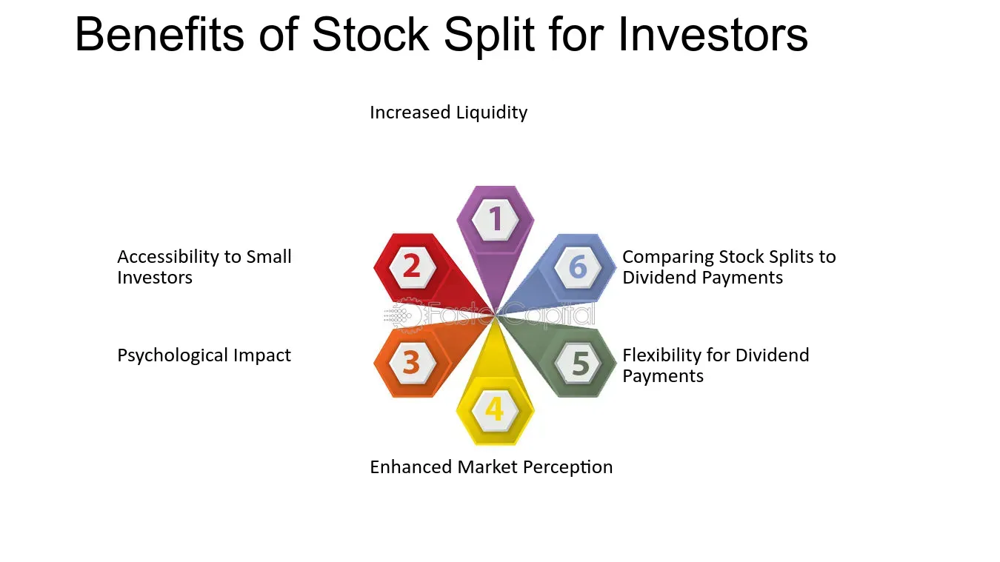

## Table of Contents

## What is a stock split and how does it work?

A stock split is when a company decides to divide its existing shares into more shares. This means that if you own one share of the company, after the split, you will own more shares, but the total value of your investment stays the same. Companies do this to make their stock price lower, which can attract more investors who might think the stock is more affordable.

For example, if a company does a 2-for-1 stock split, each share you own will turn into two shares. If the stock was worth $100 before the split, each share will be worth $50 after the split. So, if you owned one share worth $100 before, you would own two shares worth $50 each after the split, keeping the total value at $100. This can make the stock seem more accessible to smaller investors, even though the overall value of the company doesn't change.

## What is a stock buyback and why do companies do it?

A stock buyback is when a company uses its money to buy back its own shares from the stock market. This means the company is taking some of its shares out of the hands of investors and reducing the total number of shares that are out there. When a company does a buyback, it's like the company is investing in itself.

Companies do buybacks for a few reasons. One big reason is to make their stock price go up. When there are fewer shares available, the price of each share can go up because the value of the company is spread over fewer shares. This can make the stock look more valuable and can be good for the people who still own the shares. Another reason is to use extra cash the company has. If a company has more money than it needs for its business, it might decide to buy back its own stock instead of spending it on something else.

## How can stock splits affect the price of a stock?

A stock split can change how much each share of a stock costs. When a company does a stock split, it makes more shares, but the total value of the company stays the same. For example, if a company splits its stock 2-for-1, each share that used to cost $100 will now cost $50. This happens because the same amount of money is now spread out over twice as many shares. So, right after a stock split, the price of each share goes down.

Even though the price of each share goes down right after a stock split, it doesn't mean the value of your investment changes. If you owned one share worth $100 before the split, you'll own two shares worth $50 each after the split, so your total investment is still $100. However, stock splits can sometimes make the stock more attractive to new investors because the lower price per share can seem more affordable. This increased demand can sometimes push the stock price up over time, but it's not guaranteed.

## What are the potential benefits of stock buybacks for shareholders?

Stock buybacks can be good for shareholders because they can make the value of each share go up. When a company buys back its own shares, it takes some shares out of the market. This means there are fewer shares left, and the same amount of money the company is worth is now spread over fewer shares. So, each share becomes worth more. If you own shares, this can make your investment more valuable without you having to do anything.

Another benefit of stock buybacks is that they can show that the company thinks its own stock is a good investment. When a company uses its money to buy back its shares, it's like saying, "We believe our stock is worth buying." This can make shareholders feel more confident about the company and its future. It can also make other investors want to buy the stock too, which can help push the stock price up even more.

## How can an investor identify when a company is likely to announce a stock split or buyback?

Investors can look at a few things to guess if a company might announce a stock split or buyback. For stock splits, a big clue is if the stock price has gone up a lot and is much higher than other stocks in the same industry. Companies often split their stock to make the price lower and attract more investors. Also, if the company has a history of doing stock splits, it might do it again. For buybacks, investors should check if the company has a lot of extra cash. If a company is making more money than it needs for its business, it might decide to use that extra money to buy back its shares.

Another thing to watch is what the company says in its official reports and during meetings with investors. Sometimes, companies will talk about their plans for stock splits or buybacks in these places. Also, if the company's leaders start buying more of the company's stock themselves, it could be a sign that they think the stock is a good deal and might do a buyback. By keeping an eye on these signs, investors can get a better idea of when a company might make these moves.

## What are the tax implications of stock splits and buybacks?

Stock splits usually don't have any direct tax impact for investors. When a company does a stock split, the total value of your investment stays the same, even though you have more shares. You don't have to pay taxes on the extra shares you get because you didn't get any new money or value. But, if you decide to sell some of the shares after the split, you might have to pay capital gains tax if you make a profit. The tax rules depend on how long you held the shares and how much you made from selling them.

Stock buybacks can have a bit more of a tax impact, but it depends on what the company does with the shares it buys back. If the company cancels the shares it buys back, it doesn't directly affect your taxes. But if the company gives you some of the money it used for the buyback as a dividend, you might have to pay taxes on that money. Also, if the buyback makes the value of your shares go up and you decide to sell them, you might have to pay capital gains tax on the profit you make from selling them. The tax you pay depends on how long you owned the shares and how much money you made from selling them.

## How do stock splits and buybacks influence a company's market perception and stock valuation?

Stock splits can change how people see a company and its stock. When a company does a stock split, it makes the price of each share lower. This can make the stock seem more affordable to new investors, which can make more people want to buy it. Even though the total value of the company doesn't change, a lower price per share can make the stock look like a better deal. This can lead to more people buying the stock, which might push the stock price up over time. However, the direct effect of a stock split is that the price per share goes down right away, but the overall value of the company stays the same.

Stock buybacks can also change how people see a company and its stock. When a company buys back its own shares, it's taking some shares out of the market. This means there are fewer shares left, and the same amount of money the company is worth is now spread over fewer shares. This can make each share worth more, which can make the stock price go up. It can also make investors feel more confident about the company because it shows that the company thinks its own stock is a good investment. This positive signal can attract more investors and help push the stock price up even more. Overall, buybacks can make the stock seem more valuable and improve the company's market perception.

## What strategies can investors use to capitalize on announced stock splits?

When a company announces a stock split, investors can try to buy the stock before the split happens. This is because the news of a stock split can make more people want to buy the stock, which can push the price up. If you buy the stock before the split and the price goes up, you can make money when you sell it later. But remember, the price might not always go up just because of a stock split, so it's important to look at other things about the company too.

After the stock split, the price of each share will be lower, which can make the stock seem more affordable to new investors. This can attract more people to buy the stock, which might make the price go up over time. So, another strategy is to buy the stock right after the split and hold onto it for a while. If more people start buying the stock because of the lower price, you might be able to sell it later for a higher price. But, like with any investment, there's no guarantee that the price will go up, so always do your research before you buy.

## How can investors leverage stock buybacks to enhance their investment returns?

When a company announces a stock buyback, it's a good idea for investors to pay attention. A buyback means the company is using its money to buy its own shares from the market. This can make the value of each share go up because there are fewer shares left, and the same amount of money the company is worth is now spread over fewer shares. If you own shares in the company, this can make your investment more valuable without you having to do anything. So, one way to use buybacks to make more money is to keep your shares after the buyback. If the stock price goes up because of the buyback, you can sell your shares later for a higher price.

Another way to use buybacks to your advantage is to buy more shares of the company right before or during the buyback. If you think the buyback will make the stock price go up, buying more shares can help you make more money when you sell them later. But remember, the stock price might not always go up just because of a buyback. It's important to look at other things about the company too, like how well it's doing and what other investors think about it. By doing your research and understanding how buybacks work, you can make smarter choices about when to buy and sell your shares.

## What are the risks associated with investing in stocks around the time of splits and buybacks?

Investing in stocks around the time of splits and buybacks can be risky. When a company announces a stock split, the stock price might go up because more people want to buy it. But, there's no guarantee that the price will keep going up after the split. If the stock price goes down instead, you could lose money. Also, if you buy the stock just because of the split without looking at other things about the company, like how well it's doing or if it's a good investment, you might be making a mistake.

Stock buybacks can also be risky. When a company buys back its own shares, it can make the stock price go up because there are fewer shares left. But, if the company spends too much money on the buyback and doesn't have enough left for its business, it could hurt the company in the long run. This could make the stock price go down later. Also, if you buy more shares during a buyback hoping the price will go up, but it doesn't, you could lose money. So, it's important to think about all these risks and do your research before you invest.

## How do stock splits and buybacks fit into a long-term investment strategy?

Stock splits and buybacks can be part of a long-term investment strategy, but they should not be the only thing you think about. When a company does a stock split, it makes the price of each share lower, which can attract more investors. This might make the stock price go up over time, but it's not guaranteed. So, if you're thinking about holding onto a stock for a long time, you should look at other things about the company too, like how well it's doing and if it's a good investment overall. Stock splits can be a good sign that the company is doing well, but they don't change the total value of your investment right away.

Stock buybacks can also fit into a long-term strategy. When a company buys back its own shares, it can make the value of each share go up because there are fewer shares left. This can be good for you if you're holding onto the stock for a long time because your investment might become more valuable. But, you need to be careful. If the company spends too much money on buybacks and doesn't have enough left for its business, it could hurt the company in the long run. So, when you're thinking about your long-term investment strategy, you should look at how the company is using its money and if buybacks are a smart move for the company's future.

## What advanced metrics should expert investors monitor to assess the impact of stock splits and buybacks on a company's financial health?

Expert investors should keep an eye on a few important numbers to see how stock splits and buybacks affect a company's money situation. One key thing to watch is the company's earnings per share (EPS). When a company does a stock split, the EPS goes down because there are more shares, but the total earnings stay the same. On the other hand, a buyback can make the EPS go up because there are fewer shares, and the same amount of earnings is spread over fewer shares. Investors should also look at the price-to-earnings (P/E) ratio. This number can change after a split or buyback, and it can tell you if the stock is a good deal compared to other stocks.

Another important thing to check is the company's cash flow. A buyback uses up some of the company's cash, so investors need to make sure the company still has enough money left to run its business well. If a company spends too much on buybacks and doesn't have enough cash for other things, it could be a problem. Also, investors should look at the company's debt levels. If a company borrows money to do a buyback, it might have more debt, which can be risky. By keeping an eye on these numbers, investors can get a better idea of how stock splits and buybacks might affect the company's money situation in the long run.

## References & Further Reading

- **Financial Markets and Corporate Strategy by Mark Grinblatt & Sheridan Titman**: This comprehensive resource provides a detailed analysis of corporate finance and investment strategies, highlighting the financial mechanisms that companies use to create value. It covers fundamental aspects of stock splits, buybacks, and their strategic implications in the broader context of financial markets.

- **Stock Splits and Trading Volume by Anup Agrawal**: Agrawal’s work explores the intricate relationship between stock splits and trading volumes. The study provides empirical data showing how stock splits can affect investor behavior and market liquidity, offering insights valuable for understanding market dynamics and improving trading strategies.

- **NVIDIA's 4-for-1 Stock Split as covered by CNBC**: This article provides an overview of NVIDIA’s decision to implement a 4-for-1 stock split, analyzing its motivations and the subsequent impact on market performance. CNBC offers insights into how notable companies, like NVIDIA, maneuver stock splits to potentially boost shareholder value and market accessibility.

- **Apple’s Stock Split History overview on Investopedia**: Investopedia's coverage of Apple’s stock split history presents a chronological analysis of the company’s decisions to split its stock. This resource helps illustrate how repeated stock splits can influence market perception and investor sentiment, and why companies choose this strategy at different lifecycle stages.

- **Understanding Stock Splits in Trading, Bloomberg**: Bloomberg’s resource provides a practical guide to stock splits, explaining the processes and strategic considerations for companies and investors. It discusses the potential impact on liquidity, investor base, and price adjustment processes, making it an essential read for those seeking a deeper understanding of stock split mechanics.

