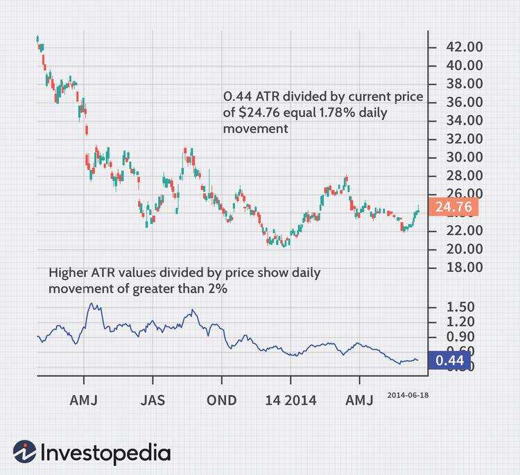

## Table of Contents

## What are Gold ETFs and how do they differ from physical gold?

Gold ETFs, or Exchange Traded Funds, are investment funds that track the price of gold. They are traded on stock exchanges, just like stocks. When you invest in a Gold ETF, you are not buying physical gold, but rather a share in a fund that holds gold or gold-related assets. This makes it easier to invest in gold without having to store and secure physical gold yourself. Gold ETFs can be bought and sold throughout the trading day at market prices, offering flexibility and liquidity.

Physical gold, on the other hand, refers to tangible gold items like coins, bars, or jewelry. When you buy physical gold, you own the actual metal and need to store it safely, which can be a concern. Physical gold can be a good investment, but it requires more effort and potentially higher costs for storage and insurance. Unlike Gold ETFs, physical gold does not come with the ease of trading on a stock exchange, and selling it can take more time and effort.

In summary, Gold ETFs offer a convenient way to invest in gold without the hassles of handling and storing physical gold. They provide the flexibility of trading on stock exchanges and can be a more accessible option for many investors. Physical gold, while offering the satisfaction of owning a tangible asset, comes with additional responsibilities and costs related to storage and security.

## What are the basic requirements for starting day-trading Gold ETFs?

To start day-trading Gold ETFs, you first need a brokerage account that lets you trade ETFs. You can open this account online with a broker that offers [ETF](/wiki/etf-trading-strategies) trading. Make sure the broker you choose has low fees and a good trading platform. You also need enough money in your account to meet the broker's minimum requirements for trading. Some brokers have a minimum amount you need to start with, so check this before you begin.

Once you have your account set up, you need to learn about the Gold ETFs you want to trade. Look at different ETFs and see which ones track the price of gold well. You should also understand how the gold market works and what affects its price. Day-trading means you buy and sell ETFs in the same day, so you need to watch the market closely and make quick decisions. It's a good idea to start with a small amount of money until you get the hang of it, and always be ready to learn more and improve your skills.

## How does market volatility affect day-trading Gold ETFs?

Market [volatility](/wiki/volatility-trading-strategies) can make day-trading Gold ETFs more exciting but also riskier. When the market is volatile, the price of Gold ETFs can go up and down a lot in a short time. This means you might make more money if you buy at the right time and sell when the price goes up. But it also means you could lose money if the price goes down quickly after you buy. You need to be ready to watch the market all the time and make fast decisions.

Volatility can also make it harder to predict what will happen next with Gold ETF prices. Things like news about the economy, changes in interest rates, or big events around the world can make the price of gold move a lot. As a day-trader, you need to stay calm and not let big price swings make you panic. It's important to have a plan and stick to it, even when the market is moving a lot.

## What are the most common technical indicators used in day-trading Gold ETFs?

When day-trading Gold ETFs, traders often use technical indicators to help them make decisions. Some of the most common ones are moving averages, which help show the average price of the ETF over a certain time. Traders might use a short-term moving average, like a 50-day one, and a longer-term one, like a 200-day one, to see if the price is going up or down. Another popular indicator is the Relative Strength Index (RSI), which tells you if an ETF is overbought or oversold. If the RSI is over 70, it might mean the ETF is overbought and could go down soon. If it's under 30, it might be oversold and could go up.

Another useful indicator is the Bollinger Bands, which show the high and low prices of the ETF over time. They help traders see if the price is moving a lot or staying the same. When the price hits the upper band, it might be time to sell, and when it hits the lower band, it might be time to buy. The MACD, or Moving Average Convergence Divergence, is also popular. It shows the relationship between two moving averages and can help traders see when it might be a good time to buy or sell. Using these indicators can help day-traders make better choices about when to trade Gold ETFs.

## How can a beginner set up a trading plan for Gold ETFs?

To set up a trading plan for Gold ETFs as a beginner, start by deciding how much money you want to spend on trading. This is your trading capital. Make sure you only use money you can afford to lose, because trading can be risky. Next, choose which Gold ETFs you want to trade. Look at different ETFs and see which ones have low fees and track the price of gold well. After [picking](/wiki/asset-class-picking) your ETFs, set clear goals for what you want to achieve. Do you want to make a certain amount of money each month, or are you just trying to learn how to trade? Having clear goals will help you stay focused.

Once you have your goals, decide on your trading strategy. A simple strategy for beginners is to use technical indicators like moving averages or the RSI to help you decide when to buy and sell. Set rules for yourself, like only trading during certain times of the day or only trading a certain amount of money at once. It's also important to have a plan for managing risk. Decide how much you're willing to lose on each trade, and stick to that limit. Keep track of your trades in a journal so you can learn from your successes and mistakes. A good trading plan will help you stay disciplined and make better decisions when trading Gold ETFs.

## What are the key economic indicators that influence Gold ETF prices?

Gold ETF prices are influenced by several key economic indicators. One important indicator is inflation. When inflation goes up, the value of money goes down, and people often buy gold to protect their money. Another big influence is interest rates. When interest rates are low, gold becomes more attractive because it doesn't pay interest, but it's seen as a safe place to keep money. On the other hand, when interest rates go up, people might choose to invest in bonds or savings accounts that pay interest instead of gold.

The strength of the US dollar also affects gold prices. When the dollar is strong, gold prices usually go down because gold becomes more expensive for people using other currencies. But when the dollar is weak, gold prices tend to go up. Another factor is economic uncertainty. During times of uncertainty, like a financial crisis or political instability, people often buy gold because it's seen as a safe investment. These economic indicators can help you understand why gold prices move the way they do, and they can be useful when you're trading Gold ETFs.

## How to manage risk when day-trading Gold ETFs?

Managing risk when day-trading Gold ETFs is important to protect your money. One way to do this is by setting a stop-loss order. This is a rule you set with your broker that tells them to sell your ETF if the price drops to a certain level. It helps you limit how much money you could lose on one trade. Another way to manage risk is by not putting all your money into one trade. Instead, spread your money across different trades. This way, if one trade goes badly, you won't lose all your money at once.

It's also a good idea to only use money you can afford to lose when trading. This means not using money you need for bills or other important things. Keeping a trading journal can help you manage risk too. Write down what you did right and what you did wrong in each trade. This can help you learn from your mistakes and make better choices in the future. By following these simple steps, you can better manage the risks of day-trading Gold ETFs and keep your trading safe.

## What are the differences between day-trading Gold ETFs and other ETFs?

Day-trading Gold ETFs and other ETFs have some differences. Gold ETFs are focused on the price of gold, so they are influenced by things like inflation, interest rates, and the strength of the US dollar. These factors can make the price of Gold ETFs go up and down a lot. Other ETFs might track different things, like the stock market or specific industries. For example, an ETF that tracks tech stocks might be influenced by news about tech companies or changes in the overall stock market.

Another difference is how volatile Gold ETFs can be compared to other ETFs. Gold prices can change quickly because of economic news or global events, which means Gold ETFs can be riskier to trade. Day-trading other ETFs might be less risky if they track more stable markets or sectors. Also, the strategies you use to trade Gold ETFs might be different from those for other ETFs. For example, you might use technical indicators like moving averages or RSI to help decide when to buy and sell Gold ETFs, while other ETFs might need different indicators based on what they track.

## How can advanced traders use algorithmic trading for Gold ETFs?

Advanced traders can use [algorithmic trading](/wiki/algorithmic-trading) to trade Gold ETFs by writing computer programs that follow certain rules to buy and sell the ETFs. These programs can look at things like price patterns, economic news, or other data to decide when to make trades. This can help traders make decisions faster and without letting emotions get in the way. For example, a trader might set up an algorithm to buy Gold ETFs when the price goes above a certain moving average and sell when it goes below another one. This way, the computer does the trading based on the rules the trader set up.

Using algorithmic trading can also help advanced traders manage risk better. They can set up their programs to automatically use stop-loss orders, which sell the ETFs if the price drops too much. This can help limit losses. Also, algorithms can trade many times in a day, taking advantage of small price changes that a person might miss. But, setting up these algorithms needs a lot of knowledge about both trading and programming. Traders need to keep an eye on their algorithms and make changes if the market changes or if the algorithms aren't working well.

## What are the tax implications of day-trading Gold ETFs?

When you day-trade Gold ETFs, you need to think about taxes. In the United States, any money you make from trading is considered capital gains. If you hold your Gold ETFs for less than a year before selling them, the gains are short-term capital gains. These are taxed at the same rate as your regular income, which can be as high as 37% depending on how much money you make. If you hold the ETFs for more than a year, the gains are long-term capital gains, which are taxed at a lower rate, usually 0%, 15%, or 20%, depending on your income.

It's also important to know that if you trade a lot, you might be considered a day-trader by the IRS. This means you could be subject to the wash-sale rule, which says you can't claim a loss on a security if you buy a "substantially identical" security within 30 days before or after the sale. This rule can make your taxes more complicated. Keeping good records of all your trades is really important so you can report your gains and losses correctly on your tax return. It's a good idea to talk to a tax professional to make sure you're doing everything right and not missing out on any tax benefits.

## How to use options strategies in conjunction with Gold ETF day-trading?

Using options strategies with Gold ETF day-trading can help you manage risk and make more money. One way to do this is by buying call options on Gold ETFs. A call option gives you the right to buy the ETF at a certain price before a certain date. If you think the price of gold will go up, you can buy a call option and make money if the ETF price goes above the option's strike price. This can be less risky than buying the ETF directly because you only lose the money you paid for the option if the price doesn't go up. Another strategy is selling put options. If you think the price of gold will stay the same or go up, you can sell a put option and make money from the premium if the ETF price stays above the strike price.

Another option strategy is using a straddle, which involves buying both a call and a put option at the same strike price and expiration date. This can be useful if you think the price of gold will move a lot but you're not sure which way. If the price goes up a lot, you make money from the call option. If it goes down a lot, you make money from the put option. But if the price doesn't move much, you could lose the money you paid for both options. Using options with Gold ETF day-trading can be a good way to make money and manage risk, but it's important to understand how options work and to be careful because they can be complicated and risky.

## What are the latest trends and future outlook for day-trading Gold ETFs?

The latest trend in day-trading Gold ETFs is the increased use of technology and automation. More traders are using algorithms and trading bots to make quick decisions based on market data. This helps them take advantage of small price changes throughout the day. Another trend is the growing interest in sustainable and ethical investing, which is leading to the creation of new Gold ETFs that focus on responsible mining practices. These trends show that the market for Gold ETFs is becoming more advanced and diverse.

Looking into the future, day-trading Gold ETFs is likely to keep growing in popularity. As more people become interested in investing, the demand for easy-to-trade assets like Gold ETFs will probably increase. Economic uncertainty and inflation concerns will also keep gold attractive as a safe investment. However, traders need to stay aware of changes in technology and market conditions to keep up with the fast-paced world of day-trading.

## How can one integrate investment strategies?

Combining gold ETFs, [day trading](/wiki/day-trading-spy), and algorithmic trading can offer a balanced approach to portfolio diversification and effective risk management. Each strategy presents unique characteristics that, when strategically integrated, can optimize the risk-return profile of an investment portfolio.

Gold ETFs serve as a steady and reliable asset class that provides exposure to the price fluctuations of gold. They offer a degree of stability and act as a hedge against inflation, which can counterbalance the higher volatility and risk associated with day trading and algorithmic trading. This stable component can effectively anchor a portfolio, providing a cushion against the unpredictable swings that more aggressive trading strategies might incur.

To effectively blend these strategies, investors should consider the principles of diversification, which involve spreading investments across various financial instruments to mitigate risk. The concept of the correlated portfolio variance can be instrumental here, where the overall risk ($\sigma_p$) of a portfolio is reduced when investments with low correlation are combined:

$$
\sigma_p = \sqrt{\left(\sum \left(w_i \cdot \sigma_i\right)^2 + 2 \sum \left(w_i \cdot w_j \cdot \text{Cov}(r_i, r_j)\right)\right)}
$$

where $w_i$ and $w_j$ represent the weights of different assets, $\sigma_i$ is the standard deviation of the individual asset, and $\text{Cov}(r_i, r_j)$ is the covariance between the returns of assets $i$ and $j$.

Another critical [factor](/wiki/factor-investing) in effectively integrating gold ETFs, day trading, and algorithmic trading is thorough planning and continual adjustment to the strategies. Investors must remain cognizant of changing market conditions and personal financial goals, which can necessitate a reevaluation and rebalancing of their portfolios. Technological advancements, regulatory changes, and macroeconomic factors can all influence optimal asset allocation, making flexibility a key attribute for successful investment management.

Furthermore, a robust understanding of the interplay between these investment methods is essential. For instance, the potential profits from day trading and algorithmic trading need to be weighed against their risks and how they might impact the more stable asset allocations in gold ETFs. Utilizing Python scripts, investors can simulate different market scenarios to assess how integrated strategies perform under various economic conditions. For instance, a simple Monte Carlo simulation can provide insights on potential outcomes and help in the decision-making process:

```python
import numpy as np

def monte_carlo_simulation(initial_value, num_simulations, time_horizon, volatility, drift):
    np.random.seed(42)
    simulated_values = np.zeros((num_simulations, time_horizon))
    for sim in range(num_simulations):
        prices = [initial_value]
        for _ in range(1, time_horizon):
            price = prices[-1] * np.exp((drift - 0.5 * volatility**2) + volatility * np.random.normal())
            prices.append(price)
        simulated_values[sim] = prices
    return simulated_values

# Example parameters
initial_value = 1000
num_simulations = 1000
time_horizon = 252  # Assume trading days in a year
volatility = 0.2
drift = 0.05

simulated_portfolios = monte_carlo_simulation(initial_value, num_simulations, time_horizon, volatility, drift)
```

In conclusion, the integration of gold ETFs, day trading, and algorithmic trading requires careful consideration of risk factors, diversification principles, and ongoing reassessment based on market conditions. The judicious combination of these strategies holds promise for enhancing portfolio resilience and achieving a balanced risk-return ratio tailored to meet individual financial aspirations.

## References & Further Reading

[1]: Bergstra, J., Bardenet, R., Bengio, Y., & Kégl, B. (2011). ["Algorithms for Hyper-Parameter Optimization."](https://dl.acm.org/doi/10.5555/2986459.2986743) Advances in Neural Information Processing Systems 24.

[2]: ["Advances in Financial Machine Learning"](https://www.amazon.com/Advances-Financial-Machine-Learning-Marcos/dp/1119482089) by Marcos Lopez de Prado

[3]: ["Evidence-Based Technical Analysis: Applying the Scientific Method and Statistical Inference to Trading Signals"](https://www.amazon.com/Evidence-Based-Technical-Analysis-Scientific-Statistical/dp/0470008741) by David Aronson

[4]: ["Machine Learning for Algorithmic Trading"](https://github.com/stefan-jansen/machine-learning-for-trading) by Stefan Jansen

[5]: ["Quantitative Trading: How to Build Your Own Algorithmic Trading Business"](https://www.amazon.com/Quantitative-Trading-Build-Algorithmic-Business/dp/1119800064) by Ernest P. Chan