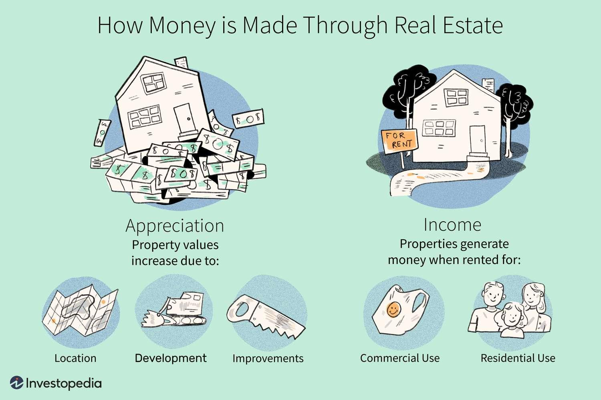

Investing in real estate offers a potential pathway to achieving financial independence by generating substantial wealth through various income streams and strategic market participation. Real estate investment involves the acquisition of properties, aiming to profit through appreciation, rental income, and strategic trading practices. This article explores the dual approach of traditional real estate investment strategies and algorithmic trading techniques, presenting a comprehensive perspective on how modern technology can enhance profitability in real estate markets.

Traditional real estate investment strategies have long been associated with stable income generation and wealth accumulation. These methods typically focus on property acquisition, securing favorable rental terms, and leveraging market timing to maximize appreciation. Investors assess property value, location, and market trends to make informed decisions that balance risk and reward, thereby creating a sustainable financial model. Diversification among different types of properties such as residential, commercial, and land further aids in withstanding market volatility and optimizing returns.



On the other hand, algorithmic trading introduces a data-driven, technology-enhanced technique allowing investors to analyze large datasets, optimize transaction timing, and make predictions based on market trends. Algorithmic trading leverages AI and machine learning to identify patterns and execute trades with precision, potentially enhancing investment efficiency and profitability. This method allows investors to capitalize on market inefficiencies and adapt to changing economic conditions with a technological edge.

Integrating these traditional methods with algorithmic trading strategies provides a synergistic approach that can yield superior returns. By combining the intuitive insights derived from traditional methods with the accuracy and speed of algorithmic trading, investors can enhance their property value assessments and improve transaction efficiency. This fusion enables a balanced strategy where human intuition complements technological precision, creating opportunities for maximizing real estate investment profits.

In summary, the intersection of traditional real estate investment strategies with cutting-edge algorithmic trading technologies represents a powerful approach for optimizing returns in the real estate market. This article aims to present this blend of methodologies as a transformative pathway toward financial independence, encouraging investors to embrace both technological advancements and time-tested investment strategies to achieve their financial goals.

## Table of Contents

## Understanding Real Estate Investment Properties

Real estate investment properties provide substantial financial opportunities primarily through two avenues: appreciation and rental income. Appreciation refers to the increase in the value of a property over time, influenced by factors such as market demand, development in the area, and improvements made to the property. Rental income, on the other hand, offers a regular revenue stream, making real estate a potentially lucrative investment.

Selecting the right property is critical for maximizing returns and involves a comprehensive market analysis. This process includes evaluating macroeconomic indicators like interest rates and employment trends, which can affect property values and rental demand. Location assessment is equally important; properties in areas with robust economic growth, infrastructure development, and access to amenities tend to show higher appreciation rates and rental yields.

Understanding potential Return on Investment (ROI) is essential for informed decision-making. ROI can be calculated by comparing the net profit from the property to the initial investment. The formula is:

$$
\text{ROI} = \left( \frac{\text{Net Profit}}{\text{Total Investment}} \right) \times 100
$$

Where:
- Net Profit is the income generated from the property minus expenses such as maintenance, taxes, and mortgage interest.
- Total Investment is the initial amount invested, including purchase price and any renovation costs.

Diversification is a fundamental strategy to mitigate risks inherent in the real estate market. By investing in various types of properties—such as residential, commercial, and industrial—across different geographic locations, investors can protect themselves against localized market downturns. Diversifying a portfolio ensures that not all assets are exposed to the same market conditions, reducing the overall risk and potentially enhancing returns.

Successful real estate investment demands an understanding of how different property types behave under varying market conditions. For instance, commercial properties often provide higher yields but come with higher risks and longer vacancy periods. In contrast, residential properties typically have lower yields but offer more stable occupancy rates.

In conclusion, choosing the right investment property involves careful assessment of market conditions, potential ROI, and diversification to buffer against economic fluctuations. By employing these strategies, investors can harness the economic potential of real estate to build a robust financial future.

## Real Estate Income Strategies

Real estate income strategies are essential for generating revenue from various types of properties. These include residential, commercial, and raw land, each offering distinct pathways to income generation.

### Residential Properties
Residential properties are often considered a stable source of income due to their ability to provide consistent rental revenue. Income from residential real estate is primarily derived from rental agreements, where tenants pay a fixed monthly amount in exchange for occupancy. Effective tenant management, such as thorough tenant screening and regular maintenance, ensures minimal vacancy periods and consistent cash flow.

Rental agreements can be structured in various ways, including fixed-term leases or month-to-month leases, each with its own set of benefits and risks. Fixed-term leases provide income stability, while month-to-month leases offer flexibility to adjust rents based on market conditions.

### Commercial Properties
Commercial properties, such as office buildings, retail spaces, and industrial complexes, typically generate higher rental yields compared to residential properties. Income from commercial real estate can come from traditional lease agreements or triple net leases. In a triple net lease, tenants are responsible for paying property taxes, insurance, and maintenance costs, reducing the landlord's operational expenses.

The profitability of commercial investments largely depends on market demand, location advantages, and tenant quality. High foot traffic areas and proximity to public transport are crucial factors that enhance rental value. Additionally, commercial leases often include rent escalation clauses, allowing incremental rent increases pegged to inflation or market benchmarks.

### Raw Land
Raw land income generation differs significantly from built property. Income from raw land can be obtained through leasing for agricultural purposes, developing the land, or holding it for appreciation. Strategic location plays a pivotal role in maximizing potential returns from raw land investments. For instance, proximity to expanding urban areas can significantly increase land value over time, providing substantial capital gains.

### Rental Price Optimization
Location and market trends are fundamental in optimizing rental prices across property types. Factors such as local economic conditions, employment rates, and demographic shifts influence rental demand and pricing. Real estate investors must conduct thorough market research and employ data analysis to set competitive rental prices that optimize occupancy rates and profitability.

For example, employing Python programming can automate and analyze market data to suggest optimal rent pricing. Below is a basic example of Python code that uses linear regression to predict rental prices based on location and market trends:

```python
import numpy as np
from sklearn.linear_model import LinearRegression

# Example dataset
locations = np.array([[1, 2], [2, 3], [3, 4], [4, 5]])
rental_prices = np.array([1000, 1500, 2000, 2500])

# Linear Regression Model
model = LinearRegression()
model.fit(locations, rental_prices)

# Predict rent price for new location data
new_location = np.array([[5, 6]])
predicted_price = model.predict(new_location)

print(f"Predicted rental price: ${predicted_price[0]:.2f}")
```

In conclusion, understanding and applying effective real estate income strategies across various property types are crucial for generating steady revenue. Through strategic tenant management, market research, and leveraging technology, investors can optimize their returns and sustain profitable real estate portfolios.

## Algorithmic Trading in Real Estate

Algorithmic trading refers to using computer programs to automate and enhance trading decisions and strategies, relying on pre-set rules and data analysis. While notably popular in financial markets, its application in real estate is gaining traction, offering an innovative approach to property investment. By integrating vast data sources, [algorithmic trading](/wiki/algorithmic-trading) in real estate aims to optimize investment timing, property selection, and overall market understanding.

### Data-Driven Decision Making

Algorithms designed for real estate investment analyze numerous data sets, ranging from economic indicators to property specifics. These algorithms identify patterns and trends that may not be visible through traditional analysis methods. For example, they can process geographical data, demographic changes, historical prices, interest rates, and more to make informed predictions about market movements. This analytical capability is crucial for timing the market—buying or selling properties at the most opportune moments—thereby maximizing returns.

In Python, a basic example of how [machine learning](/wiki/machine-learning) could predict property prices might involve using a linear regression model:

```python
from sklearn.model_selection import train_test_split
from sklearn.linear_model import LinearRegression
from sklearn.metrics import mean_squared_error
import pandas as pd

# Load your dataset
data = pd.read_csv('real_estate_data.csv')

# Define your features and target
features = data[['location_score', 'size', 'age', 'number_of_rooms', 'market_trend']]
target = data['price']

# Split the data
X_train, X_test, y_train, y_test = train_test_split(features, target, test_size=0.2, random_state=42)

# Initialize and train the model
model = LinearRegression()
model.fit(X_train, y_train)

# Make predictions
predictions = model.predict(X_test)

# Evaluate the model
mse = mean_squared_error(y_test, predictions)
print(f'Mean Squared Error: {mse}')
```

This simple model can be expanded with more complex algorithms like random forests or neural networks to enhance accuracy, particularly in capturing non-linear market trends.

### AI and Machine Learning in Real Estate

Artificial Intelligence (AI) and Machine Learning (ML) extend these capabilities further. By learning from past market data, AI systems can predict future market conditions and recommend strategic actions accordingly. Machine learning algorithms, through supervised and unsupervised learning, can cluster different property types, forecast trends, and even simulate various market scenarios.

Through techniques such as natural language processing, these algorithms can also conduct sentiment analysis using news articles, social media, and market reports. This is instrumental in assessing market sentiment, which can significantly influence real estate valuations and investment decisions.

Incorporating AI in real estate trading not only enhances prediction accuracy but also streamlines operations. For instance, AI-driven platforms can automate property searches, valuations, and the due diligence process. In practice, these applications can lead to more efficient portfolio management and optimized investment strategies.

The integration of algorithmic trading into real estate heralds a new era of smarter, data-driven investments. By leveraging advanced statistical and AI models, investors can gain deeper insights into market dynamics, mitigate risks, and enhance their investment performance. As AI technology continues to evolve, its symbiosis with real estate promises to redefine traditional investment paradigms.

## Integrating Traditional and Algo Trading Strategies

Integrating traditional real estate investment strategies, such as buy-and-hold and property flipping, with algorithmic trading techniques, offers a sophisticated approach to maximizing returns. Traditional real estate investment strategies are typically grounded in long-term market experiences and assessments. The buy-and-hold strategy, for example, involves purchasing a property with the expectation that its value will appreciate over time, thus generating capital gains. Flipping, on the other hand, focuses on buying undervalued properties, usually requiring renovation, and reselling them for a profit within a short time frame. These methods rely heavily on market expertise, demographic trends, and thorough property evaluations.

To achieve optimal results, traditional strategies can be complemented by algorithmic insights. Algorithms excel in processing large datasets and identifying patterns that might not be apparent through manual analysis. By employing algorithmic models, investors can meticulously analyze market trends, property values, and economic indicators, thereby enhancing decision-making processes. For example, algorithms can forecast property value appreciation through regression models or neural networks, enabling more informed buy-and-hold investment decisions. This data-driven approach enhances the traditional strategy's reliability and effectiveness.

Technology plays a crucial role in improving property value assessments and transaction efficiency. Automated valuation models (AVMs) leverage big data and machine learning to provide rapid and accurate property appraisals. These models analyze various property attributes and recent transaction data to predict market values more efficiently than conventional appraisal methods. Moreover, distributed ledger technology, such as blockchain, streamlines property transactions by reducing the time and costs associated with title verification and contract execution, thus enhancing [liquidity](/wiki/liquidity-risk-premium) in real estate markets.

Finding the right balance between human intuition and technological precision is vital in real estate investments. Algorithms provide data-driven insights that significantly enhance the accuracy of property valuations and market predictions. However, human intuition remains important in interpreting these insights and understanding the qualitative aspects of real estate, such as local market sentiment or unique property features that algorithms may overlook. 

A hybrid investment approach leverages the strengths of both components: using algorithmic tools for data analysis and market timing while relying on human judgment to interpret findings and make strategic decisions that align with broader investment goals. For instance, an investor might use machine learning models to identify undervalued properties and then apply personal expertise to assess the property's renovation potential and market fit.

In conclusion, integrating traditional and algorithmic trading strategies offers a comprehensive methodology for maximizing real estate investment returns. This synergy capitalizes on the analytical power of technology while harnessing the nuanced understanding and experience of seasoned investors, ensuring a robust investment process tailored to the dynamic real estate market landscape.

## Challenges and Risks

Real estate investment and algorithmic trading each present a unique set of challenges and risks. Understanding these is essential for minimizing potential losses and ensuring sustained profitability. 

### Risks in Real Estate Investment

1. **Market Volatility**: The real estate market is subject to fluctuations influenced by economic conditions, interest rates, and geopolitical events. These factors can lead to changes in property values and rental income. Being heavily reliant on market trends, investors might face reduced asset liquidity during downturns.

2. **Property-Specific Risks**: These include issues related to property management, unexpected maintenance costs, and tenant defaults. Properties in certain locations may also be susceptible to natural disasters, which can impact their value and insurability.

3. **Regulatory Changes**: Shifts in zoning laws, taxation policies, and housing regulations can affect property values and rental yields. Staying informed of local legislative developments is crucial for investors to adjust strategies accordingly.

### Risks in Algorithmic Trading

1. **Technology Failures**: Algorithmic trading is reliant on robust technology infrastructure. Hardware malfunctions, software bugs, or network downtime can severely impact trading operations. Algorithms require continuous updates and monitoring to accommodate changes in data patterns.

2. **Market Anomalies**: Algorithms are designed using historical data. However, unprecedented market conditions or anomalies can render these algorithms ineffective. This includes events like financial crises or sudden regulatory changes, leading to unexpected results.

3. **Overfitting Data Models**: In the pursuit of precision, algorithms might be overly tailored to historical datasets, failing to perform well in real-world scenarios. This statistical overfitting limits the robustness of prediction models when faced with new or unusual data inputs.

### Mitigation Strategies

1. **Diversification**: Spreading investments across different asset types, geographical locations, and sectors can mitigate risks associated with market volatility and property-specific issues. This reduces reliance on a single income stream or market condition.

2. **Continuous Monitoring and Adaptation**: Real-time data analytics and market monitoring tools can help investors stay ahead of trends and rapidly respond to changes. Implementing adaptive learning algorithms that can update themselves with new data is essential for maintaining algorithmic trading efficiency.

3. **Robust Risk Management Protocols**: Having predefined risk management strategies such as stop-loss orders, setting maximum drawdowns, and maintaining cash reserves can limit exposure during unpredictable market conditions. Regular stress testing of algorithms against extreme market scenarios can also preempt potential failures.

4. **Regular Audits and Updates**: Systematic audits of technological infrastructure and trading algorithms, accompanied by periodic updates, help safeguard against unforeseen tech failures and ensure alignment with the latest market conditions.

By balancing these risks with well-crafted strategies, investors can harness the synergy between real estate investments and algorithmic trading to optimize their portfolios and achieve stable returns.

## Conclusion

The convergence of real estate investment strategies with algorithmic trading represents a powerful avenue for maximizing income potential in today’s financial landscape. Real estate, traditionally known for its stability and tangible asset value, now benefits from innovative technological advancements that enhance decision-making processes. By integrating algorithmic trading into real estate investments, investors can leverage data-driven insights to optimize their asset selection, market timing, and portfolio management.

Modern technology offers tools that complement conventional investment wisdom, enabling investors to navigate complex market environments more efficiently. Algorithms and machine learning models contribute by predicting market trends and assessing property values with heightened accuracy. This synergy between technology and traditional strategies allows investors to maintain a competitive edge, effectively balancing intuition with precision.

Moreover, the dynamic nature of the real estate market underlines the necessity for continuous learning and adaptability. As new technological advancements emerge and market conditions fluctitate, investors must remain agile, updating their strategies accordingly. Emphasizing both education and experience ensures that investors can respond to challenges and capitalize on opportunities, securing their portfolios for long-term success.

In summary, the fusion of real estate strategies and algorithmic trading not only enhances income potential but also empowers investors to actively participate in a rapidly evolving market. By embracing both contemporary tools and age-old investment principles, one can achieve a robust and resilient investment approach.

## References & Further Reading

[1]: Bergstra, J., Bardenet, R., Bengio, Y., & Kégl, B. (2011). ["Algorithms for Hyper-Parameter Optimization."](https://papers.nips.cc/paper/4443-algorithms-for-hyper-parameter-optimization) Advances in Neural Information Processing Systems 24.

[2]: ["Advances in Financial Machine Learning"](https://www.amazon.com/Advances-Financial-Machine-Learning-Marcos/dp/1119482089) by Marcos Lopez de Prado

[3]: ["Evidence-Based Technical Analysis: Applying the Scientific Method and Statistical Inference to Trading Signals"](https://www.amazon.com/Evidence-Based-Technical-Analysis-Scientific-Statistical/dp/0470008741) by David Aronson

[4]: ["Machine Learning for Algorithmic Trading"](https://github.com/stefan-jansen/machine-learning-for-trading) by Stefan Jansen

[5]: ["Quantitative Trading: How to Build Your Own Algorithmic Trading Business"](https://www.amazon.com/Quantitative-Trading-Build-Algorithmic-Business/dp/1119800064) by Ernest P. Chan