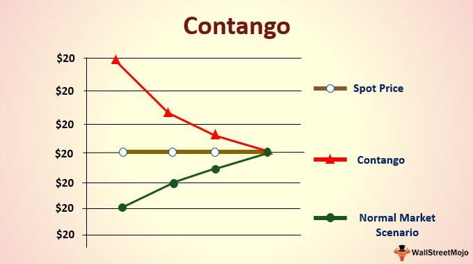

Contango trading is a compelling prospect within financial markets, offering substantial opportunities for traders who possess effective strategies. This article explores contango's underlying mechanics, detailing its implications and presenting the best trading strategies available. Algorithmic trading serves as an instrumental tool for traders seeking to harness the potential of contango scenarios, enabling enhanced precision and efficiency. This exploration highlights both the significant potential and inherent risks of contango trading, empowering traders with the knowledge to navigate these market conditions. Through illustrative examples and expert insights, readers will gain a thorough understanding of contango environments and strategies for their exploitation.

## Table of Contents



## Understanding Contango

Contango represents a market condition where the futures price of a commodity exceeds its current spot price. This scenario is typically driven by several factors including storage costs, insurance, and expectations of rising prices. For instance, if the spot price of oil currently stands at $60 per barrel but its futures price is $65, the market is depicting a contango situation. 

One of the primary mechanics contributing to contango is the cost of carry. This concept encompasses the expenses associated with holding a physical commodity over time, which include storage fees, insurance, and financing costs. The futures price can be expressed as:

$$
F = S(1 + c)^t
$$

Where:
- $F$ represents the futures price
- $S$ is the spot price
- $c$ denotes the cost of carry
- $t$ is the time until the futures contract expires

In a contango market, traders anticipate future increases in the commodity's price, leading to higher futures prices compared to current spot prices. This expectation can arise due to factors such as projected demand spikes, geopolitical tensions, or anticipated supply chain disruptions.

To identify contango opportunities, traders should monitor the spread between the futures and spot prices. A widening spread can signal a stronger contango situation, presenting potential [arbitrage](/wiki/arbitrage) opportunities. Technical analysis tools and historical price data can also help traders discern patterns indicative of contango. Additionally, understanding these opportunities requires a grasp of the broader economic context and the specific commodity's market dynamics.

In summary, contango arises primarily due to the cost of carrying commodities and anticipations of future price escalations. Traders can exploit these dynamics by analyzing price spreads and considering the underlying economic factors affecting commodity markets.

## Market Implications of Contango

Contango markets present a unique set of implications that potentially translate into profitable opportunities for traders. In these markets, futures prices are higher than the current spot prices, typically indicating that traders expect the price of the underlying asset or commodity to increase over time. This expectation can be influenced by various factors such as storage costs, insurance, and future demand projections.

One of the primary implications of contango is the possibility of arbitrage. Arbitrage involves exploiting price differentials between different markets or forms of an asset. In a contango scenario, traders can execute cash-and-[carry](/wiki/carry-trading) strategies. This involves purchasing the commodity at the current spot price and simultaneously entering a futures contract to sell it at the higher futures price. The price differential, minus the costs of carrying (such as storage and insurance), can result in a profit.

Mathematically, the profit from cash-and-carry arbitrage can be represented as:

$$
\text{Profit} = F_t - S_0 - C
$$

Where:
- $F_t$ is the futures price at time $t$,
- $S_0$ is the current spot price,
- $C$ represents the carrying costs.

The presence of contango often indicates a bullish market sentiment, with traders expecting future prices to rise, potentially due to factors such as anticipated supply constraints or increased demand. This outlook can affect various trading strategies, as traders may adopt positions that align with these expected price increases.

Understanding and leveraging contango implications can enable traders to enhance their trading strategies, allowing them to maximize potential returns while effectively managing risk. By maintaining awareness of market trends and recognizing signs of contango, traders can make informed decisions. Furthermore, strategies such as futures rolling can be advantageous. This strategy involves selling near-term contracts while purchasing those with longer maturities to exploit the differences in term structures. However, traders must exercise caution as persistent contango can lead to negative roll yields, thereby reducing profitability.

Overall, the ability to navigate contango markets hinges on a clear understanding of market dynamics and a proactive approach to risk management, allowing traders to capitalize on potential gains while mitigating exposure to adverse price movements.

## Algorithmic Trading in Contango Markets

Algorithmic trading in contango markets involves the use of automated systems designed to execute trades by capitalizing on price discrepancies inherent in futures contracts. Central to this approach are techniques such as spread trading and statistical pattern recognition, which facilitate the identification and exploitation of profitable opportunities in a contango environment.

Spread trading, a popular strategy in [algorithmic trading](/wiki/algorithmic-trading), involves taking positions in two or more related instruments to profit from the price difference between them. In the context of contango, traders may establish a long position in a futures contract that is undervalued and simultaneously take a short position in a related contract that is overvalued. This tactic aims to benefit from the convergence of prices over time as the expiry dates of the futures contracts approach and the market recalibrates its expectations.

Statistical pattern recognition plays a crucial role in identifying these trading opportunities. By analyzing historical price data and applying statistical models, traders can detect patterns and anomalies within contango markets. Machine learning algorithms are particularly useful in this regard, as they can be trained to recognize subtle signals that may indicate profitable trading opportunities. For example, principal component analysis (PCA) can reduce the dimensionality of complex data sets, highlighting key factors that influence price movements in futures contracts.

Python is frequently used for developing trading algorithms in contango markets due to its powerful data manipulation libraries such as NumPy and pandas. These libraries enable traders to efficiently process large volumes of data and conduct sophisticated analyses. A simplified Python script illustrating a basic algorithmic trading strategy in a contango market might look like this:

```python
import numpy as np
import pandas as pd

# Load historical price data
data = pd.read_csv('futures_prices.csv')

# Calculate price spread
data['Spread'] = data['Future1'] - data['Future2']

# Define trading strategy parameters
threshold = 1.5

# Execute trades based on the spread
def trading_strategy(data, threshold):
    data['Position'] = np.where(data['Spread'] > threshold, 'Sell Future1 and Buy Future2',
                                np.where(data['Spread'] < -threshold, 'Buy Future1 and Sell Future2', 'Hold'))
    return data

# Apply the trading strategy
trading_strategy(data, threshold)

# Output the trading signals
print(data[['Date', 'Spread', 'Position']])
```

This script calculates the spread between two futures contracts, identifies when the spread exceeds a specified threshold, and generates corresponding trading signals. Such automated approaches enable traders to quickly react to market changes, thereby enhancing their ability to profit from contango scenarios.

In conclusion, algorithmic trading in contango markets offers a systematic approach to exploiting market inefficiencies. By utilizing advanced computational techniques and leveraging powerful programming tools like Python, traders can optimize their strategies to navigate and benefit from the unique characteristics of contango environments effectively.

## Contango Trading Strategies

Contango trading strategies are crucial for traders looking to exploit disparities in commodity pricing between spot and futures markets. One primary strategy is Cash-and-Carry Arbitrage. This involves purchasing a commodity at the current spot price while simultaneously selling futures contracts for the same commodity. The key objective is to profit from the price difference, assuming that the futures price is above the spot price plus any associated carrying costs, such as storage and insurance. The mechanics of this strategy rely on holding the commodity until the futures contract matures, delivering it, and pocketing any positive spread after costs.

Reverse Cash-and-Carry Arbitrage becomes relevant in situations where mispricing occurs, most often in markets experiencing backwardation but can also apply to overvalued futures in contango conditions. This strategy involves selling the commodity at the spot price and simultaneously purchasing future contracts. The profitability hinges on the premise that the cost of buying and storing until delivery will be less than the future contracts yield, after considering associated costs.

Rolling Futures Contracts are another strategic approach leveraged in contango markets. Here, traders sell short-term futures contracts and replace them with longer-term ones as the short-term contracts near expiration. This technique attempts to profit from favorable shifts in future prices, though it is susceptible to negative roll yields—losses that occur when the futures curve is upward sloping, a hallmark of contango. Persistent contango can diminish returns as the cost of rolling exceeds perceived profits, requiring careful prediction and timing.

Overall, contango trading demands acute market awareness and a calibrated strategy to manage inherent risks and costs, ensuring that opportunities are maximized and leveraged efficiently.

## Risks and Considerations

Contango trading, while offering substantial profit potential, is fraught with risks that traders must manage carefully to ensure successful outcomes. Market [volatility](/wiki/volatility-trading-strategies) is a primary concern, as unexpected price movements can significantly affect both spot and futures prices. Traders operating within contango environments need to be vigilant in monitoring these fluctuations to avoid unexpected losses.

One of the primary considerations in contango trading is the impact of storage and transaction costs. These costs can quickly erode potential profits if they aren't accurately incorporated into trading strategies. For example, if the costs of storing a commodity exceed the anticipated price increase reflected in the futures market, any gains from trading may be negated. Therefore, precise cost calculations and projections are crucial.

Effective risk management in contango trading involves several key strategies. Hedging is a common technique used to protect against adverse price movements. By taking opposing positions in the spot and futures markets, traders can mitigate potential losses. For instance, if a trader is concerned about a possible drop in the spot price of a commodity, they might take a short position in that commodity's futures contract.

Diversification also plays an essential role in managing contango trading risks. By spreading investments across various commodities or asset classes, traders can reduce the impact of adverse price movements in any single market. This approach is particularly critical in volatile markets where price movements can be sudden and unpredictable.

Another critical [factor](/wiki/factor-investing) is efficient transaction cost management. The frequent buying and selling of contracts in futures markets can incur significant transaction costs, which, if not minimized, can reduce overall profitability. Traders should seek out trading platforms that offer low fees and utilize algorithms that optimize trade execution.

Overall, while contango trading offers enticing opportunities, it demands a rigorous approach to risk management. Traders must carefully calculate storage and transaction costs, employ strategies like hedging and diversification, and remain vigilant to market volatility to safeguard their investments.

## Conclusion

Contango trading strategies offer significant potential for profit but require a deep understanding of market dynamics and associated risks. Traders who engage in contango markets must maintain a detailed awareness of the factors driving the price differences between futures and spot markets. This includes an in-depth analysis of storage costs, interest rates, and market expectations that can influence futures pricing.

Algorithmic trading enhances precision and efficiency, enabling traders to capitalize on the opportunities contango markets present. By employing sophisticated algorithms, traders can execute trades at optimal moments, reducing human error and increasing the speed of transactions. For instance, using Python to automate trades based on real-time data analysis allows for the exploitation of fleeting arbitrage opportunities. Even simple Python libraries such as NumPy and Pandas can be used to perform advanced mathematical computations and data manipulation, contributing to the formulation of effective trading strategies.

The key to success in contango trading lies in continuous market monitoring, strategic planning, and adapting to emerging market patterns. Traders must be vigilant and ready to adjust their strategies as market conditions change. This requires not only technical skill in using algorithmic tools but also an intuitive understanding of market signals. Incorporating [machine learning](/wiki/machine-learning) techniques can further refine predictions, providing competitive edges in accurately forecasting price movements.

Ultimately, achieving success in contango trading demands a balance of technical expertise, strategic foresight, and adaptive flexibility. By leveraging algorithmic trading tools and maintaining an acute awareness of market dynamics, traders can effectively harness the profit opportunities that contango environments present.

## Frequently Asked Questions (FAQs)

### Is contango a bearish or bullish indicator?

Contango is generally considered a bullish indicator. It implies that futures prices are higher than the current spot prices due to market participants' expectations of rising prices in the future. This situation often leads traders to anticipate higher demand or supply constraints, which could drive prices up. However, contango could also arise from factors like storage costs rather than genuine bullish sentiment. Understanding the underlying reasons for contango is crucial for assessing the actual market outlook.

### How does backwardation affect commodity pricing strategies?

Backwardation, the opposite of contango, is characterized by futures prices being lower than the spot prices. It typically indicates a bearish sentiment or scarcity of current supply, leading to higher spot prices. In such markets, traders might focus on selling strategies to take advantage of the current high spot prices. Commodity producers may prefer to sell futures contracts to lock current high prices. Pricing strategies in backwardation often aim to capitalize on the declining futures prices and can influence hedging tactics and inventory management.

### Can algorithmic trading manage risk in contango and backwardation effectively?

Algorithmic trading can manage risk in both contango and backwardation markets effectively. By using prespecified algorithms, trades can be executed swiftly to exploit minor price discrepancies and hedge against unfavorable movements. Such algorithms are capable of monitoring market conditions, predicting price movements, and executing trades at optimal times to minimize risks. Techniques such as [statistical arbitrage](/wiki/statistical-arbitrage) and delta-neutral strategies help ensure that potential risks are systematically managed in both market scenarios.

### What tools are essential for conducting algorithmic trading in futures markets?

Tools essential for algorithmic trading in futures markets include:

1. **Programming Languages**: Python is particularly popular due to its extensive libraries like pandas and NumPy for data manipulation and analysis.

2. **Trading Platforms**: Platforms like MetaTrader and NinjaTrader allow for the development and execution of complex trading algorithms.

3. **Data Feeds**: Real-time and historical data feeds are crucial for backtesting algorithms and making informed decisions.

4. **Risk Management Systems**: These systems help in assessing risk exposure and implementing measures to mitigate potential losses.

5. **Cloud Computing Resources**: Utilizing cloud services provides the computational power necessary to analyze large datasets and execute trades efficiently.

These tools collectively enable traders to build and optimize trading strategies, ensuring adaptability to changing market conditions.

## References & Further Reading

[1]: Chance, D. M., & Brooks, R. (2015). ["An Introduction to Derivatives and Risk Management"](https://books.google.com/books/about/Introduction_to_Derivatives_and_Risk_Man.html?id=b8PgBQAAQBAJ). Cengage Learning.

[2]: Hull, J. C. (2017). ["Options, Futures and Other Derivatives"](https://www.semanticscholar.org/paper/Options%2C-Futures%2C-and-Other-Derivatives-Hull/89bdee500c8623864fc9eb7a471546aa713acc44). Pearson.

[3]: Till, H. (2000). ["A Long-Term Perspective on Commodity Futures Returns: Evidence from the Past 60 Years"](https://www.premiacap.com/publications/EDHEC_Working_Paper_Long-Term_Sources_of_Return.pdf). BIS Papers No 33, Commodity Markets and Derivatives.

[4]: Liu, L. X., & Tang, Y. (2010). ["The Term Structure of Interest Rates: Stylized Facts and Changes over Time"](https://www.sciencedirect.com/science/article/pii/S1385894721031144). National Bureau of Economic Research Working Paper Series.

[5]: Kaminski, K. M. (2011). ["In Search of Crisis Alpha: A Short Guide to Investing in Managed Futures"](https://www.iasg.com/blog/2019/12/02/in-search-of-crisis-alpha-a-short-guide-to-investing-in-managed-futures). AQR Capital Management.

[6]: Geman, H. (2005). ["Commodities and Commodity Derivatives: Modelling and Pricing for Agriculturals, Metals and Energy"](https://download.e-bookshelf.de/download/0000/5675/90/L-G-0000567590-0015270354.pdf). Wiley Finance.

[7]: Jansen, S. (2020). ["Machine Learning for Algorithmic Trading: Predictive Models to Extract Signals from Market and Alternative Data for Systematic Trading Strategies"](https://www.amazon.com/Machine-Learning-Algorithmic-Trading-alternative/dp/1839217715). Packt Publishing.