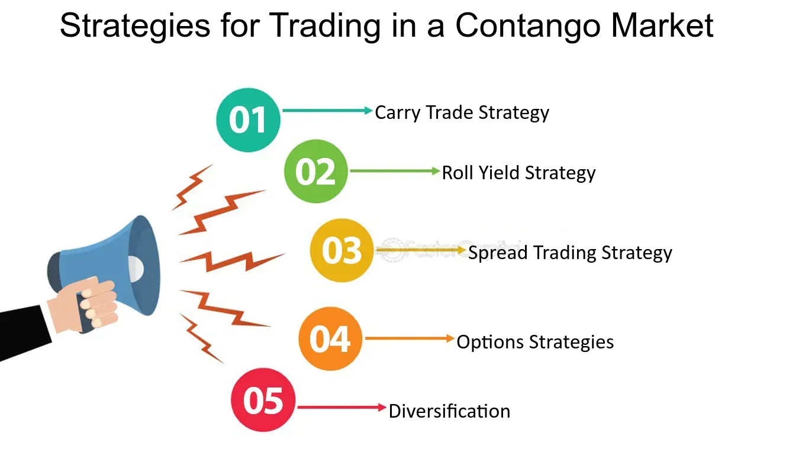

## Table of Contents

## What is contango in the context of trading?

Contango is a situation in the futures market where the price of a futures contract is higher than the expected future spot price of the underlying asset. This means that if you want to buy a futures contract, you will pay more than what you would expect to pay for the actual asset when the contract expires. This situation often happens when people expect the price of the asset to go up over time, so they are willing to pay more now to lock in that future price.

For example, if the current price of oil is $50 per barrel, but the price for a futures contract that expires in six months is $55 per barrel, the market is in contango. This can happen because of costs like storage and insurance, or because people think oil prices will be higher in the future. When the market is in contango, it can be expensive for traders who are holding onto futures contracts because they might lose money if the spot price doesn't rise as expected by the time the contract expires.

## How does contango affect futures and commodity markets?

Contango can make it more expensive to invest in futures and commodities. When the futures price is higher than the expected future spot price, investors have to pay more upfront for the contract. This can be a problem for people who want to hold onto these contracts until they expire. If the actual price of the commodity doesn't go up as much as expected, investors might lose money. For example, if someone buys a futures contract for oil at a higher price and the oil price doesn't increase enough by the time the contract expires, they will have paid too much.

Contango also affects how people trade in these markets. Traders might use strategies to take advantage of the price difference between the futures and the spot price. Some might sell their futures contracts before they expire to avoid the higher cost. Others might try to profit from the difference by buying the commodity at the lower spot price and selling the futures contract at the higher price. Overall, contango can lead to more trading activity as people try to navigate the higher costs and potential profits in the futures and commodity markets.

## What are the basic strategies for exploiting contango?

One basic strategy for exploiting contango is called "cash and carry." This means you buy the physical commodity at the current spot price and then sell a futures contract for that commodity at a higher price. Since the futures price is higher in contango, you can make a profit from the difference between what you paid for the commodity and what you sold the futures contract for. You need to consider storage and other costs, but if these costs are less than the difference between the spot and futures prices, you can make money.

Another strategy is to roll over futures contracts. This means you keep selling the near-term futures contracts before they expire and buying longer-term futures contracts. In contango, the longer-term contracts are more expensive. By constantly selling the near-term contracts at a higher price and buying the longer-term ones, you can make a profit from the price difference. This strategy works well if you can manage the costs of rolling over the contracts and if the contango situation continues.

## Can you explain the concept of rolling futures contracts in contango?

Rolling futures contracts in contango means you keep selling the futures contracts that are about to expire and buying new ones that will expire later. In contango, the price of the later contracts is higher than the price of the ones that are expiring soon. By selling the near-term contracts at a higher price and buying the longer-term ones, you can make money from the difference in prices.

This strategy works well if the market stays in contango. You need to keep an eye on the costs of rolling over the contracts, like the fees for buying and selling. If these costs are less than the money you make from the price difference, you can keep making a profit. But if the market changes and contango goes away, this strategy might not work anymore.

## What are the risks associated with trading in a contango market?

Trading in a contango market can be risky. One big risk is that you might lose money if the price of the commodity doesn't go up as much as expected. If you buy a futures contract at a high price and the spot price stays low or goes down, you will lose money when the contract expires. This is because you paid more for the futures than what the commodity is actually worth at that time.

Another risk is the cost of rolling over futures contracts. If you keep selling near-term contracts and buying longer-term ones, you have to pay fees and other costs each time you do this. If these costs are more than the money you make from the price difference, you will lose money. Also, if the market suddenly changes from contango to backwardation, where the futures price is lower than the spot price, your strategy might not work anymore, and you could lose money.

## How can an investor identify contango opportunities in different markets?

To find contango opportunities, an investor needs to look at the prices of futures contracts compared to the current spot price of the commodity. If the futures price is higher than what people expect the spot price to be when the contract expires, that's contango. You can check this by looking at the futures market data for different commodities like oil, gold, or corn. Websites and financial news services often show these prices, so you can compare them easily.

Once you spot a contango situation, you need to think about how long it might last and what the costs are. For example, if you see that oil futures are priced higher than the current oil price, you might want to buy the oil now and sell the futures contract. But you also need to consider storage costs and other fees. If the contango lasts long enough and the costs are low, you could make money from the price difference. Keep an eye on market news and trends to see if the contango is likely to continue or if it might change soon.

## What are some advanced techniques for maximizing gains from contango?

One advanced technique for making more money from contango is to use a strategy called "calendar spread trading." This means you buy a futures contract that expires soon and sell a futures contract that expires later. In contango, the later contract is more expensive, so you can make money from the price difference between the two contracts. You need to be careful with this because the prices can change, but if you get it right, you can make a good profit.

Another technique is to use options along with futures. You can buy a futures contract and also buy a put option, which gives you the right to sell the futures at a certain price. This can protect you if the price of the commodity goes down. If the price goes up as expected, you make money from the futures and the option doesn't cost you anything extra. This way, you can make the most of the contango situation while also reducing your risk.

## How does contango impact the performance of ETFs and other investment vehicles?

Contango can affect how well ETFs and other investment vehicles do, especially if they are tied to commodities. When an [ETF](/wiki/etf-trading-strategies) holds futures contracts in a contango market, it has to keep buying new contracts at higher prices as the old ones expire. This can eat into the ETF's returns because it is always paying more for the new contracts than what it gets from the old ones. If the spot price of the commodity doesn't go up enough to cover these costs, the ETF might lose money over time.

To deal with contango, some ETFs use different strategies. They might roll over their futures contracts more often to try to reduce the impact of the higher prices. Or, they might use other ways to invest, like holding physical commodities or investing in companies that produce them. By doing this, they can try to make up for the losses from contango and keep their performance strong. But it's important for investors to know how their ETFs handle contango, because it can make a big difference in how well they do.

## What role does market sentiment play in contango and how can it be used strategically?

Market sentiment is what people think and feel about the future of a commodity or market. In contango, if people think prices will go up a lot, they might be willing to pay more for futures contracts now, which keeps the market in contango. But if everyone starts to think prices won't go up as much, the futures prices might start to come down, and contango could weaken or go away. So, market sentiment can keep contango going or make it stop.

You can use market sentiment to make smart moves in contango. If you see that everyone is really excited about a commodity and thinks its price will keep going up, you might want to buy futures contracts and sell them later at a higher price. But if you notice that people are starting to feel less sure about the commodity's future, you might want to sell your futures contracts before the prices drop. By watching what people think and feel, you can decide when to buy or sell to make the most money in a contango market.

## How can historical data be used to predict and exploit contango?

You can use old data to guess when contango might happen again and how to make money from it. By looking at past prices of futures and the actual stuff they're for, you can see patterns. If contango showed up a lot at certain times of the year or when certain things happened in the world, you might expect it to happen again. For example, if oil prices always went into contango around the same time every year, you could get ready to buy the oil now and sell the futures contract later when the price is higher.

Once you know when contango might happen, you can plan how to use it to make money. If you see that contango usually lasts for a few months, you can buy the futures contracts and hold onto them until they're worth more. Or, if you notice that contango often ends quickly, you might want to sell your contracts before the prices start to fall. By using what happened before to guess what might happen next, you can make better choices about when to buy and sell in the futures market.

## What are the tax implications of trading strategies that exploit contango?

When you make money from trading strategies that use contango, you have to think about taxes. If you make a profit, you will have to pay capital gains tax. This tax can be different depending on how long you held onto your futures contracts. If you held them for less than a year, you pay a short-term capital gains tax, which is usually higher. If you held them for more than a year, you pay a long-term capital gains tax, which is usually lower.

You also need to think about how often you trade. If you trade a lot, you might be seen as a trader by the tax people, and that can change how your taxes work. Traders can sometimes use different rules to figure out their taxes, like marking-to-market, where you count all your profits and losses at the end of the year instead of when you actually buy or sell. It's a good idea to talk to a tax expert to make sure you're doing everything right and not paying more tax than you need to.

## How do global economic factors influence contango and what strategies can be employed to mitigate these effects?

Global economic factors can really change how contango works. Things like how much people want to buy a commodity, how much of it is available, and what's going on with money around the world can make futures prices go up or down. If a lot of people think a commodity will be worth more later, they might pay more for futures now, making contango stronger. But if something big happens, like a war or a new law, it can make people change their minds and the futures prices might drop, weakening contango. So, keeping an eye on what's happening in the world can help you understand why contango is happening and how long it might last.

To deal with how global economic factors affect contango, you can use different ways to trade. One way is to spread out your investments so you're not just betting on one commodity. If you invest in different things, a big change in one market won't hurt you as much. Another way is to use options to protect yourself. If you buy a futures contract and also a put option, you can sell the futures at a certain price if things go bad. This can help you not lose as much money if the commodity price goes down. By thinking about what's happening in the world and using smart trading moves, you can try to make money from contango while also keeping your risks lower.

## What is Contango and How Can It Be Understood?

Contango represents a market condition where the futures price of a commodity exceeds its current spot price. This scenario is typically driven by several factors including storage costs, insurance, and expectations of rising prices. For instance, if the spot price of oil currently stands at $60 per barrel but its futures price is $65, the market is depicting a contango situation. 

One of the primary mechanics contributing to contango is the cost of carry. This concept encompasses the expenses associated with holding a physical commodity over time, which include storage fees, insurance, and financing costs. The futures price can be expressed as:

$$
F = S(1 + c)^t
$$

Where:
- $F$ represents the futures price
- $S$ is the spot price
- $c$ denotes the cost of carry
- $t$ is the time until the futures contract expires

In a contango market, traders anticipate future increases in the commodity's price, leading to higher futures prices compared to current spot prices. This expectation can arise due to factors such as projected demand spikes, geopolitical tensions, or anticipated supply chain disruptions.

To identify contango opportunities, traders should monitor the spread between the futures and spot prices. A widening spread can signal a stronger contango situation, presenting potential [arbitrage](/wiki/arbitrage) opportunities. Technical analysis tools and historical price data can also help traders discern patterns indicative of contango. Additionally, understanding these opportunities requires a grasp of the broader economic context and the specific commodity's market dynamics.

In summary, contango arises primarily due to the cost of carrying commodities and anticipations of future price escalations. Traders can exploit these dynamics by analyzing price spreads and considering the underlying economic factors affecting commodity markets.

## What are the market implications of contango?

Contango markets present a unique set of implications that potentially translate into profitable opportunities for traders. In these markets, futures prices are higher than the current spot prices, typically indicating that traders expect the price of the underlying asset or commodity to increase over time. This expectation can be influenced by various factors such as storage costs, insurance, and future demand projections.

One of the primary implications of contango is the possibility of arbitrage. Arbitrage involves exploiting price differentials between different markets or forms of an asset. In a contango scenario, traders can execute cash-and-[carry](/wiki/carry-trading) strategies. This involves purchasing the commodity at the current spot price and simultaneously entering a futures contract to sell it at the higher futures price. The price differential, minus the costs of carrying (such as storage and insurance), can result in a profit.

Mathematically, the profit from cash-and-carry arbitrage can be represented as:

$$
\text{Profit} = F_t - S_0 - C
$$

Where:
- $F_t$ is the futures price at time $t$,
- $S_0$ is the current spot price,
- $C$ represents the carrying costs.

The presence of contango often indicates a bullish market sentiment, with traders expecting future prices to rise, potentially due to factors such as anticipated supply constraints or increased demand. This outlook can affect various trading strategies, as traders may adopt positions that align with these expected price increases.

Understanding and leveraging contango implications can enable traders to enhance their trading strategies, allowing them to maximize potential returns while effectively managing risk. By maintaining awareness of market trends and recognizing signs of contango, traders can make informed decisions. Furthermore, strategies such as futures rolling can be advantageous. This strategy involves selling near-term contracts while purchasing those with longer maturities to exploit the differences in term structures. However, traders must exercise caution as persistent contango can lead to negative roll yields, thereby reducing profitability.

Overall, the ability to navigate contango markets hinges on a clear understanding of market dynamics and a proactive approach to risk management, allowing traders to capitalize on potential gains while mitigating exposure to adverse price movements.

## References & Further Reading

[1]: Chance, D. M., & Brooks, R. (2015). ["An Introduction to Derivatives and Risk Management"](https://books.google.com/books/about/Introduction_to_Derivatives_and_Risk_Man.html?id=b8PgBQAAQBAJ). Cengage Learning.

[2]: Hull, J. C. (2017). ["Options, Futures and Other Derivatives"](https://www.semanticscholar.org/paper/Options%2C-Futures%2C-and-Other-Derivatives-Hull/89bdee500c8623864fc9eb7a471546aa713acc44). Pearson.

[3]: Till, H. (2000). ["A Long-Term Perspective on Commodity Futures Returns: Evidence from the Past 60 Years"](https://www.premiacap.com/publications/EDHEC_Working_Paper_Long-Term_Sources_of_Return.pdf). BIS Papers No 33, Commodity Markets and Derivatives.

[4]: Liu, L. X., & Tang, Y. (2010). ["The Term Structure of Interest Rates: Stylized Facts and Changes over Time"](https://www.sciencedirect.com/science/article/pii/S1385894721031144). National Bureau of Economic Research Working Paper Series.

[5]: Kaminski, K. M. (2011). ["In Search of Crisis Alpha: A Short Guide to Investing in Managed Futures"](https://www.iasg.com/blog/2019/12/02/in-search-of-crisis-alpha-a-short-guide-to-investing-in-managed-futures). AQR Capital Management.

[6]: Geman, H. (2005). ["Commodities and Commodity Derivatives: Modelling and Pricing for Agriculturals, Metals and Energy"](https://download.e-bookshelf.de/download/0000/5675/90/L-G-0000567590-0015270354.pdf). Wiley Finance.

[7]: Jansen, S. (2020). ["Machine Learning for Algorithmic Trading: Predictive Models to Extract Signals from Market and Alternative Data for Systematic Trading Strategies"](https://www.amazon.com/Machine-Learning-Algorithmic-Trading-alternative/dp/1839217715). Packt Publishing.