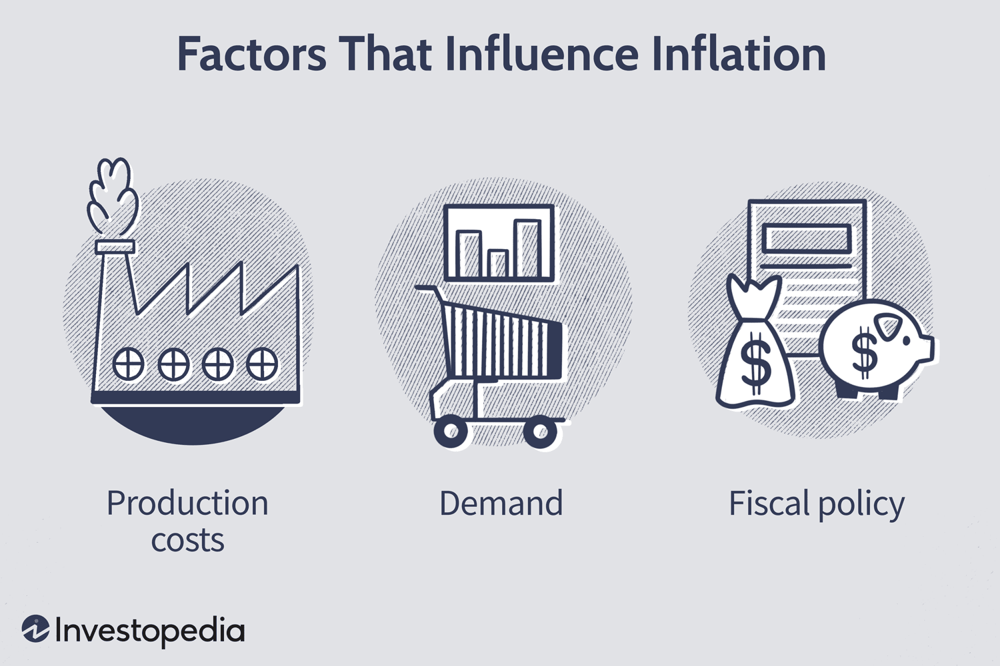

## Table of Contents

## What is inflation and how does it affect personal finances?

Inflation is when the prices of things we buy, like food and clothes, go up over time. It means that the money we have can buy less than it used to. For example, if a candy bar costs $1 now, and next year it costs $1.10, that's inflation. It happens because the cost of making things can go up, or because more people want to buy things than there are things available.

Inflation can affect our personal finances in a few ways. If our income doesn't go up as fast as prices, we might find it harder to afford the things we need. For example, if we get a 2% raise at work, but inflation is 3%, we're actually a bit worse off because our money doesn't go as far. On the other hand, if we have savings, inflation can make the value of our money go down over time. This means we need to think about investing our money in ways that can grow faster than inflation to keep up with rising prices.

## What are the basic investment options available during inflationary periods?

During times when prices are going up, or inflation, there are a few simple ways to invest your money. One option is to put your money into things like stocks. Companies can sometimes raise their prices to keep up with inflation, which might help their profits grow. This could make the value of their stocks go up too. Another option is real estate. When inflation happens, the value of property and rent can go up, which might be good for people who own property.

Another choice is to invest in things like commodities, which are basic goods like gold, oil, or food. These things can sometimes go up in price when inflation is high, so they might be a good way to protect your money. You can also look into inflation-protected securities, like Treasury Inflation-Protected Securities (TIPS) in the U.S. These are special bonds that adjust their value based on inflation, so they can help keep your money's buying power steady even when prices are rising.

It's important to remember that all investments come with risks, and what works best can depend on your own situation and how much risk you're okay with. Talking to a financial advisor can help you figure out the best way to invest during inflationary times.

## How can budgeting help manage finances during inflation?

Budgeting can really help you manage your money when prices are going up. By making a budget, you can see exactly where your money is going each month. This helps you figure out which things you spend on are really important and which ones you can maybe cut back on. For example, if you see that you're spending a lot on eating out, you might decide to cook more at home to save money. This way, even if the prices of things are going up, you can still make sure you have enough money for the things you need.

Another way budgeting helps during inflation is by letting you plan for the future. When you know how much money you have coming in and going out, you can set some aside for emergencies or big expenses that might come up. This is really important because inflation can make everything more expensive, and having a little extra saved up can make a big difference. By sticking to your budget, you can keep your finances in check and feel more secure even when prices are rising.

## What role do savings accounts play in protecting money from inflation?

Savings accounts are a safe place to keep your money, but they don't do a great job at protecting it from inflation. When prices go up, the money in your savings account stays the same, but it can buy less than before. For example, if you have $100 in your account and inflation is 3%, after a year, that $100 might only be able to buy things that used to cost $97. Savings accounts usually give you a little bit of interest, but often this [interest rate](/wiki/interest-rate-trading-strategies) is lower than the inflation rate, so your money loses value over time.

To really protect your money from inflation, you might want to look at other options besides just a regular savings account. Things like investing in stocks, real estate, or commodities can grow faster than inflation and help keep your money's value up. If you do keep money in a savings account, it's a good idea to use it for short-term goals or emergencies, and think about other ways to grow your money for the long term.

## How can diversifying investments mitigate risks associated with inflation?

Diversifying your investments means spreading your money across different types of investments. This can help protect your money from inflation because not all investments are affected by inflation in the same way. For example, if you put all your money in a savings account, inflation can make your money worth less over time. But if you also invest in stocks, real estate, or commodities, some of these might go up in value when prices rise, helping to balance out the loss from inflation.

By having a mix of investments, you're not putting all your eggs in one basket. If one type of investment doesn't do well because of inflation, another type might do better and help make up for it. This way, you can lower the risk that inflation will hurt all your money at once. It's like having a safety net that can catch you if one part of your investments falls due to rising prices.

## What are the benefits of investing in commodities like gold during inflation?

Investing in commodities like gold during inflation can be a good idea because gold often goes up in price when other things get more expensive. When inflation happens, the value of money goes down, but gold tends to keep its value better than money. So, if you have some of your money in gold, it might help protect your savings from losing value as prices rise. People often see gold as a safe place to put their money during uncertain times, which can make more people want to buy it and push its price up.

Another benefit is that gold can be a good way to spread out your investments. If you have all your money in things like savings accounts or stocks, and inflation makes those lose value, having some gold can balance things out. Gold doesn't always go up when other investments go down, but it can help make your overall investment plan more stable. By mixing different types of investments, you can lower the risk that inflation will hurt all your money at the same time.

## How do Treasury Inflation-Protected Securities (TIPS) work and why are they beneficial during inflation?

Treasury Inflation-Protected Securities, or TIPS, are special bonds from the U.S. government that help protect your money from inflation. When you buy a TIPS, the bond's value goes up and down based on the inflation rate. If inflation goes up, the value of your TIPS goes up too, so your money keeps its buying power. The interest you earn on TIPS also adjusts with inflation, meaning you get more interest when prices rise. This makes TIPS different from regular bonds, where the interest stays the same no matter what happens with inflation.

TIPS are beneficial during inflation because they help make sure your money doesn't lose value over time. If you put your money in a regular savings account or a normal bond, and inflation goes up, your money can buy less than before. But with TIPS, the adjustments for inflation mean your money can keep up with rising prices. This makes TIPS a good choice for people who want to keep their savings safe and steady, even when everything else is getting more expensive.

## What strategies can be used to increase income during inflationary times?

One way to increase your income during inflation is to ask for a raise at your job. When prices go up, it's important to make sure your pay goes up too. If you've been doing a good job and taking on more responsibilities, talk to your boss about getting a raise. Another way is to look for a new job that pays more. Sometimes, switching jobs can help you earn more money, especially if you have skills that are in demand.

You can also think about starting a side job or doing freelance work. There are lots of things you can do, like driving for a ride-share service, selling things online, or offering your skills as a tutor or consultant. This extra money can help you keep up with rising prices. It's also a good idea to learn new skills or get more education. This can make you more valuable at work and open up better-paying job opportunities.

Lastly, if you own something like a house or a car, you might be able to rent it out for extra money. For example, you could rent out a room in your house or use your car for a car-sharing service. These are all ways to bring in more money when everything is getting more expensive.

## How can real estate investments serve as a hedge against inflation?

Real estate can be a good way to protect your money from inflation because when prices go up, the value of property and rent often go up too. If you own a house or an apartment, you can charge more rent as things get more expensive. This means the money you get from renting can keep up with or even grow faster than inflation. Also, if you decide to sell your property later, it might be worth more money because of inflation, which can help your investment grow.

Another way real estate helps during inflation is through mortgages. If you have a fixed-rate mortgage, the amount you pay each month stays the same even as prices rise. This means the money you're paying back becomes less valuable over time, but your property might be worth more. So, real estate can be a smart choice to keep your money's value steady when everything else is getting more expensive.

## What are the advanced techniques for using derivatives to profit from inflation?

Using derivatives to make money from inflation can be tricky but useful if you know what you're doing. One way is to use inflation swaps. In an inflation swap, you agree with someone else to exchange payments based on inflation rates. If you think inflation will go up, you can get payments that go up with inflation, which can help you make money as prices rise. Another way is to use options on commodities like oil or gold. These options let you bet on whether the price of these things will go up or down. If you think inflation will make commodity prices go up, buying call options can help you profit from that increase.

Another advanced technique is using futures contracts. Futures let you agree to buy or sell something at a set price in the future. If you think inflation will push up the price of things like wheat or corn, you can buy futures contracts for these commodities. If the price goes up as you expected, you can sell the contract later for more money than you paid, making a profit. These methods need a good understanding of how markets work and can be risky, so it's important to learn a lot about them before trying them out.

## How can global diversification of investments help in managing inflation risks?

Global diversification means spreading your investments across different countries. This can help manage the risks of inflation because not all countries experience inflation at the same time or at the same rate. If inflation is high in your home country, it might be lower in another country. By having investments in different places, you can balance out the effects of inflation. For example, if prices are going up a lot in the U.S., but staying steady in Japan, your investments in Japan might not lose value as much, helping to protect your overall savings.

Another way global diversification helps is by giving you access to different kinds of investments. Different countries have different economies and industries, so you can invest in things that might do well even when inflation is high. For instance, if a country has a lot of natural resources like oil or gold, those investments might go up in value when inflation rises. By spreading your money around the world, you're not relying on just one place or one type of investment, which can make your financial plan stronger and more able to handle the ups and downs of inflation.

## What are the long-term financial planning strategies to consider during persistent inflation?

When inflation keeps going up for a long time, it's important to have a plan to keep your money safe and growing. One good strategy is to invest in things that can grow faster than inflation, like stocks, real estate, or commodities like gold. These investments can help your money keep its value even when prices are rising. It's also smart to keep some of your money in inflation-protected securities like TIPS, which adjust their value based on inflation, so your money doesn't lose its buying power. By mixing different types of investments, you can lower the risk that inflation will hurt all your money at the same time.

Another important part of long-term planning during persistent inflation is to keep an eye on your income and expenses. Make sure your income goes up as fast as prices do, which might mean asking for raises at work or finding ways to earn more money through side jobs or investments. At the same time, try to cut back on spending where you can, and stick to a budget to make sure you're not spending more than you need to. By managing your money carefully and making smart investment choices, you can protect your finances and feel more secure even when inflation is high.

## References & Further Reading

[1]: Bergstra, J., Bardenet, R., Bengio, Y., & Kégl, B. (2011). ["Algorithms for Hyper-Parameter Optimization."](https://papers.nips.cc/paper/4443-algorithms-for-hyper-parameter-optimization) Advances in Neural Information Processing Systems 24.

[2]: ["Advances in Financial Machine Learning"](https://www.amazon.com/Advances-Financial-Machine-Learning-Marcos/dp/1119482089) by Marcos Lopez de Prado

[3]: ["Evidence-Based Technical Analysis: Applying the Scientific Method and Statistical Inference to Trading Signals"](https://books.google.com/books/about/Evidence_Based_Technical_Analysis.html?id=jbD47VkOHAEC) by David Aronson

[4]: ["Machine Learning for Algorithmic Trading"](https://github.com/stefan-jansen/machine-learning-for-trading) by Stefan Jansen

[5]: ["Quantitative Trading: How to Build Your Own Algorithmic Trading Business"](https://www.amazon.com/Quantitative-Trading-Build-Algorithmic-Business/dp/1119800064) by Ernest P. Chan