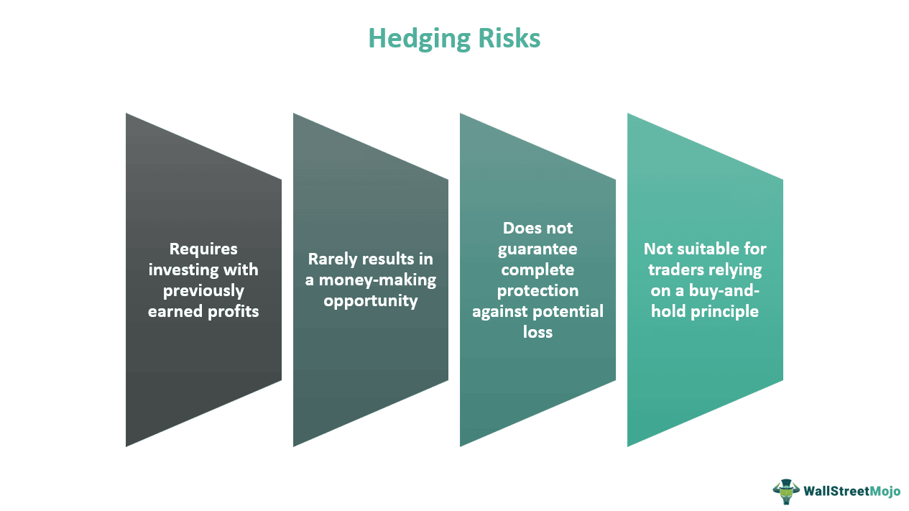

In today's complex economic landscape, the interplay between stagflation, economic strategies, financial protection, and algorithmic trading has garnered significant attention. Stagflation represents a challenging economic environment characterized by stagnant growth and high inflation, creating a dual pressure on economies. Unlike typical economic slowdowns, stagflation combines reduced consumer demand with rising prices, creating a scenario that defies traditional economic remedies. As a result, innovative solutions are necessary to address these unique challenges.

Algorithmic trading, which involves using automated systems to execute trades based on predefined strategies, has emerged as a potential tool to navigate the negative impacts of stagflation. By leveraging advanced algorithms capable of analyzing vast amounts of data, market participants can potentially mitigate risks associated with economic volatility. Algorithmic trading systems offer the speed and precision necessary to react to market fluctuations exacerbated by stagflation.



Understanding these dynamics is crucial not only for financiers and market participants but also for policymakers who strive to protect finances and maintain economic growth. By dissecting the interactions between these elements, this article aims to provide valuable insights into effective economic strategies that can be employed during challenging periods marked by stagflation. The goal is to highlight how algorithmic trading can be a key component in the arsenal of tools used to combat the adverse effects of stagflation, ultimately contributing to a more resilient economic framework.

## Table of Contents

## Understanding Stagflation

Stagflation is an atypical economic condition that combines high inflation with high unemployment and stagnant demand. This phenomenon presents a complex challenge because it simultaneously affects multiple critical areas of an economy. Traditionally, inflation and unemployment have an inverse relationship, as described by the Phillips Curve. However, stagflation disrupts this connection, leading to simultaneous economic stagnation and inflationary pressures.

The most notable instance of stagflation occurred during the 1970s, a decade marked by global economic turmoil. This period was characterized by oil supply shocks, rampant inflation, and rising unemployment, compelling economies worldwide to contend with its repercussions. The term 'stagflation,' a portmanteau of 'stagnation' and 'inflation,' aptly depicts the dual challenges it embodies.

Key drivers of stagflation include external supply shocks and flawed economic policies. Supply shocks, particularly pronounced increases in oil prices, have historically played a pivotal role. For example, the oil crises of the 1970s drastically increased production costs, leading to widespread inflation while dimming economic growth prospects.

In addition to external shocks, poorly calibrated economic policies exacerbate stagflation. Expansionary monetary policies aimed at stimulating growth can inadvertently fuel inflation if not carefully managed. During periods of stagflation, traditional policy tools such as adjusting interest rates may become less effective due to the concurrent rise in unemployment and inflation.

To comprehend stagflation, one must consider the intricate web of economic indicators such as GDP growth, inflation rates, and unemployment figures. Their interactions yield valuable insights into market behaviors and challenges faced by policy-makers and investors. The traditional Keynesian and Monetarist frameworks often fall short in diagnosing or remedying stagflation due to the unusual alignment of economic symptoms.

Advanced economic theories and models attempt to address this by integrating real-world complexities. For instance, incorporating expectations and supply chains dynamics into economic models provides a more nuanced understanding of stagflation's origins and effects. Mathematical modeling, in this context, can be instrumental:
```python
import numpy as np

# Example: Simple model to demonstrate the potential impact of oil price shocks on inflation and GDP
def economic_impact(oil_price_increase, elasticity_of_demand):
    inflation_rate = np.log(oil_price_increase) * elasticity_of_demand
    gdp_growth_rate = -elasticity_of_demand * np.exp(-oil_price_increase)
    return inflation_rate, gdp_growth_rate

# Given example values
oil_price_increase = 1.2  # 20% increase
elasticity_of_demand = 0.7

inflation, gdp_growth = economic_impact(oil_price_increase, elasticity_of_demand)
print(f"Inflation Rate: {inflation:.2f}, GDP Growth Rate: {gdp_growth:.2f}")
```
Understanding these dynamics is critical for formulating effective responses to stagflation. Policymakers and investors must collaborate to design strategies that balance inflation control with economic stimulus, ensuring that growth prospects are not undermined by stringent anti-inflationary measures.

## Economic Strategies for Financial Protection

In the face of stagflation, sound economic strategies are essential for financial protection. Stagflation, characterized by concurrent inflation and stagnation, requires a balanced approach to mitigate financial risks and protect assets. One fundamental approach is diversification, which entails spreading investments across various asset classes to reduce risk and enhance potential returns. By diversifying into equities, bonds, and international markets, investors can decrease their exposure to any single economic anomaly, such as stagflation, thereby protecting their portfolios.

Investing in commodities, particularly gold and real estate, is another strategic move during stagflation. Gold is traditionally viewed as a safe haven asset due to its intrinsic value and historical resilience to inflationary pressures. Real estate investments offer stable returns and inherent value due to land's tangible nature—qualities that are particularly valuable when inflation erodes purchasing power. Allocating a portion of portfolios to these assets can serve as a hedge against inflationary dynamics accompanying stagflation.

Implementing financial plans with disciplined budgeting practices is crucial for withstanding the uncertainty brought by stagflation. By critically evaluating income streams and expenses, individuals can identify areas to tighten budgets and safeguard financial stability. Establishing emergency reserves and reducing discretionary spending ensures [liquidity](/wiki/liquidity-risk-premium) and flexibility to address unforeseen economic challenges.

Moreover, delaying large purchases and reassessing aggressive investment approaches are prudent decisions during economic downturns typical of stagflation. Postponing significant expenditures, such as property or vehicles, allows individuals to preserve capital and adapt to shifts in purchasing power. Rebalancing investment portfolios to minimize exposure to volatile sectors and securities further supports financial resilience.

Overall, adopting these strategies prepares investors and households to better manage the intricacies of stagflation, ensuring financial protection A proactive stance with diversified investments, strategic asset allocation, disciplined budgeting, and careful timing of expenditures can all contribute to navigating the economic uncertainties that characterize stagflation.

## Algorithmic Trading and Economic Challenges

Algorithmic trading leverages automated systems to manage the execution of trades using pre-established criteria, providing a blend of speed and precision that manual trading simply cannot match. In the challenging economic environment characteristic of stagflation, which entails high inflation paired with economic stagnation, [algorithmic trading](/wiki/algorithmic-trading) can offer critical benefits, such as enhancing liquidity and reducing market [volatility](/wiki/volatility-trading-strategies). 

The ability of algorithmic trading to quickly assimilate and act on vast quantities of data is one of its core strengths. Advanced algorithms employ sophisticated data analysis techniques and predictive models to anticipate market movements and adapt to the financial uncertainties that stagflation presents. For example, [machine learning](/wiki/machine-learning) algorithms can process historical financial data to discern patterns that may signal impending economic shifts, enabling traders to adjust strategies accordingly. Consider a simplified Python example that uses linear regression to predict future prices based on historical data:

```python
import numpy as np
from sklearn.linear_model import LinearRegression

# Example data: historical prices plus a time index
X = np.array([[1], [2], [3], [4], [5]])  # Time index
y = np.array([100, 102, 105, 107, 110])   # Historical prices

# Creating a linear regression model
model = LinearRegression().fit(X, y)

# Predict future price
future_time = np.array([[6]])
predicted_price = model.predict(future_time)
print(f"Predicted future price: {predicted_price[0]}")
```

While the speed and efficiency of algorithmic trading are beneficial, these same attributes can also lead to unintended consequences, such as exacerbating market volatility. Rapid, large-scale trades executed by algorithms can amplify price swings, especially when multiple systems trigger similar trades based on comparable market signals. This makes it essential to design algorithms that incorporate robust fail-safes and adaptable strategies.

Integrating real-time economic indicators into trading algorithms is a strategy that can enhance their operational efficacy. By continuously updating algorithms with the latest economic data—from unemployment rates to inflation metrics—traders can refine their decision-making processes. For instance, dynamic adjustment models allow for the continuous refinement of trading strategies based on incoming data, reducing the time lag between market changes and trader response.

Moreover, using sentiment analysis powered by natural language processing (NLP) can provide qualitative insights that enhance traditional quantitative metrics. By parsing news headlines and social media trends, algorithms can gauge market sentiment, offering another layer of data to inform trading decisions. In this way, the confluence of cutting-edge technology and sophisticated data analysis techniques equips algorithmic trading systems with the tools needed to deftly navigate the intricate landscape posed by stagflation.

Ultimately, while algorithmic trading provides a promising approach to managing economic challenges, it necessitates a thoughtful consideration of potential risks and an adherence to ethical practices. Thus, continuously refining these systems with advanced technology and rigorous data analysis protocols is crucial to leveraging their full potential in turbulent economic times.

## Case Studies: Algorithmic Responses to Stagflation

Historical data showcases the varied impacts of algorithmic trading during periods resembling stagflation, illustrating both its benefits and potential pitfalls. One key observation from these case studies is that algorithmic trading often increases market liquidity. By automating trades based on predefined strategies, algorithms can facilitate smoother transactions, even in challenging economic conditions. However, this increased liquidity can also lead to short-term volatility, as rapid execution of trades might exacerbate market fluctuations.

Algorithmic trading systems have demonstrated adaptability to inflationary pressures by strategically shifting portfolios toward sectors that are more resilient to economic downturns, such as essential goods and services. This sectoral reallocation is achieved by leveraging real-time data analysis to identify and capitalize on emerging market trends. For example, algorithms might increase holdings in consumer staples or healthcare sectors, which traditionally exhibit lower sensitivity to economic turbulence.

Insights from these case studies underscore the necessity for adaptability in algorithmic trading models. The ability to swiftly adjust trading strategies based on shifting economic indicators is crucial. This flexibility ensures that trading systems remain effective even when confronted with stagflation-like conditions. Developing algorithms capable of processing complex economic data and executing adaptive strategies is paramount for mitigating risks and maximizing returns.

Simulations play a vital role in testing algorithmic responses to economic shocks, offering valuable hypothetical scenarios to better understand their performance during stagflation. These simulations often employ machine learning techniques to refine predictive models, ensuring they can anticipate and react to potential market disruptions. For instance, Monte Carlo simulations might be used to model different economic scenarios and assess the robustness of trading strategies under various conditions.

In conclusion, while algorithmic trading has the potential to address some of the challenges posed by stagflation, it also requires careful calibration and continuous improvement. By learning from past case studies and employing advanced simulations, traders can enhance the resilience and efficacy of their algorithmic models.

## The Future: Mitigating Stagflation with Technology

Machine learning (ML) and [artificial intelligence](/wiki/ai-artificial-intelligence) (AI) are increasingly shaping the landscape of algorithmic trading strategies, particularly in the context of mitigating stagflation. These technologies provide predictive capabilities essential for anticipating economic shifts and adapting trading approaches. By analyzing vast datasets, machine learning models can identify patterns and forecast market trends with a level of precision unattainable through traditional methods. This enables traders to implement strategies that are not only reactive but also preemptive, thereby safeguarding against the adverse effects of stagflation.

Dynamic asset allocation models are central to this technological advancement. These models facilitate real-time portfolio adjustments, grounded in the latest economic indicators and market sentiment. For instance, machine learning algorithms can continuously assess factors such as interest rates, inflation data, and unemployment figures. By doing so, they offer the agility needed to shift investments towards more resilient asset classes, ultimately enhancing portfolio resilience during economically volatile periods.

The integration of qualitative data through AI-driven sentiment analysis further enriches market prediction and decision-making processes. Sentiment analysis algorithms evaluate news articles, social media discourse, and economic reports to gauge public and investor sentiment. This qualitative data complements quantitative metrics, offering a holistic view of market conditions. Traders armed with this information can make more informed decisions, potentially benefitting from early signals of economic shifts that typical numerical data might not immediately reveal.

However, the deployment of these technologies in addressing stagflation is contingent upon responsible and transparent implementation. Ensuring ethical practices in AI application is vital to avoid potential pitfalls, such as reinforcing market biases or contributing to systemic risk. Transparency in algorithmic processes and decision-making instills trust among market participants and regulators, facilitating smoother integration of advanced technologies into existing financial systems.

In conclusion, the capabilities offered by machine learning and AI in algorithmic trading present promising avenues for mitigating stagflation. Through dynamic asset allocation and qualitative data integration, these technologies provide the tools needed to navigate economic turbulence. As these strategies continue to evolve, their responsible deployment will be crucial in harnessing their full potential to protect economies against the unique challenges posed by stagflation.

## Conclusion

Stagflation presents complex challenges that demand innovative economic strategies. Addressing these challenges requires leveraging advanced technological tools like algorithmic trading, which has shown promising potential in navigating economic turbulence. By implementing mathematical models and data-driven approaches, algorithmic trading can efficiently respond to the intricate variables influencing markets during such periods.

For algorithmic trading to effectively address stagflation, continuous advancements in technology are essential. Innovations in machine learning and artificial intelligence enable the development of sophisticated algorithms capable of adapting to volatile economic conditions. Furthermore, ethical practices must be upheld to ensure these technological advancements do not exacerbate existing economic inequalities or create systemic risks.

Collaboration between policymakers and market participants is crucial in forging resilient economic frameworks that can withstand stagflation's adverse effects. Policymakers can facilitate the creation of stable regulatory environments while encouraging innovation. This collaboration will support the design of strategies that incorporate the benefits of technological innovations, such as real-time market analysis and predictive capabilities.

By embracing technological innovations, investors and policymakers can better protect economies from the adverse effects of stagflation. Dynamic asset allocation techniques based on real-time economic indicators can enhance decision-making processes, ultimately fostering economic stability. This proactive approach will not only mitigate the impact of stagflation but also contribute to sustainable economic growth in the long term.

## References & Further Reading

[1]: ["The Rise of the Machines: A Review of Algorithmic Trading"](https://www.jstor.org/stable/43612951) by Algos, Journal of Trading.

[2]: Erb, C.B., & Harvey, C.R. (2006). ["The Strategic and Tactical Value of Commodity Futures"](https://www.jstor.org/stable/4480745). Financial Analysts Journal.

[3]: ["Quantitative Analysis, Derivatives Modeling, and Trading Strategies"](https://archive.org/details/quantitativeanal0000tang) by Yi Tang, Bin Li.

[4]: ["Algorithmic Trading and DMA: An Introduction to Direct Access Trading Strategies"](https://www.semanticscholar.org/paper/Algorithmic-trading-%26-DMA-%3A-an-introduction-to-Johnson/aa5de1ab883d5e23b6651faa7c1807586d688e4b) by Barry Johnson.

[5]: ["Stagflation: An Empirical Analysis"](https://www.jstor.org/stable/40750163) by S. M. Fouad, Journal of Economic Issues.