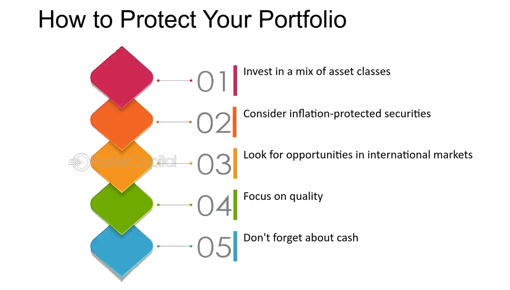

## Table of Contents

## What is stagflation and how does it affect the economy?

Stagflation is when the economy has high inflation, high unemployment, and slow growth all at the same time. It's a tough situation because usually, high inflation means the economy is doing well, but with stagflation, the economy is struggling even though prices are going up.

When stagflation happens, it can make life harder for people. High prices mean that everything costs more, but if people are also out of work, they have less money to spend. This can lead to less spending in the economy, which makes the slow growth even worse. It's a tricky problem for governments and central banks to solve because the usual ways to fix high inflation, like raising interest rates, can make unemployment even higher.

## What are the common signs that an economy is entering a period of stagflation?

When an economy starts to enter stagflation, you might see prices going up faster than usual. This is called high inflation. At the same time, more people might be out of work, which means unemployment is going up. Even though prices are rising, businesses might not be growing or making more money, so the economy as a whole is not doing well.

These signs can be confusing because usually, when prices go up, it means the economy is doing okay. But with stagflation, even though prices are high, the economy is slow and people are struggling to find jobs. This mix of high prices, high unemployment, and slow growth is what makes stagflation a big problem for everyone.

## How can individuals protect their savings during stagflation?

During stagflation, money can lose value because prices go up but the economy isn't doing well. One way to protect savings is by putting money into things that can grow faster than inflation. For example, investing in stocks or real estate might help because their value can go up over time, even if prices are rising everywhere else.

Another way is to keep some money in savings accounts that offer interest rates higher than the inflation rate. This way, the money in the account can grow a little bit, even if it's not a lot. It's also smart to spend money carefully and save as much as possible during stagflation, because it can be a tough time and having extra savings can help.

## What investment strategies are effective during stagflation?

During stagflation, it's good to invest in things that can keep up with or beat the rising prices. One smart move is to put money into stocks that pay dividends. These are companies that give you part of their profits regularly. They can help because even if the economy is slow, these companies might still make money and give you some back. Also, looking at sectors like energy or basic goods can be good, because people always need these things, no matter how the economy is doing.

Another strategy is to invest in real assets like real estate or commodities. Real estate can be a good choice because property values might go up over time, even during stagflation. Commodities like gold or oil can also work well because their prices often go up when inflation is high. These types of investments can help protect your money from losing value because they tend to do better when prices are rising everywhere.

It's also important to keep some money in safe places like high-yield savings accounts or bonds that adjust with inflation. These won't grow your money a lot, but they can help keep it safe. During stagflation, it's all about balancing risk and safety to make sure your money doesn't lose value too quickly.

## How does stagflation impact different asset classes like stocks, bonds, and real estate?

During stagflation, stocks can be a mixed bag. Some stocks, especially those in sectors like energy or basic goods, might do okay because people always need these things. These companies might even do better because they can raise prices when inflation goes up. But other stocks, especially in industries that depend on people spending a lot of money, might struggle. When people are out of work and prices are high, they spend less on things they don't need, which can hurt these companies. So, while some stocks can be a good choice during stagflation, others might not do so well.

Bonds usually don't do great during stagflation. When inflation is high, the money you get back from bonds loses value because it can't buy as much as before. Regular bonds that pay a fixed amount each year are especially bad because the money they give you doesn't change, even if prices go up. But there are special bonds called inflation-protected bonds that can help. These bonds adjust the money they pay you based on how much prices go up, so they can be a safer choice during stagflation.

Real estate can be a good investment during stagflation because property values often go up over time, even when the economy is slow. People always need a place to live, so demand for housing stays pretty steady. Also, if you own real estate, you can sometimes raise the rent when prices go up, which can help protect your money from losing value. But it's not always easy because if a lot of people are out of work, they might not be able to pay higher rent, so it's important to think carefully about where and what kind of real estate to invest in during stagflation.

## What role do commodities play in a stagflation-resistant investment portfolio?

Commodities are things like gold, oil, and food that people always need. During stagflation, when prices are going up but the economy is slow, commodities can be a good part of your investment plan. This is because their prices often go up when inflation is high. For example, if the cost of everything else is going up, the price of oil or gold might go up too. So, putting some of your money into commodities can help protect it from losing value too quickly.

Including commodities in your portfolio can also balance out the risk from other investments like stocks or bonds. While stocks might go down because people are spending less during stagflation, commodities might still do well because they are needed no matter what. This can make your overall investments safer and help you keep more of your money's value when times are tough.

## How can diversification help mitigate the risks of stagflation?

Diversification means spreading your money across different types of investments. This can help during stagflation because not all investments will be affected in the same way. For example, if you only have money in stocks and the economy slows down, your money might lose value. But if you also have some money in commodities like gold or oil, which often go up in price when inflation is high, you can balance out the losses from your stocks.

By having a mix of investments like stocks, bonds, real estate, and commodities, you can protect your money better. When one type of investment is doing badly, another might be doing well. This way, even if stagflation makes some of your investments lose value, others might hold up or even grow. Diversification doesn't make stagflation go away, but it can make the impact on your savings less harsh.

## What are the benefits and drawbacks of investing in inflation-protected securities during stagflation?

Investing in inflation-protected securities, like Treasury Inflation-Protected Securities (TIPS), can be a good idea during stagflation. These securities adjust the money they pay you based on how much prices go up. So, if inflation is high, the value of your investment goes up too. This can help protect your money from losing value because the payments you get will be worth more as prices rise. It's like having a safety net that keeps your money's value steady even when everything else is getting more expensive.

But there are also some downsides to these securities. They usually don't offer as high returns as other investments like stocks or real estate. This means your money might not grow as much, even if it's protected from inflation. Also, if inflation turns out to be lower than expected, the adjustments to your payments might not be as big, and you might not get as much benefit from them. So, while inflation-protected securities can help during stagflation, they might not be the best choice if you're looking for big growth or if inflation doesn't end up being as high as predicted.

## How should one adjust their budget and spending habits in response to stagflation?

During stagflation, it's smart to be careful with your money. Prices are going up, but people might be out of work, so you need to make sure you have enough money for the things you really need. Start by looking at your budget and cutting back on things you don't need. Maybe you can eat out less or find cheaper ways to have fun. It's also a good idea to save more money if you can, because having extra savings can help you get through tough times.

Another thing to think about is how you spend your money. Try to buy things that will last a long time, so you don't have to keep buying new stuff. Also, look for deals and discounts to save money. If you have debts, try to pay them off as quickly as you can, because high inflation can make them more expensive over time. By being smart with your budget and spending, you can make it through stagflation a bit easier.

## What are the long-term financial planning considerations during periods of stagflation?

During stagflation, it's important to think about your long-term financial plans. One big thing to consider is how to keep your money safe from losing value because of high prices. You might want to put some of your money into things like stocks that pay dividends or real estate, because these can grow over time even when the economy is slow. It's also a good idea to have some money in savings accounts that offer interest rates higher than inflation, so your money can grow a little bit even if it's not a lot. Planning for the long term means thinking about how to balance risk and safety to make sure your money lasts through tough times.

Another thing to think about is how stagflation might change your retirement plans. If you're saving for retirement, you might need to save more money or adjust your investments to make sure you have enough when you stop working. Inflation can make the money you save worth less over time, so it's important to plan for that. Also, if you're already retired, you might need to be careful with how you spend your money because high prices can make it harder to live on a fixed income. By thinking ahead and making smart choices, you can better prepare for the challenges that stagflation might bring.

## How can businesses adapt their strategies to survive and thrive during stagflation?

During stagflation, businesses need to be smart about how they spend and make money. They should look at their costs and see if they can save money by finding cheaper ways to do things. For example, they might need to buy materials from different places or use less of them. It's also important for businesses to keep their prices fair so customers keep buying their products, even when prices are going up everywhere. Businesses can also try to sell things that people always need, like food or energy, because these things will always have customers no matter how the economy is doing.

Another way businesses can do well during stagflation is by being flexible and trying new things. They might need to change what they sell or how they sell it to match what people want and can afford. For example, they could offer smaller sizes of products or sell things online to save money. It's also a good idea for businesses to keep good relationships with their customers and workers, because happy customers and workers can help a business get through tough times. By being smart and flexible, businesses can survive and even do well during stagflation.

## What historical examples of stagflation can provide lessons for current financial planning?

One big example of stagflation happened in the United States in the 1970s. Back then, prices were going up a lot, but the economy was not doing well and a lot of people were out of work. The government and the central bank tried different things to fix it, like raising interest rates to slow down inflation. But this made it even harder for people to find jobs. People learned that during stagflation, it's important to save money and be careful with spending because things can get tough. They also learned that investing in things like gold or real estate can help protect their money from losing value.

Another example of stagflation was in the United Kingdom during the same time, the 1970s. Just like in the U.S., prices were going up fast, but the economy was slow and unemployment was high. The government tried to control prices and wages, but it didn't work well. People in the UK learned that during stagflation, it's good to have a mix of different investments to keep their money safe. They also saw that businesses needed to be flexible and change how they worked to survive. These lessons can help people today plan better for their money during tough economic times.

## References & Further Reading

[1]: ["The Rise of the Machines: A Review of Algorithmic Trading"](https://www.jstor.org/stable/43612951) by Algos, Journal of Trading.

[2]: Erb, C.B., & Harvey, C.R. (2006). ["The Strategic and Tactical Value of Commodity Futures"](https://www.jstor.org/stable/4480745). Financial Analysts Journal.

[3]: ["Quantitative Analysis, Derivatives Modeling, and Trading Strategies"](https://archive.org/details/quantitativeanal0000tang) by Yi Tang, Bin Li.

[4]: ["Algorithmic Trading and DMA: An Introduction to Direct Access Trading Strategies"](https://www.semanticscholar.org/paper/Algorithmic-trading-%26-DMA-%3A-an-introduction-to-Johnson/aa5de1ab883d5e23b6651faa7c1807586d688e4b) by Barry Johnson.

[5]: ["Stagflation: An Empirical Analysis"](https://www.jstor.org/stable/40750163) by S. M. Fouad, Journal of Economic Issues.