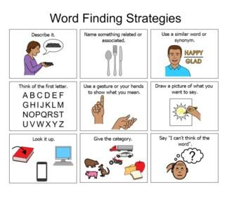

## Table of Contents

## What is the basic definition of a strategy?

A strategy is a plan that helps you reach a goal. It's like a roadmap that shows you the best way to get from where you are now to where you want to be. When you have a strategy, you think about what steps you need to take and what resources you need to use to make your goal happen.

You can use a strategy in many different situations, like in business, sports, or even in your everyday life. For example, a business might have a strategy to grow by selling more products. A soccer team might have a strategy to win games by playing a certain way. Having a clear strategy helps you stay focused and make better decisions along the way.

## Why is it important to find the right strategy?

Finding the right strategy is important because it helps you use your time and resources in the best way possible. When you have a good strategy, you know exactly what steps to take to reach your goal. This means you won't waste time doing things that don't help you get where you want to go. For example, if you're trying to save money, a good strategy might be to cut down on unnecessary spending. Without a strategy, you might spend money on things you don't need and not reach your savings goal.

Having the right strategy also helps you stay on track and keep moving forward, even when things get tough. It's like having a map when you're on a long trip. If you get lost or face a problem, you can look at your map and figure out how to get back on the right path. In life, challenges and setbacks are common, but a solid strategy gives you a clear plan to follow, making it easier to overcome obstacles and achieve your goals.

## What are some common strategies used in everyday decision-making?

In everyday life, one common strategy is making a list of pros and cons. When you have a decision to make, like choosing between two job offers, you write down the good things and the bad things about each option. This helps you see clearly which choice is better for you. For example, one job might pay more but be far from home, while the other might be closer but pay less. By looking at the pros and cons, you can decide which job is the best fit for your needs.

Another strategy people often use is asking for advice from others. If you're unsure about what to do, talking to friends, family, or even experts can give you new ideas and perspectives. They might have experience with a similar situation and can share what worked for them. For instance, if you're thinking about buying a car, asking someone who knows a lot about cars can help you make a smarter choice.

Sometimes, people also use a strategy called setting priorities. This means figuring out what is most important to you and focusing on those things first. For example, if you have a lot of tasks to do, you might decide to do the most urgent ones first. By setting priorities, you make sure you're spending your time and energy on what matters most to you, which can make decision-making easier and more effective.

## How can a beginner start developing their own strategies?

For a beginner, the first step in developing their own strategies is to clearly define their goal. Think about what you want to achieve, whether it's saving money, getting better grades, or learning a new skill. Once you know your goal, break it down into smaller, manageable steps. For example, if your goal is to save money, you might decide to start by making a budget, then look for ways to cut down on spending, and finally, set up a savings plan. By breaking your goal into smaller steps, it becomes easier to create a strategy that you can follow.

Next, it's helpful to learn from others. Look for examples of strategies that have worked for people with similar goals. You can read books, watch videos, or talk to friends and family about what they did. Don't be afraid to try different things and see what works best for you. It's okay to make mistakes because that's how you learn. As you try out different strategies, keep track of what works and what doesn't. Over time, you'll get better at creating strategies that help you reach your goals.

## What tools or resources can help in finding effective strategies?

One helpful tool for finding effective strategies is the internet. You can use search engines to look up information about your goal and find strategies that have worked for other people. Websites, blogs, and forums are great places to learn from others' experiences. You can also watch videos on platforms like YouTube, where people often share tips and strategies for achieving different goals. Using the internet helps you gather a lot of information quickly and easily, which can give you ideas for your own strategies.

Another useful resource is books. There are many books written about strategies for reaching different kinds of goals, whether it's in business, personal development, or other areas. Libraries and bookstores have a wide selection of books that can provide detailed guidance and examples. Reading books can help you understand different strategies and how they work in real life. Plus, books often include exercises and worksheets that you can use to plan your own strategy.

Lastly, talking to people can be a great way to find effective strategies. Friends, family, and even professionals in the field you're interested in can share their own experiences and advice. You might join a club or group where people are working towards similar goals, which can give you a chance to learn from others and get support. By talking to people, you can get personalized advice and find strategies that are tailored to your specific situation.

## What are the key elements to consider when evaluating a strategy's effectiveness?

When you want to know if a strategy is working well, the first thing to look at is if it is helping you reach your goal. If your goal is to save money, for example, you should check if you are actually saving more money since you started using the strategy. It's also important to see if the strategy is easy to follow. If it's too hard or takes too much time, you might not stick with it. Another thing to think about is if the strategy fits with your life. If it doesn't match how you live or what you value, it might not work well for you.

Another key element is to see if the strategy is flexible. Life can change, and a good strategy should be able to change with it. If you can adjust your plan when things don't go as expected, that's a sign of a good strategy. Finally, think about the results over time. Sometimes a strategy can work well at first but not in the long run. It's important to keep checking how well your strategy is doing and make changes if you need to. By looking at these things, you can tell if your strategy is effective and helping you reach your goal.

## How can one adapt strategies from one field to another?

Adapting strategies from one field to another is like taking a good idea from one place and using it somewhere else. You can do this by looking at what makes the strategy work in its original field and seeing if those same things can help in your new field. For example, if a business strategy involves breaking big goals into small steps, you could use that same idea to help you learn a new hobby. The key is to understand the main parts of the strategy and think about how they can fit into your new situation.

Sometimes, you need to change the strategy a little bit to make it work in a different field. If a sports strategy focuses on teamwork, you might use that idea in a school project by working closely with your classmates. It's important to be flexible and creative when you adapt strategies. By doing this, you can take successful ideas from one area of your life and use them to achieve your goals in another area.

## What advanced techniques can be used to refine and optimize strategies?

One advanced technique to refine and optimize strategies is using data and analytics. By collecting information about how your strategy is working, you can see what parts are doing well and what parts need to be better. For example, if you're trying to save money, you might track your spending every month to see if your strategy is helping you spend less. With this data, you can make smart changes to your plan. You can also use tools like spreadsheets or apps to help you keep track of your progress and make decisions based on facts, not just feelings.

Another technique is experimenting with different versions of your strategy. This is called A/B testing. You try out two different ways of doing things to see which one works better. For example, if you're trying to get better at a sport, you might try two different training methods to see which one helps you improve more. By doing this, you can find the best way to reach your goal. Over time, as you keep testing and learning, you can make your strategy even stronger and more effective.

## How do experts identify when a strategy needs to be changed or updated?

Experts know a strategy needs to be changed or updated when it stops helping them reach their goal. They look at the results they are getting and compare them to what they want to achieve. If the strategy isn't working as well as it used to, or if it's not working at all, that's a sign that something needs to change. For example, if a business strategy was making money before but now the business is losing money, experts would see that as a sign to update the strategy.

Another way experts identify when a strategy needs updating is by paying attention to changes in the environment. This could be changes in the market, new technology, or even shifts in what people want. If the world around them is changing, experts know they need to change their strategy to keep up. For instance, if a new technology comes out that makes an old strategy outdated, experts would update their plan to include the new technology. By staying aware of these changes and keeping an eye on their results, experts can know when it's time to make a change.

## What role does data analysis play in strategy development?

Data analysis helps a lot when you're making a strategy. It's like using a map to find the best way to go on a trip. When you look at data, you can see what's working and what's not. For example, if you want to save money, you can look at how much you spend each month. If you see you're spending a lot on things you don't need, you can change your strategy to spend less on those things. Data gives you clear information so you can make smart choices and plan better.

Data analysis also helps you see trends and patterns. This can tell you what might happen in the future. If you're trying to grow your business, you can look at sales data to see when people buy more of your product. With this information, you can plan to have more stock at those times. By using data, you can make your strategy stronger and more likely to help you reach your goal. It's like having a crystal ball that shows you the best path forward.

## How can one measure the success of a strategy over time?

To measure the success of a strategy over time, you need to keep track of how well it's helping you reach your goal. Start by setting clear goals and milestones that you want to achieve. For example, if your goal is to lose weight, you might set a target to lose a certain amount of weight each month. Then, regularly check your progress against these goals. If you're losing weight as planned, your strategy is working. If not, you might need to change your approach.

It's also helpful to use numbers and data to see how your strategy is doing. Keep records of important information, like how much money you're saving or how many customers you're getting. Look at these numbers over time to see if they're going up or down. If your savings are increasing every month, that's a sign your strategy is successful. If the numbers aren't moving in the right direction, it might be time to try something different. By watching these trends, you can tell if your strategy is working and make it better if you need to.

## What are some case studies of successful strategy implementation in various industries?

In the retail industry, Walmart used a strategy called "Every Day Low Prices" to become one of the biggest companies in the world. They focused on keeping prices low all the time, not just during sales. To do this, Walmart worked closely with suppliers to get the best deals and used technology to keep track of what customers wanted. They also opened stores in many places, making it easy for people to shop there. Over time, this strategy helped Walmart grow a lot and stay ahead of other stores. By always offering low prices and making shopping easy, Walmart was able to keep customers coming back.

In the technology industry, Apple's strategy of focusing on design and user experience helped them become a leader. When Apple released the iPhone, they didn't just make another phone; they made a phone that was easy to use and looked great. They spent a lot of time making sure the software and hardware worked well together. Apple also created a strong brand that people trusted. By focusing on making products that people loved to use, Apple was able to sell a lot of iPhones and other devices. This strategy helped Apple grow and become one of the most valuable companies in the world.

In the automotive industry, Toyota used the "Lean Manufacturing" strategy to improve their production process. They focused on getting rid of waste and making their factories more efficient. Toyota involved their workers in finding ways to make things better and used a system called "Just-In-Time" to make sure they had the right parts at the right time. This strategy helped Toyota make high-quality cars faster and at a lower cost. As a result, Toyota became known for making reliable cars and grew to be one of the biggest car companies in the world.

## What are the opportunities in algo trading?

Identifying profitable trading opportunities in algorithmic trading largely hinges on data-driven approaches that leverage advanced analytics and computational capabilities. Central to these methods are the principles of [backtesting](/wiki/backtesting) and historical data analysis, as well as the strategic use of technical indicators and financial news.

**Backtesting and Historical Data Analysis**

Backtesting is the process of testing a trading strategy on historical data to evaluate its efficacy. It provides critical insights into how a strategy would have performed in the past, allowing traders to assess potential profitability and risk. By simulating trades that might have occurred historically, backtesting offers a methodology to refine strategies before actual capital is put at risk. The process involves the following steps:

1. **Data Collection**: This includes acquiring high-quality historical market data, which can consist of prices, volumes, and other relevant metrics. Sources for such data include trading platforms, financial data providers, and exchanges.

2. **Strategy Simulation**: Implement the trading logic in a programming environment. Python is commonly used due to its powerful libraries like Pandas for data manipulation and Backtrader for strategy testing.

3. **Performance Metrics**: Evaluate the strategy using key performance indicators such as returns, Sharpe ratio, maximum drawdown, and volatility. These metrics help in understanding the strategy's risk-adjusted performance.

$$
\text{Sharpe Ratio} = \frac{E[R] - R_f}{\sigma_R}
$$

where $E[R]$ is the expected portfolio return, $R_f$ is the risk-free rate, and $\sigma_R$ is the standard deviation of the portfolio return.

4. **Optimization**: Adjust strategy parameters to enhance performance while avoiding overfitting, which occurs when a model is too tailored to the historical data and may not perform well in live markets.

**Using Technical Indicators and Financial News**

Technical indicators are mathematical calculations based on price, [volume](/wiki/volume-trading-strategy), or open interest information that traders use to predict future price movements. These can be used individually or in combination to generate trading signals. Common indicators include moving averages, relative strength index (RSI), and Bollinger Bands.

For instance, a simple moving average (SMA) crossover strategy involves buying when a short-term SMA crosses above a long-term SMA and selling when the opposite occurs. Implementing such a strategy in Python might look like this:

```python
import pandas as pd

# Assume `data` is a DataFrame with historical price data
data['SMA_50'] = data['Close'].rolling(window=50).mean()
data['SMA_200'] = data['Close'].rolling(window=200).mean()

data['Signal'] = 0
data['Signal'][50:] = np.where(data['SMA_50'][50:] > data['SMA_200'][50:], 1, 0)
data['Position'] = data['Signal'].diff()
```

In addition, financial news and sentiment analysis can significantly impact market movements. Analyzing vast amounts of news articles, earnings reports, and social media posts can help identify trends and potential market-moving events. Machine learning algorithms, particularly Natural Language Processing (NLP), are increasingly being used to gauge sentiment analysis, thereby enhancing the alacrity and precision of trade decisions.

By integrating historical data analysis, technical indicators, and news sentiment, traders can formulate comprehensive strategies capable of identifying profitable opportunities. Continuous analysis and adaptation are necessary as markets evolve, ensuring trading strategies remain effective and profitable.

## How can one develop and optimize strategies?

Developing a robust algorithmic trading strategy requires a systematic approach that incorporates thorough analysis, precise execution, and effective optimization techniques. Below are the essential steps for crafting and refining a successful algorithmic trading strategy:

### Steps to Develop a Robust Algo Trading Strategy

1. **Define Objectives and Constraints**: Establish clear financial goals, risk tolerance, and constraints. Objectives might include maximizing returns, minimizing risk, or achieving a specific risk-adjusted return. Constraints could involve capital limits, trading hours, or market-specific regulations.

2. **Data Collection and Analysis**: Gather and analyze historical and real-time market data, including price movements, volume, and external factors like macroeconomic indicators. Data preprocessing is crucial to ensure accuracy and relevance, potentially involving cleaning and normalization.

3. **Strategy Formulation**: Develop the trading logic based on the analysis. This could entail identifying patterns such as trends, reversals, or arbitrage opportunities. Mathematical models or statistical tools can aid in strategy formulation. For instance, a momentum strategy might be based on:
$$
   \text{Signal} = \frac{\text{Current Price} - \text{Moving Average of Prices}}{\text{Standard Deviation of Prices}}

$$
   where a positive signal may indicate a buy, while a negative one suggests a sell.

4. **Backtesting**: Test the strategy using historical data to evaluate its performance without risking capital. Backtesting helps assess potential profitability, risk exposure, and overall feasibility. It is critical to avoid overfitting, where the strategy performs well on past data but fails in live markets.

5. **Deployment for Live Trading**: Once backtesting results are satisfactory, the strategy can be deployed in live markets. This step requires a reliable technology infrastructure, capable of executing trades with minimal latency, to ensure adherence to the predefined strategy.

### Tips for Optimizing Strategies

- **Performance Metrics Evaluation**: Regularly assess strategy performance using metrics like the Sharpe ratio, maximum drawdown, and P&L curves. This evaluation can highlight areas that require improvement or adjustment.

- **Risk Management**: Implement risk management techniques such as setting stop-loss orders, position sizing, and diversification to mitigate potential losses. Tools like Value at Risk (VaR) can quantify the risk of loss on a portfolio.

- **Parameter Tuning using Machine Learning**: Employ machine learning algorithms for parameter optimization and improving predictive accuracy. Techniques like grid search or genetic algorithms may enhance certain parameters like entry and exit signals.

- **Stress Testing**: Conduct stress tests under various market conditions to evaluate the strategy's robustness. This involves simulating different scenarios, such as market crashes or volatility spikes.

### Importance of Continuous Monitoring and Adjustments

A trading strategy must be continuously monitored and updated in response to changing market conditions and emerging trends. This dynamic approach ensures long-term viability and competitiveness. Monitoring involves tracking key performance indicators (KPIs) and market changes. Regular adjustments might include refining algorithms, updating datasets, and recalibrating risk parameters, thereby ensuring that the strategy remains aligned with its initial objectives and market conditions.

Ultimately, the goal is to maintain a balance between maximizing returns and managing risk, achieved through a well-defined development process and ongoing strategy refinement.

## References & Further Reading

[1]: Bergstra, J., Bardenet, R., Bengio, Y., & Kégl, B. (2011). ["Algorithms for Hyper-Parameter Optimization."](https://papers.nips.cc/paper/4443-algorithms-for-hyper-parameter-optimization) Advances in Neural Information Processing Systems 24.

[2]: ["Advances in Financial Machine Learning"](https://www.amazon.com/Advances-Financial-Machine-Learning-Marcos/dp/1119482089) by Marcos Lopez de Prado

[3]: ["Evidence-Based Technical Analysis: Applying the Scientific Method and Statistical Inference to Trading Signals"](https://www.amazon.com/Evidence-Based-Technical-Analysis-Scientific-Statistical/dp/0470008741) by David Aronson

[4]: ["Machine Learning for Algorithmic Trading"](https://github.com/stefan-jansen/machine-learning-for-trading) by Stefan Jansen

[5]: ["Quantitative Trading: How to Build Your Own Algorithmic Trading Business"](https://books.google.com/books/about/Quantitative_Trading.html?id=j70yEAAAQBAJ) by Ernest P. Chan