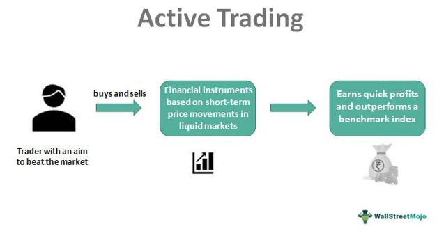

In the fast-paced world of trading, investors are constantly exploring avenues to refine their strategies and achieve higher returns. Among the many methods available, active trading and algorithmic trading have gained prominence due to their distinctive approaches and associated benefits. These two strategies offer unique pathways for participating in the stock market, each catering to varying preferences and goals among traders.

Active trading is characterized by frequent buying and selling of securities, leveraging short-term market movements to extract profits. It requires a hands-on approach, demanding significant attention and quick decision-making to capitalize on market volatility. This method appeals to traders who enjoy being directly involved in the execution of trades and continuously adapting their strategies based on market trends.

On the other hand, algorithmic trading, often termed "algo trading," leverages computer programs to execute trades at high speed according to predefined criteria. This approach aims to minimize human error and mitigates the emotional biases that often influence trading decisions. By using mathematical models and technological infrastructure, algorithmic trading can process vast amounts of data rapidly, identifying trading opportunities that may be inaccessible through manual methods.

This article seeks to explore a variety of stock trading strategies, with a particular focus on active trading and algo trading. Our goal is to clarify these concepts, unravel their complexities, and provide insightful perspectives on their respective advantages and challenges. Understanding these strategies allows traders to tailor their approach to better meet their unique objectives, leveraging either hands-on techniques or automated processes to optimize their market interactions.

## Table of Contents

## Understanding Active Trading

Active trading is a dynamic investment strategy that capitalizes on short-term market fluctuations. Unlike passive investment, where investors typically buy securities and hold them for a long duration, active trading involves a more frequent buying and selling of securities to exploit short-term movements. The primary objective is to generate profits by leveraging the volatility in asset prices.

Active traders spend considerable time analyzing market trends, news, and technical indicators to make informed trading decisions. This hands-on approach is characterized by swift decision-making and requires a deep understanding of market mechanics. Traders must remain vigilant and agile, often using sophisticated tools and platforms to enhance the speed and precision of their trades.

Several strategies fall under the umbrella of active trading:

1. **Scalping**: This strategy focuses on executing dozens or even hundreds of trades in a day, aiming to profit from small price changes. Scalpers typically hold positions for mere seconds or minutes, requiring them to act quickly and precisely to capitalize on minor market movements.

2. **Day Trading**: Similar to scalping, day trading involves executing multiple trades within a single trading day. Day traders close all positions by the end of the day to avoid overnight risks associated with price gaps between the market close and the following day’s open.

3. **Swing Trading**: This strategy involves holding positions for several days or weeks, aiming to profit from expected upward or downward shifts in an asset’s price. Swing traders rely on technical analysis to identify entry and exit opportunities based on longer-term trends.

4. **Position Trading**: Unlike the previous strategies, position trading involves holding positions over a more extended period, ranging from weeks to months. Position traders capitalize on long-term market trends and are less concerned with short-term fluctuations, focusing instead on the asset's overall trajectory.

Active trading necessitates a robust understanding of market dynamics, significant time investment, and the ability to make rapid decisions. It can yield substantial returns but also comes with higher risks, including increased transaction costs and the potential for emotional decision-making.

## Types of Active Trading Strategies

Active trading is characterized by strategies that aim to capitalize on short-term market movements. Here, we explore four primary types of active trading strategies: [scalping](/wiki/gamma-scalping), [day trading](/wiki/day-trading-spy), swing trading, and position trading. Each strategy varies in terms of time frames, risk levels, and market approaches.

**Scalping** is a high-frequency trading strategy that involves making rapid trades to profit from small price changes in a security. Scalpers often hold their positions for just a few seconds or minutes. The goal is to accumulate small gains that can add up over time. Given the speed and volume of trades, scalping requires access to advanced trading systems and low-latency connections to market data. Scalpers must also be prepared for the high transaction fees that can accompany such frequent trading.

**Day Trading** involves buying and selling securities within the same trading day. The strategy is built around taking advantage of small fluctuations in a security's price and holding no positions overnight to avoid exposure to adverse events that might occur after market close. Day traders rely heavily on technical analysis and real-time market data. Tools like candlestick charts, moving averages, and RSI (Relative Strength Index) are commonly used to identify entry and exit points. A crucial element of day trading is the ability to make quick decisions based on market sentiment and price movements.

**Swing Trading** seeks to capture gains from price swings lasting from a few days to several weeks. This strategy is based on the premise that securities often oscillate between oversold and overbought states. Swing traders use chart patterns and technical indicators to predict potential reversals and trends in the market. Unlike scalping and day trading, swing trading allows for longer holding periods, which can result in lower transaction costs. However, it also exposes traders to overnight risks and potential market volatility.

**Position Trading** is a long-term approach where traders aim to profit from substantial market trends over extended periods, ranging from several weeks to months or even years. This strategy does not concern itself with minor market fluctuations in the short term. Instead, position traders rely on fundamental analysis of market trends and macroeconomic variables. They may use technical indicators to time their entry and exit points but are generally more focused on the overall direction of the market. Unlike other active trading strategies, position trading requires less frequent trading, resulting in fewer transactions and lower costs. However, it requires patience and a high tolerance for fluctuations in the interim market conditions.

Each of these strategies requires a different skill set and psychological makeup, and traders should carefully consider their own risk tolerance, available time, and market knowledge when selecting an approach.

## Advantages and Limitations of Active Trading

Active trading strategies come with several advantages, which make them attractive to certain types of investors. One of the primary benefits is the potential for higher returns. By actively managing their portfolios and capitalizing on short-term market fluctuations, traders can exploit price movements that may be overlooked by passive investment strategies. This approach grants traders the ability to adapt to market conditions rapidly, optimizing strategies as new information, trends, or opportunities emerge. 

Another significant advantage is the flexibility that active trading provides. Traders can adjust their investment strategies based on market signals, deploying assets tactically rather than adhering to a fixed set of rules or a long-term investment strategy. This adaptability often allows individuals to better control their investments, tailoring their actions to align with personal financial goals or market expectations.

While there are notable benefits to active trading, it is also associated with several disadvantages. High transaction costs can erode potential profits, especially given the frequent buying and selling that characterize active trading. Each trade involves costs including broker fees, exchange fees, and potentially higher tax liabilities, as gains may be classified as short-term and thus taxed at a higher rate.

Active trading also carries the risk of emotional decision-making. The fast-paced nature of the markets can pressure traders to react impulsively to price movements or news events, potentially resulting in suboptimal decisions that can negatively impact their portfolios. Cognitive biases such as overconfidence and loss aversion can further exacerbate this issue.

Finally, successful active trading requires a significant investment of time and effort. Traders must continuously monitor market conditions, analyze data, and adjust their strategies accordingly. This commitment can be demanding, and individuals with other professional or personal responsibilities may find it difficult to devote the necessary resources to active trading. 

In summary, while active trading offers the potential for significant returns and strategic flexibility, it is also fraught with high costs, emotional risks, and significant time requirements. Traders must weigh these factors carefully to determine if active trading aligns with their investment objectives and lifestyle.

 to Algorithmic Trading

Algorithmic trading, commonly known as 'algo trading,' employs computer algorithms to execute trades at high speeds, relying on predefined criteria for decision-making. This method has become increasingly prevalent due to its potential to enhance trading efficiency, accuracy, and speed. By utilizing sophisticated algorithms, traders aim to reduce human error and eliminate emotional influences that often affect trading decisions.

The fundamental principle behind algo trading involves automating the trading process to capitalize on market opportunities that human traders might miss. Algorithms can swiftly analyze market data, identify patterns, and execute trades based on set conditions, thus offering a more systematic approach to trading. Typical strategies employed by these algorithms include trend-following, which monitors and capitalizes on market trends, and [arbitrage](/wiki/arbitrage), which exploits price differences of the same asset across different markets.

Trend-following strategies are designed to identify and follow existing market trends. This approach assumes that assets that have been rising in price will continue to rise, and those that are falling will continue to fall. By using historical data and statistical analysis, algorithms can track the [momentum](/wiki/momentum) of price movements and make real-time trading decisions.

Arbitrage opportunities arise when an asset is priced differently in two or more markets. Algorithms can detect these discrepancies and simultaneously buy and sell the same asset in different markets to lock in profit. This strategy requires rapid execution and constant monitoring of market prices to be effective.

Another prominent strategy is index fund rebalancing, where algorithms adjust the composition of investment portfolios to align with the index's changes. This involves buying and selling the underlying assets of the index accordingly, ensuring the portfolio maintains the desired risk level and diversification.

In conclusion, [algorithmic trading](/wiki/algorithmic-trading) utilizes technology to streamline trading processes, minimizing human error and optimizing decision-making. The capability to execute trades based on data-driven insights presents a powerful tool for traders looking to enhance their performance in the financial markets.

## How Algorithmic Trading Works

Algorithmic trading leverages advanced mathematical models and computer software to execute trades according to predetermined criteria, aiming for precision and speed unattainable by human traders alone. At its core, algorithmic trading automates the decision-making process in financial markets, reducing the need for human intervention and thus minimizing errors related to emotional biases or fatigue.

The process begins with the development of a trading algorithm, which is a set of rules that dictate when and how trades will be executed. These algorithms are designed to identify profitable trading opportunities by analyzing vast quantities of market data. The key components involved include the selection of a trading strategy, coding the algorithm, and integrating it with a trading platform. Algorithms can range from simple to highly complex, depending on the strategies they implement and the sophistication of their logic.

Trend-following strategies are some of the most prevalent within algorithmic trading. These strategies assume that securities which have been trending in a particular direction will continue to do so. Algorithms programmed for trend-following will analyze historical price data using statistical indicators such as moving averages or momentum indicators to identify trends and execute trades accordingly. 

Mean reversion algorithms operate on the hypothesis that asset prices, over time, tend to revert to their historical mean or average level. This strategy involves identifying assets that have deviated significantly from their mean values, predicting that they will return to these mean levels, and executing trades that capitalize on this expected reversion.

Another widely used algorithm is based on the Volume Weighted Average Price (VWAP). This strategy focuses on executing trades at a [volume](/wiki/volume-trading-strategy)-weighted average price that reflects the average price a security has traded at throughout a specified time period, on the basis of both volume and price. This approach ensures that large orders are executed without causing significant market impact, thus achieving better pricing efficiency and minimizing the cost of trading.

Implementing these strategies through algorithmic trading requires sophisticated technical infrastructure capable of handling high-frequency trading. The system monitors market data in real-time, evaluating numerous trading signals, and executing orders instantaneously when opportunities arise. This infrastructure must be robust and resilient, as even minor technical glitches can lead to significant financial losses.

In summary, algorithmic trading automates and optimizes trading processes through complex algorithms that analyze market data for strategic executions. Common strategies include trend-following, mean reversion, and VWAP, each serving specific trading objectives and demands meticulous development and testing to ensure successful deployment.

## Pros and Cons of Algorithmic Trading

Algorithmic trading, frequently termed "algo trading," offers various advantages and disadvantages stemming from its dependency on technology and advanced mathematical models.

**Pros**

Algorithmic trading ensures real-time trading opportunities by leveraging advanced computational techniques and vast data processing capabilities. This speed in executing trades enables market participants to capitalize on fleeting opportunities in the market that might be inaccessible through manual trading. Furthermore, algorithmic trading significantly reduces transaction costs. By automating order execution, it minimizes the bid-ask spread and takes advantage of rebates, efficiently executing trades at lower costs.

A notable advantage of algorithmic trading is its ability to eliminate human emotion from trading decisions. Emotionless execution prevents common psychological traps, such as panic selling or impulsive buying, which often plague human traders. The automation further enables the consistent application of complex strategies that would be impractical for humans to execute manually.

**Cons**

However, algorithmic trading is not without its challenges. It requires substantial technical infrastructure and expertise to develop, test, and maintain sophisticated trading algorithms. This necessity for advanced systems and knowledge can pose a significant barrier to entry for individual traders or small firms.

Market [volatility](/wiki/volatility-trading-strategies) also poses a potential risk to algorithmic trading. Sudden, unpredictable market events can lead to unanticipated outcomes, given that algorithms often rely on historical data and statistical models, which may fail in extreme conditions. The reliance on technology can become a vulnerability during periods of high volatility or unforeseen circumstances.

Lastly, the initial setup costs for algorithmic trading can be considerable. Developing a robust, efficient trading algorithm necessitates investment in both software and hardware infrastructure. These costs, alongside the ongoing expense of system maintenance and updates, can be prohibitive for smaller market participants. 

While algorithmic trading offers numerous benefits by stressing speed, cost efficiency, and emotionless execution, it demands technical sophistication and significant upfront investment, alongside its vulnerability to market volatility.

## Comparing Active Trading and Algorithmic Trading

Active trading and algorithmic trading represent distinct approaches within the stock trading landscape, each catering to different preferences and strategies among traders. Both methods have their own advantages and are suited to specific trader profiles, focusing on unique aspects of market interaction.

Active trading is characterized by the direct involvement of traders who make frequent buy and sell decisions to capitalize on short-term market movements. This approach is highly suitable for those who prefer hands-on control over their trading activities. Active traders rely heavily on market analysis and personal judgment, leveraging their expertise to adjust strategies in real-time based on market conditions. The immediacy and personal oversight involved in active trading appeal to traders who value the ability to respond quickly to market changes and exert direct influence over their investments. The flexibility granted by active trading allows for continuous adaptation, helping traders stay nimble in volatile markets.

Conversely, algorithmic trading appeals to those who favor automation and technological precision in executing trades. This approach utilizes computer programs to implement trading strategies based on predefined criteria, thus minimizing the role of human emotion and error in decision-making processes. Algorithmic trading is highly advantageous for traders who appreciate leveraging technology to enhance their trading processes, automating routine tasks, and exploiting opportunities in real-time. Algorithms can be configured to follow various strategies, from trend-following to arbitrage, offering a spectrum of options tailored to specific market conditions. While the initial setup requires technical infrastructure and expertise, the potential for reduced transaction costs and increased execution speed makes it an appealing choice for technologically adept traders.

Ultimately, the choice between active and algorithmic trading depends largely on the trader's personal preferences, goals, and skill set. Active trading benefits those who thrive on active decision-making and direct engagement, while algorithmic trading suits individuals willing to invest in technology to streamline and optimize their trading operations. As the financial markets continue to evolve, traders may increasingly blend these approaches to leverage the strengths of each, aiming for improved efficiency and profitability.

## Conclusion

Understanding both active and algorithmic trading strategies offers traders a comprehensive toolkit to enhance their market approach. Active trading provides hands-on control, enabling traders to react swiftly to market fluctuations. It is ideal for those who thrive on real-time decision-making and have the capability to analyze market indicators on the go. However, this strategy requires substantial time investment and carries the risk of emotional decision-making, potentially leading to inconsistent outcomes.

Algorithmic trading, on the other hand, automates the process, allowing predefined criteria to guide trading decisions with precision and speed. This method reduces human error and emotional bias, resulting in potentially lower transaction costs and more efficient trade execution. Yet, it demands significant technical expertise and infrastructure, alongside the capability to develop robust algorithms resilient to market volatility.

The choice between these strategies should align with a trader’s objectives and skill set. Active trading suits those who prefer immediate control and can handle the stress and complexity of rapid decision-making. Conversely, algo trading is ideal for traders prioritizing efficiency and consistency through technology, despite the required initial setup and technical knowledge.

As technology advances, trading strategies are likely to converge, integrating elements of both active and algorithmic approaches. This blend promises enhanced market efficiency, catering to diverse trading preferences while maximizing potential returns. Hybrid strategies may emerge, combining the adaptability of active trading with the precision of algorithms, offering a dynamic balance between human oversight and technological automation.

## References & Further Reading

[1]: Bergstra, J., Bardenet, R., Bengio, Y., & Kégl, B. (2011). ["Algorithms for Hyper-Parameter Optimization."](https://papers.nips.cc/paper/4443-algorithms-for-hyper-parameter-optimization) Advances in Neural Information Processing Systems 24.

[2]: ["Advances in Financial Machine Learning"](https://www.amazon.com/Advances-Financial-Machine-Learning-Marcos/dp/1119482089) by Marcos Lopez de Prado

[3]: ["Evidence-Based Technical Analysis: Applying the Scientific Method and Statistical Inference to Trading Signals"](https://www.amazon.com/Evidence-Based-Technical-Analysis-Scientific-Statistical/dp/0470008741) by David Aronson

[4]: ["Machine Learning for Algorithmic Trading"](https://github.com/stefan-jansen/machine-learning-for-trading) by Stefan Jansen

[5]: ["Quantitative Trading: How to Build Your Own Algorithmic Trading Business"](https://www.amazon.com/Quantitative-Trading-Build-Algorithmic-Business/dp/1119800064) by Ernest P. Chan