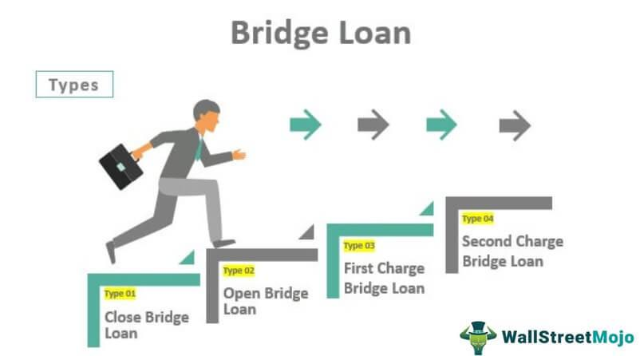

Real estate investment is widely recognized as a reliable path for cultivating long-term wealth. As a tangible asset class, real estate offers a plethora of opportunities for income generation and capital appreciation. Investors who employ strategic approaches can realize substantial returns, making real estate an integral component of many investment portfolios.

This article examines the synergies between real estate investment, home financing, and the innovative use of algorithmic trading. By integrating these elements, investors can enhance their strategies and potentially maximize gains. We will consider various financing options that are available for acquiring second homes, a critical aspect for those aiming to expand their real estate holdings. Financing a second home often involves distinct considerations compared to a primary residence, requiring a deeper understanding of available financial instruments and their specific advantages and constraints.

Moreover, the article highlights how algorithmic trading, traditionally associated with financial markets, is making its influence felt in real estate investing. Algorithms have the capacity to analyze vast datasets and detect patterns, providing investors with valuable insights into market trends and potential property valuations. As a tool for optimizing investment strategies, algorithmic trading allows for precise timing of market entry and exit points, thus improving portfolio performance.

By exploring these intersections, this comprehensive overview aims to provide a well-rounded perspective on how modern tools and methods can unlock new potentials in real estate investment.

## Table of Contents

## Understanding Real Estate Investment

Real estate investment entails the acquisition of properties with the primary goal of generating income, realizing value appreciation, or both. This form of investment leverages tangible assets, offering investors diverse options such as residential, commercial, or hybrid property types.

**Investment Properties:**

1. **Residential Properties:** These include single-family homes, apartments, and condos. Investors often purchase residential properties to rent out, creating a continuous cash flow through rental income. Appreciation over time further enhances the asset's value.

2. **Commercial Properties:** Characterized by office buildings, retail spaces, warehouses, and industrial properties, commercial real estate tends to yield higher returns compared to residential investments. This potential for increased returns often comes with higher initial costs and maintenance expenses.

3. **Mixed-Use Properties:** These involve a combination of residential and commercial entities within a single premises, providing a diversification hedge - blending income sources while potentially benefiting from commercial and residential market dynamics.

**Key Benefits of Real Estate Investment:**

- **Steady Cash Flow:** Real estate investments, particularly rental properties, provide a regular income stream. For instance, residential lease agreements ensure monthly rental payments, while commercial leases might generate income via longer-term contracts.

- **Tax Advantages:** Real estate investors benefit significantly from tax incentives. Depreciation, a non-cash deduction, allows investors to reduce taxable income while still accumulating property value. Additionally, expenses such as mortgage interest, property management fees, and maintenance costs can be deducted from taxable income, subject to different jurisdictions' tax codes [1].

- **Portfolio Diversification:** Real estate offers a hedge against market volatility seen in equities or bonds. Its low correlation to other asset classes helps spread risk across a portfolio. Thus, as part of a balanced investment strategy, real estate can stabilize returns, smoothing out fluctuations that might occur in other investments.

Investors should be aware that while real estate provides lucrative opportunities, it also demands substantial capital outlay and involves risks, including economic downturns and property market fluctuations. Hence, a comprehensive understanding of market dynamics and careful due diligence are crucial for optimizing real estate investments.

**References:**

1. U.S. Internal Revenue Service. "Residential Rental Property." IRS, www.irs.gov.

## Home Financing for Second Homes

Financing a second home involves distinct strategies compared to securing a mortgage for a primary residence. Understanding these differences is crucial for investors seeking to maximize the benefits of owning an additional property.

**Options for Financing a Second Home:**

1. **Cash Purchases**: For those with sufficient funds, purchasing a second home outright eliminates the need for financing and associated interest payments. This approach provides full ownership immediately, simplifying the buying process. However, it requires substantial liquidity and may tie up capital that could be invested elsewhere.

2. **Home Equity Loans**: Homeowners may leverage the equity in their primary residence to finance the purchase of a second home. A home equity loan allows for borrowing against the existing equity, providing a lump sum that can be used for the new property. The interest rates on such loans are typically fixed, ensuring predictable monthly payments. However, this option increases the risk to the primary residence, as it serves as collateral.

3. **Conventional Loans**: Investors can also opt for traditional mortgage financing. Conventional loans for second homes usually require a higher down payment, often 20% or more, due to the increased risk perceived by lenders. Interest rates on second homes tend to be slightly higher as well, reflecting this risk. Borrowers must also meet stringent credit requirements to secure a favorable interest rate.

**Benefits and Challenges:**

Each financing method presents unique advantages and potential pitfalls. 

- **Cash Purchases**: The main benefit is the absence of monthly mortgage payments and interest, leading to cost savings over time. However, this method can strain financial resources if not balanced with overall investment strategies.

- **Home Equity Loans**: These loans offer the advantage of utilizing the equity built in an existing property, often at competitive interest rates. The challenge lies in the additional lien on the primary home, which could be at risk if the loan defaults.

- **Conventional Loans**: This option allows for gradual payments, aligning with cash flow projections and preserving liquidity for other investments. The challenges include higher upfront costs and stricter eligibility criteria, which may limit accessibility for some investors.

Investors must weigh these factors carefully, considering their financial situation, long-term investment goals, and risk tolerance. By assessing the benefits and challenges of each financing method, individuals can make informed decisions regarding the acquisition of a second home.

## Exploring Alternative Financing Strategies

Alternative financing strategies are essential for those looking to invest in second homes, as they provide avenues to mitigate the significant initial costs often associated with such investments. These methods not only offer flexibility but also introduce various degrees of risk and additional costs that investors must carefully evaluate.

One prevalent strategy is tapping into home equity, which allows homeowners to utilize the equity accumulated in their primary residence to finance the purchase of a second home. Homeowners can access this equity either through a home equity loan or a home equity line of credit (HELOC). While this approach can be beneficial due to potentially lower interest rates and tax advantages, it does entail the risk of losing the primary residence if the borrower defaults.

Seller financing represents another innovative financing method. In this arrangement, the seller of the property acts as the lender, allowing the buyer to make payments directly to them instead of obtaining a traditional mortgage. This can be advantageous for buyers who may not meet the stringent credit requirements of conventional loans. However, seller financing often comes with higher interest rates and shorter loan terms, which could place additional financial strain on the buyer.

Private mortgages, offered by private lenders or investors rather than conventional banks, provide another alternative. These can be particularly useful for buyers who face challenges in securing traditional financing due to credit score issues or the unique nature of the property being purchased. Though private mortgages can offer more lenient eligibility requirements and faster approval processes, they generally involve higher interest rates and shorter repayment terms, increasing the overall cost of the loan.

In summary, alternative financing strategies such as home equity loans, seller financing, and private mortgages play a vital role in enabling investors to acquire second homes. Each method offers unique benefits but requires careful assessment of associated risks and costs to ensure alignment with the investor's financial goals and risk tolerance.

## The Role of Algorithmic Trading in Real Estate Investment

Algorithmic trading represents a transformative approach within real estate investment by employing sophisticated computer programs to automate decision-making processes. This automation is critical in enhancing the efficiency and accuracy of investment strategies. Traditionally, real estate investment involved extensive manual analysis; however, algorithms now enable investors to systematically interpret vast datasets, such as historical price trends, interest rates, and economic indicators. This facilitates faster and more precise assessments of market conditions, leading to improved decision-making capabilities.

In the context of real estate, algorithms can examine market trends to forecast property value movements. They employ techniques like [machine learning](/wiki/machine-learning) and statistical analysis to identify patterns and correlations within large datasets, which manual analysis might overlook. For instance, regression models can predict real estate price appreciation by analyzing variables such as geographical location, infrastructure developments, and demographic trends. Consider the formula for a simple linear regression:

$$
Y = \beta_0 + \beta_1X_1 + \beta_2X_2 + \ldots + \beta_nX_n + \epsilon
$$

In this equation, $Y$ represents the property value, $\beta_0$ is the intercept, $\beta_1, \beta_2, \ldots, \beta_n$ are coefficients for each predictor (e.g., location, interest rates), $X_1, X_2, \ldots, X_n$ are the predictor variables, and $\epsilon$ is the error term. This model helps investors anticipate shifts in property values by quantifying the impact of various independent factors.

Algorithmic trading also optimizes entry and [exit](/wiki/exit-strategy) points within real estate markets. By setting predefined conditions within trading algorithms, investors can automatically execute transactions when those conditions are met, whether for buying or selling assets. This maximizes investment returns and minimizes risks associated with market [volatility](/wiki/volatility-trading-strategies). For example, an algorithm might execute a purchase order when property prices drop below a certain threshold or initiate a sale if the return on investment (ROI) exceeds a target percentage.

Moreover, algorithms aid in managing investment portfolios by continuously monitoring and adjusting holdings based on market changes and risk preferences. This dynamic management ensures portfolios remain aligned with investment objectives and risk tolerance. Tools such as the Sharpe Ratio, given by:

$$
\text{Sharpe Ratio} = \frac{E[R_p - R_f]}{\sigma_p}
$$

where $E[R_p]$ is the expected portfolio return, $R_f$ is the risk-free rate, and $\sigma_p$ is the portfolio's standard deviation, are frequently used to assess risk-adjusted returns. Algorithms can continuously calculate such metrics to maintain optimal portfolio balance.

In sum, [algorithmic trading](/wiki/algorithmic-trading) offers substantial advantages in real estate investment by automating complex analyses and streamlining transaction processes. This leads to smarter investment choices, enabling real estate investors to capture opportunities effectively while managing potential risks.

## Benefits and Risks of Algorithmic Trading in Real Estate

Algorithmic trading in real estate leverages advanced computational methods to enhance decision-making processes by analyzing vast amounts of market data with high speed and precision. This approach offers significant benefits, such as improved efficiency and the ability to respond swiftly to market dynamics. By utilizing algorithms, investors can identify optimal entry and exit points for real estate transactions, potentially increasing returns and minimizing risks.

One of the primary advantages of algorithmic trading is its capacity for high-speed data processing, allowing for real-time analysis and execution of trades. This can be particularly beneficial in the volatile real estate market, where quick decisions might yield substantial advantages. Algorithms can assess multiple data sources, such as property prices, historical trends, and economic indicators, to generate insights and automate buy or sell decisions.

However, algorithmic trading is not without its challenges. The complexities involved in developing and maintaining trading algorithms require significant expertise and resources. System failures pose a critical risk; a malfunctioning algorithm can lead to erroneous transactions and substantial financial losses. Additionally, the presence of market anomalies, such as sudden economic shifts or unexpected global events, can disrupt algorithmic models, which may rely on historical data that no longer reflects current market conditions.

To mitigate these risks, investors must balance automation with strategic oversight. This involves continuously monitoring algorithm performance and making necessary adjustments to reflect changing market conditions. Regular audits of algorithmic processes can identify and rectify potential weaknesses, ensuring that the technology remains aligned with investment objectives.

In conclusion, while algorithmic trading enhances real estate investment strategies through rapid data processing and automated decision-making, it entails inherent risks that require careful management. Ensuring a robust system architecture and incorporating human oversight can help achieve an effective integration of algorithmic trading into real estate investments.

## Conclusion

Combining real estate investment with innovative financing solutions and the strategic use of algorithmic trading offers substantial potential for growth and financial gain. Real estate remains a solid asset class, which, when enhanced by modern tools and strategies, can provide a robust framework for generating wealth. Through careful planning, investors can maximize the benefits of each component. The utilization of algorithmic trading assists in refining entry and exit strategies, allowing investors to respond swiftly to market changes and predictions of property value fluctuations.

The strategic implementation of advanced data analytics through algorithmic trading ensures better decision-making. By automating processes that analyze real-time market data, investors can capitalize on opportunities with greater precision and speed, mitigating potential human error and reaction delays. It is important to acknowledge the complexities and risks involved, such as the potential for system failures or market anomalies, which necessitate a balance between automation and strategic oversight.

Successful real estate investment, however, is not solely reliant on technology. Sound financing choices using traditional or alternative methods specific to the purchase of second homes can significantly influence investment performance. It is vital to assess interest rates, credit requirements, and the potential risks associated with flexible financing arrangements.

Continuous learning and adaptability to both market dynamics and evolving technological landscapes are indispensable. Investors must remain informed about new tools and techniques to maintain competitive advantage and ensure sustained success in their investment endeavors. By embracing technological innovation and informed financial strategies, investors can navigate the complexities of real estate investment with confidence and skill.

## References & Further Reading

[1]: U.S. Internal Revenue Service. "Residential Rental Property." IRS, www.irs.gov.

[2]: Bergstra, J., Bardenet, R., Bengio, Y., & Kégl, B. (2011). ["Algorithms for Hyper-Parameter Optimization."](https://dl.acm.org/doi/10.5555/2986459.2986743) Advances in Neural Information Processing Systems 24.

[3]: ["Advances in Financial Machine Learning"](https://www.amazon.com/Advances-Financial-Machine-Learning-Marcos/dp/1119482089) by Marcos Lopez de Prado.

[4]: ["Evidence-Based Technical Analysis: Applying the Scientific Method and Statistical Inference to Trading Signals"](https://www.amazon.com/Evidence-Based-Technical-Analysis-Scientific-Statistical/dp/0470008741) by David Aronson.

[5]: ["Machine Learning for Algorithmic Trading"](https://github.com/PacktPublishing/Machine-Learning-for-Algorithmic-Trading-Second-Edition) by Stefan Jansen.

[6]: ["Quantitative Trading: How to Build Your Own Algorithmic Trading Business"](https://books.google.com/books/about/Quantitative_Trading.html?id=j70yEAAAQBAJ) by Ernest P. Chan.