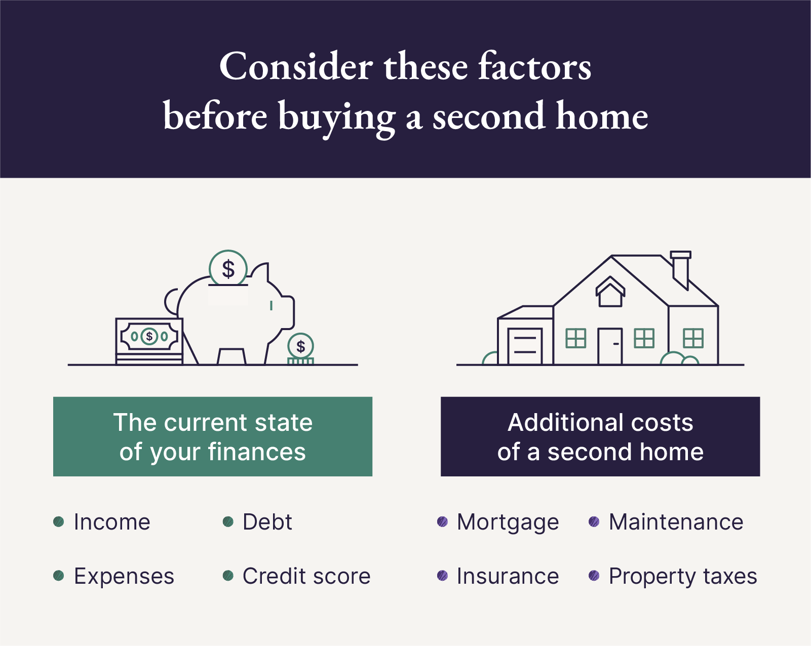

## Table of Contents

## What are the basic steps to start planning for financing a second home?

Starting to plan for financing a second home involves first assessing your financial situation. You need to look at your income, savings, and current debts. This will help you understand how much you can afford to spend on a second home. It's important to be honest with yourself about what you can handle financially. You might also want to check your credit score because a good score can help you get better loan terms.

Once you have a clear picture of your finances, the next step is to explore your financing options. You can consider a mortgage for the second home, which might have different terms than your primary home's mortgage. Another option is to use the equity in your first home through a home equity loan or line of credit. It's a good idea to talk to a financial advisor or mortgage broker to understand all your options and find the best one for your situation. They can help you navigate the process and make informed decisions.

## How much down payment is typically required for a second home?

For a second home, lenders usually want a bigger down payment than for a primary home. A common down payment for a second home is around 10% to 20% of the home's price. This is higher than the 3% to 5% you might need for your first home.

The reason for the higher down payment is that second homes are seen as riskier for lenders. They want to make sure you can handle the extra cost. If you can put down more than the minimum, it might help you get a better interest rate on your loan.

## What are the different types of loans available for purchasing a second home?

When you want to buy a second home, you have a few different loan options to think about. One common type is a conventional mortgage, which is a loan from a bank or mortgage lender. These loans often need a bigger down payment, like 10% to 20% of the home's price. Another option is a home equity loan or a home equity line of credit (HELOC). With these, you borrow against the value of your first home. This can be a good choice if you have a lot of equity in your first home.

Another type of loan you might consider is a jumbo loan. These are for more expensive homes and usually require a bigger down payment and have stricter rules. If you're planning to rent out your second home, you might look into an investment property loan. These loans often have higher interest rates and need a larger down payment, like 20% to 30%. It's a good idea to talk to a financial advisor or mortgage broker to see which type of loan fits your situation best.

## How does my credit score affect my ability to finance a second home?

Your credit score is really important when you want to finance a second home. It tells lenders how good you are at paying back money you borrow. A high credit score, like 700 or more, can help you get a loan easier and with a lower interest rate. This means you'll pay less money over time for your second home. If your credit score is lower, it might be harder to get a loan, and you might have to pay a higher interest rate, which makes your second home more expensive.

So, before you start looking for a second home, it's a good idea to check your credit score. If it's not as high as you'd like, you can work on improving it. Pay your bills on time, keep your credit card balances low, and don't apply for a lot of new credit. A better credit score can make a big difference in how much you'll pay for your second home and how easy it is to get a loan.

## What are the tax implications of owning a second home?

Owning a second home can affect your taxes in a few ways. If you rent out your second home, you can deduct expenses like mortgage interest, property taxes, and maintenance costs from your rental income. This can lower the amount of taxes you have to pay on that income. But, there are rules about how much you can deduct, so it's good to talk to a tax professional to make sure you're doing it right.

If you don't rent out your second home and just use it for personal use, you can still deduct mortgage interest and property taxes, but there are limits. For example, you can only deduct mortgage interest on up to $750,000 of total mortgage debt for both your primary and second home combined. Also, the total amount you can deduct for state and local taxes, including property taxes, is capped at $10,000. Understanding these limits can help you plan better and maybe save some money on taxes.

## Can rental income from a second home be used to help finance it?

Yes, rental income from a second home can help you finance it. When you apply for a loan to buy a second home, lenders look at how much money you make. If you plan to rent out the second home, the rental income can be counted as part of your total income. This can help you qualify for a bigger loan or get better loan terms. But, lenders usually don't count all of your rental income. They might only consider a part of it because they want to make sure you can still pay the loan even if you don't get all the rent you expect.

It's also important to remember that using rental income to finance a second home comes with some risks. If you can't find renters or if they stop paying rent, it might be hard to keep up with your loan payments. You need to think about these risks and maybe have some extra savings to cover the loan if things don't go as planned. Talking to a financial advisor can help you understand if using rental income to finance your second home is a good idea for you.

## How do interest rates for second homes compare to those for primary residences?

Interest rates for second homes are usually higher than those for primary residences. Lenders see second homes as riskier because they think you might not be as committed to keeping up with the payments as you would be with your main home. Also, if you plan to rent out your second home, lenders might see it as an investment property, which often comes with even higher interest rates. So, you might end up paying more in interest over time for a loan on a second home.

The difference in interest rates can vary depending on a few things, like your credit score and how much of a down payment you can make. If you have a good credit score and can put down a big down payment, you might get a better rate, but it will still likely be higher than what you'd get for your primary home. It's a good idea to shop around and compare rates from different lenders to find the best deal for financing your second home.

## What are the benefits and drawbacks of using a home equity loan to finance a second home?

Using a home equity loan to finance a second home can be a good choice because it lets you borrow money at a lower interest rate than other types of loans. This is because the loan is secured by the value of your first home. Also, the interest you pay on a home equity loan might be tax-deductible if you use the money to buy, build, or improve your second home. This can save you money on taxes. Plus, getting a home equity loan can be faster and easier than applying for a new mortgage because you already have a relationship with your lender.

But, there are some risks to think about. If you can't pay back the home equity loan, you could lose your first home because it's used as collateral. This means the lender can take your home if you don't make your payments. Also, taking out a home equity loan means you'll have more debt to manage. This can make it harder to pay all your bills on time. It's important to make sure you can handle the extra payments before you decide to use a home equity loan to finance a second home.

## How can I use a 1031 exchange to finance a second home?

A 1031 exchange can be a smart way to finance a second home if you're selling an investment property. It lets you swap one investment property for another without paying taxes on the profit right away. This means you can use the money you make from selling your first property to buy a second home that you plan to rent out. But, there are strict rules you have to follow. You need to find a new property within 45 days of selling your old one, and you must finish the exchange within 180 days. It's a good idea to work with a qualified intermediary who knows how to do a 1031 exchange the right way.

However, using a 1031 exchange to buy a second home can be tricky. The IRS says you can only use a 1031 exchange for properties you use to make money, like rental properties. If you want to use the second home just for yourself sometimes, it might not qualify for a 1031 exchange. You need to be careful and make sure the second home will be used mostly as a rental property. Talking to a tax professional can help you understand all the rules and make sure you're doing everything correctly.

## What are the considerations for financing a second home in a different country?

Financing a second home in a different country can be a bit more complicated than buying one in your own country. You need to think about things like different laws and rules for buying property in that country. Some countries have special rules for foreigners buying homes, like needing more money upfront or having to get special permission. You also need to think about the money part. The interest rates and loan terms might be different, and you might have to pay in a different currency. This can make things trickier because the value of money can change between countries. It's a good idea to talk to a financial advisor who knows about buying homes in other countries to help you figure it all out.

Another thing to consider is how you'll use the second home. If you plan to rent it out, you need to learn about the rental market in that country. The rules for renting out a home can be different, and you might need to pay taxes on the money you make from renting. Also, think about how often you'll visit the second home. If it's far away, you might need to hire someone to take care of it when you're not there. This can add to the costs. Overall, buying a second home in another country takes a lot of planning and research, but it can be a great way to have a special place to visit or even make some extra money.

## How can I leverage real estate investment trusts (REITs) to help finance a second home?

Real estate investment trusts, or REITs, are companies that own and often operate income-generating real estate. You can buy shares in these companies, and they can help you make money from real estate without having to buy property yourself. If you want to finance a second home, you can use the money you make from REITs to help pay for it. This is like using the extra income from your investments to save up for your second home. But remember, investing in REITs can be risky because the value of the shares can go up and down.

Another way to use REITs to help finance a second home is by selling your REIT shares when their value goes up. You can use the money you make from selling the shares as part of your down payment on your second home. This can be a good strategy if you think the value of your REITs will go up over time. But, it's important to think about the risks. The value of REITs can drop, and if you sell them at the wrong time, you might not make as much money as you hoped. Talking to a financial advisor can help you figure out if using REITs to finance your second home is a good idea for you.

## What advanced financial strategies can be employed to optimize the financing of multiple second homes?

When you want to finance more than one second home, you can use some advanced financial strategies to make it easier and possibly cheaper. One strategy is to set up a portfolio loan, which is a type of loan that lets you use the income from all your properties to help you qualify for more financing. This can be really helpful if you have several rental properties because it takes into account all the money you make from them, not just one. Another strategy is to use a blanket mortgage, which covers multiple properties under one loan. This can save you money because you only have to pay one set of closing costs and might get a better interest rate because the loan is bigger.

Another advanced strategy is to use a 1031 exchange to swap one investment property for another without paying taxes right away. This can help you move your money around to buy more second homes without losing a big chunk of it to taxes. You can also think about setting up a limited liability company (LLC) to own your properties. This can protect your personal assets if something goes wrong with one of your second homes, and it might help you get better loan terms because lenders see LLCs as more stable. It's a good idea to talk to a financial advisor who knows about real estate to help you figure out which strategies will work best for you and how to use them the right way.

## What is the role of algorithmic trading in real estate investment?

Algorithmic trading represents a transformative approach within real estate investment by employing sophisticated computer programs to automate decision-making processes. This automation is critical in enhancing the efficiency and accuracy of investment strategies. Traditionally, real estate investment involved extensive manual analysis; however, algorithms now enable investors to systematically interpret vast datasets, such as historical price trends, interest rates, and economic indicators. This facilitates faster and more precise assessments of market conditions, leading to improved decision-making capabilities.

In the context of real estate, algorithms can examine market trends to forecast property value movements. They employ techniques like [machine learning](/wiki/machine-learning) and statistical analysis to identify patterns and correlations within large datasets, which manual analysis might overlook. For instance, regression models can predict real estate price appreciation by analyzing variables such as geographical location, infrastructure developments, and demographic trends. Consider the formula for a simple linear regression:

$$
Y = \beta_0 + \beta_1X_1 + \beta_2X_2 + \ldots + \beta_nX_n + \epsilon
$$

In this equation, $Y$ represents the property value, $\beta_0$ is the intercept, $\beta_1, \beta_2, \ldots, \beta_n$ are coefficients for each predictor (e.g., location, interest rates), $X_1, X_2, \ldots, X_n$ are the predictor variables, and $\epsilon$ is the error term. This model helps investors anticipate shifts in property values by quantifying the impact of various independent factors.

Algorithmic trading also optimizes entry and [exit](/wiki/exit-strategy) points within real estate markets. By setting predefined conditions within trading algorithms, investors can automatically execute transactions when those conditions are met, whether for buying or selling assets. This maximizes investment returns and minimizes risks associated with market [volatility](/wiki/volatility-trading-strategies). For example, an algorithm might execute a purchase order when property prices drop below a certain threshold or initiate a sale if the return on investment (ROI) exceeds a target percentage.

Moreover, algorithms aid in managing investment portfolios by continuously monitoring and adjusting holdings based on market changes and risk preferences. This dynamic management ensures portfolios remain aligned with investment objectives and risk tolerance. Tools such as the Sharpe Ratio, given by:

$$
\text{Sharpe Ratio} = \frac{E[R_p - R_f]}{\sigma_p}
$$

where $E[R_p]$ is the expected portfolio return, $R_f$ is the risk-free rate, and $\sigma_p$ is the portfolio's standard deviation, are frequently used to assess risk-adjusted returns. Algorithms can continuously calculate such metrics to maintain optimal portfolio balance.

In sum, [algorithmic trading](/wiki/algorithmic-trading) offers substantial advantages in real estate investment by automating complex analyses and streamlining transaction processes. This leads to smarter investment choices, enabling real estate investors to capture opportunities effectively while managing potential risks.

## References & Further Reading

[1]: U.S. Internal Revenue Service. "Residential Rental Property." IRS, www.irs.gov.

[2]: Bergstra, J., Bardenet, R., Bengio, Y., & Kégl, B. (2011). ["Algorithms for Hyper-Parameter Optimization."](https://dl.acm.org/doi/10.5555/2986459.2986743) Advances in Neural Information Processing Systems 24.

[3]: ["Advances in Financial Machine Learning"](https://www.amazon.com/Advances-Financial-Machine-Learning-Marcos/dp/1119482089) by Marcos Lopez de Prado.

[4]: ["Evidence-Based Technical Analysis: Applying the Scientific Method and Statistical Inference to Trading Signals"](https://www.amazon.com/Evidence-Based-Technical-Analysis-Scientific-Statistical/dp/0470008741) by David Aronson.

[5]: ["Machine Learning for Algorithmic Trading"](https://github.com/PacktPublishing/Machine-Learning-for-Algorithmic-Trading-Second-Edition) by Stefan Jansen.

[6]: ["Quantitative Trading: How to Build Your Own Algorithmic Trading Business"](https://books.google.com/books/about/Quantitative_Trading.html?id=j70yEAAAQBAJ) by Ernest P. Chan.