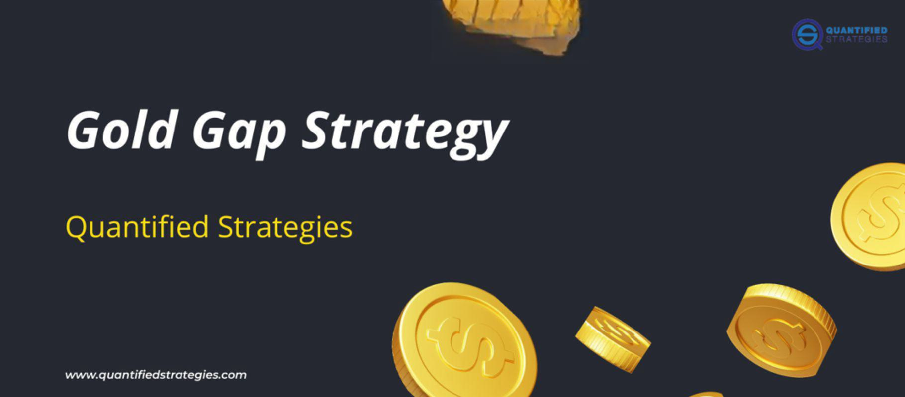

## Table of Contents

## What are the basic reasons someone should consider investing in gold?

Investing in gold can be a good idea for a few main reasons. First, gold is often seen as a safe investment during times when the economy is not doing well. When stock markets go down or there is a lot of uncertainty, people tend to buy more gold because it keeps its value better than other investments. This makes gold a good way to protect your money when things are unstable.

Another reason to invest in gold is that it can help you have a mix of different types of investments. Having a variety of investments, like stocks, bonds, and gold, can lower the risk of losing money. Gold often goes up in value when other investments go down, so it can balance out your overall investment portfolio. This way, if one type of investment does poorly, the gold might do well and help protect your money.

## How does gold act as a hedge against inflation?

Gold acts as a hedge against inflation because its value tends to go up when the value of money goes down. When prices for things like food, gas, and other goods increase, that's called inflation. During times of high inflation, the money you have can buy less stuff. But gold usually keeps its value or even becomes more valuable. So, if you have some of your money in gold, it can help protect your savings from losing value because of inflation.

For example, if you have $1,000 and inflation makes everything more expensive, that $1,000 won't buy as much as before. But if you had invested some of that money in gold, the gold might be worth more now. This means you could sell the gold and get more money than you started with, helping you keep up with the rising prices. That's why people often turn to gold when they're worried about inflation—it helps them keep their money's value.

## What are the different ways to invest in gold (physical gold, gold ETFs, gold mining stocks, etc.)?

There are several ways to invest in gold, and each has its own benefits and risks. One way is to buy physical gold, like gold bars or coins. You can hold these in your hand and keep them safe at home or in a bank's safe deposit box. Physical gold is good because it's a real thing you own, but it can be hard to sell quickly and you need to think about how to keep it safe.

Another way to invest in gold is through gold exchange-traded funds (ETFs). These are like stocks that you can buy and sell easily through a broker. Gold ETFs track the price of gold, so when gold goes up, the value of the ETF usually goes up too. This is a good option if you don't want to deal with storing physical gold, but you still want to benefit from changes in gold prices.

You can also invest in gold by buying stocks in gold mining companies. These companies find and sell gold, so their stock prices can go up when gold prices go up. This can be riskier than buying physical gold or ETFs because the success of the company depends on more than just the price of gold. It also depends on how well the company is run and how much gold they can find and sell.

## What are the pros and cons of buying physical gold?

Buying physical gold, like gold bars or coins, has some good points. One big plus is that you own something real. You can hold it in your hand and keep it safe at home or in a bank's safe deposit box. This can make you feel more secure because you know exactly what you have. Also, physical gold is easy to understand. You don't need to know a lot about stocks or investing to buy and own gold. It's simple and straightforward.

However, there are also some downsides to buying physical gold. One big problem is that it can be hard to sell quickly. If you need money fast, you might have to wait or accept a lower price than you want. Also, you need to think about how to keep it safe. If you keep it at home, you risk it being stolen. If you use a bank's safe deposit box, you have to pay for that service. Another thing to consider is that when you buy physical gold, you often have to pay extra for making the gold into bars or coins, and you might have to pay more when you sell it too.

## How do gold ETFs work and what are their benefits and risks?

Gold ETFs are like funds that you can buy and sell on the stock market. They track the price of gold, so when the price of gold goes up, the value of the ETF usually goes up too. You don't have to worry about storing physical gold because the ETF does that for you. To buy a gold ETF, you need a brokerage account, and you can trade it just like you would trade stocks. This makes it easy to buy and sell whenever you want.

The benefits of gold ETFs are that they are easy to trade and you don't have to worry about keeping physical gold safe. They are also a good way to invest in gold without having to buy and store the metal yourself. However, there are risks too. The price of the ETF can go up and down, and it might not always match the price of gold perfectly. Also, you have to pay fees to own the ETF, which can eat into your profits over time. So, while gold ETFs can be a convenient way to invest in gold, you need to be aware of these costs and the possibility that the ETF's value might not track gold prices exactly.

## What should beginners know about investing in gold mining stocks?

Investing in gold mining stocks means buying shares in companies that find and sell gold. When you do this, you're not just betting on the price of gold going up. You're also betting on the company doing well. This can be riskier than buying physical gold or gold ETFs because the company's success depends on many things. They need to find enough gold, sell it at a good price, and run their business well. If the company does poorly, even if gold prices go up, your investment might not do well.

Beginners should know that gold mining stocks can be a good way to make money if the company does well and gold prices go up. But they can also lose money if the company has problems or if gold prices go down. It's important to do your homework and learn about the company before you invest. Look at how much gold they have, how much it costs them to find and sell it, and how well they are run. This can help you make a smarter choice about whether to invest in their stocks.

## How can one determine the right time to buy gold?

Deciding when to buy gold can be tricky. One good time to buy gold is when you think the economy might get worse. When people are worried about the economy, they often buy gold because it's seen as a safe place to put their money. So, if you see news about problems in the economy, like high inflation or stock markets going down, it might be a good time to buy gold. Another time to buy gold is when its price is lower than usual. If you keep an eye on gold prices and see that it's cheaper than it has been, that could be a good time to buy.

Another thing to think about is your own money situation. If you have extra money that you don't need right away, and you want to protect it from inflation, buying gold can be a good idea. But if you might need that money soon, it's better to wait because gold can be hard to sell quickly. Also, it's good to buy gold as part of a mix of investments. If you have all your money in one thing, like stocks, adding some gold can help balance it out. So, the right time to buy gold depends on the economy, the price of gold, and your own money needs.

## What are the tax implications of investing in gold?

When you invest in gold, you need to think about taxes. If you sell your gold for more money than you paid for it, you might have to pay capital gains tax. This is a tax on the profit you make. How much you pay depends on how long you owned the gold. If you owned it for less than a year, you pay a short-term capital gains tax, which is usually higher. If you owned it for more than a year, you pay a long-term capital gains tax, which is usually lower.

Another thing to know is that if you buy gold coins or bars, you might have to pay sales tax when you buy them. This depends on where you live because different places have different rules. Also, if you keep your gold in a safe deposit box at a bank, you might not have to pay taxes on it until you sell it. But if you use gold in a business, like a jeweler, you might have to pay different kinds of taxes. It's a good idea to talk to a tax expert to understand all the tax rules for gold in your area.

## How does global economic uncertainty affect gold prices?

When the world's economy is uncertain, people often turn to gold. They see it as a safe place to put their money because gold usually keeps its value even when other things like stocks go down. For example, if there's a big problem like a financial crisis or a war, people might worry about their money in banks or stocks. So, they buy more gold, which makes the price of gold go up. This is because more people want to buy it, and when more people want something, the price goes up.

But it's not just big problems that can affect gold prices. Even smaller worries about the economy can make people buy more gold. If people think inflation might go up or if they're not sure what will happen with the economy, they might decide to buy gold to protect their money. This extra demand for gold can push its price higher. So, whenever there's uncertainty in the world, gold often becomes more valuable because people see it as a way to keep their money safe.

## What advanced strategies can be used to leverage gold investments?

One advanced strategy for leveraging gold investments is using gold futures and options. These are agreements to buy or sell gold at a certain price in the future. Futures and options can help you make money if you think gold prices will go up or down. But they are also riskier because you can lose a lot of money if the price of gold doesn't go the way you expected. It's important to understand these tools well before you use them, and many people use them only if they are experienced investors.

Another strategy is to use gold as part of a larger investment plan. This means you can use gold to balance out other investments like stocks or real estate. For example, if you think the stock market might go down, you can buy more gold to protect your money. You can also use something called a 'gold-backed loan.' This is when you borrow money using your gold as a guarantee. If gold prices go up, you can make money from the loan and still keep your gold. But be careful, because if gold prices go down, you might have to pay back the loan with less valuable gold.

## How can gold be integrated into a diversified investment portfolio?

Adding gold to a mix of investments can help keep your money safe. Gold is different from things like stocks or bonds because it often goes up in value when those other things go down. This means if the stock market has a bad day, your gold might still be worth the same or even more. By having some gold in your investment mix, you spread out your risk. If one part of your investments does badly, the gold can help balance it out and keep your overall money safe.

To add gold to your investments, you can choose from a few options. You could buy physical gold, like bars or coins, which you can keep at home or in a safe deposit box. Another way is to buy gold ETFs, which are easy to trade and don't need you to store the gold yourself. You can also buy stocks in gold mining companies, but these are riskier because they depend on more than just the price of gold. No matter which way you choose, having a little bit of gold in your investment mix can help protect your money from big ups and downs in the economy.

## What are the long-term trends and forecasts for gold prices?

Over the long term, gold prices have gone up and down but have generally increased. This is because gold is seen as a safe place to put money when the economy is not doing well. For example, during times like the 2008 financial crisis or more recent global uncertainties, people bought more gold, which made its price go up. Experts think that in the future, gold prices might keep going up because of things like inflation and economic problems around the world. But it's hard to predict exactly what will happen because so many things can affect gold prices.

Looking ahead, some people think that gold will keep being important because it helps protect money from losing value. If inflation keeps going up, or if there are more economic problems, gold could become even more valuable. But other things like new technology or changes in how people invest their money could also affect gold prices. So, while many experts think gold prices will go up over time, it's always a good idea to keep an eye on what's happening in the world and adjust your investments as needed.

## References & Further Reading

[1]: Bergstra, J., Bardenet, R., Bengio, Y., & Kégl, B. (2011). ["Algorithms for Hyper-Parameter Optimization."](https://papers.nips.cc/paper/4443-algorithms-for-hyper-parameter-optimization) Advances in Neural Information Processing Systems 24.

[2]: ["Advances in Financial Machine Learning"](https://www.amazon.com/Advances-Financial-Machine-Learning-Marcos/dp/1119482089) by Marcos Lopez de Prado

[3]: ["Evidence-Based Technical Analysis: Applying the Scientific Method and Statistical Inference to Trading Signals"](https://www.amazon.com/Evidence-Based-Technical-Analysis-Scientific-Statistical/dp/0470008741) by David Aronson

[4]: ["Machine Learning for Algorithmic Trading"](https://github.com/stefan-jansen/machine-learning-for-trading) by Stefan Jansen

[5]: ["Quantitative Trading: How to Build Your Own Algorithmic Trading Business"](https://www.amazon.com/Quantitative-Trading-Build-Algorithmic-Business/dp/1119800064) by Ernest P. Chan