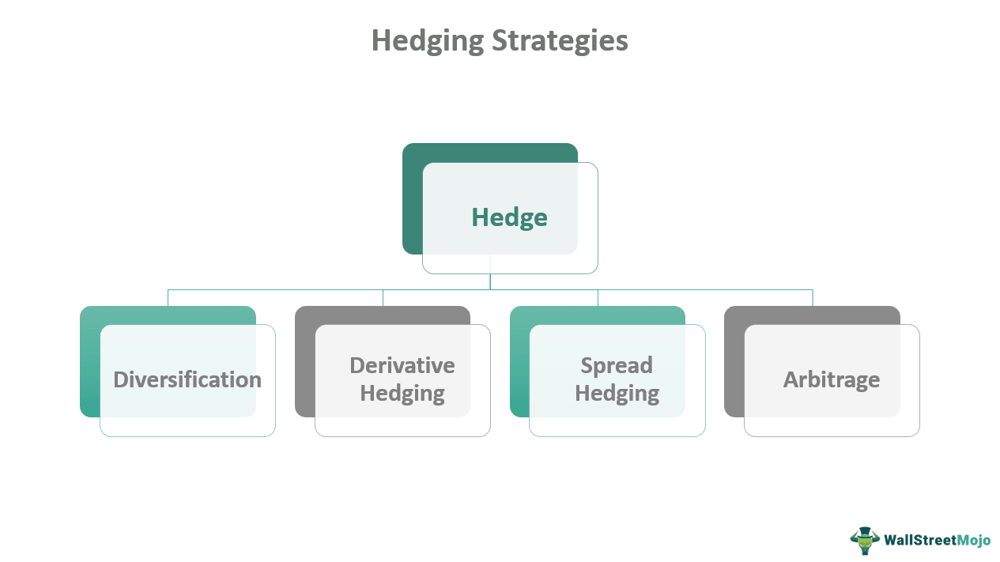

Economic recessions are inevitable occurrences within the economic cycle, characterized by declines in economic activity, and they can severely impact financial markets and individual portfolios. During these periods, effective financial planning and adopting sound hedging strategies become essential. A well-structured approach helps protect investments and capital, minimizing losses during economic downturns.

Algorithmic trading, or algo trading, is instrumental in executing these strategies efficiently. It allows for automated, systematic, and disciplined implementation of strategies that can swiftly adapt to market changes. By leveraging advanced algorithms and technologies, investors can optimize their trading activities, capitalize on fleeting market opportunities, and shield their portfolios from significant losses during turbulent economic times.



This article examines crucial financial planning techniques and hedging strategies that are integral to safeguarding investments amid economic recessions. Understanding and implementing these strategies can serve as the foundation for maintaining financial stability and growth even during challenging economic periods, offering investors the means to not only preserve wealth but also position themselves for future opportunities.

## Table of Contents

## Understanding Economic Recessions

An economic recession is commonly defined as a significant decline in economic activity spread across the economy, lasting more than a few months, and usually visible in real GDP, real income, employment, industrial production, and wholesale-retail sales. The most widely accepted technical criterion for a recession is two consecutive quarters of negative GDP growth. This standard was popularized by economists and economic observers as a benchmark.

Several factors often indicate a forthcoming recession. Inflation, which reflects the rate at which the general level of prices for goods and services rises, eroding purchasing power, can precipitate a recession when it spirals out of control. Rising interest rates, often a tool used by monetary authorities to control inflation, can also contribute by increasing borrowing costs, which dampens consumer and business spending. Additionally, stock market volatility, characterized by sharp fluctuations in market prices, may signal or contribute to economic uncertainty and contractions.

Recessions impact sectors differently because each industry has its unique sensitivities and drivers. For instance, consumer staples, healthcare, and utilities are generally more resilient due to the consistent demand for their products and services. Conversely, cyclical industries like luxury goods, automotive, and travel usually experience more significant downturns, as consumers tend to cut back on non-essential expenditures during economic hardships.

Comprehending these dynamics is critical for financial planning and making informed investment decisions. Such understanding aids in risk assessment and management by identifying which sectors are likely to face severe pressures and which might stand strong or even thrive. As investors and policy-makers anticipate these shifts, strategic planning focuses on diversification and risk mitigation, wherein the goal is to construct portfolios that can withstand or capitalize on the different phases of economic cycles. In essence, a well-rounded approach takes into account both macroeconomic indicators and sector-specific dynamics when navigating through recessions.

## Financial Planning During a Recession

Economic recessions challenge investors by introducing increased [volatility](/wiki/volatility-trading-strategies) and uncertainty in financial markets. To navigate these downturns effectively, maintaining a diversified portfolio is crucial. Diversification involves spreading investments across a range of assets to mitigate the impact of adverse market conditions on a single asset or sector. For instance, a well-diversified portfolio might include stocks, bonds, commodities, and real estate, thereby reducing dependence on any individual component.

Investing in quality, cash-rich defensive stocks is another strategy that can offer stability during recessions. Defensive stocks typically belong to industries such as utilities, healthcare, and consumer staples, which tend to maintain steady earnings regardless of economic conditions. These companies usually have robust balance sheets and generate strong cash flows, which enable them to provide consistent dividends. This dividend income offers investors some financial cushioning during turbulent times.

The strategy of dollar-cost averaging (DCA) can be a practical approach to managing investments during a recession. DCA involves regularly investing a fixed amount of money into a particular asset over an extended period, regardless of the market price. This method reduces the risk of making significant investments at market peaks and takes advantage of lower prices during downturns. For example, if an investor commits $500 monthly to purchase shares of a specific stock, they would accumulate more shares when prices drop and fewer shares when prices rise, potentially reducing the average cost per share over time.

Adhering to a well-thought-out investment plan is essential for weathering the emotional challenges posed by recessions. Investors are often tempted to panic sell when markets decline sharply; however, avoiding impulsive decisions is vital for long-term success. Historical data suggests that markets tend to recover over time, rewarding those who remain committed to their strategies. Implementing a disciplined approach, grounded in thorough research and analysis, can help investors maintain focus amidst the noise of economic downturns.

Overall, sound financial planning during a recession involves a mix of diversification, investing in high-quality assets, disciplined strategies like dollar-cost averaging, and unwavering adherence to a predetermined investment plan. This approach not only helps mitigate risks but also positions investors for potential gains when economic conditions improve.

## Hedging Strategies to Mitigate Risks

Hedging strategies are critical for reducing potential losses during volatile market conditions, protecting portfolios and ensuring stability. Effective hedging requires diversification, the use of sophisticated financial instruments, and international market exploration.

Diversification across different asset classes is a fundamental hedging strategy. By distributing investments among bonds, commodities, and foreign stocks, investors can achieve a balanced portfolio that is less susceptible to market volatility. Bonds generally offer fixed returns, providing a stabilizing influence during economic downturns. Commodities, such as gold, often act as safe havens, preserving value when stock markets decline. Foreign stocks can deliver opportunities by capitalizing on growth in markets not correlated with the domestic economy. This diversification mitigates the risk as different assets react distinctively to economic shifts.

Utilizing options and derivatives offers another layer of protection. Options give investors the right, but not the obligation, to buy or sell an asset at a predetermined price within a specified timeframe. This flexibility can be beneficial in hedging against adverse price movements. For example, put options can protect against falling stock prices. Derivatives like futures contracts can also be used to hedge by locking in prices, thus avoiding losses from price volatility. These instruments provide leverage, allowing investors to control more significant positions with smaller capital outlays, potentially enhancing returns while mitigating risks.

Exploring international investments is advantageous for reducing region-specific risks. Economic conditions can vary significantly across countries, and investing in multiple geographic regions can dilute the impact of local economic downturns. For instance, an economic slump in one country may be offset by growth in another, balancing the overall portfolio performance. Moreover, currency diversification resulting from international investments can act as an additional hedge against currency-specific risks.

By employing these hedging strategies—diversifying across asset classes, leveraging options and derivatives, and venturing into international markets—investors can effectively mitigate risks associated with volatile market conditions, protecting their investments from significant losses.

## The Role of Algo Trading in Financial Planning

Algorithmic trading, often abbreviated as algo trading, revolutionizes financial planning by enabling automated and systematic execution of investment strategies. This technology-driven approach leverages computer algorithms to execute trades at speeds and frequencies impractical for human traders, thus optimizing performance and reducing emotional biases in trading decisions.

One of the primary advantages of algo trading is its ability to respond swiftly to market changes. Algorithms are programmed to monitor multiple markets simultaneously, taking into account various indicators and data points. This capability allows investors to capitalize on opportunities as they arise, thereby maximizing profits and minimizing potential losses. For example, by setting predefined conditions under which trades should be executed, algorithms can exploit [arbitrage](/wiki/arbitrage) opportunities or quickly adjust portfolios in response to economic news or market volatility.

Furthermore, algo trading facilitates the implementation of specific hedging strategies. By allowing for the precise timing of trades, algorithms can ensure discipline and consistency in executing complex strategies such as delta hedging or pairs trading. This systematic approach reduces the possibility of human error and ensures that hedging strategies are executed as intended, thereby providing a buffer against market unpredictability.

The integration of [machine learning](/wiki/machine-learning) and [artificial intelligence](/wiki/ai-artificial-intelligence) (AI) in [algorithmic trading](/wiki/algorithmic-trading) enhances decision-making processes. Machine learning models can analyze vast amounts of historical and real-time data to identify patterns and trends that might not be immediately apparent to human analysts. These models can adapt over time, learning from new data and dynamically adjusting to evolving market conditions. For instance, a machine learning algorithm might use historical price data to predict future stock movements, continuously updating its predictive model as new data becomes available.

Here is a simple example of a Python code snippet implementing a basic moving average crossover strategy using historical stock price data:

```python
import pandas as pd
import numpy as np
import matplotlib.pyplot as plt

# Load historical stock price data
data = pd.read_csv('stock_prices.csv', parse_dates=True, index_col='Date')

# Calculate short-term and long-term moving averages
data['Short_MA'] = data['Close'].rolling(window=20).mean()
data['Long_MA'] = data['Close'].rolling(window=50).mean()

# Generate buy/sell signals
data['Signal'] = np.where(data['Short_MA'] > data['Long_MA'], 1, 0)
data['Position'] = data['Signal'].diff()

# Plot the stock price and moving averages
plt.figure(figsize=(14, 7))
plt.plot(data['Close'], label='Stock Price', alpha=0.5)
plt.plot(data['Short_MA'], label='20-Day MA', alpha=0.8)
plt.plot(data['Long_MA'], label='50-Day MA', alpha=0.8)

# Plot buy/sell signals
plt.plot(data[data['Position'] == 1].index, data['Short_MA'][data['Position'] == 1], '^', markersize=10, color='g', lw=0, label='Buy Signal')
plt.plot(data[data['Position'] == -1].index, data['Short_MA'][data['Position'] == -1], 'v', markersize=10, color='r', lw=0, label='Sell Signal')

plt.title('Stock Price and Moving Averages with Buy/Sell Signals')
plt.legend(loc='best')
plt.show()
```

This code calculates short-term (20-day) and long-term (50-day) moving averages and generates buy/sell signals based on their crossover. Such algorithmic strategies can be complexified with additional rules, data inputs, or integrated with machine learning techniques for further enhancements in prediction accuracy and trading efficiency.

In conclusion, algorithmic trading serves as a powerful tool in financial planning, offering advantages such as speed, precision, and adaptability. It allows investors to navigate the complexities of financial markets with greater agility and confidence, making it an indispensable component of modern portfolio management.

## Conclusion

Economic recessions, though inherently challenging, offer savvy investors a chance to strategically position themselves for future gains. The turbulence of an economic downturn underscores the importance of disciplined financial planning and the judicious use of hedging strategies. By integrating algorithmic trading (algo trading) within their investment framework, investors can effectively mitigate the risks associated with market volatility.

A long-term investment perspective remains crucial during recessions. Diversification of investment portfolios is not merely a suggestion but a necessity, as it spreads risk across various asset classes and sectors, which may react differently to economic stress. Quality investments, particularly in sectors known for resilience, provide a steady hand during uncertain times. Equities with strong cash flows and capable of paying dividends can be particularly rewarding when markets eventually recover.

Algo trading adds another layer of sophistication to investment strategies. By capitalizing on innovative technology, investors can automate responses to market fluctuations, executing trades with precision and speed that manual processes cannot match. This automation aids in maintaining the discipline of sticking to pre-defined strategies, reducing the emotional biases that often lead to poor decision-making during market downturns. Furthermore, the integration of machine learning and AI into algo trading platforms enhances the ability to analyze vast datasets and refine strategies in real-time.

Staying informed and adaptable is imperative. Market conditions and economic indicators must be continually assessed to adjust strategies as needed. By cultivating a space for flexibility and informed responsiveness, investors can shield their wealth from the brunt of recessions. Moreover, they are better positioned to take advantage of the opportunities that arise in the wake of economic recovery, ensuring not only the preservation of their capital but its growth as well.

In conclusion, while recessions pose significant challenges, they also allow proactive investors to consolidate their financial resilience and prepare for eventual market rebounds. Through effective financial planning, robust hedging strategies, and the strategic deployment of algo trading, individuals can successfully navigate economic downturns and emerge in a stronger position for future prosperity.

## References & Further Reading

[1]: Bergstra, J., Bardenet, R., Bengio, Y., & Kégl, B. (2011). ["Algorithms for Hyper-Parameter Optimization."](https://dl.acm.org/doi/10.5555/2986459.2986743) Advances in Neural Information Processing Systems 24.

[2]: ["Advances in Financial Machine Learning"](https://www.amazon.com/Advances-Financial-Machine-Learning-Marcos/dp/1119482089) by Marcos Lopez de Prado

[3]: ["Evidence-Based Technical Analysis: Applying the Scientific Method and Statistical Inference to Trading Signals"](https://www.amazon.com/Evidence-Based-Technical-Analysis-Scientific-Statistical/dp/0470008741) by David Aronson

[4]: ["Machine Learning for Algorithmic Trading"](https://github.com/stefan-jansen/machine-learning-for-trading) by Stefan Jansen

[5]: ["Quantitative Trading: How to Build Your Own Algorithmic Trading Business"](https://www.amazon.com/Quantitative-Trading-Build-Algorithmic-Business/dp/1119800064) by Ernest P. Chan

[6]: ["Algorithmic and High-Frequency Trading"](https://www.cambridge.org/us/universitypress/subjects/mathematics/mathematical-finance/algorithmic-and-high-frequency-trading) by Álvaro Cartea, Sebastian Jaimungal, and José Penalva

[7]: Malkiel, B. G. (2007). ["A Random Walk Down Wall Street: The Time-Tested Strategy for Successful Investing"](https://www.academia.edu/10850809/A_Random_Walk_Down_Wall_Street_The_Time_Tested_Strategy_for_Successful_Investing)

[8]: Sharpe, W. F. (1994). ["The Sharpe Ratio"](https://web.stanford.edu/~wfsharpe/art/sr/SR.htm) Journal of Portfolio Management, 21(1), 49-58.

[9]: Markowitz, H. (1952). ["Portfolio Selection"](https://onlinelibrary.wiley.com/doi/abs/10.1111/j.1540-6261.1952.tb01525.x) The Journal of Finance, 7(1), 77-91.