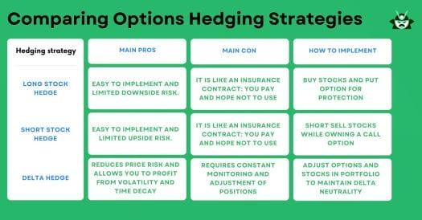

## Table of Contents

## What is an economic recession and how is it defined?

An economic recession is a time when the economy of a country slows down a lot. It means that people are buying less, businesses are making less money, and many people might lose their jobs. A common way to tell if there is a recession is if the economy shrinks for two quarters in a row. This shrinking is measured by something called the Gross Domestic Product, or GDP, which is the total value of all goods and services produced in a country.

Recessions can happen for many reasons. Sometimes, it's because people suddenly stop spending money because they're worried about the future. Other times, it might be because of a big event, like a financial crisis or a global health emergency. When a recession hits, governments and central banks often try to help by lowering interest rates or spending more money to stimulate the economy. But it can take time for these efforts to work, and in the meantime, many people can struggle.

## Why is it important to hedge against economic recessions?

Hedging against economic recessions is important because it helps protect your money and your future. When a recession happens, the value of things like stocks, houses, and businesses can go down a lot. If you have all your money in one place, like the stock market, you could lose a lot if the market crashes. By spreading your money around, or hedging, you can lower the risk of losing everything at once.

Hedging can also help you keep your life stable during tough economic times. If you lose your job during a recession, having some money saved up or invested in safe places can help you pay your bills and take care of your family. It's like having a safety net that catches you if you fall. By planning ahead and hedging against a recession, you can feel more secure and ready for whatever the economy might do.

## What are the common signs that an economic recession might be approaching?

One of the first signs that an economic recession might be coming is when people start to spend less money. When people feel worried about the future, they might decide to save their money instead of buying things they don't really need. This can lead to businesses selling less, which can make them cut jobs or even close down. Another sign is when the stock market starts to go down a lot. If investors think a recession is coming, they might start selling their stocks, which can make the market drop even more.

Another thing to watch for is rising unemployment. When businesses are not doing well, they might have to let people go. If more and more people are losing their jobs, it's a sign that the economy might be slowing down. Interest rates can also give a clue. If the central bank starts to lower interest rates, it might be trying to help the economy because it sees a recession coming. All these signs together can help people get ready for a possible economic downturn.

## What are the basic strategies for individuals to hedge against a recession?

One basic way to hedge against a recession is to save money. Try to put some money away every month into a savings account. This money can help you pay for things if you lose your job or if prices go up. Another good idea is to pay off debts like credit cards. When you don't owe money, you'll have more to save and you won't have to worry about paying interest.

Another strategy is to invest wisely. Instead of putting all your money in one place, like the stock market, spread it out. You can put some money in safe places like savings accounts or bonds. These might not grow as fast as stocks, but they are less likely to lose value during a recession. It's also smart to keep learning new skills. If you can do more things, you might find it easier to get a job even when times are tough.

Lastly, having a plan can really help. Talk to a financial advisor if you can, to make a plan that fits your life. They can help you figure out how much to save, where to invest, and how to get ready for a recession. By thinking ahead and being ready, you can feel more secure no matter what happens to the economy.

## How can diversification help in protecting investments during a recession?

Diversification means spreading your money across different types of investments. Instead of putting all your money in one place, like just stocks, you can invest in things like bonds, real estate, and even cash. This way, if one type of investment goes down during a recession, the others might not go down as much or might even go up. It's like not putting all your eggs in one basket. If one basket falls, you still have eggs in the other baskets.

By diversifying, you lower the risk of losing all your money at once. During a recession, different parts of the economy can be affected differently. For example, while stocks might be going down, some bonds might stay steady or even increase in value. This balance can help protect your overall investment. So, even if a recession hits, having a mix of investments can help you weather the storm better and keep your financial future more secure.

## What role do emergency funds play in personal financial planning during economic downturns?

An emergency fund is like a safety net for your money. It's money you save up to use when something unexpected happens, like losing your job during a recession. Having an emergency fund can help you pay for things like food, rent, and bills even if you're not [earning](/wiki/earning-announcement) money. This can stop you from having to borrow money or sell your investments at a bad time, which could make your money problems even worse.

During an economic downturn, having an emergency fund can make a big difference. It can give you peace of mind because you know you have some money saved up. This can help you avoid making quick, bad decisions with your money out of panic. By having an emergency fund, you can focus on getting through the tough times without worrying so much about money, which can help you come out of the recession in a better financial position.

## How can one adjust their investment portfolio in anticipation of a recession?

When you think a recession might be coming, you can change your investment portfolio to be safer. One way to do this is by moving some of your money from stocks to bonds. Bonds are usually less risky than stocks and can help protect your money if the stock market goes down a lot. You might also want to put some money into cash or a savings account. This money can be used if you need it quickly during tough times.

Another thing you can do is to make sure your investments are spread out. This means not putting all your money in one place. For example, you could have some money in different types of stocks, some in real estate, and some in bonds. This way, if one type of investment does badly during a recession, the others might not do as badly. It's like having different safety nets to catch you if you fall. By adjusting your portfolio like this, you can be better prepared for a recession and protect your money.

## What are the advanced financial instruments used for hedging against recessions?

One advanced financial instrument for hedging against recessions is options. Options give you the right, but not the obligation, to buy or sell an asset at a certain price before a certain date. For example, you can buy a "put option" on a stock. If the stock price goes down during a recession, you can sell the stock at the higher price you set with the option. This can help you make money or lose less money when the market goes down.

Another tool is futures contracts. Futures let you agree to buy or sell something at a set price on a future date. They are often used for things like commodities, but can also be used for financial assets. If you think a recession will make prices go down, you can use futures to lock in today's prices. This can protect you from losing money if prices drop a lot during a recession.

Lastly, there are inverse ETFs, or exchange-traded funds. These are funds designed to go up in value when the market goes down. By investing in an inverse [ETF](/wiki/etf-trading-strategies), you can make money if the stock market falls during a recession. These instruments can be more complicated and risky, but they can be useful tools for experienced investors looking to hedge against economic downturns.

## How do businesses hedge against economic downturns, and what strategies do they employ?

Businesses hedge against economic downturns by using different strategies to protect themselves. One common way is by diversifying their products or services. If a business sells many different things, it's less likely that all of them will do badly during a recession. For example, a company that makes both luxury items and everyday products might see more people buying the everyday products when times are tough. Another strategy is to keep a lot of cash on hand. This money can help the business keep running even if sales go down. It can also be used to take advantage of new opportunities that come up during a recession, like buying other businesses at a lower price.

Another way businesses protect themselves is by using financial instruments like futures and options. These tools can help a business lock in prices for things they need to buy or sell, so they don't lose money if prices change a lot during a recession. For example, an airline might use futures to lock in the price of fuel. This way, if fuel prices go up during a recession, the airline won't have to pay more. Businesses also often cut costs during tough times. They might lay off workers, reduce spending on new projects, or find other ways to save money. By doing these things, businesses can stay strong even when the economy is weak.

## What are the macroeconomic indicators that experts monitor to predict recessions?

Experts watch several big signs to guess if a recession might be coming. One of the main things they look at is the Gross Domestic Product (GDP). If the GDP goes down for two quarters in a row, it's often a sign that a recession is happening. Another big sign is the unemployment rate. When more people start losing their jobs, it can mean the economy is slowing down. Experts also keep an eye on the stock market. If stock prices start falling a lot, it might mean investors are worried about a recession.

Another important thing experts watch is consumer spending. When people start spending less money, it can hurt businesses and lead to a recession. Interest rates are also key. If the central bank starts lowering interest rates, it might be trying to help the economy because it sees a recession coming. Lastly, experts look at things like the housing market and business investments. If fewer people are buying houses or if businesses are not investing as much, these can be early warnings that an economic downturn is on the way.

## How can international diversification be used as a strategy to hedge against domestic recessions?

International diversification means spreading your money across different countries. If you only invest in your own country and it goes into a recession, you could lose a lot of money. But if you also invest in other countries, those economies might not be in a recession at the same time. This way, if your home country's economy is doing badly, you might still make money from your investments in other countries. It's like having different safety nets in different places.

For example, if the U.S. economy is slowing down, you might have investments in Europe or Asia that are doing well. By having a mix of investments from around the world, you can lower the risk of losing all your money at once. This can help you keep your money safe and maybe even grow it, even when your own country is going through tough economic times.

## What are the potential pitfalls and limitations of various hedging strategies during economic recessions?

Hedging against economic recessions can be smart, but it has some problems. One big problem is that hedging can cost money. For example, when you buy options or futures, you have to pay for them. If the recession doesn't happen, you might lose the money you spent on these tools. Another problem is that some hedging strategies are hard to understand and use. If you don't know a lot about things like options and futures, you might make mistakes and lose money instead of protecting it.

Another limitation is that no strategy can protect you completely. Even if you diversify your investments or keep a lot of cash, a really bad recession can still hurt you. Also, some strategies might not work as well as you hope. For example, if you move your money from stocks to bonds, but bond prices also go down during the recession, you might not be as safe as you thought. It's important to remember that while hedging can help, it's not a perfect shield against all economic troubles.

## References & Further Reading

[1]: Bergstra, J., Bardenet, R., Bengio, Y., & Kégl, B. (2011). ["Algorithms for Hyper-Parameter Optimization."](https://dl.acm.org/doi/10.5555/2986459.2986743) Advances in Neural Information Processing Systems 24.

[2]: ["Advances in Financial Machine Learning"](https://www.amazon.com/Advances-Financial-Machine-Learning-Marcos/dp/1119482089) by Marcos Lopez de Prado

[3]: ["Evidence-Based Technical Analysis: Applying the Scientific Method and Statistical Inference to Trading Signals"](https://www.amazon.com/Evidence-Based-Technical-Analysis-Scientific-Statistical/dp/0470008741) by David Aronson

[4]: ["Machine Learning for Algorithmic Trading"](https://github.com/stefan-jansen/machine-learning-for-trading) by Stefan Jansen

[5]: ["Quantitative Trading: How to Build Your Own Algorithmic Trading Business"](https://www.amazon.com/Quantitative-Trading-Build-Algorithmic-Business/dp/1119800064) by Ernest P. Chan

[6]: ["Algorithmic and High-Frequency Trading"](https://www.cambridge.org/us/universitypress/subjects/mathematics/mathematical-finance/algorithmic-and-high-frequency-trading) by Álvaro Cartea, Sebastian Jaimungal, and José Penalva

[7]: Malkiel, B. G. (2007). ["A Random Walk Down Wall Street: The Time-Tested Strategy for Successful Investing"](https://www.academia.edu/10850809/A_Random_Walk_Down_Wall_Street_The_Time_Tested_Strategy_for_Successful_Investing)

[8]: Sharpe, W. F. (1994). ["The Sharpe Ratio"](https://web.stanford.edu/~wfsharpe/art/sr/SR.htm) Journal of Portfolio Management, 21(1), 49-58.

[9]: Markowitz, H. (1952). ["Portfolio Selection"](https://onlinelibrary.wiley.com/doi/abs/10.1111/j.1540-6261.1952.tb01525.x) The Journal of Finance, 7(1), 77-91.