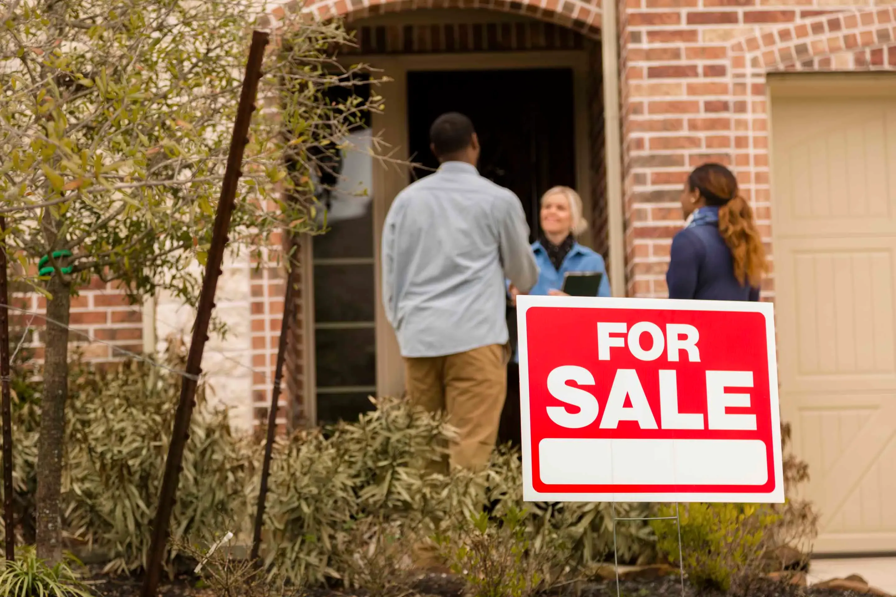

## Table of Contents

## What is a recession and how does it affect the housing market?

A recession is when the economy of a country slows down for a while. During a recession, people lose their jobs, businesses make less money, and it's harder for everyone to buy things they want or need. This happens because people are spending less money, which makes the economy shrink instead of grow.

When a recession hits, the housing market usually feels the impact too. People might not want to buy houses because they're worried about their jobs and money. This means fewer people are looking to buy, so house prices can go down. Also, if people can't pay their mortgages because they lost their jobs, more houses might be sold at lower prices or even taken back by banks. This can make the housing market slow down and become less active.

## Why might it be a good time to buy a home during a recession?

During a recession, home prices often drop because fewer people are buying. This means you might be able to find a good deal on a house. If you have a steady job and can afford to buy, it could be a smart time to look for a home. You might end up paying less than you would during better economic times.

Also, interest rates on loans can be lower during a recession. This makes borrowing money to buy a house cheaper. If you can get a lower [interest rate](/wiki/interest-rate-trading-strategies), your monthly mortgage payments will be smaller. This can make buying a home more affordable, even if the economy is struggling.

## What are the risks of buying a home during a recession?

Buying a home during a recession can be risky. One big risk is that you might lose your job. If you lose your job, it can be hard to keep up with your mortgage payments. If you can't pay, you might have to sell your house quickly, maybe for less money than you paid for it. This is called selling at a loss, and it's not good for your finances.

Another risk is that home prices might keep falling after you buy. If you need to sell your house soon after buying it, you could end up selling it for less than what you paid. This can be a problem if you need to move for a new job or other reasons. It's important to think about how long you plan to stay in the house before you decide to buy during a recession.

Lastly, getting a loan can be harder during a recession. Banks might be stricter about who they lend money to because they're worried about people not being able to pay back their loans. If you can't get a loan, or if you get one with a high interest rate, it can make buying a home more difficult and more expensive. It's important to make sure you're in a good financial position before buying a home during tough economic times.

## How can home buyers prepare financially for purchasing a home in a recession?

To prepare financially for buying a home during a recession, it's important to save as much money as you can. Start by building a big emergency fund. This fund will help you pay your bills if you lose your job or if something unexpected happens. Having enough savings can make you feel more secure about buying a home, even when the economy is struggling. Also, try to pay off any debts you have, like credit cards or student loans. Less debt means you'll have more money each month to put toward a mortgage.

Another important step is to check your credit score. A good credit score can help you get a better interest rate on your mortgage, which can save you a lot of money over time. You can improve your credit score by paying your bills on time and not taking on too much new debt. It's also a good idea to talk to a financial advisor or a mortgage broker. They can help you understand what you can afford and guide you through the home-buying process. Remember, buying a home is a big decision, so make sure you're ready financially before you take the leap.

## What types of mortgages are best during a recession?

During a recession, a fixed-rate mortgage can be a good choice. This type of mortgage has the same interest rate for the whole time you're paying it off. That means your monthly payments stay the same, even if the economy gets worse. This can help you plan your budget better because you know exactly how much you'll need to pay each month. If interest rates go up during the recession, you won't have to worry about your mortgage payments going up too.

Another good option might be a government-backed loan, like an FHA loan or a VA loan. These loans are insured by the government, which can make it easier to get approved, even if banks are being stricter during a recession. FHA loans can be good if you don't have a lot of money saved for a down payment, and VA loans are great for veterans and can offer lower interest rates and no down payment. Both types of loans can help you buy a home when money is tight.

It's also worth thinking about an adjustable-rate mortgage (ARM) if you plan to sell or refinance your home before the interest rate changes. ARMs start with a lower interest rate than fixed-rate mortgages, which can make your monthly payments smaller at first. But remember, the interest rate can go up after a few years, so this type of mortgage can be riskier if you're not sure you'll be able to handle higher payments later on.

## How do interest rates typically behave during a recession and what does this mean for home buyers?

During a recession, interest rates often go down. This happens because the government and the central bank want to help the economy by making it cheaper for people and businesses to borrow money. Lower interest rates can encourage people to spend more and businesses to invest, which can help the economy start growing again. For home buyers, this means that borrowing money to buy a house becomes cheaper. If you can get a mortgage with a lower interest rate, your monthly payments will be smaller, making it easier to afford a home.

However, even though interest rates are usually lower during a recession, it's still important to be careful. If you lose your job because of the recession, you might not be able to keep up with your mortgage payments, even if they are smaller. Also, if home prices keep falling after you buy, you could end up owing more on your mortgage than your house is worth. So, while lower interest rates can make buying a home more affordable, you need to make sure you're in a good financial position and can handle the risks that come with buying during tough economic times.

## What should home buyers look for in terms of property value and location during a recession?

When buying a home during a recession, it's smart to look for properties that are priced lower than usual. Because fewer people are buying homes, you might find good deals. Look for homes that are in good shape but are being sold for less money than they're worth. It's also a good idea to think about the long-term value of the property. Even if prices are low now, if the area is growing or has good schools and jobs, the value of your home might go up over time. This can help you make money if you decide to sell later.

Location is really important too. During a recession, some areas might be hit harder than others. Look for neighborhoods that have stayed strong even during tough times. These might be places with a lot of jobs, good schools, or other things that make people want to live there. Avoid areas that have a lot of empty houses or businesses, because these places might take longer to recover from a recession. Choosing the right location can make your home a good investment, even when the economy is struggling.

## How can buyers negotiate better deals on homes during economic downturns?

During a recession, fewer people are buying homes, so sellers might be more willing to negotiate. If you find a home you like, you can offer less than the asking price. Sellers might be more likely to accept a lower offer because they want to sell their home quickly. You can also ask the seller to pay for some of your closing costs or to fix things that need to be repaired. This can save you money and make the home more affordable.

It's also a good idea to work with a real estate agent who knows the local market well. They can help you find homes that are priced to sell and can give you advice on how much to offer. Sometimes, homes that have been on the market for a long time might be a good chance to negotiate a better deal. The seller might be more willing to lower the price if they're tired of waiting for a buyer. By being patient and smart about your offers, you can get a better deal on a home during a recession.

## What government programs or incentives might be available to home buyers during a recession?

During a recession, the government might start programs to help people buy homes. One common program is called an FHA loan. These loans are backed by the government, which means they can be easier to get, even if banks are being strict. FHA loans often need a smaller down payment, which can be a big help if you don't have a lot of money saved up. Another program might be a VA loan, which is for veterans and their families. These loans can offer lower interest rates and no down payment at all, making it easier for veterans to buy a home during tough times.

In addition to these loan programs, the government might offer tax credits or other incentives to encourage people to buy homes. For example, they might give you money back on your taxes if you buy a home in a certain area or if you're a first-time buyer. These incentives can help make buying a home more affordable. It's a good idea to check with a local housing authority or a financial advisor to see what programs are available in your area. They can help you understand how these programs work and if you qualify for them.

## How should home buyers adjust their expectations and strategies when the market is in a recession?

When the market is in a recession, home buyers should be ready to adjust their expectations. Homes might not be as expensive as they were before, but they might also not be in perfect condition. Buyers should be open to looking at homes that need a bit of work, because they can often get a better deal on these properties. It's also important to be patient. It might take longer to find the right home, and you might need to make several offers before one is accepted. Being flexible about what you want in a home can help you find a good deal.

Buyers should also change their strategies during a recession. It's a good time to negotiate with sellers, who might be more willing to lower their prices. You can offer less than the asking price and ask the seller to pay for some of your closing costs or to fix things that need repair. Working with a real estate agent who knows the local market can help you find the best deals and make smart offers. It's also important to have a strong financial plan, like saving a big emergency fund and checking your credit score, to make sure you can handle the risks of buying a home during tough economic times.

## What are advanced strategies for investing in real estate during a recession?

During a recession, one advanced strategy for investing in real estate is to focus on buying properties that you can rent out. When home prices are low, you can buy a house for less money and then rent it to people who need a place to live. This can give you a steady income, even if the economy is struggling. It's important to choose properties in areas where people will still want to live, like near jobs or good schools. This way, you can keep your rental income coming in, even during tough times.

Another strategy is to look for properties that you can fix up and sell for a profit. This is called flipping houses. During a recession, you might be able to buy a house that needs some work at a lower price. If you can fix it up and sell it when the market starts to recover, you could make a good profit. This strategy can be riskier because it takes money and time to fix up a house, and you need to know what you're doing. But if you do it right, it can be a smart way to make money in real estate during a recession.

## How can home buyers use market data and economic indicators to time their purchase during a recession?

Home buyers can use market data and economic indicators to time their purchase during a recession by keeping an eye on home prices and interest rates. Home prices often go down during a recession because fewer people are buying. By looking at data from real estate websites and local housing reports, buyers can see when prices are at their lowest. This is a good time to buy because you can get a better deal. Also, interest rates usually drop during a recession to help the economy. By watching economic reports and news about interest rates, buyers can find the best time to get a mortgage with a low rate, which can save them a lot of money over time.

Another important thing to watch is the unemployment rate. If a lot of people are losing their jobs, it might not be the best time to buy a home because you could lose your job too. But if the unemployment rate starts to go down, it could mean the economy is getting better, and it might be a good time to buy. Buyers should also look at other economic indicators like consumer confidence and GDP growth. If these indicators start to improve, it could be a sign that the recession is ending, and it might be a good time to buy a home before prices start to go up again. By using this information, home buyers can make smarter decisions about when to buy during a recession.

## References & Further Reading

[1]: Riddiough, T. J., & Steiner, E. J. (2014). ["Risk-Based Pricing of Commercial Mortgages."](https://scholar.google.com/citations?user=liPH7KoAAAAJ) Real Estate Economics, 42(4), 846–876.

[2]: Shiller, R.J. (2008). ["The Subprime Solution: How Today's Global Financial Crisis Happened, and What to Do about It."](https://www.jstor.org/stable/j.cttq94jd) Princeton University Press.

[3]: Malkiel, B. G., & Shiller, R. J. (2005). ["Asset Prices and Rents in Housing Markets: A Review of the Theory and Evidence."](https://www.princeton.edu/~ceps/workingpapers/91malkiel.pdf) Econometrica, 105(2), 371–392.

[4]: Lopez de Prado, M. (2018). ["Advances in Financial Machine Learning."](https://books.google.com/books/about/Advances_in_Financial_Machine_Learning.html?id=oU9KDwAAQBAJ) Wiley.

[5]: Chan, E. P. (2009). ["Quantitative Trading: How to Build Your Own Algorithmic Trading Business."](https://github.com/ftvision/quant_trading_echan_book) Wiley.

[6]: Jansen, S. (2020). ["Machine Learning for Algorithmic Trading - Second Edition."](https://www.amazon.com/Machine-Learning-Algorithmic-Trading-alternative-ebook/dp/B08D9SP6MB) Packt Publishing.