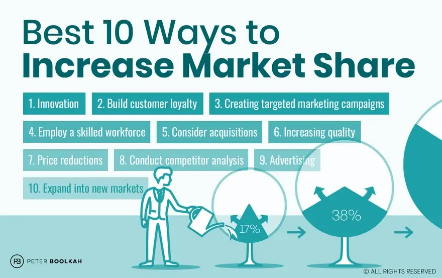

## Table of Contents

## What is market share and why is it important for a business?

Market share is the part of total sales in an industry that a company has. It is shown as a percentage. If a company has a big market share, it means they sell a lot compared to other companies in the same industry.

Market share is important for a business because it shows how well the company is doing compared to others. If a company's market share is growing, it means more people are choosing their products or services over others. This can help the company make more money and become stronger in the market. It also helps the company see if they need to change their plans to keep or grow their share.

## How can a beginner identify their current market share?

To find out your current market share, you first need to know the total sales of your industry. This means you have to look at how much everyone in your industry is selling altogether. You can find this information from industry reports, market research, or sometimes from government data. Once you know the total sales of the industry, you then need to know your own company's sales. This is easier because you can get this number from your own sales records.

After you have both numbers, you can calculate your market share. To do this, divide your company's sales by the total sales of the industry, then multiply by 100 to get a percentage. For example, if your company sold $1 million and the total industry sales were $10 million, your market share would be 10%. This simple calculation gives you a clear picture of where your business stands in the market.

## What are some basic strategies a small business can use to increase market share?

One way a small business can increase its market share is by focusing on understanding and meeting the needs of its customers better than competitors. This can be done by listening to what customers want and making products or services that match those needs. For example, a small bakery could start offering gluten-free or vegan options if they notice more customers are looking for these. Good customer service is also important. If customers feel valued and happy with the service, they are more likely to come back and tell others about the business, which can bring in more customers and increase market share.

Another strategy is to find new customers by reaching out to people who might not know about the business yet. This can be done through advertising, like putting ads in local newspapers or on social media. Special promotions or discounts can attract new customers too. For instance, a small clothing store could have a big sale to get people to come in and try their products. It's also helpful to look for new places to sell, like setting up a booth at local events or starting an online store. By expanding where and how the business reaches customers, it can grow its market share.

## How does understanding your target audience help in increasing market share?

Understanding your target audience is key to increasing market share because it helps you know exactly what your customers want and need. When you know your audience well, you can make products or services that fit their needs perfectly. For example, if your target audience likes eco-friendly products, you can focus on making things that are good for the environment. This makes your customers happier and more likely to choose your business over others.

Also, knowing your target audience helps you talk to them in a way that they understand and like. You can use the right words and messages in your ads and on your website. This makes your business stand out and attract more customers. When more people feel connected to your business, they are more likely to buy from you, which can help you grow your market share.

## What role does product differentiation play in gaining more market share?

Product differentiation is important for gaining more market share because it helps your product stand out from others. When your product is different and better in some way, customers are more likely to choose it over competitors' products. For example, if you sell a special kind of coffee that no one else has, people might come to your store just to try it. This can help you get more customers and sell more, which increases your market share.

Also, product differentiation can make your brand stronger. When people see your product as unique, they remember your brand more easily. They might even tell their friends about it, which can bring in more customers. Over time, this can help you grow your market share because more people are choosing your product because it's different and they like it.

## How can pricing strategies be adjusted to boost market share?

One way to boost market share with pricing strategies is to lower your prices. When your prices are lower than your competitors, more people might choose to buy from you because they want to save money. This can help you get more customers and sell more products. But, you need to be careful because if you lower your prices too much, you might not make enough money to keep your business running well.

Another way is to use a strategy called penetration pricing. This means you start with a low price to get into the market quickly and attract lots of customers. Once you have more customers, you can slowly raise your prices. This can help you grow your market share fast at first. It's important to make sure that people still think your product is worth the price, even when you raise it.

You can also use a strategy called price skimming. This is when you start with a high price and then lower it over time. This works well if your product is new and different, and people are willing to pay more for it at first. As the price goes down, more people can afford it, which can help you reach more customers and increase your market share.

## What are the benefits of expanding into new markets for increasing market share?

Expanding into new markets can help a business increase its market share by reaching more people. When a business goes into new areas or countries, it can sell to people who did not know about it before. This means more customers and more sales, which can make the business's part of the total market bigger. For example, a company that sells only in one city can grow its market share by starting to sell in other cities or even other countries.

Also, going into new markets can help a business learn new things and get better. When a business tries to sell in a new place, it might find out that people there like different things. The business can then change its products or how it sells them to fit what these new customers want. This can make the business stronger and more able to compete, which can help it grow its market share even more.

## How can marketing and advertising campaigns be optimized to increase market share?

To increase market share, a business can optimize its marketing and advertising campaigns by focusing on the right audience. This means knowing who your customers are and what they like. By using this information, you can make ads that really speak to them. For example, if your customers are young people who use social media a lot, you can put your ads on platforms like Instagram or TikTok. This way, more of the right people will see your ads, which can bring in more customers and help grow your market share.

Another way to optimize marketing and advertising is by making your campaigns stand out. You can do this by coming up with creative ideas that people remember. For instance, you could use funny or emotional ads that people want to share with their friends. Also, offering special deals or promotions in your ads can attract more customers. When more people see and like your ads, they are more likely to buy from you, which can help increase your market share.

## What advanced techniques involve using data analytics to enhance market share?

Using data analytics can help a business learn a lot about their customers and how to sell more. By looking at data, a business can find out what people like and don't like about their products. They can see which customers are buying a lot and which ones are not. This helps the business make better products and find new ways to reach more people. For example, if the data shows that a lot of customers are buying a certain product at a certain time of year, the business can plan special sales or ads around that time to sell even more.

Another way data analytics can help is by making marketing and advertising more effective. Businesses can use data to see which ads are working and which ones are not. They can track how many people click on their ads and how many of those people actually buy something. This helps the business spend their money on the ads that work best. They can also use data to find new groups of customers who might like their products but haven't tried them yet. By reaching out to these new customers, the business can grow its market share.

## How does strategic partnerships and collaborations contribute to market share growth?

Strategic partnerships and collaborations can help a business grow its market share by working with other companies to reach more customers. When two businesses team up, they can share their customers with each other. For example, a small clothing store might partner with a popular local fitness center. The store can put its clothes in the fitness center, and the fitness center can tell its members about the store. This way, both businesses can get more customers without spending a lot of money on ads.

Also, partnerships can help a business offer new and better products or services. When companies work together, they can combine their skills and resources to make something new that customers want. For instance, a bakery might partner with a coffee shop to create a special line of baked goods that go great with coffee. This can attract more people to both the bakery and the coffee shop, helping both businesses grow their market share. By working together, businesses can do more than they could alone, which can lead to more sales and a bigger part of the market.

## What are the potential risks and challenges of aggressive market share expansion?

Trying to grow market share quickly can be risky. One big problem is that it can cost a lot of money. When a business tries to get more customers fast, it might need to spend a lot on ads or lower its prices a lot. This can make it hard to make a profit. If the business spends too much and doesn't get enough new customers, it might lose money instead of making more.

Another challenge is that other businesses might fight back. When a company tries to take over more of the market, its competitors might start doing the same things, like lowering their prices or running more ads. This can lead to a price war, where everyone's prices go down and it's hard for anyone to make money. Also, if a business grows too fast, it might not be able to keep up with the demand. This can lead to problems like not having enough products to sell or not being able to give good customer service, which can make customers unhappy and hurt the business's reputation.

## How can a company sustain and grow its market share in a highly competitive industry?

To keep and grow market share in a very competitive industry, a company needs to always focus on understanding its customers. By knowing what people want, the company can make products or services that fit those needs better than anyone else. Good customer service is also important. When customers feel happy and valued, they are more likely to keep coming back and tell others about the business. This can help the company keep its current customers and attract new ones, which is key to growing market share. The company can also use data to see what is working and what is not, and then make smart choices about where to spend money on ads or new products.

Another way to sustain and grow market share is by staying ahead of the competition. This means always trying to be better and different. A company can do this by coming up with new ideas and products that no one else has. It can also work with other businesses through partnerships to reach more people and offer better products. But, it's important to be careful and not grow too fast. Trying to take over more of the market too quickly can lead to spending too much money or making customers unhappy if the company can't keep up with demand. By growing at a steady pace and always focusing on what customers want, a company can keep and grow its market share even when the competition is tough.

## What are the challenges and solutions in algorithmic trading?

Algorithmic trading, though advanced and effective, is not without its challenges. Key issues include regulatory compliance and market [volatility](/wiki/volatility-trading-strategies), both of which can significantly impact a firm's operations and profitability.

### Addressing Regulatory Hurdles and Volatility

Regulatory hurdles are a primary concern as they dictate how trading activities must be conducted. Financial markets are governed by strict regulations that vary by region, such as the Market in Financial Instruments Directive II (MiFID II) in Europe and the Dodd-Frank Act in the United States. These regulations demand transparency, reporting, and strict internal controls. To maintain compliance, firms often allocate significant resources to ensure their trading algorithms adhere to these regulatory frameworks. Failure to comply can lead to hefty fines and reputational damage.

Market volatility presents another challenge, as sudden price movements can lead to rapid losses if not managed correctly. Algorithmic trading systems must be equipped with sophisticated risk management tools to mitigate these risks. Techniques such as value-at-risk (VaR) and stress testing are commonly used to estimate potential losses and prepare for adverse market conditions. For instance, VaR is often calculated using the formula:

$$
\text{VaR} = \mu - \sigma \times Z_{\alpha}
$$

Where:
- $\mu$ is the mean of the portfolio returns,
- $\sigma$ is the standard deviation,
- $Z_{\alpha}$ is the Z-score at confidence level $\alpha$.

### Risk Management Capabilities

Robust risk management is crucial in preventing financial losses. Firms employ various strategies, including stop-loss orders and algorithmic adjustments based on market signals, to protect against downside risks. By simulating different market scenarios, traders can predict potential outcomes and adjust their strategies accordingly. Machine learning models also play a role in identifying hidden patterns that predict volatility, allowing for preemptive action.

### Ensuring Compliance

To keep up with ever-evolving regulations, many companies implement automated compliance systems. These systems conduct real-time monitoring of trading activities and flag potential violations, thus minimizing human error. Additionally, regular training programs ensure that employees remain informed about new regulatory developments.

### Leveraging Strategic Partnerships

Forming strategic partnerships is another effective way to overcome these challenges. By collaborating with technology providers, financial institutions can enhance their algorithmic capabilities and improve compliance mechanisms. These partnerships may involve sharing resources for developing more sophisticated trading infrastructures or gaining access to proprietary market data that can refine trading strategies.

### Preparing for Future Trends

Looking ahead, [algorithmic trading](/wiki/algorithmic-trading) is expected to evolve with advancements in [artificial intelligence](/wiki/ai-artificial-intelligence) and data analytics. Companies can prepare by investing in research and development to stay ahead of technological trends. Predictive analytics and quantum computing are areas with potential to revolutionize trading practices, offering unprecedented speed and accuracy. By staying adaptable and investing in innovation, firms can navigate future challenges and capitalize on emerging opportunities in the algorithmic trading landscape.

Adopting these solutions helps firms not only overcome current challenges but also prepare for the complexities of future markets, ensuring sustained growth and competitiveness in algorithmic trading.

## References & Further Reading

[1]: Bergstra, J., Bardenet, R., Bengio, Y., & Kégl, B. (2011). ["Algorithms for Hyper-Parameter Optimization."](https://dl.acm.org/doi/10.5555/2986459.2986743) Advances in Neural Information Processing Systems 24.

[2]: ["Advances in Financial Machine Learning"](https://www.amazon.com/Advances-Financial-Machine-Learning-Marcos/dp/1119482089) by Marcos Lopez de Prado

[3]: ["Evidence-Based Technical Analysis: Applying the Scientific Method and Statistical Inference to Trading Signals"](https://books.google.com/books/about/Evidence_Based_Technical_Analysis.html?id=MeoJAQAAMAAJ) by David Aronson

[4]: ["Machine Learning for Algorithmic Trading"](https://github.com/stefan-jansen/machine-learning-for-trading) by Stefan Jansen

[5]: ["Quantitative Trading: How to Build Your Own Algorithmic Trading Business"](https://www.amazon.com/Quantitative-Trading-Build-Algorithmic-Business/dp/1119800064) by Ernest P. Chan