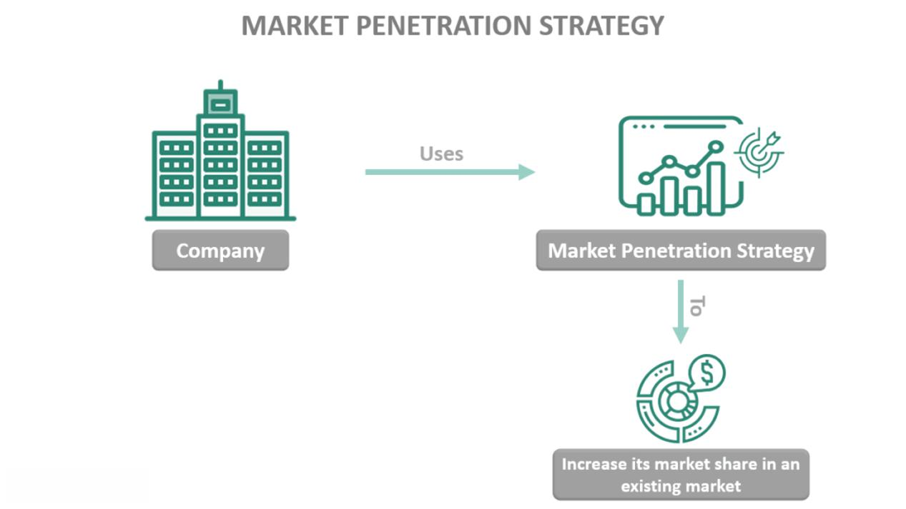

Algorithmic trading has revolutionized the financial trading industry by introducing sophisticated techniques that rely on mathematical models and computational algorithms to make trading decisions at speeds and frequencies that no human could achieve. As trading markets continue to evolve and grow in complexity, the necessity for innovative business strategies to secure and expand market share becomes evident.

Competitive growth in algorithmic trading is achievable through a combination of strategies that focus on customer loyalty, skilled workforce acquisition, strategic acquisitions, targeted advertising, and competitive pricing. Each of these strategies plays a crucial role in positioning a company favorably within the fast-paced trading industry. Customer loyalty can be built by ensuring consistent and superior trading experiences, while a skilled workforce is essential to both develop and manage advanced trading algorithms. Acquiring other firms can provide rapid expansion capabilities and an increase in market presence. Furthermore, advertising, specifically targeted advertising, allows firms to reach niche segments more effectively, while strategic price reductions can attract new clients or retain existing ones by offering compelling value.

In recent years, artificial intelligence (AI) and machine learning (ML) have emerged as critical components in enhancing trading strategies. These technologies allow firms to analyze vast quantities of market data and predict trends with high precision, thereby providing a decisive edge over competitors. AI-driven trading strategies are capable of adapting to market changes substantially faster than conventional methods, offering significant competitive advantages.

Understanding these varied strategies and their application in the context of algorithmic trading provides business entities with valuable insights into maintaining and increasing their competitive edge. Businesses must be flexible and proactive in adopting strategies that align well with evolving market conditions and client expectations to sustain and enhance their market share in this dynamic field.

## Table of Contents

## Understanding Market Share in Trading

Market share is an essential metric in trading, serving as a key indicator of a company's standing within the industry. In the trading sector, it encompasses not just the volume of trades but also a company's influence and reputation. An increase in market share typically reflects a firm’s ability to outperform competitors by offering superior services or innovative solutions that attract and retain clients.

Market share in algorithmic trading specifically references the percentage of market transactions executed using algorithmic systems within the broader trading ecosystem. This share is influenced by a firm’s technological capabilities, service quality, and capacity to meet evolving client needs effectively. To understand market share in this context, it is important to consider the distinct elements that contribute to gaining and expanding it.

Primarily, gaining market share in [algorithmic trading](/wiki/algorithmic-trading) requires outperforming competitors in trade execution speed, accuracy, and cost-effectiveness. An algorithmic trading firm must be proficient in executing large volumes of trades accurately and without significant market impact, a capability assisted by cutting-edge technology and robust infrastructure. Efficient algorithms ensure high-frequency trades can be made swiftly, offering clients price advantages and increased profitability.

Furthermore, to expand market share, understanding and anticipating customer needs is crucial. Clients in algorithmic trading are typically institutions or wealthy individuals who demand high-speed execution, transparency, and reliability. Firms that effectively research and analyze client preferences can tailor their services to exceed expectations, thereby attracting larger accounts and increasing transaction volumes.

Additionally, firms can boost their market share by capitalizing on reputation. In the financial sector, a firm's reputation can significantly influence its market position. Trusted firms with proven track records in executing trades efficiently are more likely to secure contracts with large financial institutions. Maintaining a strong reputation involves not just meeting client needs but also ensuring data security, regulatory compliance, and ethical trading practices.

In conclusion, understanding market share in algorithmic trading involves analyzing various metrics and factors, including trade [volume](/wiki/volume-trading-strategy), client base expansion, and competitive performance. A firm's ability to leverage technology, meet customer expectations, and uphold a reputable brand image are pivotal in elevating its market position in the algorithmic trading industry.

## Strategies to Increase Market Share through Algorithmic Trading

Algorithmic trading has redefined the landscape of financial markets by utilizing sophisticated algorithms to automate trading decisions. To increase market share in this competitive domain, companies can adopt several strategies, focusing on technological innovations, customer loyalty, acquisitions, targeted advertising, and pricing strategies.

**Leveraging Technological Advancements**

The foundation of algorithmic trading is built on technology. By embracing cutting-edge technologies, firms can offer more efficient trading solutions, which attract and retain clients. High-frequency trading ([HFT](/wiki/high-frequency-trading-strategies)) requires rapid data analysis and execution, often down to milliseconds. Companies can use technologies such as low-latency networks and proximity hosting to optimize trade execution times. Additionally, implementing robust data analytics platforms allows firms to harness big data, offering insights that drive strategic decision-making. For instance, advanced predictive models can forecast market trends, enabling traders to make informed choices and stay ahead of the competition.

**Building Customer Loyalty**

Customer loyalty is vital in ensuring sustained market share growth. This can be achieved by delivering superior service and implementing competitive pricing models. Personalized customer experiences, made possible through data analytics, help meet individual client needs more effectively. Offering competitive spreads, reduced commission fees, or even subscription-based pricing can make a firm more attractive compared to its competitors. Building long-term relationships through consistent performance and reliability reinforces client trust and loyalty.

**Acquisitions for Expansion**

A strategic approach to increasing market share is through acquisitions. By acquiring other firms, a company can swiftly expand its market capabilities and customer base. This not only introduces new clientele but also integrates diverse technological innovations, potentially improving overall service offerings. Acquisitions can also eliminate competition and provide access to new markets. Mergers and acquisitions should be handled with due diligence to ensure a seamless integration process and maximize gained benefits.

**Utilizing Targeted Advertising**

Targeted advertising can effectively increase market presence by reaching specific market segments. By identifying key demographics and investing in data-driven marketing strategies, firms can tailor their advertising efforts to connect with potential clients. Digital marketing platforms, social media, and personalized advertising campaigns enable companies to present their value propositions directly to interested traders, increasing the probability of converting them into clients.

**Exploration of Price Reduction Strategies**

Competitive pricing is a significant draw for new and existing customers. Firms can explore various price reduction strategies to maintain a competitive edge. This includes offering volume-based discounts, rebates, or loyalty reward programs. However, price reductions should be strategically balanced to ensure profitability is not compromised. Analyzing the pricing models of competitors and understanding the price elasticity of demand within the market can guide effective pricing decisions. In practice, this may involve simulating different pricing strategies using financial models to assess potential outcomes and risk factors.

By systematically implementing these strategies, companies engaged in algorithmic trading can enhance their market share, ensuring sustained growth and competitiveness in an ever-evolving financial landscape.

## The Role of AI and Machine Learning in Trading

Artificial Intelligence (AI) and Machine Learning (ML) are fundamentally reshaping trading strategies by facilitating decisions grounded in data analytics. These technologies enable the efficient processing and analysis of large volumes of trading data, aiding in the anticipation of market trends with greater accuracy. 

AI and ML algorithms are capable of analyzing historical and real-time data, identifying patterns that may not be immediately discernible to human traders. This predictive capability allows for more informed decision-making. For instance, complex quantitative models can be used to forecast market movements and optimize trade execution, thereby enhancing profitability and reducing risk.

The ability of AI-driven trading systems to adapt rapidly to changing market conditions provides a significant advantage over traditional trading approaches. Traditional methods often rely on static models that may not respond quickly to dynamic market factors. In contrast, AI systems can learn and evolve by continuously integrating new data inputs, thus maintaining performance efficacy in fluctuating markets.

Integration of AI and ML into trading platforms offers traders the flexibility and power to automate decision processes, minimize human errors, and execute trades at increasingly high speeds. This automation enables handling intricate trading strategies like high-frequency trading (HFT), where success is measured in microseconds.

Several companies have successfully embraced AI within their trading operations. For example, Numerai, a [hedge fund](/wiki/hedge-fund-trading-strategies) based in San Francisco, uses AI to aggregate predictions from numerous data scientists and then trade equities in the stock market. Another notable example is Renaissance Technologies, which has extensively used quantitative analysis and AI techniques to achieve substantial returns.

These innovations illustrate the potential of AI and ML in revolutionizing trading strategies, emphasizing the importance of technological adoption for competitive edge enhancement in the trading industry.

## Case Studies: Successful Market Share Growth in Algorithmic Trading

Leading companies in algorithmic trading have implemented diverse strategies to augment their market share. Noteworthy among these are Tradetron and FXCM Group, each employing distinct approaches to solidify their positions.

Tradetron, a cloud-based algorithmic trading platform, has significantly increased its market presence by leveraging cutting-edge technology. Tradetron allows traders to create, backtest, and deploy trading strategies across multiple markets without extensive programming knowledge. This accessibility has enabled Tradetron to attract a wide user base, ranging from individual traders to institutional clients. The platform's embrace of cloud technology facilitates real-time data processing and strategy execution, allowing users to respond rapidly to market conditions—a crucial advantage in competitive trading environments.

FXCM Group, a seasoned player in the trading industry, has expanded its market share through strategic acquisitions and technological integration. By acquiring firms with complementary technologies and market reach, FXCM has diversified its service offerings and enhanced its operational capabilities. This expansion strategy allows the company to tap into new customer segments and geographic markets, broadening its influence and customer base.

Regulatory changes have also played a pivotal role in shaping market strategies for algorithmic trading companies. Both Tradetron and FXCM Group have adapted to evolving regulations by investing in robust compliance frameworks. These frameworks ensure adherence to financial regulations, fostering client trust and maintaining operational integrity. By proactively addressing regulatory requirements, these companies mitigate risks associated with non-compliance, enabling them to focus on growth initiatives.

Cost reduction and efficiency improvements are vital components of market share expansion strategies. Companies often automate trading processes to reduce costs and minimize human error. For instance, Tradetron's users benefit from lower transaction costs due to the platform's automated strategy execution. Meanwhile, FXCM Group has improved operational efficiency by integrating advanced analytics to optimize trade execution and enhance decision-making processes.

Lessons from these case studies emphasize the importance of technology, strategic acquisitions, regulatory compliance, and cost management in achieving market share growth. Firms aspiring to enhance their presence in algorithmic trading should focus on:

1. **Technology adoption**: Implement scalable and user-friendly platforms to attract diverse traders.
2. **Strategic acquisitions**: Acquire companies that complement existing capabilities and extend market reach.
3. **Regulatory adaptability**: Establish comprehensive compliance systems to navigate regulatory landscapes.
4. **Operational efficiency**: Leverage automation and data analytics to streamline processes and reduce costs.

By incorporating these strategies, firms can strengthen their competitive position in the fast-evolving algorithmic trading market.

## Challenges and Solutions in Algorithmic Trading

Algorithmic trading, though advanced and effective, is not without its challenges. Key issues include regulatory compliance and market [volatility](/wiki/volatility-trading-strategies), both of which can significantly impact a firm's operations and profitability.

### Addressing Regulatory Hurdles and Volatility

Regulatory hurdles are a primary concern as they dictate how trading activities must be conducted. Financial markets are governed by strict regulations that vary by region, such as the Market in Financial Instruments Directive II (MiFID II) in Europe and the Dodd-Frank Act in the United States. These regulations demand transparency, reporting, and strict internal controls. To maintain compliance, firms often allocate significant resources to ensure their trading algorithms adhere to these regulatory frameworks. Failure to comply can lead to hefty fines and reputational damage.

Market volatility presents another challenge, as sudden price movements can lead to rapid losses if not managed correctly. Algorithmic trading systems must be equipped with sophisticated risk management tools to mitigate these risks. Techniques such as value-at-risk (VaR) and stress testing are commonly used to estimate potential losses and prepare for adverse market conditions. For instance, VaR is often calculated using the formula:

$$
\text{VaR} = \mu - \sigma \times Z_{\alpha}
$$

Where:
- $\mu$ is the mean of the portfolio returns,
- $\sigma$ is the standard deviation,
- $Z_{\alpha}$ is the Z-score at confidence level $\alpha$.

### Risk Management Capabilities

Robust risk management is crucial in preventing financial losses. Firms employ various strategies, including stop-loss orders and algorithmic adjustments based on market signals, to protect against downside risks. By simulating different market scenarios, traders can predict potential outcomes and adjust their strategies accordingly. Machine learning models also play a role in identifying hidden patterns that predict volatility, allowing for preemptive action.

### Ensuring Compliance

To keep up with ever-evolving regulations, many companies implement automated compliance systems. These systems conduct real-time monitoring of trading activities and flag potential violations, thus minimizing human error. Additionally, regular training programs ensure that employees remain informed about new regulatory developments.

### Leveraging Strategic Partnerships

Forming strategic partnerships is another effective way to overcome these challenges. By collaborating with technology providers, financial institutions can enhance their algorithmic capabilities and improve compliance mechanisms. These partnerships may involve sharing resources for developing more sophisticated trading infrastructures or gaining access to proprietary market data that can refine trading strategies.

### Preparing for Future Trends

Looking ahead, algorithmic trading is expected to evolve with advancements in [artificial intelligence](/wiki/ai-artificial-intelligence) and data analytics. Companies can prepare by investing in research and development to stay ahead of technological trends. Predictive analytics and quantum computing are areas with potential to revolutionize trading practices, offering unprecedented speed and accuracy. By staying adaptable and investing in innovation, firms can navigate future challenges and capitalize on emerging opportunities in the algorithmic trading landscape.

Adopting these solutions helps firms not only overcome current challenges but also prepare for the complexities of future markets, ensuring sustained growth and competitiveness in algorithmic trading.

## Conclusion

Algorithmic trading has revolutionized the financial markets, offering companies the potential to significantly increase their market share. By adopting key strategies, businesses can effectively leverage technology to enhance their market position. Among the most crucial elements is a steadfast commitment to technological and innovative advancement. As markets continue to evolve rapidly, companies that embrace cutting-edge technology and adapt their strategies in real-time will be better positioned to maintain a competitive edge.

Building and maintaining strong customer relationships also play a critical role in sustaining growth. Understanding customer needs and expectations, and providing superior service, can help businesses foster loyalty and satisfaction. Alongside customer relations, the talent and expertise of the workforce cannot be underestimated. Skilled professionals who can harness and implement algorithmic strategies are essential for driving success and innovation in trading operations.

It is vital for companies to continuously adapt their strategies to align with fluctuating market dynamics and shifting customer demands. Flexibility and responsiveness to market feedback can ensure long-term viability and growth. The ability to pivot quickly in response to regulatory changes or technological advancements can provide a strong competitive advantage.

Looking forward, the landscape of algorithmic trading promises considerable opportunities for business expansion and profitability. As AI and [machine learning](/wiki/machine-learning) continue to progress, the potential for refined trading models and increased efficiency becomes even more attainable. Companies that focus on strategic growth, technological integration, and strong customer and workforce relations will likely be at the forefront of this dynamic industry, capitalizing on its vast potential for business development and market dominance.

## References & Further Reading

[1]: Bergstra, J., Bardenet, R., Bengio, Y., & Kégl, B. (2011). ["Algorithms for Hyper-Parameter Optimization."](https://dl.acm.org/doi/10.5555/2986459.2986743) Advances in Neural Information Processing Systems 24.

[2]: ["Advances in Financial Machine Learning"](https://www.amazon.com/Advances-Financial-Machine-Learning-Marcos/dp/1119482089) by Marcos Lopez de Prado

[3]: ["Evidence-Based Technical Analysis: Applying the Scientific Method and Statistical Inference to Trading Signals"](https://books.google.com/books/about/Evidence_Based_Technical_Analysis.html?id=MeoJAQAAMAAJ) by David Aronson

[4]: ["Machine Learning for Algorithmic Trading"](https://github.com/stefan-jansen/machine-learning-for-trading) by Stefan Jansen

[5]: ["Quantitative Trading: How to Build Your Own Algorithmic Trading Business"](https://www.amazon.com/Quantitative-Trading-Build-Algorithmic-Business/dp/1119800064) by Ernest P. Chan