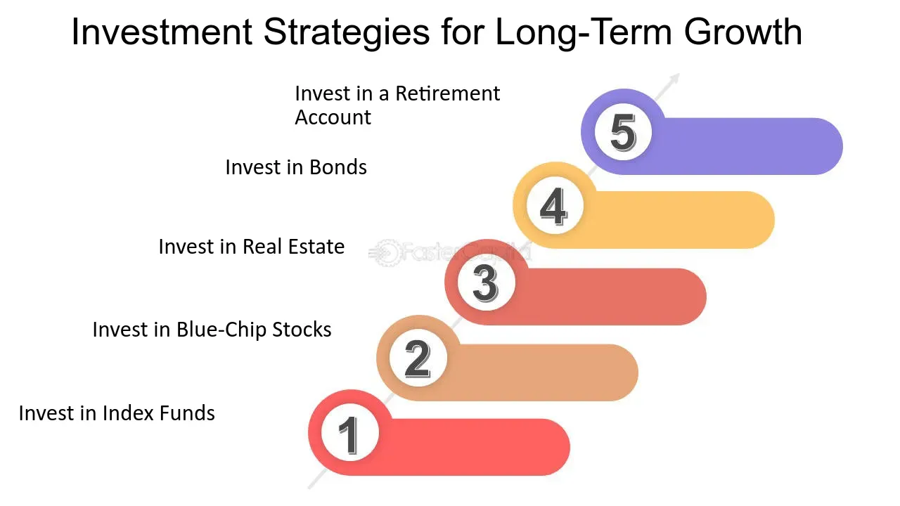

In today's dynamic financial environment, long-term investment strategies are an essential component of sound financial planning and wealth management. As markets swing between periods of volatility and stability, investors seek approaches that offer the promise of growth, stability, and safety over extended periods. Long-term investment strategies aim to mitigate the impacts of market fluctuations by focusing on the bigger picture, allowing investors to capitalize on the potential for asset appreciation and income over time.

One of the cornerstones of these strategies is diversification, which involves spreading investments across various asset classes, geographical regions, and sectors to reduce risk. Similarly, asset allocation is a strategic approach to determine the right mix of investments — from equities and bonds to real estate and commodities — tailored to an investor's risk tolerance, time horizon, and financial goals.



The advent of technology has transformed the investment landscape significantly, particularly with the rise of algorithmic trading. This form of trading uses computer algorithms to execute orders based on predetermined criteria, such as timing, price, or volume, often at speeds and frequencies that human traders cannot match. Algorithmic trading has gained prominence in modern finance due to its ability to enhance trading efficiency, reduce transaction costs, and provide liquidity to the markets.

Combining traditional investment strategies with technological innovations such as algorithmic trading offers a competitive edge. Investors harnessing these tools can benefit from rigorous data analysis, pattern recognition, and real-time market insights, enabling informed decision-making and the timely execution of trades. This blend of conventional wisdom and cutting-edge technology equips investors to better navigate market complexities and improve the probability of achieving their financial objectives.

In conclusion, long-term investment strategies and algorithmic trading complement each other by providing a robust framework for growth and resilience in volatile markets. Embracing a balanced approach allows investors to leverage the strengths of both traditional and modern methodologies, ultimately enhancing their ability to achieve sustained financial success.

## Table of Contents

## The Fundamentals of Long-Term Investment Strategies

Long-term investment strategies play a pivotal role in securing financial growth and stability over time. The adoption of a strategic approach involving diversification and asset allocation is fundamental to mitigate risks and achieve steady returns.

Diversification is the process of spreading investments across various assets, sectors, or geographies to reduce exposure to any single risk. By diversifying a portfolio, an investor can lower the unsystematic risk associated with individual investments, thereby enhancing stability. For example, an investor might diversify by purchasing stocks in different industries, such as technology, healthcare, and consumer goods. As different sectors often respond differently to market events, this approach reduces the potential negative impact of a downturn in any one area.

Asset allocation, closely intertwined with diversification, involves distributing investments among different asset classes, such as stocks, bonds, and cash equivalents. This strategy is dictated by the investor's risk tolerance, investment horizon, and financial goals. A well-balanced allocation can achieve an optimal trade-off between risk and return, ensuring that a portfolio is aligned with an investor's long-term objectives.

Risk management is integral to long-term investing, requiring continuous assessment and adjustment of investment strategies. Effective risk management involves evaluating the potential impacts of various market conditions on a portfolio, thereby enabling investors to take preventative measures to protect their assets. Techniques such as regular portfolio reviews and rebalancing are critical in maintaining an intended asset allocation amidst volatile markets.

Growth stocks, Exchange-Traded Funds (ETFs), and bonds are often at the core of long-term investment portfolios. Growth stocks represent companies expected to increase their earnings at an above-average rate compared to the overall market. While these stocks may not provide immediate dividends, their value can appreciate significantly, offering capital gains over time.

ETFs allow investors to buy a collection of stocks or bonds in a single fund, typically tracking an index. They offer the benefits of diversification and [liquidity](/wiki/liquidity-risk-premium) with generally lower fees than mutual funds, making them an attractive option for long-term investors seeking growth potential.

Bonds, as fixed-income instruments, provide predictable interest payments and principal return at maturity. They are generally considered safer than stocks, although they offer lower returns. Including bonds in a portfolio can provide stability and protect against the [volatility](/wiki/volatility-trading-strategies) of the equity market.

By strategically combining these elements—diversification, asset allocation, risk management, and a mix of more volatile and stable investments like [growth stocks](/wiki/growth-stocks), ETFs, and bonds—investors can construct a robust portfolio designed for steady growth over the long term. Such a structured approach not only mitigates risk but also leverages market opportunities, ultimately supporting the achievement of financial goals.

## Benefits of Long-Term Investing

Long-term investments are frequently less susceptible to market volatility due to their extended time horizons, allowing investors to ride out short-term market fluctuations. This inherent stability is a pivotal advantage, reducing the pressure of reacting to transitory market movements and fostering a focus on enduring growth trends.

A central advantage of long-term investing is the power of compound interest, which Albert Einstein famously dubbed the "eighth wonder of the world." Compounding involves reinvesting earnings, allowing initial capital to generate earnings on both the principal and the accumulated earnings over time. Mathematically, the formula for compound interest is:

$$
A = P \left(1 + \frac{r}{n}\right)^{nt}
$$

where $A$ is the amount of money accumulated after n years, including interest, $P$ is the principal amount, $r$ is the annual interest rate, $n$ is the number of times that interest is compounded per year, and $t$ is the time in years. This exponential growth mechanism can significantly enhance wealth over the long term, assuming a consistent reinvestment and favorable market returns.

Long-term investment strategies are particularly aligned with retirement planning and financial security goals. Such strategies typically focus on a steady accumulation of assets over decades, supporting financial stability in post-retirement years. By adopting a long-term perspective, investors can better achieve goals such as buying a home, funding education, or ensuring a comfortable retirement.

Moreover, aligning investments with long-term goals often involves a disciplined approach, emphasizing asset classes like growth stocks, Exchange-Traded Funds (ETFs), and bonds, which can offer consistent returns. This diversification not only mitigates risk but also aligns portfolios with an individual's risk tolerance and financial aspirations.

Lastly, long-term investors benefit from potential tax advantages, as long-term capital gains are taxed at a lower rate than short-term gains in many jurisdictions, further enhancing the net returns over time. This tax efficiency, combined with reduced transaction costs due to infrequent trading, supports the wealth accumulation capabilities of long-term investing.

## Integrating Algorithmic Trading with Investment Strategies

Algorithmic trading, often abbreviated as algo trading, refers to the use of computer algorithms to automate the process of trading financial instruments. These algorithms are designed to execute trades based on predefined criteria such as timing, price, or quantity, rendering the process much faster and more efficient than manual trading. Algorithmic trading is employed by institutional investors, hedge funds, and large finance houses but has increasingly become available to individual investors through various platforms and software solutions.

Incorporating [algorithmic trading](/wiki/algorithmic-trading) into investment strategies offers several benefits. One of the primary advantages is the enhancement of decision-making with remarkable speed and precision. By leveraging algorithmic systems, traders can analyze vast amounts of data and execute orders at speeds that are unattainable for human traders. Algorithms can process complex strategies involving multiple variables and market conditions instantly, creating opportunities to capitalize on short-lived market inefficiencies.

For example, algorithms can be programmed to respond to market conditions by buying low and selling high, performing these transactions rapidly to take advantage of small price movements in efficiently timed trades. This capability can be particularly advantageous in markets characterized by high volatility where prices can vary substantially in short periods.

Moreover, another benefit of integrating algorithmic trading with traditional investment strategies is consistency. Algorithms operate based on objective, predefined rules, eliminating the emotional and psychological factors that can affect human decision-making. This automated, consistent approach helps in maintaining discipline and adhering to strategies, thereby increasing the probability of sustained, favorable performance in the market.

An additional advantage lies in [backtesting](/wiki/backtesting). Backtesting involves applying an algorithmic trading strategy to historical data to evaluate its viability before deploying it in live markets. This process provides a detailed insight into the potential risks and returns associated with the strategy and allows for optimization and adjustment before actual capital is at risk.

In summary, the integration of algorithmic trading with conventional investment strategies offers a robust blend of speed, precision, and consistency. While human insight and intuition are invaluable, algorithms provide a highly efficient, emotionless, and systematic way to manage investments, ultimately providing a competitive edge in modern financial markets. The combination of these approaches serves to enhance overall investment strategy efficacy, aligning with both short-term trading opportunities and long-term investment goals.

## Popular Algorithmic Trading Strategies

Algorithmic trading has revolutionized the landscape of financial markets by enabling traders to execute strategies with speed and precision. Popular algorithmic trading strategies often incorporate a range of methodologies, including trend-following, [arbitrage](/wiki/arbitrage), index fund rebalancing, mathematical models, and high-frequency trading. Each of these strategies provides unique advantages and applications within financial markets.

Trend-following strategies rely on algorithms to identify and capitalize on asset price movements that demonstrate a consistent direction over time. These strategies involve the use of technical indicators such as moving averages, relative strength index (RSI), and [momentum](/wiki/momentum) oscillators to signal entry and [exit](/wiki/exit-strategy) points. The logic behind trend-following is that assets exhibiting a strong directional trend will likely continue in that direction for a period, allowing traders to profit from sustained market movements.

Arbitrage opportunities arise when there are price discrepancies of the same asset across different markets or financial instruments. Algorithmic trading systems can quickly detect and exploit these inefficiencies, executing simultaneous buy and sell transactions to capture risk-free profits. This strategy requires sophisticated technology and real-time data feeds to ensure that the transactions occur before the market corrects the price differences.

Index fund rebalancing involves adjusting a portfolio to match the composition of a specific index. Algorithms can automate this process efficiently, ensuring that portfolios remain aligned with index weightings. This strategy is crucial for passive index fund managers who aim to replicate index performance with minimal tracking error. Algorithms can process vast amounts of data and execute trades in large volumes, making the rebalancing process seamless and cost-effective.

Mathematical model-based strategies use quantitative models to predict market movements and inform trading decisions. These models can range from simple regression analyses to complex [machine learning](/wiki/machine-learning) algorithms capable of processing vast datasets. Traders employ [statistics](/wiki/bayesian-statistics) and probability to optimize portfolios and forecast market trends. For instance, the Black-Scholes model is frequently used for options pricing within model-based strategies.

High-frequency trading ([HFT](/wiki/high-frequency-trading-strategies)) leverages powerful computing infrastructure to execute a large number of orders at extremely high speeds. HFT strategies thrive on small price discrepancies and market inefficiencies, often completing transactions in fractions of a second. To implement HFT, traders require state-of-the-art technology and access to low-latency data, as speed and efficiency are paramount to profitability.

In Python, implementing a basic moving average crossover strategy, which is a component of trend-following, might look like this:

```python
import pandas as pd
import numpy as np

# Load data
data = pd.read_csv('stock_data.csv')
data['SMA_50'] = data['Close'].rolling(window=50).mean()
data['SMA_200'] = data['Close'].rolling(window=200).mean()

# Generate buy/sell signals
data['Signal'] = np.where(data['SMA_50'] > data['SMA_200'], 1, 0)
data['Position'] = data['Signal'].diff()

# Output buy/sell dates
buy_signals = data[data['Position'] == 1]
sell_signals = data[data['Position'] == -1]

print("Buy Signals:\n", buy_signals)
print("Sell Signals:\n", sell_signals)
```

This code calculates the 50-day and 200-day simple moving averages and creates buy/sell signals based on the crossover strategy. Such implementations demonstrate how algorithmic strategies can be applied programmatically, enhancing decision-making processes through automation.

Algorithmic trading strategies continue to evolve, driven by advancements in technology and financial theory. While offering significant opportunities, they also require a comprehensive understanding of market dynamics, technology infrastructure, and risk management to be effective and sustainable in real-world applications.

## Technical Requirements for Successful Algo Trading

Algorithmic trading relies heavily on a robust technological infrastructure to ensure efficiency and accuracy in executing trades. A well-structured technical setup is crucial for developing, testing, and deploying algorithms in real-time market conditions.

First, high-performance computing systems are essential for algorithmic trading. These systems need to handle large volumes of data and execute trades within milliseconds. The trading platform must have low latency and high throughput capabilities to process transactions swiftly and efficiently.

Coding proficiency is fundamental in algorithmic trading, as algorithms need to be meticulously programmed and customized. Python is often the language of choice due to its simplicity and extensive libraries, such as NumPy for numerical computations and Pandas for data manipulation. For example, a simple trading algorithm might be structured as follows in Python:

```python
import numpy as np
import pandas as pd

def simple_moving_average(prices, window):
    return np.convolve(prices, np.ones(window), 'valid') / window

# Example usage
prices = pd.Series([10, 11, 12, 13, 14, 15, 16, 17, 18, 19, 20])
sma = simple_moving_average(prices, window=3)
print(sma)
```

Real-time market data access is another critical requirement. Algorithms rely on timely and accurate data to make informed decisions, necessitating connections to data providers or exchanges that supply this information with minimal delay. These connections help algorithms respond to market changes as they occur.

Moreover, tools for backtesting are crucial in refining trading strategies before live deployment. Backtesting allows traders to simulate their algorithms on historical data to assess potential performance and risks. Platforms like MetaTrader and software libraries such as PyAlgoTrade provide functionality for backtesting in a simulated environment. A typical backtesting process includes testing an algorithm across various market conditions and refining it based on performance metrics.

Finally, continuous system monitoring and adaptation are necessary to maintain effectiveness. Traders must ensure that all systems are updated and running efficiently, with mechanisms in place to address connectivity issues or data irregularities promptly. This comprehensive approach to infrastructure, coding, data access, backtesting, and monitoring forms the backbone of successful algorithmic trading operations.

## Challenges and Risks in Algorithmic Trading

Algorithmic trading has transformed financial markets by introducing speed and precision into trade execution. However, these innovations also bring a range of risks and challenges that need careful consideration. Understanding these risks is crucial for ensuring successful implementation and management of algorithmic trading strategies.

**Market Impact and Technology Dependence**

Algorithmic trading systems can significantly impact market dynamics due to their ability to execute a large number of trades in a short period. This speed can lead to inadvertent market manipulation, such as triggering price swings by overwhelming the [order book](/wiki/order-book-trading-strategies) with trades. Additionally, algorithms operating on outdated or malfunctioning data can exacerbate market volatility, leading to suboptimal trading decisions.

The dependence on technology is another critical aspect of algorithmic trading, as these systems rely heavily on cutting-edge infrastructure and software. Failure in technology, whether hardware malfunctions or software glitches, can result in substantial financial losses. This dependency necessitates robust systems for redundancy and real-time monitoring to mitigate the potential impact of technological failures.

**Potential Disadvantages: System Failures and Latency Issues**

One of the inherent disadvantages of algorithmic trading is the risk of system failures. These can occur due to various reasons such as software bugs, network outages, or unexpected market conditions that the algorithm is unprepared to handle. Python code used in developing these algorithms must undergo rigorous testing and validation to minimize the risk of such failures. For instance, a typical backtesting process might include:

```python
def backtest_strategy(strategy, historical_data):
    results = []
    for data in historical_data:
        try:
            results.append(strategy.execute(data))
        except Exception as e:
            print(f"Error in strategy execution: {e}")
    return results
```

Latency, the delay between the time a trading signal is generated and when it is executed, is another significant challenge. High-frequency trading strategies, which heavily depend on minimal latency, can suffer adverse outcomes if there is even a slight delay in execution. This necessitates the use of high-speed, low-latency trading platforms and direct market access to reduce the time from signal generation to trade execution.

**Regulatory Oversight and Ethical Considerations**

With the rise of algorithmic trading, regulatory bodies have increased their scrutiny to maintain fair and orderly markets. Traders must comply with regulations that prevent manipulative practices and ensure market integrity. This involves adhering to guidelines for fair trading and transparency standards set by financial authorities. Regulatory compliance adds an additional layer of complexity as traders must continuously update their algorithms to remain compliant with evolving laws.

Ethical considerations also play a pivotal role in algorithmic trading. Traders must ensure that their algorithms do not engage in practices such as spoofing, where large orders are placed with the intention of canceling them before execution, misleading other market participants regarding the true supply and demand dynamics.

In summary, while algorithmic trading offers enhanced speed and efficiency, it is not without its challenges and risks. Traders must be vigilant about technological dependencies, potential system failures, latency issues, and regulatory compliance. Ethical trading practices and robust systems can mitigate these risks, ensuring the sustainable success of algorithmic trading strategies.

## Conclusion

In today's rapidly evolving financial landscape, striking a balance between long-term investment strategies and algorithmic trading is crucial for maximizing returns and ensuring financial security. Long-term investment strategies such as diversification, asset allocation, and the focus on growth stocks, ETFs, and bonds provide a solid foundation for investors seeking steady growth and stability. These traditional approaches emphasize the importance of risk management and the powerful effect of compound interest over time, aligning closely with retirement planning and financial security.

Algorithmic trading, on the other hand, represents a technological innovation that enhances investment strategies by introducing speed and precision to decision-making processes. By leveraging algorithms, investors can automate complex trading decisions, capitalize on market inefficiencies, and manage large volumes of data with unprecedented accuracy. The capability of algorithms to analyze real-time market data and execute trades swiftly offers a competitive advantage, especially in volatile markets.

The integration of these traditional and modern strategies allows investors to harness the benefits of both worlds—a robust framework provided by long-term investing combined with the agility and precision of algorithmic trading. This synergy not only augments the potential for higher returns but also mitigates risks associated with short-term market fluctuations.

As investors leverage these tools, it is essential to remain informed and adaptable. Staying updated with the latest advancements in financial technology and market trends enables investors to refine their strategies continuously. Embracing new developments and maintaining a proactive learning mindset will be key to navigating the complexities of modern finance and capitalizing on opportunities for wealth accumulation.

In conclusion, a balanced approach that effectively integrates long-term investment strategies with algorithmic trading can significantly enhance an investor's ability to achieve financial goals. By utilizing modern tools and maintaining an adaptable stance, investors can position themselves advantageously in a dynamic market environment.

## References & Further Reading

[1]: Bergstra, J., Bardenet, R., Bengio, Y., & Kégl, B. (2011). ["Algorithms for Hyper-Parameter Optimization."](https://papers.nips.cc/paper/4443-algorithms-for-hyper-parameter-optimization) Advances in Neural Information Processing Systems 24.

[2]: ["Advances in Financial Machine Learning"](https://www.amazon.com/Advances-Financial-Machine-Learning-Marcos/dp/1119482089) by Marcos Lopez de Prado

[3]: ["Evidence-Based Technical Analysis: Applying the Scientific Method and Statistical Inference to Trading Signals"](https://www.amazon.com/Evidence-Based-Technical-Analysis-Scientific-Statistical/dp/0470008741) by David Aronson

[4]: ["Machine Learning for Algorithmic Trading"](https://github.com/stefan-jansen/machine-learning-for-trading) by Stefan Jansen

[5]: ["Quantitative Trading: How to Build Your Own Algorithmic Trading Business"](https://www.amazon.com/Quantitative-Trading-Build-Algorithmic-Business/dp/1119800064) by Ernest P. Chan