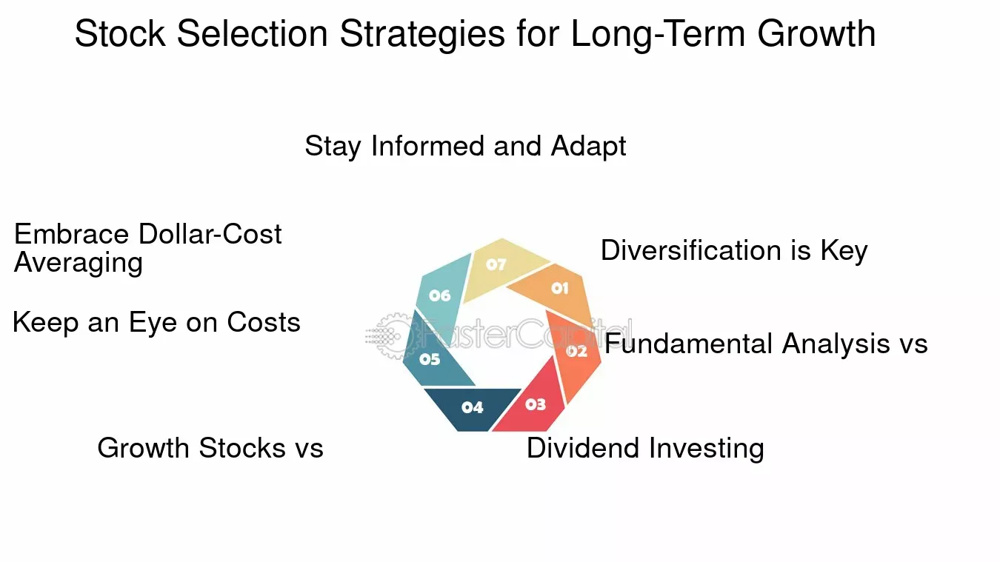

## Table of Contents

## What are the basic principles of long-term stock investing?

Long-term stock investing is about buying stocks and holding onto them for many years. The main idea is to invest in good companies that will grow over time. This way, the value of your stocks can increase a lot. It's important to be patient and not worry too much about short-term ups and downs in the stock market. Instead, focus on how the company is doing in the long run.

Another key principle is diversification. This means spreading your money across different types of stocks and industries. By doing this, you reduce the risk of losing a lot of money if one company or industry does poorly. It's also helpful to keep learning about the companies you invest in and the overall economy. This can help you make better decisions and stick to your long-term plan, even when the market is going through tough times.

## How can a beginner start selecting stocks for long-term investment?

To start selecting stocks for long-term investment, a beginner should first focus on understanding their own financial goals and how much risk they are willing to take. It's important to decide if you want to grow your money slowly and steadily, or if you're okay with more ups and downs for the chance of bigger gains. Once you know what you're aiming for, you can start looking at different companies. A good place to begin is by researching well-known companies that you use or hear about often. These could be big names in technology, healthcare, or consumer goods. 

Next, you'll want to learn about the company's financial health. Look at things like their earnings, how much debt they have, and how they're growing. Websites like Yahoo Finance or the company's own investor relations page can give you this information. It's also helpful to read news articles and analyst reports to get a sense of what experts think about the company's future. When choosing stocks, think about diversifying your investments. This means picking stocks from different industries so that if one sector struggles, your whole portfolio isn't affected. By taking these steps, a beginner can start building a solid long-term investment strategy.

## What are the key financial metrics to look at when evaluating a stock for long-term holding?

When you're thinking about holding a stock for a long time, there are some important financial numbers you should look at. One key thing is the company's earnings. You want to see if the company is making more money each year. This is called earnings growth. Another thing to check is the price-to-earnings ratio, or P/E ratio. This tells you if the stock is priced fairly compared to how much money the company makes. A lower P/E ratio might mean the stock is a good deal, but you also need to think about why it's low. It could be because people think the company won't do well in the future.

Another important metric is the company's debt. You want to know how much debt the company has compared to its earnings. This is called the debt-to-equity ratio. A high debt-to-equity ratio might mean the company is risky because it has to pay back a lot of money. You should also look at the company's return on equity (ROE). This tells you how well the company is using the money its shareholders have invested to make more money. A higher ROE is usually a good sign. By looking at these numbers, you can get a better idea of whether a company is a good choice for long-term investing.

## How important is diversification in a long-term stock investment strategy?

Diversification is really important in a long-term stock investment strategy. It means spreading your money across different types of stocks and industries. This helps you lower the risk of losing a lot of money if one company or industry does badly. Imagine if you put all your money into one company and that company has a big problem. You could lose a lot. But if you spread your money around, even if one company does poorly, the others might do well and balance things out.

By diversifying, you're not putting all your eggs in one basket. This makes your investments more stable over the long run. It's like having a safety net. If the tech industry has a bad year, but the healthcare industry does well, your overall investment won't suffer as much. So, diversification helps you stay calm and stick to your long-term plan, even when the market goes through ups and downs.

## What role does sector analysis play in long-term stock selection?

Sector analysis is really important when you're picking stocks to hold for a long time. It means looking at different parts of the economy, like technology, healthcare, or energy, to see which ones are doing well and which ones might do well in the future. By understanding how different sectors are doing, you can pick stocks from sectors that are growing or are expected to grow. This can help your investments grow over time. For example, if you think technology will keep growing because more people are using smartphones and computers, you might want to invest in tech companies.

Also, sector analysis helps you spread your money around in a smart way. If you only invest in one sector and something bad happens to that sector, like new laws or a big drop in demand, your investments could lose a lot of value. But if you have stocks in different sectors, a problem in one sector won't hurt your whole investment plan. This is called diversification, and it's a key part of long-term investing. By looking at sectors, you can make sure your investments are balanced and less risky over the long run.

## How can an investor use economic indicators to guide long-term stock selections?

Economic indicators are important tools for investors looking to make long-term stock selections. These indicators give you a big picture of how the economy is doing. For example, if you see that the unemployment rate is going down and people are earning more money, it might mean that people will spend more. This can be good for companies that sell things to consumers, like retail or restaurant businesses. So, you might want to think about investing in stocks from these sectors. On the other hand, if interest rates are going up, it might be harder for companies to borrow money to grow, which could slow down their growth. This kind of information helps you pick stocks that will do well over many years.

Another important economic indicator is inflation. If inflation is high, the value of money goes down, and this can affect how much companies can charge for their products. If inflation is low and steady, it's usually good for the economy because it means prices are stable. You can also look at the Gross Domestic Product (GDP) to see if the overall economy is growing. If GDP is growing, it's a sign that businesses are doing well, and this can be a good time to invest in stocks. By keeping an eye on these economic indicators, you can make smarter choices about which stocks to buy and hold for the long term.

## What are some common pitfalls to avoid in long-term stock investing?

One common pitfall to avoid in long-term stock investing is getting too caught up in short-term market changes. It's easy to feel worried when the stock market goes up and down a lot, but if you're investing for the long term, you need to look at the bigger picture. Don't sell your stocks just because they drop a bit. Instead, think about how the company will do over many years. Another mistake is not diversifying your investments. If you put all your money into just one or two stocks, you're taking a big risk. If those companies do badly, you could lose a lot of money. It's better to spread your money across different stocks and industries to lower your risk.

Another pitfall is not doing enough research before you buy a stock. It's important to understand the company's financial health, like how much money it's making and how much debt it has. If you don't know these things, you might end up buying stocks in companies that aren't doing well. Also, be careful of chasing after the latest hot stock or trend without really understanding it. Just because everyone is talking about a certain stock doesn't mean it's a good long-term investment. Stick to your plan and make decisions based on solid research, not just what's popular at the moment.

## How can advanced investors utilize technical analysis for long-term stock picks?

Advanced investors can use technical analysis to help pick stocks for the long term by looking at charts and patterns to see how a stock has moved in the past. They might look for trends that show a stock's price going up over a long time. For example, if a stock keeps making higher highs and higher lows over many months or years, it could be a sign that the stock is in a strong uptrend. This can give investors more confidence that the stock might keep going up in the future. They might also use tools like moving averages, which smooth out price changes and help show the overall direction of the stock's price. If the stock's price stays above its long-term moving average, it might be a good sign for long-term investors.

Another way advanced investors use technical analysis is by looking at support and resistance levels. These are price levels where the stock has had trouble moving past before. If a stock keeps bouncing off a certain support level, it might be a good time to buy because that level seems strong. On the other hand, if a stock can't break through a resistance level, it might be a sign to wait before buying. By combining these technical signals with their research on the company's fundamentals, advanced investors can make more informed decisions about which stocks to hold for the long term. This helps them find stocks that not only look good on paper but also show strong price action over time.

## What are the benefits and drawbacks of focusing on dividend stocks for long-term investment?

Focusing on dividend stocks for long-term investment has some good points. One big benefit is that dividend stocks give you regular money, called dividends, which you can use or reinvest to buy more stocks. This can help your investment grow over time. Also, companies that pay dividends are often well-established and financially stable, which can make them less risky than other stocks. This can give you peace of mind, knowing that your investment is in a strong company. Another good thing is that dividend stocks can help protect your money from inflation. As prices go up, the dividends you get can also go up, keeping your income strong.

However, there are also some drawbacks to think about. One problem is that dividend stocks might not grow as fast as other stocks. If you're looking for big gains over time, you might find that dividend stocks don't increase in value as quickly as growth stocks. Also, not all dividends are safe. Sometimes, a company might cut its dividend if it's not doing well, which can hurt your income and the value of your stock. So, it's important to do your homework and pick companies that have a good history of paying steady dividends. By understanding both the benefits and the risks, you can decide if dividend stocks are right for your long-term investment plan.

## How can global market trends influence long-term stock selection strategies?

Global market trends can have a big impact on which stocks you pick for the long term. If you see that the world is moving towards using more green energy, like solar or wind power, you might want to invest in companies that are part of this trend. These companies could grow a lot in the future as more people and countries switch to clean energy. Also, if you notice that a lot of people around the world are buying more things online, you might think about investing in e-commerce companies. These global trends can help you find stocks that will do well over many years.

On the other hand, global market trends can also make some stocks less attractive for long-term investing. For example, if you see that countries are starting to use less oil and more electric cars, oil companies might not be the best choice for the long term. Their business might shrink as the world changes. So, it's important to keep an eye on what's happening around the world and think about how these changes could affect different industries and companies. By understanding global trends, you can make smarter choices about where to put your money for the long run.

## What advanced valuation models should an expert investor consider for long-term stock analysis?

Expert investors often use advanced valuation models like the Discounted Cash Flow (DCF) model to analyze stocks for the long term. The DCF model looks at how much money a company is expected to make in the future and then figures out what that money is worth today. This helps investors see if a stock is priced right based on the company's future earnings. To use the DCF model, you need to guess how fast the company will grow, how much money it will make each year, and what interest rate to use to bring those future earnings back to today's value. It's a bit tricky because you're making guesses about the future, but it can give you a good idea of whether a stock is a good buy for the long term.

Another advanced model that experts might use is the Residual Income Model (RIM). This model looks at the extra money a company makes after it pays for its costs and what it needs to keep the business running. The idea is that this extra money, or residual income, belongs to the shareholders. By figuring out how much residual income a company will make in the future and then discounting it back to today, investors can see if the stock's price makes sense. Both the DCF and RIM models need a lot of detailed information and some guesswork about the future, but they can help expert investors make smart choices about which stocks to hold for a long time.

## How can an investor assess the sustainability and growth potential of a company for long-term investment?

To assess the sustainability and growth potential of a company for long-term investment, an investor should start by looking at the company's financial health. This means checking the company's earnings to see if they are growing over time. A company that consistently makes more money each year is likely to be sustainable and have good growth potential. It's also important to look at the company's debt. If a company has too much debt, it might struggle to pay it back, which can hurt its long-term growth. By examining the company's financial statements, like the income statement and balance sheet, an investor can get a clear picture of its financial stability and potential for future growth.

Another way to assess a company's sustainability and growth potential is by understanding its business model and the industry it operates in. A company with a strong, unique business model that gives it an advantage over competitors is more likely to do well in the long run. For example, if a company has a product or service that people need and can't easily get elsewhere, it has a good chance of growing. Additionally, looking at industry trends can help. If the industry is growing and the company is a leader in that industry, it's a good sign for long-term investment. By combining financial analysis with an understanding of the company's business and industry, an investor can make a smart choice about whether a company is a good long-term investment.

## What is the key to understanding long-term stock investment?

Long-term stock investment involves acquiring shares in companies anticipated to deliver strong performances over several years. This approach necessitates patience and discipline, critical traits for weathering the inevitable ups and downs of market cycles. Investors who commit to long-term strategies often reap benefits from reduced transaction costs, capital appreciation through compound growth, and minimized impacts from short-term market volatility.

Patience in long-term investing relies on the understanding that markets can fluctuate based on economic events, company earnings reports, and geopolitical developments. Investors must maintain their focus on the future potential of their chosen companies, rather than being swayed by short-term market movements. Discipline is similarly essential; adhering to an investment strategy regardless of market sentiments ensures that decisions are made logically rather than emotionally.

Long-term investments afford the opportunity to leverage compound growth, a phenomenon where the value of an investment grows because earnings generated are reinvested over time. This is mathematically expressed as:

$$
A = P \left(1 + \frac{r}{n}\right)^{nt}
$$

where:
- $A$ is the amount of money accumulated after n years, including interest.
- $P$ is the principal investment amount.
- $r$ is the annual interest rate (in decimal form).
- $n$ is the number of times that interest is compounded per year.
- $t$ is the number of years the money is invested for.

By reinvesting earnings, investors can exponentially increase their portfolio's value over the years, enabling them to achieve significant financial growth. Furthermore, long-term strategies minimize transaction costs, as frequent trading incurs additional fees and taxes that erode investment returns.

Finally, focusing on long-term horizons helps investors bypass the detrimental effects of short-term market [volatility](/wiki/volatility-trading-strategies)—a common psychological pitfall known as myopic loss aversion. This term describes the tendency of investors to react negatively to short-term losses, leading to irrational decision-making. By concentrating on long-term goals, investors can maintain a more stable and resilient investment trajectory, thus enhancing the potential for substantial yields over time.

## What is the Role of Fundamental Analysis?

Fundamental analysis is a critical component of evaluating a company's long-term potential by examining its financial health and market position. This approach involves studying various financial metrics and qualitative factors to determine the intrinsic value of a stock. One of the primary objectives is to avoid value traps—stocks that appear undervalued based on certain metrics but have underlying issues that hinder growth—and to identify genuinely undervalued stocks with strong growth prospects.

Key indicators in [fundamental analysis](/wiki/fundamental-analysis) include dividend consistency, price-to-earnings (P/E) ratios, and earnings stability. Dividend consistency reflects a company's ability to generate steady income, signaling financial stability. Companies with a long history of paying consistent or growing dividends are often viewed as reliable investments, as dividends indicate management's confidence in the company's future earnings capacity.

The P/E ratio is a widely used tool to determine whether a stock is overvalued or undervalued relative to its earnings. It is calculated by dividing the company's current share price by its earnings per share (EPS):

$$
\text{P/E Ratio} = \frac{\text{Market Price per Share}}{\text{Earnings per Share}}
$$

A high P/E ratio may suggest that the stock is overvalued, or investors expect high growth rates in the future. Conversely, a low P/E ratio may indicate that the stock is undervalued or that the company faces potential risks. However, comparing P/E ratios across similar companies within the same industry provides better context regarding valuation.

Earnings stability is another significant element, as it reflects a company's capacity to maintain or grow its earnings over time. Analyzing yearly or quarterly earnings reports helps investors assess the company's profitability and growth trajectory. Steady and predictable earnings also provide a cushion against market volatility, making the company a more attractive long-term investment.

In addition to these quantitative measures, qualitative analysis is essential in understanding a company's fundamentals. This includes evaluating the company's competitive position, management quality, industry trends, and economic conditions. A comprehensive assessment of both quantitative and qualitative factors enables investors to make informed decisions regarding a company's long-term potential.

By meticulously analyzing a company's financial health and market positioning, fundamental analysis aids investors in identifying genuinely undervalued stocks with solid growth prospects, thereby optimizing their stock selection and investment strategy.

## What are the fundamental factors for stock valuation?

Dividend consistency is a critical [factor](/wiki/factor-investing) when evaluating the fundamental strength of a stock for long-term investment. Consistent dividends often indicate a company's solid financial health and the predictability of its cash flows. This is particularly important for investors seeking regular income and those valuing stability in their investment portfolios. Companies with a history of stable or increasing dividends are generally viewed as less risky because they demonstrate a reliable cash management strategy and commitment to returning value to shareholders.

The Price-to-Earnings (P/E) ratio serves as a vital tool in determining whether a stock is overvalued or undervalued compared to other stocks and the general market. The P/E ratio is calculated as follows:

$$
\text{P/E Ratio} = \frac{\text{Market Value per Share}}{\text{Earnings per Share (EPS)}}
$$

A high P/E ratio may suggest that investors expect high growth rates in the future, while a low P/E might indicate that the stock is undervalued or that the company is experiencing difficulties. However, it is crucial to consider the P/E ratio within the context of the industry average and the company's own historical P/E trends.

Earnings fluctuations also offer significant insights into a company's growth trajectory and financial resilience. By analyzing year-over-year and quarter-over-quarter earnings, investors can assess a company’s capability to generate profit under varying economic conditions. Consistent earnings growth tends to be a positive indicator of a company's robust business model and its ability to adapt to changing market dynamics. Conversely, irregular earnings might reveal instability or challenges within the company.

In summary, when selecting stocks for long-term investment, examining fundamental factors such as dividend consistency, the P/E ratio, and earnings fluctuations provide a comprehensive understanding of a company's potential for sustained performance and resilience in the face of economic shifts.

## References & Further Reading

[1]: ["Advances in Financial Machine Learning"](https://www.amazon.com/Advances-Financial-Machine-Learning-Marcos/dp/1119482089) by Marcos Lopez de Prado

[2]: ["Evidence-Based Technical Analysis: Applying the Scientific Method and Statistical Inference to Trading Signals"](https://www.amazon.com/Evidence-Based-Technical-Analysis-Scientific-Statistical/dp/0470008741) by David Aronson

[3]: ["Machine Learning for Algorithmic Trading"](https://github.com/stefan-jansen/machine-learning-for-trading) by Stefan Jansen

[4]: ["Quantitative Trading: How to Build Your Own Algorithmic Trading Business"](https://www.amazon.com/Quantitative-Trading-Build-Algorithmic-Business/dp/1119800064) by Ernest P. Chan

[5]: Krishnamurthy, A., & Vissing-Jorgensen, A. (2012). ["The Aggregate Demand for Treasury Debt."](https://home.treasury.gov/system/files/276/2011-session-4-vissing-tsy-demand-PAPER.pdf) Journal of Political Economy, 120(2). 

[6]: Pedersen, L. H. (2015). ["Efficiently Inefficient: How Smart Money Invests and Market Prices Are Determined."](https://press.princeton.edu/books/hardcover/9780691166193/efficiently-inefficient) Princeton University Press.