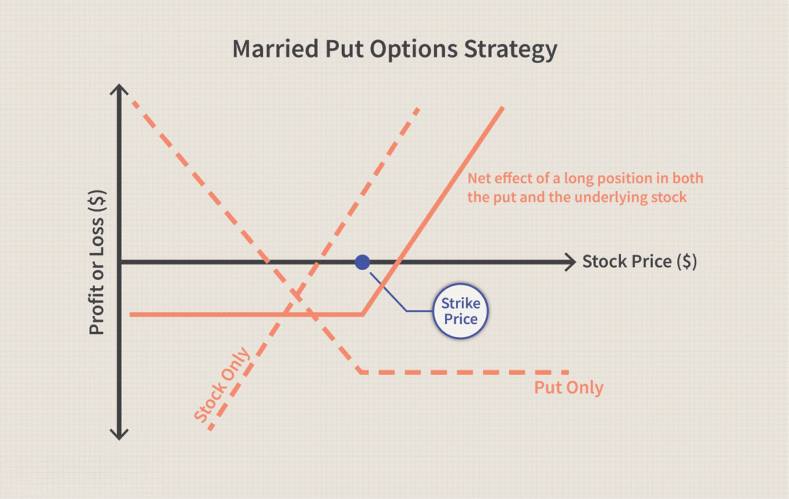

Understanding investment strategies, risk management, and financial losses is essential for investors navigating today's intricate financial markets. The increasing complexity of these markets requires a sophisticated approach to planning and execution, as investors deal with a multitude of factors such as market volatility, economic indicators, and global trends. These elements are crucial when formulating investment strategies that align with individual or institutional financial goals.

With the rapid technological advancements in recent years, algorithmic trading (algo trading) has emerged as a significant technological innovation. Algo trading allows for the execution of trades at speeds and frequencies that are beyond human capability, providing both opportunities and challenges. This technology can optimize trade efficiency, accuracy, and timing, offering potential advantages such as cost reductions and improved market liquidity. However, it also introduces new risks, including technical failures and market anomalies due to erroneous algorithms.



This article explores the main elements of effective investment strategies and examines how they intersect with risk management practices. Effective risk management is critical in mitigating financial losses and maximizing investment returns. It involves both quantitative and qualitative analyses to identify, assess, and prioritize risks, allowing investors to make informed decisions. As algo trading continues to evolve, it plays an influential role in modern investment strategies, contributing to both risk reduction and the potential for financial loss.

By providing a comprehensive overview of these topics, this article seeks to equip both individual and institutional investors with valuable insights that can enhance their understanding of today's financial markets and assist in making informed investment decisions. Through the integration of traditional strategies and modern technology, investors can develop a robust framework that effectively manages risk and capitalizes on market opportunities.

## Table of Contents

## Overview of Investment Strategies

Investment strategies are essential methodologies that investors use to achieve specific financial goals. These strategies are not one-size-fits-all; they are influenced by factors such as market conditions, economic indicators, and an individual’s risk tolerance. The primary types of investment strategies include value investing, growth investing, income investing, and index investing, each with distinct risk and return profiles suited to varying investor preferences.

**Value Investing** involves selecting stocks that appear to be undervalued in the market based on fundamental analysis. Investors using this strategy typically look for companies with strong balance sheets, stable earnings, and low price-to-earnings (P/E) ratios. The goal is to capitalize on market inefficiencies by purchasing stocks at reduced prices and selling them when their value is realized by the market. This approach aligns with long-term investment horizons and requires patience, as undervalued stocks may take time to appreciate.

**Growth Investing**, conversely, focuses on companies expected to grow at rates higher than the industry average. These companies often reinvest their earnings to fuel expansion rather than distributing them as dividends. Growth investors are less concerned with the current price of stocks or their valuation metrics as they anticipate substantial future earnings. This strategy carries higher risk due to its reliance on projections and market sentiment, yet it also offers considerable potential for significant returns.

**Income Investing** targets securities that provide regular income through dividends or interest payments. This strategy typically involves investing in bonds, dividend-yielding stocks, and real estate investment trusts (REITs), making it appealing for investors seeking stable, predictable returns with lower risk. While the growth potential in capital is limited compared to other strategies, income investing is popular among retirees and those requiring current cash flow.

**Index Investing** involves replicating the performance of a specific index, such as the S&P 500, by purchasing the same securities in equivalent proportions. This passive strategy benefits from diversification and reduced management costs, leading to moderate risk and steady returns. Index investors aim to match market returns, accepting that they may not outperform the market but also experience lower volatility.

Market conditions, news releases, and economic indicators significantly impact investment strategy selection. For example, in a bull market, growth investing may be more favorable due to heightened market optimism and economic expansion. Conversely, during downturns, value investing or income strategies may provide more attractive risk-adjusted returns as investors gravitate towards stability and undervalued opportunities.

Individual risk tolerance also plays a critical role in choosing an investment strategy. Risk-averse investors often prefer income or index investing, which are associated with lower [volatility](/wiki/volatility-trading-strategies). In contrast, those willing to accept higher risk in pursuit of greater returns might opt for growth investing. An understanding of these strategies and their attributes allows investors to choose methodologies aligned with their financial objectives and market perspectives, optimizing their investment outcomes.

## The Importance of Risk Management in Investing

Risk management is a critical aspect of investing that involves identifying, assessing, and prioritizing various financial risks. The primary purpose of risk management is to protect investors from potential financial losses while maximizing returns. Investors employ various strategies, each tailored to handle risks differently, and the effectiveness of these strategies significantly impacts the financial outcomes.

**Diversification** involves spreading investments across different asset classes, sectors, or geographies to reduce exposure to any single source of risk. By holding a diverse set of securities, investors can dampen the impact of poor performance from any one investment. This technique is grounded in the principle that a well-diversified portfolio reduces unsystematic risk, which is the risk inherent to a specific company or industry. The modern portfolio theory supports diversification, suggesting that the overall risk of a portfolio is lower than the weighted average risk of its individual assets.

**Asset allocation** refers to the strategic division of an investment portfolio among different asset categories, such as stocks, bonds, and cash. The allocation depends on the investor’s risk tolerance, investment goals, and time horizon. A diversified asset allocation can protect investors from volatility in a specific sector or asset class, potentially smoothing returns over time. One common method used to determine appropriate asset allocation is the mean-variance optimization, which aims to find the mix of investments that provides the maximum expected return for a given level of risk.

Formula for portfolio variance ($\sigma_p^2$) in a two-asset portfolio can be expressed as:

$$
\sigma_p^2 = w_1^2 \sigma_1^2 + w_2^2 \sigma_2^2 + 2w_1w_2\sigma_1\sigma_2\rho_{1,2}
$$

where:
- $w_1, w_2$ are the weights of the two assets,
- $\sigma_1, \sigma_2$ are the standard deviations of the two assets,
- $\rho_{1,2}$ is the correlation coefficient between the returns of the two assets.

**The use of derivatives** involves financial instruments like options, futures, and swaps to hedge against potential losses. Derivatives can provide insurance against market volatility by allowing investors to lock in prices or hedge positions, thus reducing exposure to price fluctuations. For instance, options can serve as a hedge by providing the right, but not the obligation, to buy or sell an asset at a predetermined price, potentially limiting losses in volatile markets.

Investors should continually assess market trends and their personal circumstances to adjust their risk management strategies. This involves staying informed about economic indicators, market conditions, and global events that could affect investment valuations. Risk management is not a one-time task but a continuous process that requires regular review and adjustment based on changing circumstances. By actively managing risk, investors can better navigate uncertainties and capitalize on opportunities within financial markets.

## Understanding Financial Losses

Financial losses in investing are an inevitable aspect of participating in financial markets. These losses can result from a multitude of factors including market fluctuations, poor decision-making, and unforeseen events. Market fluctuations often manifest through price volatility and economic cycles, which may negatively impact asset values. Economic indicators, such as interest rates and inflation, can significantly influence asset performance and contribute to financial losses.

Understanding the causes of financial losses provides a foundation for developing strategies to prevent or mitigate them. Loss aversion, a concept in behavioral finance, is the tendency of individuals to prefer avoiding losses rather than acquiring equivalent gains. This psychological bias can lead to suboptimal decision-making, where investors might hold onto losing investments in the hope of a rebound, thereby exacerbating losses.

Behavioral biases also play a crucial role in financial decision-making. Emotional investing, driven by fear or greed, can lead to reactive decisions that deviate from rational analysis. For example, during a market downturn, fear may cause investors to sell assets prematurely, crystallizing losses rather than riding out the volatility.

A systematic approach to investing can help manage and potentially reduce financial losses. Developing a well-researched investment plan and adhering to it can provide a clear framework for decision-making, reducing the influence of emotions and biases. Learning from past mistakes is also vital. Investors should regularly review their portfolios and reflect on previous investment outcomes to identify areas for improvement.

For investors seeking to implement systematic strategies, programming can offer insightful data analysis and decision-making tools. For example, using Python's data analysis libraries, investors can calculate the historical volatility of a stock, which is a measure of how much the stock price fluctuates over a period.

```python
import numpy as np
import pandas as pd

# Sample historical stock price data
data = {
    'Date': pd.date_range(start='2022-01-01', periods=5, freq='B'),
    'Price': [100, 102, 105, 103, 98]
}
df = pd.DataFrame(data)
df['Returns'] = df['Price'].pct_change()

# Calculate annualized volatility
volatility = np.std(df['Returns'].dropna()) * np.sqrt(252)  # Assuming 252 trading days in a year
print(f"Annualized Volatility: {volatility:.2%}")
```

By systematically evaluating risk and employing corrective measures, investors can navigate the complexities of financial markets and work towards minimizing financial losses. This approach not only focuses on preventing losses but also emphasizes the importance of learning and adapting to ever-changing market dynamics.

## Algo Trading: A New Dimension in Investment Strategy

Algorithmic trading, commonly referred to as algo trading, leverages computer algorithms to execute trades with precision and speed beyond human capabilities. By automating trading decisions, algo trading seeks to optimize trade execution and reduce human error. It is prominently used in various strategies, such as high-frequency trading, [market making](/wiki/market-making), and statistical [arbitrage](/wiki/arbitrage).

The effectiveness of algo trading stems from its ability to analyze vast datasets in real-time, allowing traders to swiftly identify arbitrage opportunities that might be fleeting. For example, algorithms can detect price discrepancies between different markets or assets faster than human analysis would allow, enabling timely exploitation of these opportunities.

Despite its advantages, algo trading introduces an array of risks. Technological failures, such as software bugs or hardware malfunctions, can lead to significant financial losses. Additionally, algorithms may cause or exacerbate market volatility during times of instability, as seen in episodes like the "Flash Crash" of May 6, 2010, when the Dow Jones Industrial Average experienced a rapid and severe drop due to automated trading systems [1].

Investors engaging in algo trading must possess a comprehensive understanding of the algorithms' design, including their logic, limitations, and potential market impacts. Clear knowledge of how an algorithm functions is crucial, as unexpected behavior could result in unintended trades and financial exposure. Furthermore, ensuring robust risk management frameworks and implementing fail-safes, such as circuit breakers, can mitigate potential adverse outcomes.

Algo trading also demands a robust infrastructure, including low-latency network connections and powerful computational resources. Collaborating with technology specialists to develop and maintain these systems is essential for successful deployment.

Ultimately, while algo trading offers a transformative approach to investment strategies, it requires diligent oversight and continuous adaptation to technological advancements. By balancing automated algorithms with traditional financial insight, investors can capitalize on the benefits of algo trading while safeguarding against its inherent risks.

References:
[1] Budish, E., Cramton, P., & Shim, J. (2015). "The High-Frequency Trading Arms Race: Frequent Batch Auctions as a Market Design Response." *The Quarterly Journal of Economics*, 130(4), 1547-1627.

## Risk Management in the Era of Algo Trading

Algorithmic trading (algo trading) has revolutionized how financial markets operate, offering enhanced speed and precision in executing trades. However, the rapid pace and complexity inherent in algo trading demand sophisticated risk management tools and techniques to mitigate risks effectively.

**Continuous Monitoring and Stress Testing**

Continuous monitoring of algorithms is crucial for identifying potential anomalies in trading activities. Real-time data feeds and analytics tools provide insights into market dynamics and ensure that the algorithms function as intended. Stress testing, on the other hand, evaluates the performance of trading systems under extreme market conditions to anticipate how they might behave during high volatility or unexpected events.

Stress tests can simulate various scenarios, such as sudden market crashes or [liquidity](/wiki/liquidity-risk-premium) shortages, helping to uncover vulnerabilities. By identifying weak points within trading systems, investors can implement necessary adjustments to strengthen their overall risk management framework.

**Implementing Circuit Breakers**

Circuit breakers act as an essential risk management tool by temporarily halting trading in response to significant market movements. These mechanisms prevent panic-driven trading and allow time for human intervention if necessary. They can be pre-programmed to trigger based on predefined thresholds or sudden deviations from expected patterns in market data, thus reducing the risk of cascading failures in financial systems.

In practice, circuit breakers work by pausing trading activity once certain criteria are met, providing a cooling-off period for market participants. This pause helps maintain market stability and protects investors from excessive financial losses driven by erroneous trading activities.

**Transparency and Oversight**

Maintaining transparency and clear oversight of algorithmic activities is vital. Investors must ensure that the models they deploy are thoroughly tested and validated before implementation. Regular audits and compliance checks can help identify discrepancies between predicted and actual outcomes, ensuring that algorithms align with the intended investment strategy.

Documentation of algorithm logic and decision-making processes is also essential. By maintaining detailed records, investors can verify the activities of algorithms and make adjustments to strategies as needed. This approach promotes accountability and enhances trust among stakeholders involved in the algo trading environment.

**Collaborating with Technology Experts**

The complexity of algo trading necessitates collaboration with technology experts to ensure both security and efficiency. These experts can help design robust trading systems, integrate advanced data analytics, and implement cutting-edge cybersecurity measures to protect sensitive trading data.

Such collaborations can also facilitate the development of adaptive algorithms that learn from historical data and adjust automatically to evolving market conditions. This adaptability is crucial in maintaining a competitive edge while minimizing risks associated with unforeseen market shifts.

In summary, the effective management of risks in the era of [algorithmic trading](/wiki/algorithmic-trading) requires a multi-faceted approach involving continuous monitoring, stress testing, circuit breakers, transparency, and collaboration with technology experts. By integrating these strategies, investors can enhance the security and performance of their trading systems, ultimately safeguarding their investments against potential losses.

## Mitigating Financial Losses Through Diversification and Technology

Diversification remains a fundamental principle of risk management, reducing exposure to individual asset risks by spreading investments across various asset classes, sectors, and geographies. By diversifying their portfolios, investors can mitigate potential financial losses and ensure more stable returns over the long term. The principle of diversification is rooted in Modern Portfolio Theory, which suggests that a well-diversified portfolio can achieve optimal returns for a given level of risk.

Technology is increasingly playing a crucial role in enhancing diversification strategies. Advanced tools such as [artificial intelligence](/wiki/ai-artificial-intelligence) (AI) and big data analytics provide valuable insights that were previously inaccessible to investors. These technologies can process vast amounts of data quickly, uncovering trends and identifying hidden risks that could impact decision-making.

For instance, [machine learning](/wiki/machine-learning) algorithms can analyze historical market data to identify patterns that might signify future movements. This allows for data-driven predictions and more informed investment decisions. Python, widely used in financial analytics, provides powerful libraries such as NumPy and pandas for data analysis, making it easier to implement strategies based on algorithmic insights.

```python
import pandas as pd
import numpy as np
from sklearn.linear_model import LinearRegression

# Sample code to perform a simple linear regression on financial data
data = pd.read_csv('financial_data.csv') # Hypothetical financial data
X = data[['feature1', 'feature2']] # Independent features
y = data['target'] # Market movement to predict

model = LinearRegression()
model.fit(X, y)
predictions = model.predict(X)

# Evaluate model performance
performance = np.mean((predictions - y) ** 2)
```

AI-driven platforms can also facilitate real-time portfolio adjustments, aligning with fluctuating market conditions and improving the risk-return profile of investments. Moreover, big data analytics can provide a macroeconomic outlook and identify sectoral shifts, helping investors to recalibrate their diversification strategies dynamically.

While leveraging technology offers significant advantages, investors must strike a balance between automated tools and traditional investment techniques. Relying solely on technology can introduce new risks, such as model overfitting or algorithmic biases. It is essential to maintain a human oversight component to interpret technology-generated insights within the context of broader investment goals.

Moreover, diversification should not only rely on asset distribution but also encompass strategy diversification. Combining traditional methods with technology-enhanced approaches can offer robust protection against financial losses. Investors who adeptly integrate these elements can enhance their portfolios' resilience, navigating the complexities of financial markets more effectively.

## Conclusion

Investment strategies, risk management, and the proactive mitigation of financial losses are essential components for successful investing. In today's rapidly evolving financial landscape, where algorithmic trading (algo trading) is becoming increasingly prevalent, investors face both enhanced opportunities and significant challenges.

As algo trading continues to evolve, it offers the potential to optimize investment strategies through improved trade execution, reduced human error, and the identification of arbitrage opportunities. However, it also introduces unique challenges, such as technological failures and increased complexity, which require sophisticated risk management strategies. Investors must stay informed and adapt to these technological advancements, ensuring that they maintain a clear understanding of the systems they utilize. This knowledge is crucial for managing the risks associated with high-frequency trading and other algorithm-driven activities.

To successfully navigate these complexities, investors must retain foundational investment principles while incorporating modern strategies. This integration allows for a balanced approach, enabling investors to capitalize on technological advancements without losing sight of time-tested strategies such as diversification and systematic risk assessment. By combining traditional and contemporary methods, such as leveraging technology to enhance diversification and employing sophisticated risk management tools, investors can build more resilient portfolios.

Ultimately, the effective integration of investment strategies, risk management, and loss mitigation techniques is indispensable for navigating today's complex financial markets. By staying informed about technological developments and maintaining a solid foundation in traditional investment techniques, investors can enhance their portfolios and achieve long-term financial success.

## References & Further Reading

[1]: Budish, E., Cramton, P., & Shim, J. (2015). ["The High-Frequency Trading Arms Race: Frequent Batch Auctions as a Market Design Response."](https://academic.oup.com/qje/article/130/4/1547/1916146) *The Quarterly Journal of Economics*, 130(4), 1547-1627.

[2]: ["Advances in Financial Machine Learning"](https://www.amazon.com/Advances-Financial-Machine-Learning-Marcos/dp/1119482089) by Marcos Lopez de Prado

[3]: ["Quantitative Trading: How to Build Your Own Algorithmic Trading Business"](https://www.amazon.com/Quantitative-Trading-Build-Algorithmic-Business/dp/0470284889) by Ernest P. Chan

[4]: ["Evidence-Based Technical Analysis: Applying the Scientific Method and Statistical Inference to Trading Signals"](https://www.amazon.com/Evidence-Based-Technical-Analysis-Scientific-Statistical/dp/0470008741) by David Aronson

[5]: ["Machine Learning for Algorithmic Trading"](https://github.com/PacktPublishing/Machine-Learning-for-Algorithmic-Trading-Second-Edition) by Stefan Jansen