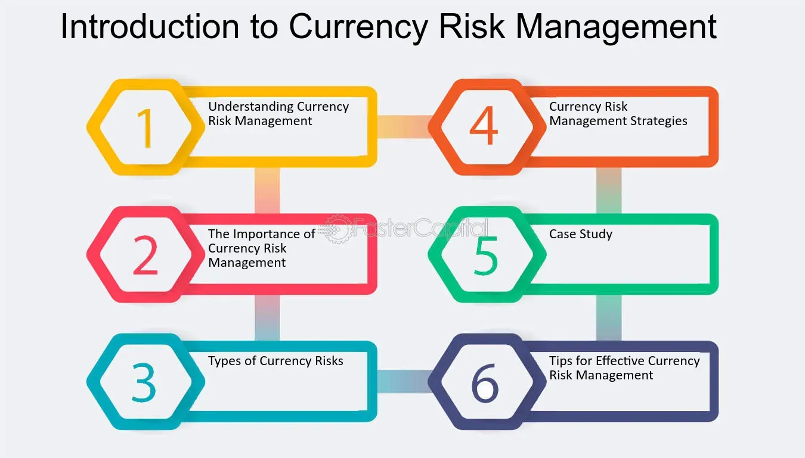

## Table of Contents

## What is currency risk and why is it important to manage?

Currency risk, also known as exchange rate risk, is the possibility that changes in currency exchange rates will affect the value of your investments or the cost of doing business internationally. For example, if you have money invested in a foreign country and the value of that country's currency goes down compared to your home currency, your investment could be worth less when you convert it back. This risk is important for anyone who deals with foreign currencies, whether they are investing, trading, or simply buying goods and services from another country.

Managing currency risk is important because it can help protect your money and make your financial planning more predictable. If you don't manage this risk, sudden changes in exchange rates could lead to big losses. By using different strategies, like hedging or diversifying your investments across different currencies, you can reduce the impact of these changes. This way, you can have more control over your financial outcomes and avoid unexpected costs or losses due to currency fluctuations.

## How can currency fluctuations impact businesses and individual investors?

Currency fluctuations can have a big impact on businesses, especially those that buy or sell things in different countries. If a business in the U.S. buys materials from Europe, and the euro gets stronger compared to the dollar, those materials will cost more. This can make it harder for the business to make a profit. On the other hand, if a U.S. company sells products in Europe and the dollar gets weaker, their products become cheaper for European customers, which could help the business sell more. But, it's not always good; if the dollar gets too weak, it might mean the business earns less money when it converts the euros back to dollars.

For individual investors, currency fluctuations can change the value of their investments. If an investor from Canada puts money into a U.S. stock, and the U.S. dollar gets weaker compared to the Canadian dollar, the value of that investment goes down when converted back to Canadian dollars. This means the investor might not make as much money as they hoped. On the flip side, if the U.S. dollar gets stronger, the value of the investment goes up in Canadian dollars, which could lead to bigger profits. But, these changes can be hard to predict, so investors need to be careful and think about how currency changes might affect their plans.

## What are the basic types of currency risk?

There are three main types of currency risk: transaction risk, translation risk, and economic risk. Transaction risk happens when a business or person has to change money from one currency to another. For example, if a company in the U.S. buys something from Japan, and the value of the yen goes up before the company pays, it will cost more dollars. This can make the company lose money.

Translation risk is about how a company's financial statements look when they are changed from one currency to another. If a U.S. company has a branch in Europe, and the euro gets weaker, the value of the European branch's earnings will be less when changed to dollars. This can make the whole company look less profitable, even if nothing else has changed.

Economic risk is the hardest to see because it's about how currency changes can affect a business's future earnings and plans. If a company sells a lot of its products in another country, and that country's currency gets weaker, the company might sell less because its products become more expensive for people in that country. This can hurt the company's profits over time.

## What is the difference between transaction, translation, and economic exposure?

Transaction exposure happens when a business or person has to change money from one currency to another. For example, if a U.S. company buys something from Japan and the value of the yen goes up before they pay, it will cost more dollars. This can make the company lose money because the cost of the purchase goes up. It's all about the actual money transactions that happen between different currencies.

Translation exposure is about how a company's financial statements look when they are changed from one currency to another. If a U.S. company has a branch in Europe, and the euro gets weaker, the value of the European branch's earnings will be less when changed to dollars. This can make the whole company look less profitable on paper, even if nothing else has changed. It's about how the numbers in the financial reports change because of currency differences.

Economic exposure is the hardest to see because it's about how currency changes can affect a business's future earnings and plans. If a company sells a lot of its products in another country, and that country's currency gets weaker, the company might sell less because its products become more expensive for people in that country. This can hurt the company's profits over time. It's about the long-term impact of currency changes on a business's overall health and strategy.

## What are some common strategies for beginners to mitigate currency risk?

One simple way for beginners to reduce currency risk is by using hedging. Hedging is like a safety net that can protect your money from big changes in currency values. You can do this by using financial products like forward contracts or options. A forward contract lets you agree on a price to buy or sell a currency at a future date, so you know exactly how much it will cost, no matter what happens to the exchange rate. Options give you the right, but not the obligation, to buy or sell a currency at a set price, which can also help protect your money.

Another strategy is to diversify your investments. This means spreading your money across different currencies and types of investments. If one currency loses value, your other investments in different currencies might not be affected as much. This can help balance out any losses and make your overall investment more stable. For example, if you invest in both U.S. dollars and euros, a drop in the value of the dollar might be offset by a rise in the value of the euro.

It's also important to stay informed about what's happening in the world that could affect currency values. Keeping an eye on economic news, political events, and market trends can help you make better decisions about when to buy or sell different currencies. By understanding these factors, you can be more prepared for potential changes and take steps to protect your money from currency fluctuations.

## How can forward contracts be used to hedge against currency risk?

Forward contracts are a way to protect your money from changes in currency values. Imagine you're a U.S. company that needs to pay a supplier in Europe in three months. You can use a forward contract to agree on a price to buy euros today, even though you won't need them until later. This means you know exactly how many dollars you'll need to pay, no matter what happens to the exchange rate between the dollar and the euro. If the euro gets more expensive, you're safe because you locked in a good price earlier.

Using forward contracts is like making a bet that the currency will change in a way that could hurt you if you didn't have the contract. It's a way to make your financial planning more predictable. For example, if you're an investor who wants to buy stocks in Japan, you can use a forward contract to set a price for yen now. This way, if the yen gets stronger before you buy the stocks, you won't have to pay more dollars than you planned. Forward contracts help you avoid surprises and keep your costs under control.

## What role do options play in managing currency risk, and how are they used?

Options are another tool you can use to protect your money from changes in currency values. They give you the right, but not the obligation, to buy or sell a currency at a set price before a certain date. This means you can decide whether to use the option or not, depending on what happens to the exchange rate. If the currency moves in a way that's bad for you, you can use the option to avoid losing money. But if the currency moves in a good way, you can just let the option expire and not use it.

For example, if you're a U.S. company that will receive payment in euros in the future, you might buy a put option on euros. This option lets you sell euros at a set price. If the euro gets weaker and you think you'll lose money when you convert the euros to dollars, you can use the put option to sell the euros at the better price you locked in earlier. This way, you can protect your earnings from a drop in the euro's value. If the euro stays strong or gets even stronger, you don't have to use the option, and you can just convert the euros at the current, better rate.

## Can you explain how currency swaps work as a tool for mitigating currency risk?

Currency swaps are like agreements between two parties to exchange money in different currencies for a set time. Imagine you're a U.S. company that needs to borrow money in euros, but you only have dollars. You can do a currency swap with a European company that needs dollars. You give them your dollars, and they give you euros. You both agree to swap the money back at the end of the agreed time, usually at the same exchange rate you used at the start. This way, you can use the euros you need without worrying about the exchange rate changing while you have the loan.

Currency swaps help reduce the risk of currency changes because they lock in the exchange rate for the whole time you have the swap. If the euro gets stronger or weaker compared to the dollar, it doesn't affect you because you know exactly how many dollars you'll get back when you swap the euros at the end. This makes it easier to plan your finances and avoid surprises from currency fluctuations. Companies often use currency swaps when they need to borrow money in a different currency or when they want to protect themselves from big changes in exchange rates.

## What are the advantages and disadvantages of using natural hedging strategies?

Natural hedging is when a business tries to balance out currency risk by doing things in a way that reduces the impact of currency changes. One big advantage of natural hedging is that it can be cheaper than using financial tools like options or forward contracts. Instead of paying for these tools, a company might choose to set up operations in different countries or sell products in multiple currencies. This way, if one currency loses value, the company might still make money from sales in other currencies, which helps balance things out. It's like spreading your bets so that you're not too affected if one thing goes wrong.

However, natural hedging also has its downsides. It can be hard to set up and might take a lot of time and effort. For example, a company might need to open new branches in different countries or change how it does business, which can be expensive and complicated. Also, natural hedging might not protect against all types of currency risk. If a company's main business is in one country, and that country's currency changes a lot, natural hedging might not be enough to stop the company from losing money. So, while natural hedging can be a good way to manage currency risk, it's not always easy or perfect.

## How do multinational corporations typically approach currency risk management?

Multinational corporations usually have big teams that work on managing currency risk. They use a mix of different strategies to protect their money from changes in currency values. One common way is to use financial tools like forward contracts, options, and currency swaps. These tools help them lock in exchange rates and avoid big losses if a currency suddenly changes a lot. They also might use natural hedging by setting up operations in different countries and selling products in multiple currencies. This way, if one currency goes down, they can still make money from sales in other currencies, which helps balance things out.

Another thing multinational corporations do is to keep a close eye on what's happening in the world that could affect currency values. They watch economic news, political events, and market trends to make better decisions about when to buy or sell different currencies. By understanding these factors, they can be more prepared for potential changes and take steps to protect their money from currency fluctuations. Managing currency risk is a big job for these companies, but it's really important because it helps them avoid unexpected costs or losses due to currency changes.

## What advanced financial instruments can be used for sophisticated currency risk mitigation?

Multinational corporations often use advanced financial instruments like currency futures and exotic options to manage currency risk in a sophisticated way. Currency futures are contracts to buy or sell a currency at a set price on a future date, similar to forward contracts but traded on an exchange. This means they are standardized and can be easier to buy and sell. Exotic options are more complex than regular options and can be tailored to specific needs. They might include features like barriers, where the option only becomes active if the currency hits a certain price, or digital options, which pay out a fixed amount if a certain condition is met. These tools allow companies to fine-tune their risk management strategies to fit their unique situations.

Another advanced tool is a currency collar, which combines options to set both a floor and a ceiling on the exchange rate. This means a company can protect itself from big losses if the currency moves against them, but also limit how much they can gain if the currency moves in their favor. It's like having a safety net that keeps things within a certain range. Multinational corporations also use cross-currency [interest rate](/wiki/interest-rate-trading-strategies) swaps, which are like currency swaps but also involve exchanging interest payments in different currencies. This can help them manage both currency risk and interest rate risk at the same time. These advanced instruments require a good understanding of financial markets and are typically used by companies with dedicated risk management teams.

## How can predictive analytics and machine learning be utilized to forecast and manage currency risk?

Predictive analytics and [machine learning](/wiki/machine-learning) can help businesses and investors guess what might happen to currency values in the future. They do this by looking at a lot of past data, like how currencies have changed before, and using special math formulas to find patterns. These tools can look at things like economic news, how much people are buying and selling, and even what people are saying on social media. By understanding these patterns, predictive analytics and machine learning can make smart guesses about where currency values might go next. This helps businesses and investors plan better and make choices that can protect their money from big changes in currency values.

Using these tools can also help businesses and investors react faster to changes in the market. For example, if a machine learning model sees that a currency is starting to go down, it can tell a business to use a financial tool like a forward contract or an option to protect their money. This way, they can avoid losing money if the currency keeps going down. Also, these tools can keep learning and getting better over time, so they can give even more accurate guesses about currency values. This makes it easier for businesses and investors to manage currency risk and feel more confident about their financial plans.

## References & Further Reading

[1]: Bergstra, J., Bardenet, R., Bengio, Y., & Kégl, B. (2011). ["Algorithms for Hyper-Parameter Optimization."](https://papers.nips.cc/paper/4443-algorithms-for-hyper-parameter-optimization) Advances in Neural Information Processing Systems 24.

[2]: ["Advances in Financial Machine Learning"](https://www.amazon.com/Advances-Financial-Machine-Learning-Marcos/dp/1119482089) by Marcos Lopez de Prado

[3]: ["Evidence-Based Technical Analysis: Applying the Scientific Method and Statistical Inference to Trading Signals"](https://www.amazon.com/Evidence-Based-Technical-Analysis-Scientific-Statistical/dp/0470008741) by David Aronson

[4]: ["Machine Learning for Algorithmic Trading"](https://github.com/PacktPublishing/Machine-Learning-for-Algorithmic-Trading-Second-Edition) by Stefan Jansen

[5]: ["Quantitative Trading: How to Build Your Own Algorithmic Trading Business"](https://books.google.com/books/about/Quantitative_Trading.html?id=j70yEAAAQBAJ) by Ernest P. Chan