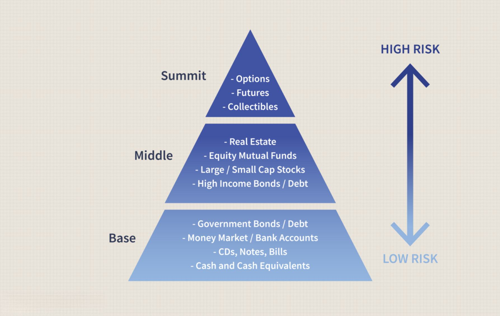

In finance, investing in distressed debt within corporate bonds presents compelling opportunities for investors ready to embrace higher levels of risk. Distressed debt involves securities from companies facing financial difficulties, often characterized by high default risk and trading at considerable discounts. Investors targeting this market aim to capitalize on the potential recovery or restructuring of these companies, seeking substantial returns in exchange for the elevated risks.

This article will explore the strategies involved in distressed corporate debt investment, highlighting how algorithmic trading can enhance investment outcomes. Algorithmic trading exploits advanced algorithms to execute trades with minimal human intervention, leveraging data-driven insights and real-time market analysis to identify undervalued opportunities swiftly. By combining distressed debt investment with algorithmic trading, investors can navigate this complex marketplace with improved efficiency and precision.

Understanding the interplay between distress scenarios and algorithmic methodologies is crucial for investors to make informed decisions in this high-stakes environment. Financial markets fluctuate, and distressed debt investments can be influenced by numerous factors, including economic conditions, legal intricacies, and company-specific challenges. Utilizing sophisticated market data analytics, investors can optimize their portfolios, capitalizing on undervalued assets while employing strategies for risk mitigation.

The merger of distressed debt investing with technology-driven strategies represents an expanding facet of modern financial markets. As investors seek innovative approaches to enhance returns, leveraging technology and comprehensive market data becomes increasingly important. This exploration aims to equip investors with an understanding of the mechanics behind these investment strategies, focusing on key concepts and practical considerations. By recognizing and adapting to the evolving landscape, investors can unlock value in the burgeoning field of distressed debt and algorithmic trading integration.

## Table of Contents

## Understanding Distressed Debt Investment

Distressed debt refers to financial instruments issued by companies experiencing dire financial difficulties, often trading at steep discounts compared to their face value due to heightened default risks. These securities become attractive to specialized investors who aim to purchase them at reduced prices, with the expectation that the issuing company will either recover or undergo a successful restructuring process. The strategy is inherently risky but promises potentially substantial returns if the company manages to stabilize or reorganize its financials.

Investors in distressed debt employ rigorous analysis to determine the potential for recovery. This involves a comprehensive evaluation of the company's financial statements, credit reports, and market position to assess the likelihood of overcoming financial distress. Factors such as liquidity ratios, cash flow projections, and debt maturity profiles are scrutinized to make informed investment decisions.

These distressed securities often attract 'vulture investors' — a term used to describe astute investors or firms specializing in purchasing undervalued financial assets from troubled companies. These investors possess the expertise to identify undervalued opportunities and frequently gain influence over the restructuring processes of the companies they invest in, leveraging this influence to drive outcomes that maximize their investments.

Engaging in distressed debt investment requires a profound understanding of complex legal and financial restructuring mechanisms. Investors must navigate potential bankruptcy scenarios, negotiate with creditors, and possibly assume active roles in reorganization plans. The process demands a balance of financial patience and strategic influence, as restructuring can be prolonged and outcomes uncertain.

Overall, distressed debt investment is a specialized area requiring a deep understanding of both financial analysis and corporate restructuring. Investors need to weigh the potential rewards against the significant risks, factoring in the volatile nature of companies in distress and the complexities involved in their turnaround or restructuring efforts.

## Algorithmic Trading in Distressed Debt Markets

Algorithmic trading employs sophisticated algorithms for the automatic execution of trading strategies, significantly enhancing speed and efficiency within financial markets. This technology-driven approach has gained relevance in the distressed debt market, where rapid analysis and execution are crucial for capitalizing on fleeting market opportunities. Algorithmic trading systems can swiftly process vast datasets, pinpointing undervalued opportunities and highlighting market inefficiencies that human traders might overlook.

In distressed debt markets, algorithms are designed to interpret real-time market signals, responding to changes instantaneously. This capability allows for enhanced risk management through automated interventions—mitigating potential losses and optimizing potential returns. For instance, algorithms can incorporate stop-loss orders, dynamic hedging, and predictive analytics to adjust investment positions in response to market [volatility](/wiki/volatility-trading-strategies), thus optimizing decision-making processes.

Advancements in technology, particularly [artificial intelligence](/wiki/ai-artificial-intelligence) (AI) and [machine learning](/wiki/machine-learning), have further amplified the potential of [algorithmic trading](/wiki/algorithmic-trading). AI algorithms can identify complex patterns in historical and real-time data, improving the accuracy of predictions related to distressed securities. Machine learning models can continuously learn and adapt, refining trading strategies over time to improve performance based on accumulated data insights. Such models are capable of [backtesting](/wiki/backtesting) strategies against historical data to estimate potential outcomes before live deployment.

Despite the advantages, algorithmic trading also presents challenges that necessitate careful oversight. The fast-paced nature of automated systems means that technical failures or unforeseen market conditions can result in significant financial repercussions. For example, algorithms might exacerbate market volatility during sudden price movements or react inappropriately to market anomalies. Oversight mechanisms, such as circuit breakers and robust validation protocols, are critical in mitigating these risks. Additionally, implementing comprehensive regulatory compliance frameworks ensures that trading activities adhere to financial regulations and market standards.

In conclusion, while algorithmic trading offers substantial benefits of speed, accuracy, and efficiency in distressed debt markets, it requires meticulous management to harness these advantages safely and effectively. Through the integration of AI and machine learning, this approach is set to further transform the landscape of distressed debt investment, expanding opportunities for investors.

## Key Strategies for Distressed Debt Investment

Distressed debt investment strategies are primarily anchored in acquiring debt instruments at a discounted rate and profiting from the financial recovery or operational turnaround of the issuing company. This section outlines the prevalent approaches employed by investors in this niche market.

One of the fundamental strategies is distressed debt trading. This involves purchasing the debt securities of distressed entities at a significant discount, with the anticipation that these securities will increase in value as the company undergoes restructuring or recovers financially. The core objective is to capitalize on the price discrepancies and potential appreciation of the debt instruments as the company's situation improves.

Active non-control investments represent another common approach. In this strategy, investors obtain significant holdings in distressed debts without necessarily seeking control over the restructuring processes. Instead, they aim to influence the outcome indirectly, relying on negotiations and strategic partnerships. This strategy allows investors to benefit from the eventual restructuring or turnaround while avoiding the complexities and responsibilities associated with direct control.

Conversely, control investments entail acquiring a controlling stake in the distressed company’s debt, thereby gaining the leverage necessary to steer the restructuring process. Through this approach, investors can exert influence over crucial decisions, including debt rescheduling, asset sales, or operational overhauls. By taking an active role in the company’s rehabilitation, control investors can potentially enhance the recovery prospects, thereby maximizing their investment returns.

Event-driven strategies are also prevalent among distressed debt investors. These strategies focus on capitalizing on specific corporate events, such as bankruptcies, mergers, or asset divestitures. By anticipating these events and understanding their implications, investors can time their entry and [exit](/wiki/exit-strategy) points to optimize returns. Such strategies require a keen understanding of the legal, financial, and market factors that drive these events.

Success in these strategies hinges on a profound comprehension of financial metrics and legal frameworks. Investors must adeptly navigate the intricate market dynamics that influence the performance of distressed securities. This includes a deep analysis of balance sheets, income statements, and cash flow projections to assess the issuer’s recovery potential and valuation.

In recent years, many investors have integrated advanced technologies and algorithmic processes to refine these strategies. By employing sophisticated analytics and machine learning models, investors can enhance decision-making efficiency and improve the probability of identifying lucrative opportunities. For example, algorithms can process and analyze vast datasets to detect undervalued assets or predict market trends with greater accuracy.

In conclusion, the diverse strategies employed in distressed debt investment require a blend of financial acumen, strategic vision, and technological innovation. By adopting a structured and informed approach, investors can unlock substantial value in the complex and volatile arena of distressed investments.

## Risks and Challenges

Investing in distressed debt involves navigating a landscape characterized by significant risk due to the precarious financial state of the issuers. One of the primary concerns is default risk, where the distressed company faces heightened challenges in meeting its financial obligations. This potential for default requires investors to conduct comprehensive assessments of the issuer's financial health and resilience. 

Another critical aspect contributing to these risks is [liquidity](/wiki/liquidity-risk-premium) issues. Distressed securities often suffer from low trading volumes, complicating the dynamics of buying and selling. The limited market activity can lead to price volatility and increased transaction costs, thereby impacting the potential for returns. Investors must be prepared to manage these liquidity constraints effectively to minimize adverse effects on their investment strategies.

Legal complexities add another layer of challenge when dealing with distressed debt. The processes of bankruptcy and restructuring are fraught with intricate legal frameworks that require investors to possess adept negotiation skills and a thorough understanding of relevant regulations. Navigating these legal hurdles necessitates engagement with legal experts to ensure compliance and optimization of investment outcomes.

To mitigate the substantial risks associated with distressed debt, investors should implement sophisticated risk management systems and strategies. These tools are essential for identifying, assessing, and managing potential risks effectively. Advanced risk management involves continuous monitoring of market conditions, regulatory changes, and the financial positions of distressed issuers. By utilizing data analytics and predictive modeling, investors can enhance their decision-making processes and respond promptly to evolving market scenarios.

Overall, a successful approach to investing in distressed debt demands a combination of financial acumen, legal expertise, and advanced technological tools. By understanding the inherent risks and implementing robust strategies, investors can navigate the volatile landscape of distressed debt markets with greater confidence and potential for reward.

## Market Dynamics and Emerging Trends

Distressed debt market conditions are significantly influenced by economic cycles. During downturns, companies face financial pressures, increasing the number of distressed opportunities as more firms struggle to meet their obligations. This cyclical nature creates a larger pool of distressed securities available at discounted prices, appealing to investors seeking substantial returns from anticipated recoveries.

Technological advancements, notably in artificial intelligence (AI) and big data analytics, are transforming strategies in distressed debt investment. AI algorithms facilitate the analysis of large datasets to identify potential investment opportunities that might be overlooked through traditional methods. These technologies help in evaluating the financial health and recovery prospects of distressed companies, thereby refining investment strategies.

Institutional investors, particularly hedge funds, are pivotal in the distressed debt market. They bring financial capital, expertise, and liquidity, which are crucial in restructuring processes and business turnarounds. Their involvement often leads to a more structured and efficient resolution to distress, potentially increasing the chances of recovery and, consequently, returns on investment.

The rise of algorithmic trading has democratized access to distressed markets, allowing retail investors to participate alongside institutional players. This technology enables retail investors to execute trades rapidly and efficiently, minimizing transaction costs and bridging the gap with larger, more experienced investors. Algorithmic trading systems can be programmed to track distressed debt securities and execute buy or sell orders automatically when specific criteria are met, enhancing competitive parity.

Staying updated with macroeconomic trends and technological innovations is crucial for taking advantage of evolving opportunities within the distressed debt landscape. Investors need to remain informed about global economic conditions that might affect the [volume](/wiki/volume-trading-strategy) and nature of distressed opportunities. Additionally, continuous advancements in technology can offer new tools and methodologies for assessing risk and optimizing investment strategies in the distressed debt sector.

## Conclusion

The synergy between distressed debt investment and algorithmic trading presents a high-risk, high-reward opportunity for those equipped with the necessary expertise and resources. Successful engagement in this sector demands a meticulous approach to financial analysis, as investors must accurately assess the potential for corporate recovery and evaluate the risk-reward profile of distressed securities. Legal proficiency is equally crucial, given the complexities surrounding bankruptcy and restructuring processes which may directly impact investment outcomes.

Technological skills play a pivotal role, particularly in harnessing the power of algorithmic trading. Algorithms are employed to process vast amounts of market data, offering insights that can guide investment decisions and enhance portfolio management. As markets and regulatory landscapes are in constant flux, maintaining flexible strategies is vital. Continuous learning and adaptation are required to align with emerging trends and potential regulatory changes, ensuring strategies remain effective and compliant.

Investors who navigate the distressed debt markets with precision have the potential to unlock significant value. Technological advances in data analytics and algorithmic trading provide tools necessary for identifying opportunities that might otherwise go unnoticed. This multifaceted field remains attractive to investors willing to integrate traditional financial practices with cutting-edge technology, aiming for substantial returns amidst inherent challenges. This blend of conventional and innovative approaches not only enhances investment strategies but also positions investors to capitalize on evolving opportunities in distressed debt markets.

## References & Further Reading

[1]: Gilson, S. C. (2010). ["Creating Value Through Corporate Restructuring: Case Studies in Bankruptcies, Buyouts, and Breakups"](https://onlinelibrary.wiley.com/doi/book/10.1002/9781119204589) by Stuart C. Gilson.

[2]: López de Prado, M. (2018). ["Advances in Financial Machine Learning"](https://www.amazon.com/Advances-Financial-Machine-Learning-Marcos/dp/1119482089) by Marcos Lopez de Prado.

[3]: Altman, E. I., & Hotchkiss, E. (2005). ["Corporate Financial Distress and Bankruptcy: Predict and Avoid Bankruptcy, Analyze and Invest in Distressed Debt"](https://onlinelibrary.wiley.com/doi/book/10.1002/9781118267806) by Edward I. Altman and Edith Hotchkiss.

[4]: Chan, E. (2008). ["Quantitative Trading: How to Build Your Own Algorithmic Trading Business"](https://github.com/ftvision/quant_trading_echan_book) by Ernest P. Chan.

[5]: Jansen, S. (2020). ["Machine Learning for Algorithmic Trading: Predictive models to extract signals from market and alternative data for systematic trading strategies with Python"](https://www.amazon.com/Machine-Learning-Algorithmic-Trading-alternative/dp/1839217715) by Stefan Jansen.