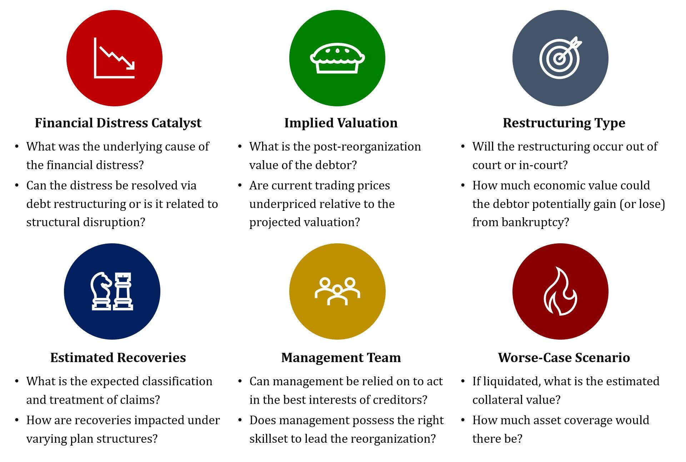

## Table of Contents

## What is distressed debt and how is it defined in the investment world?

Distressed debt refers to the securities of companies that are either in bankruptcy or facing a high risk of defaulting on their debts. In the investment world, these securities are often bonds or loans that have lost significant value because the issuing company is struggling financially. Investors see distressed debt as an opportunity to buy these securities at a low price, hoping to profit if the company recovers or if they can influence the company's restructuring process.

In simple terms, when a company is in financial trouble, its debt becomes distressed. This means the company might not be able to pay back what it owes, making its bonds or loans less valuable. Investors who specialize in distressed debt look for these situations because they can buy the debt cheaply. If the company turns around and improves, the value of the debt can go up, allowing the investor to sell it for a profit or even take control of the company during its restructuring.

## What are the common reasons a company's debt becomes distressed?

A company's debt can become distressed for several reasons. One common reason is poor financial management. This can happen when a company spends too much money or takes on too much debt without a solid plan to pay it back. For example, if a company borrows a lot of money to grow quickly but doesn't make enough profit, it might struggle to make its debt payments. Another reason is a drop in the company's revenue. This can be due to losing customers to competitors, a downturn in the economy, or unexpected events like natural disasters that disrupt business.

External factors can also lead to distressed debt. Changes in the market or industry can hurt a company's business. For instance, new laws or regulations might make it harder for the company to operate profitably. Technological changes can also play a role; if a company doesn't keep up with new technology, it might lose its edge and see its profits fall. Additionally, macroeconomic factors like rising interest rates can make it more expensive for a company to borrow money, adding to its financial strain. All these reasons can push a company's debt into distressed territory, making it risky for investors but also potentially rewarding if the company can turn things around.

## What are the basic steps to start investing in distressed debt?

To start investing in distressed debt, you first need to learn about it. Distressed debt is when a company's bonds or loans lose value because the company is having money problems. You can learn by reading [books](/wiki/algo-trading-books), taking online courses, or talking to people who know about it. It's also important to understand the risks. Investing in distressed debt can be risky because the company might not get better and you could lose money. So, you should only invest money you can afford to lose.

Once you feel ready, you can start looking for distressed debt to invest in. You can find these opportunities by checking financial news, using special websites that track distressed companies, or working with a financial advisor who knows about distressed debt. When you find a company you're interested in, you need to do a lot of research. Look at the company's financial reports, read about its problems, and think about whether it can get better. If you decide to invest, you can buy the distressed debt through a broker or a special fund that focuses on distressed debt. Remember, patience is key because it can take a long time for a distressed company to recover.

## How can an investor identify potential distressed debt opportunities?

To find potential distressed debt opportunities, an investor should start by keeping an eye on financial news and market reports. These sources often talk about companies that are struggling with their debts. You can also use special websites and databases that track companies in financial trouble. These tools can help you see which companies are having a hard time paying back their loans or bonds. Another good way to find opportunities is to talk to financial advisors or join investment groups where people share information about distressed companies.

Once you have a list of companies to look at, you need to do your homework. This means reading the company's financial reports to understand how much debt they have and how they are doing financially. You should also read news articles and analyst reports to learn about the company's problems and what they are doing to fix them. Look for signs that the company might be able to turn things around, like new management or a plan to restructure their debt. By doing this research, you can decide if the distressed debt is a good investment opportunity for you.

## What are the key risks associated with investing in distressed debt?

Investing in distressed debt can be risky because there's a chance the company might not recover from its financial problems. If the company goes bankrupt, you could lose all the money you invested in its debt. This is a big risk, especially if the company's problems are very serious and it doesn't have a good plan to fix them. Another risk is that it can take a long time for a distressed company to turn things around. You might have to wait years before you see any profit, and during that time, the value of the debt could go down even more.

There's also the risk that other investors or creditors might get paid back before you. In a bankruptcy, there's a certain order in which people get paid, and if you're at the bottom of that list, you might not get anything. Plus, the market for distressed debt can be hard to understand and can change quickly. If you don't know a lot about it, you might make bad decisions and lose money. So, it's important to do a lot of research and maybe even work with someone who knows about distressed debt before you start investing.

## What legal and regulatory considerations should be taken into account when investing in distressed debt?

When you invest in distressed debt, you need to think about the laws and rules that apply. One big thing to know is how bankruptcy works. In the United States, for example, there are rules about who gets paid first if a company goes bankrupt. If you buy distressed debt, you need to understand where you stand in line. There are also rules about how companies can restructure their debts, and these rules can change depending on the country. So, it's important to know the laws in the places where the companies you're looking at are based.

Another thing to consider is the rules set by financial regulators. These rules can affect how you can buy and sell distressed debt. For example, some countries have strict rules about who can invest in certain types of debt. You might need to be a professional investor or meet certain financial requirements. Also, there can be rules about how much information you need to share when you buy or sell distressed debt. It's a good idea to talk to a lawyer or a financial advisor who knows about these rules to make sure you're doing everything right.

## How can an investor analyze the financial health of a company with distressed debt?

To figure out if a company with distressed debt is worth investing in, you need to look at its financial health. Start by checking the company's financial statements, like the balance sheet, income statement, and cash flow statement. These documents will show you how much debt the company has, how much money it's making, and how it's spending its cash. Pay attention to the company's debt-to-equity ratio, which tells you how much it relies on borrowed money. A high ratio might mean the company is in big trouble. Also, look at the company's [liquidity](/wiki/liquidity-risk-premium), which is how easily it can pay its short-term bills. If the company doesn't have enough cash or assets it can quickly turn into cash, it might struggle to keep going.

Next, think about the company's future. Read news articles and analyst reports to understand why the company is in trouble and what it's doing to fix its problems. Sometimes, a company might have a good plan to turn things around, like cutting costs or selling off parts of the business. Other times, the problems might be too big to fix. It's also helpful to look at the industry the company is in. If the whole industry is doing badly, it might be harder for the company to recover. By putting all this information together, you can decide if the company's distressed debt is a good investment or if it's too risky.

## What are some advanced strategies for restructuring distressed debt to maximize returns?

When a company's debt is distressed, one advanced strategy to maximize returns is to buy the debt at a low price and then work with the company to restructure its debt. This means you might help the company change its debt terms, like lowering the [interest rate](/wiki/interest-rate-trading-strategies) or extending the time it has to pay back the money. By doing this, you can make the company's financial situation better, which can increase the value of the debt you bought. If the company recovers and does well, you could sell the debt for a lot more than you paid for it. Another part of this strategy is to take an active role in the company's decisions. You might even get a seat on the company's board of directors, which lets you help guide the company's recovery plan.

Another strategy is to use a "loan-to-own" approach. This means you buy the distressed debt with the goal of eventually owning part or all of the company. If the company goes bankrupt, the debt you own might be turned into equity, or ownership shares, in the restructured company. This can be a big win if the company turns around and becomes profitable again. To make this work, you need to do a lot of research and understand the company's business and industry really well. You also need to be ready to wait a long time, because turning a distressed company around can take years. But if it works, you could end up owning a valuable part of a successful business.

## How do hedge funds and other institutional investors approach distressed debt investments?

Hedge funds and other institutional investors often see distressed debt as a chance to make big profits. They buy the debt of companies that are struggling at a low price, hoping to make money if the company gets better. These investors do a lot of research to find the best opportunities. They look at the company's financial reports, talk to the company's management, and study the industry to see if the company can turn things around. Sometimes, they work with the company to help it restructure its debt, which can make the company's situation better and increase the value of the debt they bought.

These investors also use advanced strategies like "loan-to-own." This means they buy the distressed debt with the goal of eventually owning part or all of the company. If the company goes bankrupt, the debt they own might turn into ownership shares in the new, restructured company. This can be a big win if the company becomes profitable again. Hedge funds and institutional investors are usually ready to wait a long time for their investments to pay off, because turning a distressed company around can take years. But if it works, they can make a lot of money.

## What role does the economic cycle play in the success of distressed debt investments?

The economic cycle can really affect how well distressed debt investments do. When the economy is doing well, it's easier for companies to turn things around. More people are buying things, so companies can make more money and pay back their debts. This means the value of distressed debt can go up, and investors can make a profit. But if the economy is in a downturn, it's harder for companies to recover. Fewer people are spending money, so companies might keep struggling and even go bankrupt. This can make distressed debt investments riskier and less likely to pay off.

Because of this, investors need to think about where the economy is in its cycle before they invest in distressed debt. If they think the economy is going to get better soon, it might be a good time to buy distressed debt. They can buy it cheap and then sell it for more money when the company does better. But if they think the economy is going to stay bad for a while, they might want to be more careful. The company might not recover, and they could lose money. So, understanding the economic cycle is a big part of deciding when and how to invest in distressed debt.

## How can an investor use distressed debt as part of a broader investment strategy?

Distressed debt can be a part of a bigger investment plan because it can help spread out risk and possibly make more money. When you invest in different things, like stocks, bonds, and distressed debt, you're not putting all your money in one place. This can protect you if one type of investment does badly. Distressed debt can be good because you can buy it cheap and sell it for more if the company gets better. But it's risky, so you should only use a small part of your money for it. This way, if the company doesn't recover, you won't lose too much.

To use distressed debt in your overall investment strategy, you need to think about when to buy it. The economy goes through good and bad times, and it's usually better to buy distressed debt when the economy is starting to get better. This is because companies are more likely to recover when people are spending money again. You should also do a lot of research to pick the right companies. Look for ones that have a good chance of turning things around. By adding distressed debt to your mix of investments, you can try to make more money, but you need to be careful and patient because it can take a long time for the investment to pay off.

## What are the latest trends and innovations in the distressed debt market that expert investors should be aware of?

In the distressed debt market, one of the latest trends is the use of technology to find and analyze investment opportunities. Expert investors are using big data and [artificial intelligence](/wiki/ai-artificial-intelligence) to look at a lot of information quickly. These tools help them see patterns and predict which companies might recover. Another trend is the rise of [ESG](/wiki/esg-investing) (environmental, social, and governance) factors in investment decisions. More investors are thinking about how a company treats the environment, its workers, and its leaders when deciding if it's a good investment. This can affect the value of distressed debt because companies that do well in these areas might be more likely to turn things around.

Another innovation is the use of special funds that focus on distressed debt. These funds are set up to buy and manage distressed debt, and they often have experts who know a lot about turning companies around. This makes it easier for investors to get into the distressed debt market without having to do all the work themselves. Also, there's more interest in distressed debt from countries outside the United States and Europe. As more countries develop their financial markets, there are new opportunities for investors to find distressed debt in places like Asia and Latin America. These trends and innovations are changing how expert investors approach the distressed debt market, making it more efficient and global.

## References & Further Reading

[1]: Gilson, S. C. (2010). ["Creating Value Through Corporate Restructuring: Case Studies in Bankruptcies, Buyouts, and Breakups"](https://onlinelibrary.wiley.com/doi/book/10.1002/9781119204589) by Stuart C. Gilson.

[2]: López de Prado, M. (2018). ["Advances in Financial Machine Learning"](https://www.amazon.com/Advances-Financial-Machine-Learning-Marcos/dp/1119482089) by Marcos Lopez de Prado.

[3]: Altman, E. I., & Hotchkiss, E. (2005). ["Corporate Financial Distress and Bankruptcy: Predict and Avoid Bankruptcy, Analyze and Invest in Distressed Debt"](https://onlinelibrary.wiley.com/doi/book/10.1002/9781118267806) by Edward I. Altman and Edith Hotchkiss.

[4]: Chan, E. (2008). ["Quantitative Trading: How to Build Your Own Algorithmic Trading Business"](https://github.com/ftvision/quant_trading_echan_book) by Ernest P. Chan.

[5]: Jansen, S. (2020). ["Machine Learning for Algorithmic Trading: Predictive models to extract signals from market and alternative data for systematic trading strategies with Python"](https://www.amazon.com/Machine-Learning-Algorithmic-Trading-alternative/dp/1839217715) by Stefan Jansen.