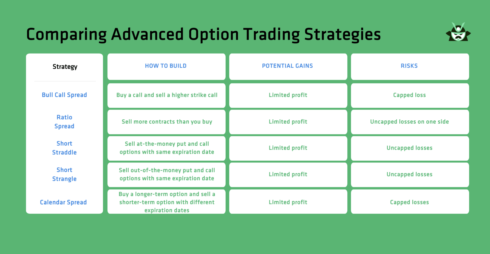

Options trading presents an exciting opportunity for investors aiming to optimize returns through strategic approaches. By choosing options, investors engage in a form of derivatives trading that offers flexibility and leverages potential benefits or mitigates risks associated with underlying assets. Options are financial instruments that provide the right, but not the obligation, to buy or sell an asset at a predetermined price before a specified expiration date. This flexibility allows investors to hedge their portfolios or speculate on market movements with a defined risk.

The advent of algorithmic trading has introduced a revolutionary force within investment strategy. Algorithms can execute trades with high precision and speed, surpassing the capability of manual trading. This transformation has enabled traders to manage enormous data sets, identify patterns, and execute trades in milliseconds, enhancing decision-making processes and opening opportunities for optimizing returns.



In this article, we explore how traders can blend the strategic elements of options trading with the powerful mechanisms of algorithmic trading. By understanding the fundamentals of options and leveraging algorithms, traders can employ sophisticated strategies to potentially increase profitability while managing risk effectively. We will outline the basic concepts underpinning options trading, detail the significance of algorithmic systems, and discuss how different strategies align with varying market conditions and investor goals.

## Table of Contents

## Understanding Options Trading

Options trading is a sophisticated domain within financial markets that offers flexibility and leverage to investors. An option is a derivative financial instrument that gives the holder the right—but not the obligation—to buy or sell an underlying asset at a predetermined price before or on a specified date. The underlying asset can be stocks, indices, exchange-traded funds (ETFs), or commodities.

Options are categorized into two primary types: call options and put options. A call option grants the holder the right to purchase an asset at the specified strike price, whereas a put option provides the right to sell the asset at the strike price. The strike price is the agreed-upon price at which the underlying asset can be bought or sold, and the expiration date is the last date on which the option can be exercised.

### Key Concepts

- **Call Option:** A financial contract that allows the owner to buy a specific quantity of an asset at the strike price within a set period.

- **Put Option:** A financial contract that allows the owner to sell a specific quantity of an asset at the strike price within a set period.

- **Strike Price:** The predetermined price at which the options contract can be exercised.

- **Expiration Date:** The final date on which the option holder must exercise their right to buy or sell.

### Benefits and Risks

Options trading provides several benefits. Investors can achieve substantial leverage, meaning they can control a large position with a relatively small amount of capital. Options can also be used for hedging, allowing investors to protect against downside risks in their portfolios. However, options trading carries inherent risks. The most significant risk for option buyers is the potential to lose the entire premium paid for the option if the market does not move in the anticipated direction. For option writers, or sellers, the risk can be much higher, potentially unlimited for uncovered call options because they may have to provide the asset at the strike price regardless of the current market price.

### Buying vs. Writing Options

Buying options, whether calls or puts, provides limited risk and potentially unlimited reward. The maximum loss is the premium paid for the options, but the potential gains can be significant if the market moves favorably. On the other hand, writing options, which involves selling options contracts, allows investors to collect premiums upfront. While this strategy can be profitable if the options expire worthless, it also exposes the writer to significant risk—particularly with uncovered options where losses can exceed the initial premiums received.

In summary, understanding the basic elements of options trading, the benefits and risks involved, and the differences between buying and writing options are crucial for investors contemplating engaging in this market. Advanced strategies involving combinations of options contracts can offer sophisticated opportunities for experienced traders.

## Algorithmic Trading in Options

Algorithmic trading, often referred to as automated trading, employs computer algorithms to execute trading orders at high speeds and frequency, relying on pre-programmed instructions. This approach emerged as a highly effective tool in the financial markets, revolutionizing the way trading is conducted. Its initial development began in the late 20th century, but it gained prominence in the early 2000s as technological advancements facilitated faster data processing and execution capabilities.

### Enhancing Precision and Timing

Algorithmic trading significantly enhances the precision and timing in executing options strategies by eliminating human emotions and biases from the decision-making process. Algorithms can analyze vast amounts of data much faster than a human trader, allowing for the quick execution of trades when opportunities arise. This speed and precision are crucial in options trading, where price movements can be rapid and volatile. By using algorithms, traders can ensure that their strategies are executed with exact timing, minimizing slippage and maximizing potential returns.

### Role of AI and Machine Learning

Artificial Intelligence (AI) and [machine learning](/wiki/machine-learning) have played pivotal roles in the evolution of sophisticated trading algorithms. Machine learning algorithms can detect patterns and trends in historical data, providing predictive analytics that assist in making informed trading decisions. Advanced models such as neural networks can process nonlinear relationships and complex interactions among variables, enhancing the algorithm's ability to forecast market movements. AI enables adaptive algorithms that can learn from past trades and continuously improve their strategies.

```python
# Basic example of a machine learning model for predicting option prices
from sklearn.svm import SVR
import numpy as np

# Sample data: [strike price, expiration days, volatility, ...]
X_train = np.array([[100, 30, 0.2], [110, 40, 0.25], [90, 25, 0.15]])
y_train = np.array([5.0, 7.0, 4.0])  # Corresponding option prices

model = SVR(kernel='rbf')
model.fit(X_train, y_train)

# Predicting a new option price
X_test = np.array([[105, 35, 0.22]])
predicted_price = model.predict(X_test)
```

### Technical Requirements and Considerations

Setting up an [algorithmic trading](/wiki/algorithmic-trading) system necessitates a robust technological infrastructure. Key technical requirements include:

1. **Computational Power**: Fast processors and high-performance servers are critical to handle real-time data processing and execution.

2. **Data Feed**: Access to real-time market data is essential for dynamic analysis and decision-making.

3. **Latency Minimization**: Reducing the time it takes to send orders to the market is crucial for executing trades quickly. This can be achieved by colocating servers near exchange facilities.

4. **Risk Management**: Implementation of risk management protocols within the algorithm to avoid potential losses from unexpected market moves.

5. **Compliance and Security**: Ensuring the system meets regulatory standards and is safeguarded against potential threats.

In conclusion, the integration of algorithmic trading in options markets offers traders enhanced efficiency and execution capabilities. As AI and machine learning continue to evolve, they will further refine and optimize these trading strategies, paving the way for more informed and strategic investment decisions.

## Investment Strategies for Profiting with Options

Options trading offers a diverse set of strategies that can be tailored to fit the investor's risk tolerance and market outlook. Several popular strategies include buying calls and puts, writing options, and implementing options spreads.

### Buying Calls and Puts

A call option provides the buyer the right, but not the obligation, to purchase an underlying asset at a specified strike price before the option's expiration date. In contrast, a put option gives the buyer the right to sell the underlying asset under similar conditions. Buying calls is typically bullish, as investors anticipate a rise in the underlying asset's price. Conversely, buying puts is bearish, with expectations of a price decline.

### Writing Options

Writing, or selling, options involves taking on the obligation to buy or sell the underlying asset if the buyer exercises the option. A call writer benefits from a stable or declining market, collecting premium income when the option expires worthless. Conversely, a put writer profits when the underlying asset's price remains stable or increases, again benefiting from premium collection.

### Options Spreads

Options spreads involve simultaneously buying and selling options of the same class (calls or puts) on the same underlying asset but with different strike prices or expiration dates. Common types of spreads include:

- **Vertical Spreads**: Involve options with different strike prices but the same expiration. They can be bullish (bull call spread, bull put spread) or bearish (bear call spread, bear put spread).
- **Horizontal Spreads (Calendar Spreads)**: Involve options with the same strike price but different expiration dates.
- **Diagonal Spreads**: Combine elements of both vertical and horizontal spreads with different strike prices and expiration dates.

### Risk Tolerance and Strategic Choices

An investor's risk tolerance significantly influences options trading strategies. Conservative traders might opt for strategies with limited risk, such as covered calls or protective puts, which cap potential losses. Meanwhile, aggressive traders may pursue higher-risk strategies like naked options or complex spreads to amplify potential returns.

### Complex Strategies: Straddles, Strangles, and Iron Condors

- **Straddles**: Involve buying both a call and a put with the same strike price and expiration date. This strategy profits from significant price movements in either direction, making it ideal for volatile markets.
- **Strangles**: Similar to straddles but involve purchasing options with different strike prices. This strategy is also aimed at benefiting from large price swings.
- **Iron Condors**: A type of options spread that involves selling a call and a put at one strike, and buying a call and a put at higher and lower strikes, respectively. It profits from low volatility and a narrow trading range in the underlying asset.

### Leveraging Market Volatility and Timing

Options traders can leverage [volatility](/wiki/volatility-trading-strategies) by adjusting their strategies based on expected market fluctuations. High implied volatility often increases option prices, providing opportunities for strategies like writing options or executing iron condors. Timing is also crucial, as the value of options decays over time due to theta, the time decay [factor](/wiki/factor-investing).

To effectively profit from options trading, investors must tailor their strategies according to market conditions, volatility, and their risk profile. By understanding the intricacies of options and employing a strategic approach, traders can effectively navigate and potentially profit from the dynamic nature of financial markets.

## Implementing Algorithmic Strategies

Algorithmic strategies in options trading can significantly enhance decision-making through the integration of mathematical models and computational power. Among the diverse strategies available, trend-following, mean reversion, and [arbitrage](/wiki/arbitrage) are particularly notable for their systematic approach to exploiting market behaviors.

**Trend-Following Strategy**

Trend-following algorithms are designed to capitalize on sustained movements in asset prices. These algorithms identify stock patterns and trends by analyzing historical data and employ moving averages, [breakout](/wiki/breakout-trading) strategies, or [momentum](/wiki/momentum) indicators to determine entries and exits. A simple example is a moving average crossover strategy, where signals to buy or sell are generated when a short-term moving average crosses above or below a long-term moving average.

The Python code snippet below illustrates a basic trend-following strategy using moving averages:

```python
import pandas as pd

# Load historical data
data = pd.read_csv('historical_data.csv')
data['Short_MA'] = data['Close'].rolling(window=50).mean()
data['Long_MA'] = data['Close'].rolling(window=200).mean()

# Generate signals
data['Signal'] = 0
data['Signal'][50:] = np.where(data['Short_MA'][50:] > data['Long_MA'][50:], 1, -1)
data['Position'] = data['Signal'].shift()

# Analyze potential returns
data['Strategy_Returns'] = data['Position'] * data['Close'].pct_change()
```

**Mean Reversion Strategy**

Mean reversion is based on the principle that asset prices tend to revert to their historical average over time. This strategy involves identifying deviations from the mean and placing trades expecting a return to the average. Statistical tools such as Bollinger Bands are often utilized to gauge when prices move too far from their average, suggesting a potential reversion point.

An example formula for calculating Bollinger Bands is:

$$
\text{Upper Band} = \text{SMA}(n) + (k \times \sigma)
$$
$$
\text{Lower Band} = \text{SMA}(n) - (k \times \sigma)
$$

where $\text{SMA}$ is the simple moving average, $\sigma$ is the standard deviation, $n$ is the period of the moving average, and $k$ is a factor to adjust band width.

**Arbitrage Strategy**

Arbitrage seeks to exploit price discrepancies across different markets or instruments, capturing risk-free profits. In options trading, this could involve strategies like the conversion arbitrage, where the trader takes advantage of mispriced options relative to their underlying securities. Implementations are algorithmically driven to quickly capitalize on fleeting opportunities before they dissipate.

**Utilizing Historical Data and Predictive Models**

Historical data forms the backbone of algorithmic strategy development. By [backtesting](/wiki/backtesting) strategies on past market conditions, traders evaluate performance metrics such as risk-adjusted returns, maximum drawdown, and Sharpe ratio. Moreover, predictive models like machine learning can refine these strategies by identifying patterns not immediately obvious through traditional statistical analysis.

**Risk Management and Portfolio Diversification**

Algorithmic trading assists in risk management by promptly reacting to market changes, thereby minimizing losses. Diversification is achieved by spreading investments across various strategies or asset classes, reducing exposure to any single entity. For example, employing a portfolio that balances trend-following and mean reversion can mitigate risks associated with unique market conditions.

**Practical Examples and Potential Returns**

A practical application involves a momentum-based trend-following system that yields consistent returns during trending markets, albeit with periods of underperformance during sideways movements. Conversely, mean reversion strategies thrive in stable or oscillating markets where prices frequently revert, yet they might incur losses in strong trending environments.

In conclusion, implementing algorithmic strategies in options trading demands a robust understanding of market mechanics, access to reliable data, and proficiency in computational tools. Through meticulous design and rigorous testing, these strategies can provide significant advantages in capitalizing on market opportunities while effectively managing risks.

## Challenges and Risks in Options Algorithmic Trading

Automated trading systems, while offering significant advantages in terms of speed and precision, also present several challenges and risks that traders need to consider carefully. One of the primary pitfalls is the dependency on historical data, which might not always accurately predict future market dynamics. Algorithmic trading systems rely on historical data to identify patterns and make predictions. However, the assumption that past performance correlates with future results may not always hold, particularly in turbulent or unprecedented market conditions.

Market conditions play a critical role in the efficacy of algorithmic trading, especially with the occurrence of black swan events—rare and unpredictable incidents with severe consequences. Such events can lead to significant market volatility, rendering pre-programmed algorithms less effective or even harmful. Algorithms typically operate based on defined rules and conditions, and sudden market shifts might lead to substantial financial losses if these systems are not versatile enough to adapt quickly.

Legal and regulatory considerations must also be taken into account. The financial industry is highly regulated, and algorithmic trading is subject to specific rules that can vary by region and market. Traders and developers must ensure compliance with these regulations to avoid penalties or legal action. This includes adhering to market rules intended to prevent unfair advantages and maintain market integrity. Regulators, like the Securities and Exchange Commission (SEC) in the United States and the European Securities and Markets Authority (ESMA) in the EU, continually evolve their policies related to automated trading to adjust to technological advancements and trading behavior.

Continuous monitoring and adaptation of trading strategies are imperative for maintaining profitability and managing risk. Automated systems require regular updates and audits to ensure their algorithms remain effective in changing market conditions. This includes revisiting risk management parameters and adjusting algorithms to reflect new data or shifts in market dynamics. Continuous improvement processes are vital to counteract the risk of algorithmic obsolescence, where a strategy becomes ineffective over time due to changing market trends.

Traders using algorithmic strategies should also consider implementing fail-safes such as circuit breakers or kill switches to halt trading in extreme conditions. Properly back-tested algorithms should include simulations of adverse conditions to give insights into potential vulnerabilities.

In summary, although algorithmic trading offers numerous benefits, it also carries inherent risks that demand vigilant oversight and strategic flexibility. Developing robust, compliant systems that can respond dynamically to market changes is crucial for sustaining a competitive edge while minimizing potential downsides.

## Conclusion

Options trading, when combined with algorithmic strategies, offers the potential to significantly enhance investment outcomes. Algorithmic techniques empower traders to execute strategies with increased precision and efficiency, unlocking possibilities for informed decision-making based on real-time data analysis. By harnessing the power of technology, traders can effectively manage complex options portfolios and navigate fluctuating market conditions.

Beginner traders are encouraged to familiarize themselves with fundamental concepts and strategies before diving into more intricate algorithmic systems. Starting with basic options strategies, such as buying calls and puts, allows traders to grasp key principles and build confidence. As they gain experience, integrating more advanced algorithms, such as machine learning models and data-driven decision frameworks, can amplify their trading effectiveness.

Education remains unequivocally critical in this context. Staying informed about market dynamics, regulatory changes, and the evolution of trading technology is essential for sustaining competitive advantages. Resources such as online trading courses, webinars, and financial market forums provide invaluable knowledge for traders at all levels.

Balancing risk and reward is fundamental to successful options trading through technology. While algorithmic systems can optimize performance, they also necessitate rigorous testing and continuous monitoring to adapt to unforeseen market events. Strategies should be crafted to mitigate potential losses while maximizing gains, ensuring a steady risk-to-reward balance.

In conclusion, the fusion of options trading and algorithmic strategies represents a compelling avenue for traders aiming to harness the benefits of technological advancements. By continually enhancing their understanding and integrating progressively sophisticated tools, traders can achieve sustained success in the ever-evolving financial markets.

## References & Further Reading

[1]: Bergstra, J., Bardenet, R., Bengio, Y., & Kégl, B. (2011). ["Algorithms for Hyper-Parameter Optimization."](https://papers.nips.cc/paper/4443-algorithms-for-hyper-parameter-optimization) Advances in Neural Information Processing Systems 24.

[2]: ["Advances in Financial Machine Learning"](https://www.amazon.com/Advances-Financial-Machine-Learning-Marcos/dp/1119482089) by Marcos Lopez de Prado

[3]: ["Evidence-Based Technical Analysis: Applying the Scientific Method and Statistical Inference to Trading Signals"](https://www.amazon.com/Evidence-Based-Technical-Analysis-Scientific-Statistical/dp/0470008741) by David Aronson

[4]: ["Machine Learning for Algorithmic Trading"](https://github.com/PacktPublishing/Machine-Learning-for-Algorithmic-Trading-Second-Edition) by Stefan Jansen

[5]: ["Quantitative Trading: How to Build Your Own Algorithmic Trading Business"](https://www.amazon.com/Quantitative-Trading-Build-Algorithmic-Business/dp/1119800064) by Ernest P. Chan