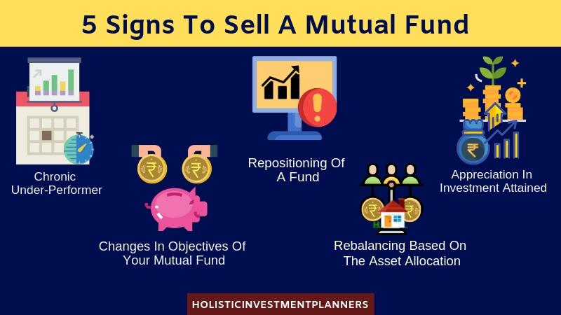

## Table of Contents

## What are mutual funds and how do they work?

Mutual funds are a type of investment where many people pool their money together to buy a variety of stocks, bonds, or other assets. This is managed by a professional who decides what to buy and sell. When you invest in a mutual fund, you are buying shares of the fund, which represent a part of the overall portfolio. This makes it easier for people to invest in a diversified portfolio without having to pick individual stocks or bonds themselves.

When you invest in a mutual fund, the value of your investment can go up or down based on how the assets in the fund perform. The fund manager will regularly update the value of the fund, which is called the Net Asset Value (NAV). You can make money from mutual funds in two main ways: by selling your shares for more than you paid for them, which is called capital gains, or by receiving dividends if the fund distributes profits from the assets it holds. Mutual funds are popular because they offer diversification and professional management, but they also come with fees that can affect your returns.

## Who is the typical target audience for mutual funds?

The typical target audience for mutual funds includes people who want to invest their money but don't have the time or knowledge to pick individual stocks or bonds. These are often everyday people who want to save for things like retirement, buying a house, or their children's education. They like mutual funds because they can invest in a lot of different things at once, which helps spread out the risk.

Another group that often uses mutual funds are people who are just starting to invest. They might feel more comfortable letting a professional manage their money. Also, some people who are already retired might use mutual funds to get a steady income from the dividends the funds pay out. So, mutual funds can be good for a wide range of people, from beginners to those planning for their future.

## What are the different types of mutual funds available to investors?

There are several types of mutual funds that investors can choose from, each designed to meet different investment goals and risk levels. One common type is equity funds, which mainly invest in stocks. These can be further divided into categories like large-cap funds, which invest in big, well-known companies, mid-cap funds, which focus on medium-sized companies, and small-cap funds, which invest in smaller, often riskier companies. Another type is bond funds, which invest in bonds and are generally considered less risky than stock funds. They aim to provide a steady income through interest payments.

There are also balanced funds, which mix stocks and bonds to offer a balance between growth and income. These are good for people who want a bit of both worlds. Then there are money market funds, which invest in very safe, short-term debt and are meant to be a safe place to park money. Sector funds focus on specific industries, like technology or healthcare, and can be riskier because they depend a lot on how that one sector does. Finally, there are index funds, which try to match the performance of a specific market index, like the S&P 500. They are popular because they usually have lower fees and are a simple way to invest in the overall market.

Each type of mutual fund has its own set of risks and rewards, so it's important for investors to think about their own goals and how much risk they're willing to take before choosing a fund. By understanding the different types of mutual funds, investors can pick the ones that best fit their needs and help them reach their financial goals.

## How can a financial advisor identify a client's investment goals and risk tolerance?

A financial advisor can identify a client's investment goals by having a good talk with them. They ask questions like, "What do you want to achieve with your money?" or "Are you saving for retirement, a house, or your kids' education?" By listening carefully, the advisor learns if the client wants to grow their money fast or if they're okay with slower, safer growth. They also ask how soon the client needs the money. If it's soon, they might suggest safer investments. If it's far away, they might go for riskier ones that could grow more over time.

To figure out a client's risk tolerance, the advisor asks about how they feel about losing money. They might say, "How would you feel if your investments went down by 10%?" or "Are you okay with big ups and downs in your investments?" They also look at the client's past experiences with investing. If someone has lost money before and it made them very upset, they might not want to take big risks again. The advisor uses all this information to pick investments that match what the client can handle and what they want to achieve.

## What are the key benefits of investing in mutual funds that should be highlighted to clients?

One big benefit of investing in mutual funds is that they help spread out your risk. When you buy a mutual fund, you're not putting all your money into one company or one type of investment. Instead, your money is spread across many different stocks, bonds, or other assets. This means if one company does badly, it won't hurt your whole investment as much. It's like not putting all your eggs in one basket. This can make investing feel less scary, especially if you're new to it.

Another great thing about mutual funds is that they are managed by professionals. This means you don't have to spend time [picking](/wiki/asset-class-picking) which stocks or bonds to buy. The fund manager does that for you, using their knowledge and experience to try to make your money grow. This can be a big help if you're busy or if you don't feel confident about choosing investments on your own. Plus, mutual funds can be a good way to save for big goals like retirement or buying a house, because they can offer both growth and income over time.

## How can past performance data be used effectively when selling mutual funds?

When you talk about mutual funds to someone, showing them how the fund has done in the past can help them see what it might do in the future. You can show them graphs or charts that tell a story about how the fund has grown over time. This can make people feel more confident about investing because they can see that the fund has done well before. But, it's really important to remind them that past results don't promise future success. The market can change, and what worked before might not work again.

It's also good to compare the fund's past performance with other funds or market indexes. This helps people understand if the fund did better or worse than others. You can point out times when the fund did really well, like during a strong market, or times when it held up better than others during a downturn. This gives a fuller picture of what the fund can do. Just make sure to keep it clear that past performance is just one piece of the puzzle and that they should look at other things too, like fees and the fund manager's strategy.

## What are some common objections clients might have about investing in mutual funds, and how can they be addressed?

Some clients might worry about the fees that come with mutual funds. They think the fees will eat into their returns too much. To help with this, you can explain that while fees are important, they're just one part of the picture. Some funds have lower fees and still do well. It's good to look at the whole package, like how the fund has done in the past and how it's managed. You can also talk about how the benefits of diversification and professional management might be worth the cost.

Another common objection is that clients might not trust the fund manager to make good choices. They might feel safer picking their own investments. To address this, you can say that fund managers are experts who spend all their time studying the market. They have more information and resources than most people do on their own. Plus, mutual funds let you invest in a lot of different things at once, which can be hard to do if you're picking each investment by yourself. It's about balancing the control you want with the help you can get from a professional.

Lastly, some clients might think mutual funds are too complicated or risky. They might have heard stories about people losing money in the market. You can help by explaining that all investments have some risk, but mutual funds can help spread that risk out. You can also break down how mutual funds work in simple terms, showing how they can be a good way to save for the future. By focusing on the long-term benefits and the safety that comes from diversification, you can ease their worries and show them that mutual funds can be a smart choice.

## How should a financial advisor explain the fees and costs associated with mutual funds to clients?

When talking about mutual funds, it's important to explain the fees and costs clearly so clients understand what they're paying for. There are mainly two types of fees: the expense ratio and sales loads. The expense ratio is like a yearly fee for managing the fund. It's a percentage of the money you have invested in the fund, and it covers things like the fund manager's salary and other costs to keep the fund running. Sales loads are fees you might pay when you buy or sell shares of the fund. Some funds have a front-end load, which you pay when you buy, and others have a back-end load, which you pay when you sell.

It's helpful to give clients examples to make it easier to understand. Let's say you invest $10,000 in a fund with an expense ratio of 1%. That means you'll pay $100 a year to keep your money in that fund. If there's also a 5% front-end load, you'd pay $500 right when you buy the shares, so only $9,500 of your money would actually go into the fund. These fees can add up over time, so it's important to pick funds with fees that make sense for what you're getting. By explaining it this way, clients can see how fees work and make better choices about which funds to invest in.

## What strategies can be used to diversify a client's portfolio using mutual funds?

To diversify a client's portfolio using mutual funds, you can start by picking funds that invest in different types of assets. For example, you could choose some equity funds that invest in stocks, some bond funds that invest in bonds, and maybe even some money market funds for safety. This way, if one type of investment goes down, the others might still do well, balancing out the risk. You can also look at funds that focus on different parts of the world, like one fund that invests in U.S. companies and another that invests in international companies. This can help protect the portfolio from problems in just one country or region.

Another strategy is to use funds that focus on different sizes of companies. You might choose a large-cap fund that invests in big, well-known companies, a mid-cap fund for medium-sized companies, and a small-cap fund for smaller, riskier companies. Each of these can behave differently in the market, so having a mix can help spread out the risk. You can also think about sector funds, which invest in specific industries like technology or healthcare. By including a few different sector funds, you can make sure your client's money isn't all tied up in one industry that might not do well. The key is to spread the investments across many different types of funds to create a balanced and diversified portfolio.

## How can a financial advisor keep clients informed and engaged with their mutual fund investments?

A financial advisor can keep clients informed and engaged with their mutual fund investments by regularly updating them on how their funds are doing. This can be done through quarterly or yearly reports that show how the funds have performed and any changes that have been made. It's important to use simple language and maybe even some graphs or charts to make the information easy to understand. By explaining things clearly, clients can feel more in control and trust that their money is being looked after well.

Another way to keep clients engaged is by setting up regular meetings or check-ins. During these meetings, the advisor can talk about the client's goals and see if anything has changed. They can also discuss any new funds that might be a good fit or explain why certain funds are still the best choice. By making these meetings friendly and helpful, clients feel more involved in their investments. They'll be more likely to stick with their plan and feel good about working with their advisor.

## What advanced analysis techniques can be used to select the best mutual funds for clients?

One advanced analysis technique to select the best mutual funds for clients is by using quantitative analysis. This involves looking at numbers and data to see how a fund has done in the past. Advisors can use special tools to calculate things like the fund's alpha, which shows how well it did compared to the market, and its beta, which tells how much it moves with the market. They can also look at the Sharpe ratio, which helps see if the fund's returns are worth the risk. By using these numbers, advisors can pick funds that have a good track record and fit well with what the client wants.

Another technique is qualitative analysis, which looks at things that numbers can't tell you. This includes checking out the fund manager's experience and how they make decisions. Advisors can read reports and listen to interviews to learn about the manager's strategy and how they've handled tough times in the market. They can also look at the fund's investment style, like if it focuses on growth or value, and see if it matches the client's goals. By combining both quantitative and qualitative analysis, advisors can choose mutual funds that not only have strong numbers but also a solid plan and good leadership.

## How can a financial advisor leverage technology and tools to enhance their mutual fund sales strategy?

A financial advisor can use technology and tools to make selling mutual funds easier and better. One way is by using software that helps them keep track of how mutual funds are doing. This software can show them charts and graphs that make it easy to see which funds are doing well and which ones are not. They can also use tools that help them find the best funds for each client based on things like the client's goals and how much risk they want to take. By using these tools, advisors can show clients clear and simple information that helps them understand why certain funds are a good choice.

Another way technology helps is by making it easier to talk to clients. Advisors can use apps and online platforms to send updates and reports to clients quickly. They can also set up meetings and share information through video calls, which can be more convenient for everyone. By using these tools, advisors can keep clients more involved and informed about their investments. This can make clients feel more confident and happy with their advisor, which can lead to more sales and a stronger relationship.

## References & Further Reading

[1]: Bergstra, J., Bardenet, R., Bengio, Y., & Kégl, B. (2011). ["Algorithms for Hyper-Parameter Optimization."](https://dl.acm.org/doi/10.5555/2986459.2986743) Advances in Neural Information Processing Systems 24.

[2]: ["Advances in Financial Machine Learning"](https://www.amazon.com/Advances-Financial-Machine-Learning-Marcos/dp/1119482089) by Marcos Lopez de Prado

[3]: ["Evidence-Based Technical Analysis: Applying the Scientific Method and Statistical Inference to Trading Signals"](https://www.amazon.com/Evidence-Based-Technical-Analysis-Scientific-Statistical/dp/0470008741) by David Aronson

[4]: ["Machine Learning for Algorithmic Trading"](https://github.com/stefan-jansen/machine-learning-for-trading) by Stefan Jansen

[5]: ["Quantitative Trading: How to Build Your Own Algorithmic Trading Business"](https://www.amazon.com/Quantitative-Trading-Build-Algorithmic-Business/dp/1119800064) by Ernest P. Chan