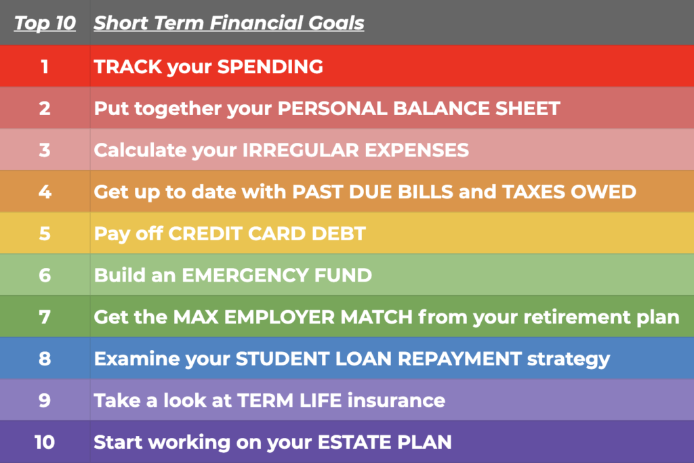

## Table of Contents

## What are short-term savings goals?

Short-term savings goals are targets you set to save money for things you want or need soon, usually within a year. These goals help you plan your spending and make sure you have enough money for important things coming up. For example, you might save for a holiday, a new phone, or to pay off a small debt. By setting these goals, you can avoid using credit cards or loans, which can add extra costs.

To set a short-term savings goal, first decide what you want to save for and how much it will cost. Then, figure out how long you have to save that amount. You can break it down into smaller, weekly or monthly savings targets. For instance, if you want to save $1,200 for a vacation in 12 months, you need to save $100 each month. Keeping track of your progress and adjusting your spending can help you reach your goal on time.

## Why is it important to set short-term savings goals?

Setting short-term savings goals is important because it helps you plan your money better. When you know what you want to save for, like a new phone or a holiday, you can make sure you have enough money when you need it. This planning stops you from spending too much on things you don't really need and helps you avoid using credit cards or loans, which can cost you more money in the end.

Having short-term savings goals also keeps you motivated. When you see your savings grow little by little, it feels good and makes you want to keep saving. It's like a small win every time you reach a goal, and these wins can make you feel more in control of your money. Plus, saving for short-term goals can teach you good habits that will help you save for bigger things in the future.

## How can someone start setting short-term savings goals?

To start setting short-term savings goals, first think about what you want to save for in the next few months or a year. It could be something like a new pair of shoes, a special event, or even a small emergency fund. Once you know what you want, figure out how much it will cost. For example, if you want to buy a new phone that costs $500, that's your savings goal.

Next, decide how long you have to save up that amount. If you want to buy the phone in 10 months, you need to save $50 each month. You can break this down even further into weekly savings, which would be about $12.50 a week. Write down your goal and how much you need to save each week or month. This will help you stay on track and make sure you reach your goal on time.

Keeping track of your progress is important. You can use a notebook, a spreadsheet, or a savings app to see how you're doing. If you're falling behind, you might need to cut back on some spending or find ways to earn a bit more money. Every time you reach a short-term savings goal, it feels great and helps you learn how to manage your money better for the future.

## What are some common short-term savings goals for beginners?

Common short-term savings goals for beginners often include saving for a new phone or a special event like a birthday party. Many people start by saving a small amount each month to buy something they really want but don't need right away. For example, if you want to buy a new phone that costs $300, you might save $25 a month for a year to reach that goal. Another common goal is to save for a fun event, like a concert or a trip with friends. These goals help beginners learn how to set aside money regularly and see their savings grow over time.

Another popular short-term savings goal is building an emergency fund. This is money you keep aside for unexpected costs, like a car repair or a sudden doctor's visit. Beginners might aim to save $500 to $1,000 for this purpose, putting away a little each month until they reach their target. Saving for an emergency fund teaches beginners the importance of being prepared for surprises and helps them feel more secure about their finances. By starting with these simple goals, beginners can build good saving habits that will help them in the long run.

## How much should one aim to save for short-term goals?

The amount you should aim to save for short-term goals depends on what you want to save for. If you're saving for something small, like a new pair of shoes or a birthday gift, you might aim to save $50 to $200. For bigger short-term goals, like a new phone or a short trip, you might need to save $300 to $1,000. The key is to pick a goal that's important to you and figure out how much it will cost.

Once you know the cost, decide how long you have to save that amount. If you want to buy a new phone that costs $500 in 10 months, you'll need to save about $50 each month. It's helpful to break it down into smaller weekly savings, like $12.50 a week, to make it easier to reach your goal. By setting a clear target and saving regularly, you can reach your short-term goals and feel good about managing your money.

## What are effective budgeting techniques for short-term savings?

To save money for short-term goals, you can use a simple budgeting technique called the 50/30/20 rule. This means you spend 50% of your money on things you need, like rent and food, 30% on things you want, like going out with friends, and save the other 20% for your short-term goals. If you make $1,000 a month, you would spend $500 on needs, $300 on wants, and save $200. This rule helps you see where your money goes and makes sure you save some every month.

Another good way to budget for short-term savings is to use the envelope system. With this method, you put cash into different envelopes labeled for different things, like groceries, fun, and savings. If you want to save $100 a month for a new phone, you put $100 in the savings envelope each month. When the envelope is full, you've reached your goal. This system helps you see your savings grow and keeps you from spending money you meant to save. By using these simple budgeting techniques, you can reach your short-term savings goals more easily.

## How can one track progress towards short-term savings goals?

To track your progress towards short-term savings goals, you can use a simple notebook or a spreadsheet. Write down your goal and how much you need to save each week or month. Every time you save money, write it down. This way, you can see how close you are to reaching your goal. For example, if you want to save $500 for a new phone in 10 months, you can write down that you need to save $50 a month. Each month, you can check if you saved the right amount and see how much more you need.

Another easy way to track your savings is by using a savings app on your phone. Many apps let you set a goal and show you a chart of your progress. You can see how much you've saved and how much more you need to save. Some apps even send you reminders to save money each week or month. This can help you stay on track and feel good about the progress you're making towards your short-term savings goals.

## What are some advanced strategies for accelerating short-term savings?

One advanced strategy to speed up your short-term savings is to automate your savings. You can set up a direct deposit from your paycheck into a separate savings account. This way, you save money without even thinking about it. If you get paid $1,000 a month and want to save $200 for a trip, you can have $200 automatically moved to your savings account each month. This helps you reach your goal faster because you're saving money before you have a chance to spend it.

Another strategy is to find ways to earn extra money. You could take on a part-time job, sell things you don't need, or do freelance work. If you make an extra $100 a week, you can put that money straight into your savings. This extra income can help you reach your short-term savings goals much quicker. By combining these strategies, you can save more money in less time and enjoy the things you're saving for sooner.

## How can one adjust savings strategies based on changing financial situations?

If your money situation changes, you might need to change how you save. If you get more money, like a raise at work, you can save more each month. For example, if you were saving $50 a month for a new phone and now you have an extra $100 a month, you can save $150 instead. This will help you reach your goal faster. On the other hand, if you have less money because you lost your job or had a big bill, you might need to save less or find other ways to make money. Maybe you can save $25 a month instead of $50, or you could sell some things you don't need to add to your savings.

It's important to keep checking your savings plan and see if it's working. If you find it hard to save the amount you planned, you can try to cut back on spending or find ways to earn a bit more money. For example, if you were saving for a trip but now you need to fix your car, you might need to change your goal to saving for the car repair first. By being flexible and ready to change your savings plan, you can still reach your short-term goals even when your money situation changes.

## What role do financial tools and apps play in managing short-term savings?

Financial tools and apps make it easier to manage your short-term savings. They let you set a savings goal, like saving for a new phone or a trip, and track how much you've saved. You can see a chart that shows your progress and how much more you need to save. Some apps even send you reminders to save money each week or month. This helps you stay on track and feel good about saving.

These tools also help you plan your money better. You can use them to make a budget and see where your money is going. Some apps let you move money automatically from your paycheck into a savings account. This way, you save money without even thinking about it. By using financial tools and apps, you can reach your short-term savings goals faster and learn good habits for managing your money.

## How can one avoid common pitfalls when saving for short-term goals?

One common pitfall when saving for short-term goals is spending money on things you don't really need. It's easy to see something you want and buy it right away, but this can slow down your savings. To avoid this, make a list of what you really need to save for and stick to it. If you see something you want, wait a few days before buying it. Often, you'll find you don't need it as much as you thought.

Another pitfall is not having a clear plan. If you don't know how much you need to save or how long it will take, it's hard to stay on track. To avoid this, set a specific goal and break it down into smaller, weekly or monthly savings targets. Write down your plan and check it often to see how you're doing. If you're falling behind, you can adjust your spending or find ways to earn a bit more money to reach your goal on time.

## What are expert tips for optimizing short-term savings in various economic conditions?

In good economic times, when you have more money or jobs are easier to find, you can save more for your short-term goals. You might get a raise at work or find a better-paying job. This extra money can help you reach your goals faster. You can also put more money into a savings account that earns interest, so your savings grow even more. It's a good idea to keep saving even when things are going well, so you're ready for any surprises.

In tough economic times, when money is tight or jobs are hard to find, you need to be careful with your savings. You might need to save less each month or change your goals to something smaller. It's important to cut back on spending and find ways to earn extra money, like selling things you don't need or doing freelance work. Even saving a little bit each month can add up over time. By being flexible and ready to adjust your plan, you can still reach your short-term savings goals, no matter what the economy is doing.

## References & Further Reading

For readers keen on gaining a more comprehensive understanding of the topics covered in this article, a variety of resources are available that delve deeper into algorithmic trading, short-term investment strategies, and broader financial planning.

### Books
1. **"Algorithmic Trading: Winning Strategies and Their Rationale" by Ernie Chan** - This book provides insights into designing and implementing successful algorithmic trading strategies, with a focus on practical applications.
2. **"Short-Term Trading Strategies That Work" by Larry Connors and Cesar Alvarez** - This resource offers tested strategies for short-term stock trading, suitable for both individual and professional traders.
3. **"The Bogleheads' Guide to Retirement Planning" by Taylor Larimore et al.** - For those interested in personal finance, this guide covers comprehensive financial planning and investment strategies that align with long-term goals.

### Articles
1. **"Algorithmic and High-Frequency Trading" by Alvaro Cartea, Sebastian Jaimungal, and José Penalva** - Published in major financial journals, this article analyzes the impacts and methodologies of algo trading.
2. **"Strategies for Education, Skills, and Lifelong Learning" in OECD Economic Outlook** - Explores various educational strategies that can enhance financial literacy and decision-making skills in a rapidly evolving financial landscape.

### Online Resources
1. **Investopedia** - A broad platform offering articles and tutorials on financial planning, investment strategies, and the use of technology in finance, including algorithmic trading.
2. **Khan Academy** - Offers free courses on economics and finance, which can be helpful for foundational learning in investment and trading strategies.

### Emerging Trends
- Subscribing to financial and technology journals like *The Journal of Portfolio Management* can keep readers updated on current trends and emerging technologies in the financial industry.
- Explore blogs and webinars hosted by financial experts and tech companies that specialize in the development of trading algorithms and investment technologies, such as QuantConnect and Alpaca.

Readers are encouraged to explore these resources to remain informed about the latest innovations and strategies in finance, providing a solid foundation for making informed investment decisions and enhancing overall financial planning.

