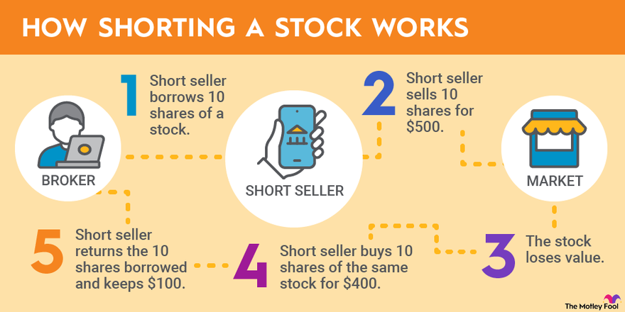

## Table of Contents

## What does it mean to short the U.S. bond market?

To short the U.S. bond market means to bet that the prices of U.S. government bonds will go down. When you short something, you are borrowing it and selling it with the hope of buying it back later at a lower price. In the case of the U.S. bond market, if you think bond prices will fall, you can short them. If the prices do fall, you can buy the bonds back at the lower price, return them to the lender, and keep the difference as profit.

Shorting the bond market can be risky because if bond prices go up instead of down, you could lose money. You would have to buy the bonds back at a higher price than you sold them for, which means you would have to pay back more than you received. This is why shorting is considered a high-risk strategy. It's important to understand the market and have a good reason to believe that bond prices will fall before deciding to short the U.S. bond market.

## Why might someone want to short the U.S. bond market?

Someone might want to short the U.S. bond market if they think that bond prices are going to go down. This could happen if they believe that interest rates are going to rise. When interest rates go up, the prices of existing bonds usually go down. So, if someone thinks that the Federal Reserve is going to raise interest rates, they might decide to short the bond market to make money from the falling prices.

Another reason someone might want to short the U.S. bond market is if they think that the U.S. government's credit rating is going to get worse. If people start to think that the U.S. government is less likely to pay back its debts, they will want to sell their bonds, which will make the prices go down. By shorting the bond market, someone can make money if this happens. But shorting is risky, so people need to be careful and really understand the market before they do it.

## What are the basic risks associated with shorting bonds?

Shorting bonds can be risky because if the price of the bond goes up instead of down, you lose money. When you short a bond, you borrow it and sell it, hoping to buy it back cheaper later. But if the bond's price rises, you have to buy it back at a higher price than you sold it for. This means you lose money because you have to pay more to return the bond than what you got from selling it.

Another risk is that there's no limit to how much you can lose. If the bond price keeps going up, your losses can keep growing. Unlike buying a bond, where the most you can lose is what you paid for it, shorting has the potential for unlimited losses. This is why shorting bonds is considered a high-risk strategy and should be done carefully.

## How does interest rate movement affect shorting the U.S. bond market?

When interest rates go up, the prices of bonds usually go down. This is because new bonds will be issued with higher interest rates, making existing bonds with lower rates less attractive to investors. If you have shorted the U.S. bond market, this drop in bond prices can be good for you. You can buy back the bonds you borrowed at a lower price than you sold them for, which means you make a profit.

On the other hand, if interest rates go down, bond prices go up. This can be bad news if you have shorted the bond market. You will have to buy back the bonds at a higher price than you sold them for, which means you lose money. So, when you are thinking about shorting the U.S. bond market, it's important to keep an eye on what the Federal Reserve is doing with interest rates. If you think rates are going to go up, shorting might be a good move, but if rates are going to go down, it could lead to big losses.

## What are the common instruments used to short U.S. bonds?

One common way to short U.S. bonds is by using futures contracts. Futures are agreements to buy or sell a bond at a certain price on a specific date in the future. If you think bond prices will go down, you can sell futures contracts. When the bond prices do go down, you can buy back the futures at a lower price and make a profit. This is a popular way to short the bond market because it's easier than borrowing and selling actual bonds.

Another tool for shorting U.S. bonds is options. Options give you the right, but not the obligation, to buy or sell a bond at a set price before a certain date. If you think bond prices will fall, you can buy put options. These give you the right to sell the bond at a higher price than what you think it will be worth in the future. If the bond price does drop, you can exercise your option and make money from the difference. Options can be a bit more complex, but they offer more flexibility than futures.

Lastly, you can also use exchange-traded funds (ETFs) that are designed to go down when bond prices go down. These are called inverse ETFs. If you buy shares in an inverse bond ETF, you make money when the bond market goes down. This is another way to short the bond market without having to deal with borrowing and selling individual bonds. Each of these methods has its own risks and costs, so it's important to understand them before you decide to short U.S. bonds.

## How can one use futures contracts to short the U.S. bond market?

To short the U.S. bond market using futures contracts, you would sell futures contracts on U.S. Treasury bonds. Futures are agreements to buy or sell something at a set price on a specific date in the future. When you sell these futures, you are betting that the price of the bonds will go down before the date of the contract. If the bond prices do drop, you can buy back the futures at the lower price. The difference between the price you sold the futures for and the price you bought them back at is your profit.

For example, let's say you sell a futures contract for a U.S. Treasury bond at a price of $100, expecting the bond prices to fall. If the bond prices do go down to $95 by the time the contract expires, you can buy back the futures at $95. You make a profit of $5 per contract because you sold at $100 and bought back at $95. However, if the bond prices go up instead, you would lose money. If the price goes up to $105, you would have to buy back the futures at $105, losing $5 per contract. This is why shorting with futures can be risky, but it can also be a way to make money if you think bond prices will fall.

## What role do options play in strategies for shorting U.S. bonds?

Options can be a useful tool for shorting U.S. bonds because they give you the right, but not the obligation, to buy or sell a bond at a set price before a certain date. If you think the price of U.S. bonds will go down, you can buy a put option. This gives you the right to sell the bond at a higher price than you think it will be worth in the future. If the bond price does drop, you can use your put option to sell the bond at the higher price you set in the option. The difference between the price you set and the lower market price is your profit.

Using options to short U.S. bonds can be a bit more complicated than using futures, but it offers more flexibility. With options, you don't have to worry about borrowing and selling actual bonds, which can be tricky. Instead, you can just buy a put option and wait to see if the bond prices go down. However, options do have a cost, called a premium, which you pay upfront. If the bond prices don't go down as you expected, you could lose the money you paid for the option. So, it's important to understand how options work and to be careful when using them to short the bond market.

## How can inverse bond ETFs be utilized in a shorting strategy?

Inverse bond ETFs are a type of investment that goes up in value when bond prices go down. If you think the U.S. bond market is going to fall, you can buy shares in an inverse bond ETF. When the bond prices drop, the value of your ETF shares will go up. This means you can make money without having to borrow and sell actual bonds. It's a simpler way to bet against the bond market because you just buy the ETF like you would buy any other stock.

However, using inverse bond ETFs can be risky. If the bond market goes up instead of down, the value of your ETF shares will go down. This means you could lose money. Also, inverse ETFs often use complex financial strategies to achieve their goals, which can make them more expensive and harder to understand than regular ETFs. So, it's important to do your research and understand how these ETFs work before you decide to use them in a shorting strategy.

## What are some advanced technical analysis techniques for timing entries in a short bond position?

One advanced technical analysis technique for timing entries in a short bond position is using moving averages. Moving averages help smooth out price data to identify trends. You can use two moving averages, one shorter-term and one longer-term, to look for a "death cross." This happens when the shorter-term moving average, like a 50-day moving average, crosses below the longer-term moving average, like a 200-day moving average. When you see this, it can be a sign that bond prices might keep going down, which could be a good time to enter a short position. You'll want to watch these moving averages closely because they can give you a heads-up on when to make your move.

Another technique is using the Relative Strength Index (RSI). The RSI is a [momentum](/wiki/momentum) indicator that measures the speed and change of price movements. It ranges from 0 to 100, and if it goes above 70, it means the bond might be overbought, and if it goes below 30, it might be oversold. For shorting bonds, you might look for times when the RSI is above 70 and starts to fall. This could mean the bond is about to lose value, which would be a good time to short. But remember, RSI is just one tool, and it's best used with other indicators to make sure you're making the right call on when to enter your short position.

## How do macroeconomic indicators influence decisions to short U.S. bonds?

Macroeconomic indicators can help you decide if it's a good time to short U.S. bonds. One important indicator is inflation. If inflation is going up, it can make bonds less attractive because the money you get back from the bond won't be worth as much. If you see that inflation is rising, you might think bond prices will go down, which could be a good time to short them. Another indicator is the unemployment rate. If unemployment is going down, it can mean the economy is doing well, which might make the Federal Reserve raise interest rates. When interest rates go up, bond prices usually go down, so this could be another sign to short U.S. bonds.

Another key indicator is the Gross Domestic Product (GDP). If GDP growth is strong, it can mean the economy is doing well, which might lead to higher interest rates and lower bond prices. On the other hand, if GDP growth is weak, it might mean the economy is struggling, which could make the Federal Reserve keep interest rates low or even lower them, causing bond prices to go up. So, watching GDP can help you decide if it's a good time to short bonds. By keeping an eye on these macroeconomic indicators, you can get a better sense of when to make your move in the bond market.

## What are the tax implications of shorting U.S. bonds?

When you short U.S. bonds, you need to think about taxes. If you make money from shorting bonds, you have to pay taxes on that money. The money you make is called capital gains. If you hold the bonds for less than a year, the gains are short-term and taxed at your regular income tax rate. If you hold them for more than a year, the gains are long-term and usually taxed at a lower rate. But, if you lose money shorting bonds, you can use those losses to lower your taxes. You can subtract those losses from any gains you made that year, and if you still have losses left over, you can use them to lower your taxes in future years.

It's also important to know that if you short bonds, you might have to pay extra taxes on the interest you would have gotten if you owned the bonds. This is called phantom income. Even though you don't actually get the interest because you shorted the bonds, you still have to pay taxes on it. This can make shorting bonds more complicated from a tax point of view. It's always a good idea to talk to a tax advisor to make sure you understand all the tax rules and how they apply to your situation.

## How can one manage and mitigate the risks associated with a short position in the U.S. bond market?

Managing and mitigating the risks of a short position in the U.S. bond market starts with setting clear stop-loss orders. A stop-loss order is like a safety net that tells your broker to buy back the bonds if their price goes up to a certain level. This can help limit how much money you could lose if the bond market doesn't go down like you thought it would. Another way to manage risk is by not putting all your money into one short position. Instead, you can spread your money across different investments. This way, if one short position loses money, you might still make money from your other investments.

Another important way to mitigate risk is by keeping a close eye on economic indicators and news that could affect bond prices. For example, if you hear that the Federal Reserve might raise interest rates, it could be a good sign to short bonds because bond prices usually go down when interest rates go up. But if you hear that the economy is struggling and interest rates might stay the same or go down, you might want to wait before shorting bonds. Staying informed and being ready to change your strategy can help you manage the risks of shorting bonds.

## What is the understanding of the U.S. Bond Market?

The U.S. bond market is distinguished by a wide variety of securities that offer different risk levels, returns, and purposes for investors and issuers. Key categories of bonds include Treasury bonds, corporate bonds, and municipal bonds, each with distinct characteristics and market behaviors.

**Treasury Bonds** are long-term debt securities issued by the U.S. Department of the Treasury with maturities typically ranging from 10 to 30 years. These bonds are considered virtually risk-free since they are backed by the full faith and credit of the U.S. government. Investors view them as a benchmark for stability and a source of predictable income. As highly liquid instruments, they appeal to a broad range of market participants, including foreign governments, institutional investors, and individual savers.

**Corporate Bonds** are issued by corporations to raise capital for business operations, expansion, or other expenditures. These bonds usually offer higher interest rates compared to Treasury bonds due to the increased credit risk associated with corporate issuers. The risk and return profile of corporate bonds varies significantly based on the issuing company's creditworthiness, industry sector, and prevailing economic conditions. Investors rely on credit ratings from agencies like Moody's and Standard & Poor's to assess the default risk.

**Municipal Bonds** are issued by states, cities, and other local government entities to finance public projects like schools, highways, and utilities. These bonds offer tax advantages, often being exempt from federal and sometimes state and local taxes, making them particularly attractive to investors in higher tax brackets. However, investors must evaluate the fiscal health of the issuing municipality to understand the underlying risks.

Bond prices in the U.S. bond market are inversely related to [interest rate](/wiki/interest-rate-trading-strategies) movements. This relationship is captured by the formula:

$$

P = \frac{C}{(1 + r)^n} + \frac{F}{(1 + r)^n} 
$$

where $P$ represents the bond price, $C$ is the annual coupon payment, $F$ is the face value of the bond, $r$ is the required rate of return or yield, and $n$ represents the number of periods until maturity.

The Federal Reserve holds significant sway over interest rates through its monetary policy decisions, such as setting the federal funds rate and engaging in open market operations. Changes in these policies can rapidly influence bond prices and yields across all categories, impacting investment strategies and economic activities.

Investors generally pursue bonds for their relatively stable returns and fixed income, which can serve as a counterbalance to more volatile equity holdings. However, periods of rising interest rates present challenges, as existing bond holdings may lose value, affecting portfolio returns. This sensitivity to interest rate changes requires investors to be vigilant about economic indicators and monetary policy updates.

Participants in the bond market include individual investors, asset managers, insurance companies, pension funds, and governments, each interacting based on their specific investment objectives, risk tolerance, and time horizons. A comprehensive understanding of the various types of bonds and the dynamics influencing their pricing is crucial for effective engagement with the U.S. bond market, enabling informed decisions aligned with financial goals.

## What are the strategies for shorting bonds?

Shorting bonds is a strategy employed by investors who anticipate a decline in bond prices. This approach involves selling bonds that have been borrowed with the intention of buying them back later at a lower price, thus securing a profit from the price differential. The mechanics of shorting bonds require access to bond borrowing facilities, often facilitated by brokerage platforms.

**1. Derivatives as Tools for Shorting:**

Derivatives, such as futures and options, are widely used instruments for taking short positions in the bond market. 

- **Futures Contracts**: A futures contract obligates the buyer to purchase, and the seller to sell, a bond at a predetermined future date and price. Shorting via futures involves committing to sell the bond at a price today, with the aim that the bond's market value will decrease by the contract expiry date. The payoff from a futures short position is given by:
$$
  \text{Payoff} = (\text{Futures Price at initiation} - \text{Futures Price at close}) \times \text{Contract Size}

$$
- **Options**: Options provide more flexibility with limited downside risk compared to futures. A put option gives the holder the right to sell the bond at a specified price before the option expires. If bond prices fall, the put option can be exercised to sell the bond at the higher strike price.

**2. Inverse Bond ETFs:**

Inverse bond Exchange-Traded Funds (ETFs) offer a straightforward strategy for retail investors to gain short exposure to bonds without engaging directly in borrowing and selling bonds. These ETFs are designed to yield returns inversely proportional to the bond index they track. For example, if the value of the index decreases by 1%, the inverse [ETF](/wiki/etf-trading-strategies) aims to increase by approximately 1%. Such ETFs can be an appropriate choice for investors seeking a less complex vehicle for short exposure.

**3. Key Considerations:**

Several factors should be thoroughly evaluated before undertaking a short position in the bond market:

- **Leverage**: Many short-selling strategies, especially those involving derivatives, can involve significant leverage, amplifying both potential returns and losses. Investors should assess their risk tolerance and leverage capacity.

- **Interest Rate Forecasting**: Successful shorting hinges on accurate predictions of future interest rate movements. An increase in interest rates typically causes bond prices to fall, benefiting short positions. However, forecasting interest rate changes involves understanding macroeconomic indicators, Federal Reserve policy directions, and global economic conditions.

- **Risk Management**: The risks associated with shorting bonds include market risk, liquidity risk, and the risk of a short squeeze. A short squeeze occurs when a bond’s price rises, forcing short sellers to buy back the bond, often at a loss, to cover their positions.

Implementing hedging strategies, like pairing a short position with a long position in another security, can mitigate potential losses. Furthermore, diversifying short positions across various bond categories or maturities can help spread risk.

In conclusion, shorting bonds is a sophisticated strategy that can yield significant returns amid falling bond prices, provided investors diligently manage the associated risks and leverage appropriate financial instruments.

## References & Further Reading

[1]: ["Trading and Hedging with an Emphasis on Hedge Funds"](https://www.investing.com/academy/trading/what-are-hedge-funds/) by Rajna Gibson, François-Serge Lhabitant, and Denis Talay

[2]: ["Financial Risk Management: Models, History, and Institutions"](https://www.wiley.com/en-us/Financial+Risk+Management%3A+Models%2C+History%2C+and+Institutions-p-9781118022917) by Allan M. Malz

[3]: Paddrik, M., Hayes, R., Todd, A., Yang, S., & Beling, P. (2012). ["An Agent-Based Model of the E-Mini S&P 500 and Treasury Note Markets."](https://papers.ssrn.com/sol3/papers.cfm?abstract_id=1932152) Social Science Research Network

[4]: ["Inside the Yield Book: The Classic That Created the Science of Bond Analysis"](https://www.amazon.com/Inside-Yield-Book-Classic-Analysis/dp/111839013X) by Martin L. Leibowitz, Sidney Homer, and Stanley Kogelman

[5]: Fabozzi, F. J., & Mann, S. V. (Eds.). (2005). ["The Handbook of Fixed Income Securities."](https://www.mhebooklibrary.com/doi/book/10.1036/9781260473902) McGraw-Hill