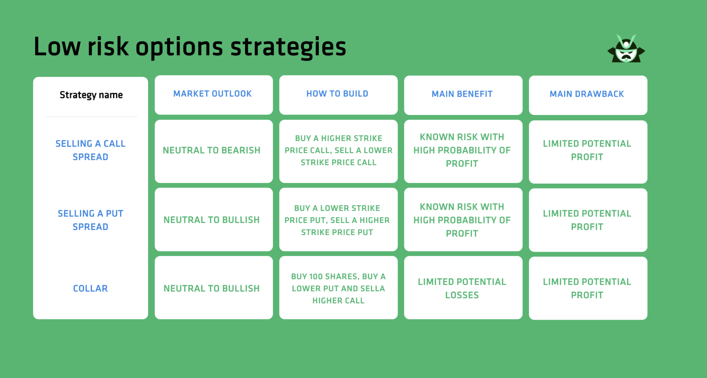

Financial markets serve as platforms for the trading of various instruments, including stocks, bonds, and derivatives. Among these, options trading stands out as a significant component, offering traders the right, but not the obligation, to buy or sell an underlying asset at a predetermined price before or on a specific date. Options are versatile financial instruments that can be used for hedging, speculation, or to enhance returns on investment. They allow for a multitude of strategies based on market expectations and risk tolerance.

Profit-taking strategies in options trading play a critical role for traders aiming to maximize their returns while mitigating risks. These strategies typically involve setting specific targets—often referred to as profit targets—and establishing stop-loss levels to protect against adverse market movements. By assessing the potential risk-reward ratios, traders can make informed decisions on when to exit a position to capitalize on favorable price movements while limiting potential losses.



With the advancement of technology, algorithmic trading, commonly known as algo trading, has become increasingly prevalent in financial markets. Algo trading utilizes computer algorithms to execute trades at speeds and frequencies that surpass human capabilities. This method enhances trading efficiency through improved speed, accuracy, and the ability to process vast amounts of data in real time. In the context of options trading, algos can be programmed to execute profit-taking strategies based on pre-defined criteria, thus optimizing trade outcomes.

This article aims to explore the integration of profit-taking strategies with algorithmic trading in options. By blending traditional methodologies with cutting-edge technological advancements, traders can potentially achieve superior results in their trading endeavors. Additionally, with the proliferation of digital content, the role of Search Engine Optimization (SEO) becomes crucial in ensuring the visibility and reach of financial information. Effective SEO practices help disseminate critical financial insights to a broader audience, enhancing the trading acumen of market participants. As the article unfolds, the focus will be on how these elements interact to enhance trading strategies and decision-making processes in modern financial markets.

## Table of Contents

## Understanding Options Trading

Options trading is a sophisticated financial instrument employed by traders to gain leverage and manage risks in financial markets. At its core, an option is a contract that grants the buyer the right, but not the obligation, to either buy (call option) or sell (put option) an underlying asset at a predetermined price, known as the strike price, before or at the contract's expiration date. The underlying assets can include stocks, commodities, indices, or currencies.

There are two primary types of options: call options and put options. A call option provides the holder with the right to purchase the underlying asset, typically favorable when the market price is expected to rise above the strike price. Conversely, a put option gives the holder the right to sell the underlying asset, which can be advantageous when the market price is anticipated to fall beneath the strike price. Options, therefore, offer strategic flexibility as traders can speculate on the direction of asset prices and hedge their investment portfolios against potential losses.

Options trading is marked by several benefits and risks. Among the benefits is leverage, as options allow traders to control large positions in the underlying asset with a relatively small initial investment compared to buying the asset outright. Additionally, options can be used for hedging, allowing traders to mitigate potential losses in their portfolios. They are also versatile, providing opportunities for various strategic plays against asset movements.

However, options trading carries inherent risks. The most common risk involves the potential to lose the premium paid for the option if the market does not move in the trader's favor. Moreover, the complexity of understanding option pricing, influenced by factors like time decay, [volatility](/wiki/volatility-trading-strategies), and interest rates, adds layers of challenges. The premium and expiration date may result in the complete loss of invested capital if the market conditions do not align with the trader's predictions.

Mastering options trading is crucial for traders aiming to implement effective trading strategies. This mastery involves understanding the mechanisms behind options pricing, known as the Greeks—Delta, Gamma, Vega, Theta, and Rho—which measure the sensitivity of the option's price in relation to different factors. Additionally, traders need to develop the skill of identifying suitable options strategies, such as spreads, straddles, and strangles, to align with their market outlook and risk tolerance.

In conclusion, options trading represents a powerful tool for traders seeking leverage and risk management in financial markets. With its potential for high returns paired with significant risks, gaining proficiency in options is pivotal for executing effective and strategic trading initiatives.

## Profit-Taking Strategies in Options Trading

Options trading involves sophisticated strategies to maximize profits and mitigate losses. A sound profit-taking strategy is crucial in navigating volatile markets. Several strategies are prominent among traders, primarily focusing on setting profit targets, establishing stop-loss levels, assessing risk-reward ratios, and adapting to market conditions.

Setting clear profit targets is fundamental in options trading. Traders define a specific price level at which they will sell their option to lock in profits. This strategy helps prevent greed-driven decisions, which might lead to holding an option too long. Such targets are often determined by technical analysis tools like support and resistance levels, moving averages, or Fibonacci retracement levels. For example, if an options trader purchases a call option expecting a stock price to rise to $150 from its current $130, setting a profit target at $145 allows the trader to capture most of the anticipated gain while managing risks if the price reverses. 

Equally important is the setting of stop-loss orders, used to minimize potential losses. By establishing pre-defined levels at which to [exit](/wiki/exit-strategy) a losing position, traders protect their capital from excessive drawdowns. This technique is particularly effective in volatile environments or when trading risky options like out-of-the-money calls or puts. For instance, a trader might set a stop-loss order at 10% below the purchase price of the option premium, ensuring that possible losses remain manageable.

Evaluating risk-reward ratios is another critical element. This involves comparing the potential profit of a trade to the potential loss, which helps traders decide if a trade is worth pursuing. A favorable risk-reward ratio is typically 1:2 or 1:3. If the maximum potential loss is $100, the expected profit should ideally be $200 to $300. This analysis guides traders in selecting options positions that align with their risk appetites and financial goals.

Market conditions play a significant role in shaping profit-taking strategies in options trading. Economic indicators, corporate earnings announcements, geopolitical events, and market sentiment can influence price movements and volatility. During high volatility periods, traders might opt for strategies like straddles or strangles, which profit from large price swings regardless of direction. Conversely, in stable markets, traders might favor credit spreads or covered calls aimed at capitalizing on time decay.

In conclusion, an adept approach to options trading requires setting strategic profit targets, implementing stop-loss levels, evaluating risk-reward scenarios, and adjusting strategies based on market conditions. By incorporating these practices, traders enhance their ability to pursue lucrative opportunities while safeguarding against unnecessary risks.

 to Algorithmic Trading

Algorithmic trading, often referred to as "algo trading," involves the use of computer algorithms to automate trading decisions and execute orders in financial markets. These algorithms utilize computational power to analyze large data sets, identify patterns, and execute trades at speeds and frequencies that would be impossible for a human trader. By leveraging mathematical models and complex strategies, algo trading aims to maximize returns, reduce transaction costs, and minimize risks.

One of the primary advantages of [algorithmic trading](/wiki/algorithmic-trading) is its speed and efficiency. Algorithms can process vast amounts of data within milliseconds, enabling traders to capitalize on short-lived market opportunities that manual trading would miss. Additionally, algorithms operate with high accuracy, eliminating human errors that can occur due to emotional or psychological biases, such as fear or greed. This precision makes algo trading particularly effective in volatile markets.

However, these advantages are accompanied by significant challenges and risks. One major concern is the reliance on technology and data quality; poor data or software bugs can lead to incorrect trading decisions and substantial financial losses. Furthermore, the increasing prevalence of algo trading has contributed to market fragmentation and may exacerbate the incidence of flash crashes—sudden, severe market downturns triggered by automated trading activities.

In the context of options trading, algorithmic trading fundamentally alters traditional profit-taking strategies. Options trading involves various complex trades, such as options spreads or straddles, which are enhanced by algorithmic approaches. Algos can adapt to changing market conditions to optimize times to take profits or cut losses, considering factors like implied volatility, options Greeks (delta, gamma, theta, etc.), and market [liquidity](/wiki/liquidity-risk-premium). 

For example, an algorithm could be designed to exploit statistical [arbitrage](/wiki/arbitrage) opportunities by calculating real-time mispricings in options compared to historical pricing models. Python, a popular programming language for algo trading, might be used to implement such strategies. Using libraries like NumPy and Pandas, a Python script could continuously update an options pricing model and execute trades when prices deviate beyond a pre-set threshold:

```python
import numpy as np
import pandas as pd

# Sample function for calculating theoretical option price
def calculate_option_price(S, K, T, r, sigma):
    # S: stock price, K: strike price, T: time to maturity, r: risk-free rate, sigma: volatility
    # Use a simplified Black-Scholes formula
    d1 = (np.log(S / K) + (r + 0.5 * sigma ** 2) * T) / (sigma * np.sqrt(T))
    d2 = d1 - sigma * np.sqrt(T)
    call_price = S * norm.cdf(d1) - K * np.exp(-r * T) * norm.cdf(d2)
    return call_price

# Mock data
current_stock_price = 100
strike_price = 105
time_to_expiry = 30/365
risk_free_rate = 0.01
volatility = 0.2

# Calculate option price
option_price = calculate_option_price(current_stock_price, strike_price, time_to_expiry, risk_free_rate, volatility)

# Logic for potential trade execution
if market_option_price < option_price:
    execute_trade("buy option")
elif market_option_price > option_price * 1.1:
    execute_trade("sell option")
```

Through such applications, algorithmic trading enables traders to develop sophisticated strategies that automate and enhance the decision-making process in options trading, providing a cutting-edge approach to maximizing profits in the financial markets.

## Integrating Algo Trading with Options Profit-Taking Strategies

Integrating algorithmic trading with options profit-taking strategies involves leveraging the power of algorithms to implement, monitor, and optimize trading activities in options markets. This integration combines the computational strength of algorithms with strategic trading methodologies to enhance decision-making processes and maximize profitability.

### Techniques for Blending Algorithmic Trading with Profit-Taking Strategies in Options

One of the key techniques in blending algorithmic trading with options profit-taking strategies involves the development of rules-based systems. These systems use predefined criteria to automatically execute trades, ensuring consistent application of strategies without the influence of human emotions. For instance, a trader might define a rule where an option is sold once it achieves a specific percentage gain relative to its purchase price. These rules are programmed into algorithmic systems enabling quick and precise executions.

### Case Studies of Successful Integrations

Several case studies highlight successful integrations of algorithmic strategies in options trading. A notable example includes the use of high-frequency trading ([HFT](/wiki/high-frequency-trading-strategies)) algorithms in the options markets. These algorithms rapidly analyze market data and execute trades within milliseconds, capturing small price discrepancies across various markets. HFT firms often employ delta-neutral strategies, where they dynamically hedge options to maintain a neutral portfolio risk, exploiting short-term market inefficiencies. Another example is the implementation of straddle and strangle strategies using [machine learning](/wiki/machine-learning) algorithms which adjust positions based on historical patterns and predictive analytics.

### Tools and Technologies for Automation

A range of tools and technologies facilitates the automation of options trading strategies. Trading platforms like MetaTrader and NinjaTrader offer robust environments for developing and [backtesting](/wiki/backtesting) algorithms. These platforms provide APIs that allow users to connect custom algorithms with real-time data feeds and broker accounts for automated execution. Additionally, programming languages such as Python are widely used due to their extensive libraries like NumPy, pandas, and scikit-learn, which are invaluable for data analysis and developing sophisticated trading algorithms. The snippet below is a simple example of using Python for backtesting an algorithmic profit-taking strategy:

```python
import pandas as pd
import numpy as np

# Load historical options data
data = pd.read_csv('options_data.csv')

# Define a simple moving average crossover strategy
data['SMA_short'] = data['Close'].rolling(window=5).mean()
data['SMA_long'] = data['Close'].rolling(window=20).mean()

# Generate trading signals
data['Signal'] = np.where(data['SMA_short'] > data['SMA_long'], 1, -1)

# Calculate returns based on signals
data['Returns'] = data['Signal'].shift(1) * (data['Close'].pct_change())

# Implement stop-loss and profit-taking criteria
data['Strategy_Returns'] = np.where(data['Returns'] > 0.05, 0.05, data['Returns'])  # Profit cap at 5%
data['Strategy_Returns'] = np.where(data['Strategy_Returns'] < -0.02, -0.02, data['Strategy_Returns'])  # Stop-loss at 2%
```

### Role of Data Analytics in Optimizing Profit-Taking

Data analytics plays a critical role in optimizing profit-taking strategies within algorithmic trading. By analyzing large datasets, algorithms can identify patterns and trends that might not be evident to human traders. Predictive modeling and machine learning techniques enhance decision-making by forecasting price movements and market conditions. For example, sentiment analysis algorithms can process news articles, social media feeds, and earnings reports to gauge market sentiment and adjust trading strategies accordingly. Additionally, clustering algorithms can categorize options into different risk profiles, allowing traders to tailor profit-taking strategies to suit the volatility and dynamics of each cluster.

In summary, the integration of algorithmic trading with options profit-taking strategies leverages advanced technologies and data analytics to develop efficient, responsive trading systems. By incorporating predefined rules and real-time data analysis, traders can achieve consistent performance and adapt to rapidly changing market conditions.

## SEO Techniques for Financial Markets Content

Search Engine Optimization (SEO) is crucial for ensuring that content related to financial markets, particularly options trading, reaches its audience effectively. In a competitive field like finance, where timely and accurate information is vital, effective SEO can differentiate between content that gets noticed and content that doesn't. 

**Importance of SEO in Financial Markets and Options Trading Content**

SEO plays a vital role in making sure financial articles, especially regarding options trading, are visible to the intended audience, such as traders, investors, and financial analysts. High visibility ensures increased traffic to the content, leading to better engagement and potentially influencing trading decisions. As financial markets operate on information dissemination and analysis, accessible and optimized content can significantly impact a trader's profitability and market understanding.

**Key SEO Practices to Enhance Visibility of Financial Trading Articles**

Optimizing financial content for search engines involves several best practices:

1. **Keyword Research and Usage**: Identifying and strategically using keywords such as 'financial markets', 'options trading', 'algo trading', and 'profit-taking strategies' is essential. Keywords should be integrated naturally into the content to enhance relevance without sacrificing readability.

2. **Content Quality and Relevance**: Producing high-quality, authoritative content that provides insights, data, and expert opinions enhances credibility and user engagement. Content must stay updated with the latest market trends and trading techniques to remain relevant.

3. **Technical SEO**: Ensuring that the website's technical aspects, such as page load speed, mobile optimization, and secure sockets layer (SSL) encryption, are up to mark is crucial for enhancing user experience and improving search engine ranking.

4. **Backlinks and Citations**: Establishing strong backlink profiles by having other reputable financial websites link to your content can significantly boost SEO. Citing credible sources strengthens the content's authority.

5. **Engagement Metrics**: Utilizing engaging formats like videos, infographics, or podcast summaries can increase the time visitors spend on a page, reducing bounce rates and indicating to search engines that the content is valuable.

**Utilizing Keywords Effectively**

Keywords should be used strategically in titles, subheadings, and throughout the text, following their research to understand search [volume](/wiki/volume-trading-strategy) and competition. Tools like Google AdWords Keyword Planner can assist in this task. Moreover, variations and synonyms should also be integrated to capture a broad audience. For instance, using both 'algo trading' and 'algorithmic trading' can reach distinct audience segments.

**Strategies for Maintaining High-Quality, SEO-Friendly Content**

High-quality content not only ranks better but also builds trust with the audience. To maintain content quality while optimizing for SEO:

- **Stay Updated**: Regularly update content with the latest data and market trends to preserve its accuracy and relevance.
- **Originality**: Original analyses or insights add value, distinguishing the content from generic information readily available.
- **Audience Understanding**: Tailoring content based on audience demographics and preferences enhances engagement and ensures content is both informative and useful to readers.
- **Clear Structure and Formatting**: Utilizing headers, bullet points, and numbered lists helps readers and search engines navigate the content more efficiently.

By employing these SEO techniques, financial and options trading content can achieve greater visibility and impact, thereby reaching and informing a broader audience, which is essential in the ever-evolving financial markets landscape.

## Conclusion

Effective profit-taking strategies in options trading are crucial for maximizing returns while managing risk. These strategies, such as setting profit targets and stop-loss levels, are essential in ensuring that the potential for profit is optimized and that traders do not expose themselves to undue risks. The evaluation of risk-reward ratios plays a significant part in deciding optimal exit points, which is essential for sustaining profitability over the long term. By implementing robust profit-taking strategies, traders can enhance their decision-making processes, ultimately leading to more consistent and favorable outcomes in options trading.

The future of algorithmic trading promises to significantly alter the landscape of financial markets. As algorithmic trading techniques continue to evolve, they are characterized by increased efficiency, speed, and accuracy. These attributes allow traders to execute complex strategies with enhanced precision. The shift towards algorithmic solutions is expected to streamline trading processes, reduce errors, and lead to more effective capital allocation. With advancements in [artificial intelligence](/wiki/ai-artificial-intelligence) and machine learning, algorithmic trading could offer more sophisticated and adaptive strategies, completely transforming how financial data is analyzed and acted upon.

Blending traditional profit-taking strategies with algorithmic techniques offers a comprehensive approach to trading. Traditional strategies provide a foundation of tried-and-tested methods, grounded in human intuition and experience. When these are integrated with algorithmic trading, traders gain the benefit of real-time data analysis and automated execution. This combination enhances the ability to react swiftly to market changes, improving the precision and timing of trades. Such integration is key in the development of robust trading models that leverage both human expertise and technological advancements.

To stay ahead in the competitive world of financial trading, it is crucial to embrace both strategic content and trading innovations. Continuous learning and adaptation to new market conditions and technological developments are essential. By focusing on high-quality, SEO-friendly content, traders and financial professionals can ensure their ideas and strategies reach a wider audience. Furthermore, leveraging data analytics and algorithmic tools enables traders to maintain a competitive edge, offering insights that might not be discernible through traditional methods alone. As the financial markets continue to evolve, the successful intertwining of traditional strategies with algorithmic innovations will spell the difference for those looking to excel in options trading and beyond.

## References & Further Reading

[1]: Bergstra, J., Bardenet, R., Bengio, Y., & Kégl, B. (2011). ["Algorithms for Hyper-Parameter Optimization."](https://papers.nips.cc/paper/4443-algorithms-for-hyper-parameter-optimization) Advances in Neural Information Processing Systems 24.

[2]: ["Advances in Financial Machine Learning"](https://www.amazon.com/Advances-Financial-Machine-Learning-Marcos/dp/1119482089) by Marcos Lopez de Prado

[3]: ["Evidence-Based Technical Analysis: Applying the Scientific Method and Statistical Inference to Trading Signals"](https://www.amazon.com/Evidence-Based-Technical-Analysis-Scientific-Statistical/dp/0470008741) by David Aronson

[4]: ["Machine Learning for Algorithmic Trading"](https://github.com/stefan-jansen/machine-learning-for-trading) by Stefan Jansen

[5]: ["Quantitative Trading: How to Build Your Own Algorithmic Trading Business"](https://www.amazon.com/Quantitative-Trading-Build-Algorithmic-Business-ebook/dp/B097QGPVND) by Ernest P. Chan