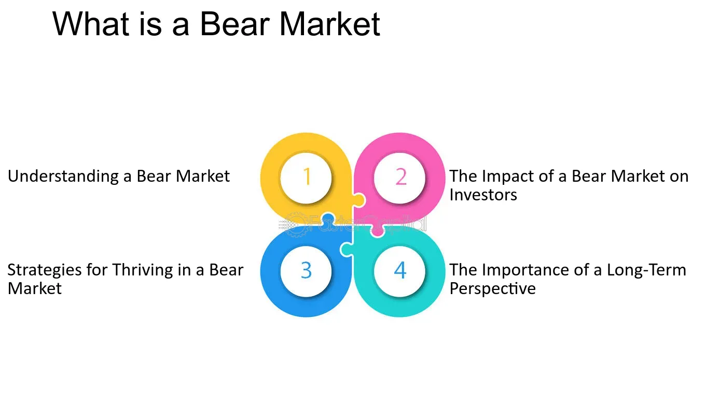

## Table of Contents

## What is a bear market and how is it different from a bull market?

A bear market is a time when the prices of things like stocks go down a lot, usually by 20% or more, and stay down for a while. People feel less confident about buying things and might sell what they own because they think prices will keep falling. This can make the market go down even more. It's like a cycle where fear makes people sell, and selling makes prices drop more.

A bull market is the opposite. It's when prices go up a lot, and people feel good about buying things. They think prices will keep going up, so they buy more, which makes prices rise even more. This cycle of confidence and buying can keep the market growing for a long time. The main difference between a bear and a bull market is how people feel and what they do with their money. In a bear market, people are scared and sell, while in a bull market, people are hopeful and buy.

## What are the common causes of a bear market?

A bear market often starts because of big problems in the economy or the world. For example, if a lot of people lose their jobs, they won't have money to spend, and businesses will make less money. This can make stock prices go down. Also, if there's a big event like a war or a natural disaster, it can scare people and make them sell their stocks quickly, pushing prices even lower.

Another reason for a bear market can be when people think the economy is growing too fast and might crash soon. This fear can make them sell their stocks to avoid losing money. Sometimes, the government or a central bank might raise interest rates to slow down the economy, which can make borrowing money more expensive and slow down business growth, leading to a bear market.

Lastly, bear markets can happen because of problems in the stock market itself. If people find out that a company has been lying about how well it's doing, it can make them lose trust in the market. This can lead to a lot of selling and a drop in stock prices. Also, if too many people are buying stocks with borrowed money and the market starts to fall, they might have to sell quickly to pay back their loans, making the market fall even more.

## How can a beginner identify the onset of a bear market?

A beginner can start to notice a bear market when stock prices start going down a lot, usually by 20% or more, and this drop lasts for a while. You might see news about the stock market losing value over several months. Another sign is when people start talking about the economy slowing down or getting worried about their jobs. If you hear more bad news than good news about businesses and the economy, it could be the start of a bear market.

Another way to spot a bear market is by paying attention to how people feel about the market. If more people are selling their stocks than buying them, it's a sign that confidence is low. You can also look at economic reports that show things like unemployment going up or companies making less money. These reports can give you clues that the economy might be heading into a bear market. If you see these signs happening together, it's a good idea to be careful with your investments.

## What are the basic investment strategies to employ during a bear market?

During a bear market, one good strategy is to not panic and sell all your investments. It might be hard when you see prices going down, but selling everything can make you lose money. Instead, think about keeping some of your investments, especially if they are in strong companies that might recover when the market gets better. This is called "holding on" or "staying the course." Another idea is to look for good deals. When prices are low, you can buy stocks at a cheaper price. This is called "buying the dip." If you believe the market will go up again, buying during a bear market can be a smart move.

Another strategy is to spread your money around, which is called "diversification." Instead of putting all your money in one place, you can invest in different kinds of things like stocks, bonds, and maybe even real estate. This can help protect you if one part of the market does badly. Also, think about putting some money into things that usually do well when the economy is not doing great, like certain types of bonds or gold. These are called "defensive investments." They might not make you a lot of money, but they can help keep your money safe during tough times.

Lastly, you might want to keep some cash on hand. Having cash can be helpful because you can use it to buy investments when prices are low. It also gives you peace of mind knowing you have money available if you need it. Remember, bear markets don't last forever, and being patient and sticking to your plan can help you come out stronger when the market turns around.

## How can diversification help in managing risks during a bear market?

Diversification helps in managing risks during a bear market by spreading your investments across different types of assets. Instead of putting all your money in one place, like just stocks, you can also invest in bonds, real estate, or even commodities like gold. This way, if one part of the market goes down a lot, like stocks during a bear market, the other parts might not go down as much or might even go up. This can help protect your money and keep your losses smaller.

For example, if you only have stocks and the stock market drops a lot during a bear market, you could lose a big part of your money. But if you also have some money in bonds, which usually don't drop as much during tough times, those bonds can help balance out the losses from your stocks. By having a mix of different investments, you're not putting all your eggs in one basket, and that can make your overall investment safer during a bear market.

## What are the psychological challenges investors face in a bear market and how can they be managed?

During a bear market, investors often face big psychological challenges. One common feeling is fear. When stock prices keep going down, it's easy to get scared and think about selling everything to avoid losing more money. This fear can make people make quick decisions without thinking them through. Another challenge is feeling hopeless. When the market is down for a long time, it can feel like things will never get better, which can make investors give up on their plans. Lastly, there's the pressure from others. When everyone around you is talking about the market going down, it can be hard to stay calm and stick to your plan.

To manage these challenges, it's important to stay calm and not let emotions control your decisions. One way to do this is by having a clear plan before a bear market starts and sticking to it, even when things get tough. This plan should include what to do if the market goes down, so you don't have to make big decisions when you're feeling scared. Talking to a financial advisor can also help. They can give you advice and remind you that bear markets don't last forever. It's also helpful to take breaks from watching the news and market updates all the time. This can reduce stress and help you keep a long-term view, knowing that the market will eventually recover.

## What advanced strategies can be used to profit from a bear market?

One advanced strategy to profit from a bear market is short selling. This means you borrow stocks from someone else and sell them at the current high price. Then, when the price goes down, you buy the stocks back at the lower price and return them to the person you borrowed them from. The difference between the price you sold at and the price you bought back at is your profit. Short selling can be risky because if the price goes up instead of down, you could lose money. But if you think the market will keep going down, it can be a way to make money during a bear market.

Another strategy is to buy put options. A put option gives you the right to sell a stock at a certain price within a certain time. If you think the stock price will go down, you can buy a put option and then sell the stock at the higher price you agreed on, even if the market price is lower. This can make you money if the stock price falls like you expected. Like short selling, buying put options can be risky, but it can also be a way to make money when the market is going down.

Lastly, you can invest in sectors that tend to do well during a bear market, like utilities or consumer staples. These are things people need no matter what the economy is doing, like electricity or food. Companies in these sectors are often more stable and might not lose as much value during a bear market. By investing in these types of companies, you might not make as much money as you would with short selling or options, but you can still make some profit while protecting your money from big losses.

## How can options and futures be utilized effectively in a bear market?

Options and futures can be used in a bear market to make money when prices are going down. One way is by buying put options. A put option gives you the right to sell a stock at a certain price within a certain time. If you think the stock price will go down, you can buy a put option and then sell the stock at the higher price you agreed on, even if the market price is lower. This can make you money if the stock price falls like you expected. It's like betting that the stock will go down, and if you're right, you can make a profit. But remember, using options can be risky because if the stock price doesn't go down, you could lose the money you paid for the option.

Another way to use options and futures in a bear market is by selling futures contracts. Futures are agreements to buy or sell something at a set price in the future. If you think the market will keep going down, you can sell a futures contract at today's price. Then, when the time comes to fulfill the contract, if the market price is lower, you can buy the asset at the lower price and sell it at the higher price you agreed on earlier. This difference is your profit. Like options, futures can be risky because if the market goes up instead of down, you could lose money. But if you're good at predicting the market, futures can be a way to make money when everyone else is losing it.

Using options and futures in a bear market can be a smart move if you understand how they work and are willing to take the risk. It's important to do a lot of research and maybe talk to a financial advisor before you start using these tools. They can help you make the best choices and manage the risks that come with trading in a bear market.

## What role does sector rotation play in a bear market strategy?

Sector rotation is when investors move their money from one part of the market to another. In a bear market, this can be a smart strategy because different parts of the economy do better or worse at different times. When the market is going down, some sectors like utilities or consumer staples, which are things people need no matter what, might not lose as much value. So, investors might move their money into these safer sectors to protect it from big losses. It's like moving to a safer spot when a storm is coming.

By using sector rotation, investors can try to make some money even when the overall market is down. For example, if you think the bear market will hurt tech companies a lot, you might sell your tech stocks and buy stocks in healthcare or food companies instead. These sectors often do better in tough times because people still need medicine and food. Sector rotation can help you keep your money safer and maybe even make a little profit while waiting for the market to get better.

## How can an investor use technical analysis to navigate a bear market?

Technical analysis can help investors spot trends and make smart choices during a bear market. By looking at charts and using tools like moving averages and support and resistance levels, investors can see where the market might be heading. For example, if a stock keeps hitting a certain low price and bouncing back up, that's called a support level. If the stock falls below this level, it might keep going down, signaling a good time to sell or avoid buying. On the other hand, if a stock keeps hitting a high price and falling back, that's a resistance level. If it breaks through this level, it might be a sign that the stock could start going up again, which could be a good time to buy.

Another way technical analysis helps in a bear market is by using indicators like the Relative Strength Index (RSI) or the Moving Average Convergence Divergence (MACD). These tools can show if a stock is overbought or oversold. If the RSI is very high, it might mean the stock is overbought and could soon go down. If it's very low, the stock might be oversold and could be ready to go back up. By watching these indicators, investors can decide when to buy or sell to make the most of a bear market. It's like having a map to help you find your way through a tricky situation.

## What are the long-term investment considerations during a bear market?

During a bear market, it's important for investors to think about the long term. Instead of panicking and selling everything, it's better to stick to your investment plan. Bear markets don't last forever, and the market usually goes back up eventually. If you believe in the companies you've invested in, holding onto your stocks can pay off when things get better. Also, a bear market can be a good time to buy stocks at lower prices. This is called "buying the dip." If you have some money saved up, you can use it to buy good stocks when they're cheaper, which can lead to bigger profits when the market recovers.

Another long-term consideration is to keep your investments spread out. This means not putting all your money in one place, like just stocks. You can also invest in bonds, real estate, or other things that might not go down as much during a bear market. This is called diversification, and it can help protect your money from big losses. It's also a good idea to keep some cash on hand. Having cash can give you peace of mind and let you buy more investments when prices are low. By thinking about the long term and staying calm, you can make smart choices that will help your investments grow over time, even during a bear market.

## How can an expert investor prepare for the transition from a bear to a bull market?

An expert investor can prepare for the transition from a bear to a bull market by keeping a close eye on economic indicators and market trends. They should watch for signs that the economy is starting to recover, like lower unemployment rates, increasing consumer spending, and rising corporate profits. By paying attention to these signs, they can get ready to shift their investments before the market fully turns around. For example, they might start buying stocks in sectors that are likely to do well in a bull market, like technology or consumer discretionary companies, when they see early signs of recovery.

Another important step is to review and adjust their investment portfolio. During a bear market, an expert investor might have moved their money into safer investments like bonds or defensive stocks. As the market starts to show signs of turning bullish, they can gradually shift back into more growth-oriented investments. This might mean selling some of their safer assets and using that money to buy stocks that they believe will do well in the coming bull market. By doing this carefully and strategically, they can position themselves to take advantage of the rising market and potentially make bigger profits.

## What are the core strategies for financial survival?

Maintaining a diversified portfolio is a foundational strategy to minimize risk exposure during periods of market volatility. Diversification involves spreading investments across various asset classes, sectors, and geographies, thereby reducing the impact of any single asset's poor performance on the overall portfolio. By holding a mixture of stocks, bonds, real estate, and possibly alternative investments, investors can mitigate the risks associated with market downturns. For example, during the 2008 financial crisis, portfolios diversified with bonds and commodities experienced less severe declines compared to those heavily invested in equities alone.

Implementing dollar-cost averaging (DCA) is another effective strategy to manage short-term market fluctuations. This approach involves regularly investing a fixed amount of money, regardless of market conditions, thereby purchasing more shares when prices are low and fewer when prices are high. Over time, this can lead to a lower average cost per share. The formula for dollar-cost averaging can be expressed as:

$$
\text{Average Cost} = \frac{\sum ( \text{Investment Amount} \times \text{Number of Periods})}{\sum (\text{Number of Shares Purchased})}
$$

DCA helps to reduce the emotional impact of market volatility, encouraging disciplined investing and potentially smoothing out returns.

Focusing on companies with strong fundamentals and stable earnings is particularly beneficial during downturns. Firms with robust balance sheets, consistent cash flows, and competitive advantages tend to be more resilient in challenging economic conditions. These companies often have the financial flexibility to weather economic downturns and may present investment opportunities at attractive valuations during bear markets. For instance, consumer staples, healthcare, and utility sectors are traditionally more stable during economic contractions due to their essential nature and relatively inelastic demand.

In summary, by maintaining a diversified portfolio, implementing dollar-cost averaging, and targeting companies with strong fundamentals, investors can enhance their financial resilience in the face of economic downturns.

## What is the conclusion?

In the landscape of financial survival strategies, particularly during economic downturns and bear markets, several key principles emerge as pivotal for investors aiming to protect and potentially grow their portfolios. Diversification remains a cornerstone strategy, providing a hedge against market volatility through the spread of investments across various asset classes. This mitigates risk, as the poor performance of one asset can be offset by the stability or growth of another. For instance, diversification can be mathematically represented using the variance of a portfolio, which is determined by the formula:

$$

\sigma_p^2 = \sum_{i=1}^n \sum_{j=1}^n w_i w_j \sigma_i \sigma_j \rho_{ij} 
$$

where $\sigma_p^2$ is the portfolio variance, $w_i$ and $w_j$ are the weights of assets in the portfolio, $\sigma_i$ and $\sigma_j$ are the standard deviations of the assets, and $\rho_{ij}$ is the correlation coefficient between the assets.

Risk management is another critical component during turbulent times; it involves systematically identifying potential risks and devising strategies to minimize financial damage. One such method is the strategic use of options to hedge against potential losses, allowing investors to maintain exposure to equities while limiting downside through instruments like puts and bear spreads.

Leveraging technology, particularly algorithmic trading, has revolutionized how investors approach bear markets. Automated trading systems, driven by complex algorithms and advancements in machine learning, allow for the execution of trades based on pre-established criteria, minimizing emotional decision-making. This technology aids investors in implementing consistent strategies by analyzing vast datasets to identify potential opportunities, thereby enhancing decision accuracy and timing.

The disciplined, long-term approach to investing underscores the need for patience and strategic flexibility. By adhering to a clear investment strategy that incorporates both traditional methods like diversification and hedging, alongside modern tools such as algorithmic trading, investors can better navigate the challenges presented by market volatility. Historical data and case studies of successful investment strategies highlight the value of these techniques, illustrating how a balanced approach can safeguard against losses and lay the groundwork for eventual recovery and growth. In essence, mastering these strategies equips investors to withstand economic downturns with resilience and a focus on sustainable financial health.

## References & Further Reading

[1]: Bergstra, J., Bardenet, R., Bengio, Y., & Kégl, B. (2011). ["Algorithms for Hyper-Parameter Optimization."](https://dl.acm.org/doi/10.5555/2986459.2986743) Advances in Neural Information Processing Systems 24.

[2]: ["Advances in Financial Machine Learning"](https://www.amazon.com/Advances-Financial-Machine-Learning-Marcos/dp/1119482089) by Marcos Lopez de Prado

[3]: ["Evidence-Based Technical Analysis: Applying the Scientific Method and Statistical Inference to Trading Signals"](https://www.amazon.com/Evidence-Based-Technical-Analysis-Scientific-Statistical/dp/0470008741) by David Aronson

[4]: ["Machine Learning for Algorithmic Trading"](https://github.com/stefan-jansen/machine-learning-for-trading) by Stefan Jansen

[5]: ["Quantitative Trading: How to Build Your Own Algorithmic Trading Business"](https://books.google.com/books/about/Quantitative_Trading.html?id=j70yEAAAQBAJ) by Ernest P. Chan

[6]: Shiller, R. J. (1987). ["Investor Behavior in the October 1987 Stock Market Crash: Survey Evidence."](https://www.nber.org/papers/w2446) Journal of Economics.