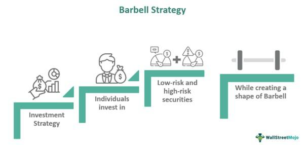

Investment strategies in bond portfolios are crucial for achieving a balance between risk and return, which is essential for meeting specific financial goals. Bonds, being fixed-income securities, offer a reliable stream of income, thereby providing stability within an investment portfolio. Managers strategically use a range of approaches to optimize income and ensure the portfolio's resilience against market fluctuations. 

Algorithmic trading, or algo trading, represents a transformative approach to enhancing the timing and execution of investments within bond portfolios. By utilizing computer algorithms, this method allows for executing trades based on pre-defined conditions and strategies, thereby potentially increasing the efficiency and effectiveness of bond investments. These algorithms can process vast amounts of data at high speeds, enabling improved decision-making and performance outcomes compared to traditional manual trading methods. 



This article will explore various strategies employed in bond management, demonstrating how algo trading is progressively integrating with these strategies to refine portfolio management in today's dynamic financial markets. By leveraging technological advancements, investors can potentially achieve a more optimized balance of risk and return, positioning themselves to better meet their financial objectives.

## Table of Contents

## Understanding Bond Investment

Bonds are financial instruments that function as loans made by investors to either corporate entities or governments. When an investor purchases a bond, they are effectively lending money to the issuer in exchange for periodic interest payments and the return of the bond's face value at maturity. Bonds are a crucial component of the global financial markets, providing issuers with a means to raise capital for various purposes, such as funding infrastructure projects, financing expansion activities, or managing debt.

**Types of Bonds**

1. **U.S. Treasury Bonds**: These are debt securities issued by the U.S. Department of the Treasury. Treasury bonds are considered some of the safest investments since they are backed by the full faith and credit of the U.S. government. They have longer maturities, typically ranging from 10 to 30 years, and provide fixed interest payments known as coupon payments.

2. **Corporate Bonds**: These bonds are issued by companies to raise capital. Corporate bonds offer higher yields compared to government bonds to compensate for the increased risk of default. The level of risk and yield varies significantly based on the issuing company's creditworthiness, as rated by credit rating agencies.

3. **Municipal Bonds**: Issued by state and local governments, municipal bonds are used to finance public projects like schools, highways, and infrastructure improvements. The interest on many municipal bonds is exempt from federal income tax, and in some cases, state and local taxes, making them attractive to investors in higher tax brackets.

**Benefits of Bond Investment**

Investing in bonds offers several advantages:

- **Steady Income**: Bonds provide predictable and regular interest payments, contributing a stable income stream to investors' portfolios. This characteristic makes bonds especially appealing to risk-averse investors, such as retirees or those nearing retirement.

- **Lower Risk Compared to Stocks**: Historically, bonds have exhibited lower volatility than stocks, making them a safer investment option, particularly during uncertain economic times. This lower volatility helps preserve capital and reduces the overall risk of an investment portfolio.

**Key Risks of Bond Investments**

Despite their benefits, bonds are subject to certain risks, including:

- **Interest Rate Risk**: Bond prices are inversely related to interest rates. When interest rates rise, the value of existing bonds falls, as newly issued bonds offer higher yields. This risk is particularly pertinent for longer-term bonds, which are more sensitive to changes in interest rates.

- **Credit Risk**: Also known as default risk, credit risk refers to the possibility that the bond issuer will fail to make interest payments or repay the principal amount at maturity. This risk is more pronounced in corporate bonds, where the issuer's financial health directly impacts the likelihood of default.

- **Inflation Risk**: Inflation reduces the purchasing power of a bond's future cash flows. If inflation rates exceed the bond's interest rate, the real return for the investor could be negative. Inflation-indexed bonds, such as Treasury Inflation-Protected Securities (TIPS), mitigate this risk by adjusting the principal with inflation changes.

Understanding the dynamics and intricacies of bond investments is essential for building a diversified and balanced investment portfolio.

## Strategies in Bond Portfolio Management

Bond portfolio management incorporates a variety of strategies designed to optimize risk-adjusted returns and meet specific investment goals. These strategies range from passive to active approaches, including indexing and immunization. Each of these strategies offers different benefits and trade-offs depending on the investor’s objectives and market outlook.

### Passive Strategy: Buy-and-Hold

The Buy-and-Hold strategy is a passive investment approach that entails purchasing bonds and holding them until maturity. This strategy aims for predictable income generation and typically involves minimal trading, thus reducing transaction costs. The primary benefit is the stability of cash flows and the eventual return of principal at maturity, assuming no default occurs. It is particularly favored by risk-averse investors who prioritize income stability over capital gains. This strategy assumes an efficient market where bond prices accurately reflect all available information.

### Active Strategy

Active bond portfolio management involves making calculated investment moves based on [interest rate](/wiki/interest-rate-trading-strategies) forecasts and other market indicators to achieve higher returns. This strategy requires frequent buying and selling of bonds to capitalize on fluctuating interest rates and changing yield curves. Investors employing active strategies often use duration analysis, yield curve positioning, and credit analysis to make informed decisions. Active management seeks to outperform a benchmark index or peer group by identifying mispriced bonds or accurately predicting shifts in interest rates.

### Indexing

Indexing in bond portfolio management involves constructing a portfolio that mirrors the composition and performance of a specific bond index. This strategy provides diversification across a broad range of bond types, reduces unsystematic risk, and achieves returns in line with the chosen index. Indexing is advantageous for investors seeking exposure to the bond market without incurring the costs and risks associated with active management. The aim is to replicate the returns of the index rather than outperform it, aligning the portfolio’s risk-return characteristics with that of the index.

### Immunization

Immunization is a dynamic bond management strategy aimed at mitigating interest rate risk by aligning the duration of assets with the duration of liabilities. It involves adjusting the bond portfolio periodically to ensure that changes in interest rates do not adversely affect the investor's ability to meet future liabilities. This requires a precise understanding of both present value calculations and duration matching. Immunization effectively creates a protective shield against interest rate fluctuations, ensuring that the bond portfolio generates sufficient returns to meet future cash flow needs regardless of interest rate movements.

Each strategy within bond portfolio management caters to different aspects of risk tolerance, investment horizon, and income requirements. Investors can choose or combine these strategies to align with their specific financial objectives and market conditions.

## The Role of Timing in Bond Investments

Market timing is crucial in bond investments, as it allows investors to capitalize on economic indicators and maximize returns. Accurate timing enables the investor to predict interest rate movements and adjust their portfolio accordingly to maintain profitability. 

Interest rate cycles significantly influence bond pricing. In general, bond prices and interest rates have an inverse relationship; when interest rates rise, bond prices fall, and vice versa. This occurs because existing bonds with lower interest rates become less attractive compared to new bonds offering higher rates, causing the prices of existing bonds to drop. Consequently, understanding and predicting interest rate cycles can lead to better decision-making. For instance, during an anticipated interest rate drop, purchasing bonds can result in capital gains as bond prices rise in response to decreasing rates.

Economic cycles also play an important role in bond investments. Various economic indicators, such as GDP growth, unemployment rate, and inflation, can signal future interest rate movements. For example, a growing economy might lead to increased demand for capital, driving up interest rates. Conversely, during a recession, central banks may lower interest rates to stimulate economic activity, thus impacting bond prices.

To align their strategies with market conditions, investors often use economic forecasts and analysis. Utilizing tools such as the yield curve, which plots the yield of bonds with different maturities, can provide insights into market expectations of future interest rates. Additionally, monitoring central bank policies and announcements can offer valuable information for predicting rate changes.

Aligning bond investment strategies with market conditions involves anticipating these cycles. For instance, holding long-term bonds in a declining interest rate environment can be beneficial, while shifting to bonds with shorter durations can mitigate risks when interest rates are expected to rise. Therefore, by understanding and applying market timing strategies, investors can optimize returns in bond investments.

## Algorithmic Trading and Bond Investment

Algorithmic trading leverages computer algorithms to automatically execute trades, including those in bond markets. These algorithms assess various market indicators to make informed trading decisions, enabling traders to achieve precise market entry and [exit](/wiki/exit-strategy) points with minimal human intervention. This process not only enhances [liquidity](/wiki/liquidity-risk-premium) by facilitating quicker and more efficient trade executions but also significantly reduces transaction costs. The algorithms operate on pre-defined strategies, which helps in maintaining consistency and avoiding emotional bias often inherent in manual trading.

Key strategies employed in [algorithmic trading](/wiki/algorithmic-trading) for bonds include mean-reversion, [momentum](/wiki/momentum) trading, and statistical [arbitrage](/wiki/arbitrage). 

1. **Mean-Reversion**: This strategy is grounded in the statistical concept that asset prices and returns eventually return to their long-term mean or average. In bond trading, the mean-reversion algorithm identifies deviations from the historical average levels of bond prices or yields and places trades expecting a return to these mean values.

2. **Momentum Trading**: This approach capitalizes on the continuation of existing market trends. In the context of bonds, if the market is trending upwards, the momentum algorithms initiate buy trades, exploiting the trend persistence until indicators suggest a reversal. This strategy relies heavily on technical indicators and past price data to predict future price movements.

3. **Statistical Arbitrage**: Statistical arbitrage involves taking advantage of price differentials between bonds or related securities. It uses sophisticated mathematical models to identify and capitalize on short-term and medium-term anomalies in bond pricing, ensuring profit through market inefficiencies.

Sophisticated models and [machine learning](/wiki/machine-learning) further refine these strategies, enhancing their predictive accuracy and efficiency. Machine learning algorithms process vast datasets to uncover patterns and trends that can influence bond prices. These models adapt to new information and evolving market conditions, improving over time to provide more accurate predictions. This iterative process benefits from continuous [backtesting](/wiki/backtesting) and optimization, ensuring the algorithms remain robust in various market environments.

In addition to enhancing execution and operational efficiency, algorithmic trading allows traders to manage larger and more complex portfolios than would be manageable through manual trading alone. By automating the trading process, these algorithms ensure consistent application of the chosen strategy, enabling optimal performance in bond investment activities.

## Implementing Algo Trading for Bond Investment

Implementing algorithmic trading in bond investments necessitates a robust technological framework, capable of handling high-speed data transfer and executing trades efficiently. The foundation of such a system involves several critical components, including high-speed internet, reliable data feeds, and sophisticated trading platforms. High-speed internet ensures that trading systems can send and receive data with minimal latency, a crucial [factor](/wiki/factor-investing) when executing algo trades in volatile markets.

Data feeds play a pivotal role in algo trading for bonds. They provide real-time access to a wide array of data points, including bond prices, interest rates, and other financial indicators. Reliable data feeds ensure that algorithms have the most current information available, allowing them to make informed trading decisions. Market data providers such as Bloomberg, Thomson Reuters, and ICE Data Services are commonly used to offer comprehensive and timely financial data.

One of the initial steps in developing a successful algorithmic trading strategy is backtesting. Backtesting involves running an algorithm through historical data to determine how it would have performed in various market conditions. This process helps refine trading strategies and uncover potential weaknesses. By assessing historical performance, traders can adjust algorithms to enhance reliability and robustness before deploying them in live markets.

A typical backtesting procedure requires a comprehensive dataset and a defined set of trading rules. In Python, the `pandas` library can be utilized for managing and analyzing historical data, while `[backtrader](/wiki/backtrader)` or `zipline` can facilitate the backtesting process. Here's a basic example using Python:

```python
import pandas as pd
import backtrader as bt

# Load historical bond data into a pandas DataFrame
data = pd.read_csv('bond_data.csv', parse_dates=True, index_col='Date')

# Define a simple Moving Average Crossover strategy
class MovingAverageStrategy(bt.Strategy):
    params = (('short_period', 10), ('long_period', 30),)

    def __init__(self):
        self.short_mavg = bt.indicators.SimpleMovingAverage(self.data.close, period=self.params.short_period)
        self.long_mavg = bt.indicators.SimpleMovingAverage(self.data.close, period=self.params.long_period)

    def next(self):
        if self.short_mavg > self.long_mavg and not self.position:
            self.buy()
        elif self.short_mavg < self.long_mavg and self.position:
            self.sell()

# Create a Backtrader Cerebro engine
cerebro = bt.Cerebro()
cerebro.addstrategy(MovingAverageStrategy)
cerebro.adddata(bt.feeds.PandasData(dataname=data))
cerebro.run()
```

Moreover, algo trading frameworks often require simulated testing environments to validate algorithm efficacy. These environments mimic real market conditions and are essential for testing strategies in a risk-free setting. Simulation helps evaluate how algorithms react to fast-changing market dynamics and stress-test against various scenarios, enhancing the robustness of the strategy under development.

In essence, implementing algo trading for bonds involves an iterative process of developing strategies, rigorously testing them, and refining algorithms to achieve optimal performance. By leveraging advanced technological infrastructure and methodical backtesting and simulation processes, investors can enhance the precision and efficiency of their bond trading strategies.

## Case Studies and Real-World Applications

Success stories in bond market timing highlight the effectiveness of leveraging accurate forecasting and policy anticipation. Several financial institutions have mastered the art of market timing to optimize returns on bond investments. One notable example is the approach used by PIMCO, one of the world's largest fixed-income investment managers. By meticulously analyzing economic indicators and central bank policies, PIMCO consistently adjusts its bond portfolios to capitalize on interest rate fluctuations. This capability to foresee market changes and adeptly rebalance portfolios is key to achieving superior returns.

Algorithmic trading plays a pivotal role in many leading financial institutions and hedge funds. Goldman Sachs, for instance, employs algorithmic strategies to enhance liquidity and reduce transaction costs in bond trading. Their algorithms use complex mathematical models and machine learning techniques to predict price movements and execute trades with minimal market impact. This efficiency is achieved through strategies like mean-reversion and momentum trading, which exploit short-term pricing inefficiencies. Such systems also allow for high-frequency trading, providing significant competitive advantages in reacting to market developments in real-time.

A compelling case is the application of algorithmic trading by Renaissance Technologies, a quantitative [hedge fund](/wiki/hedge-fund-trading-strategies) renowned for its Medallion Fund. The fund employs sophisticated [statistical arbitrage](/wiki/statistical-arbitrage) models to trade bonds and other securities, securing high returns by identifying and capitalizing on small market inefficiencies. The success of these algorithms illustrates the profound impact of data-driven decision-making and computational power in contemporary bond markets.

Lessons learned from these applications underscore the importance of adaptability and rigorous risk management. Algorithmic systems must be continually revised to address evolving market conditions and technological advancements. Institutions like Bridgewater Associates have demonstrated that robust risk management frameworks are essential in navigating potential algorithmic failures and market anomalies. Their proactive strategies include setting strict risk limits and integrating real-time analytics to monitor and adjust algorithms dynamically.

In summary, the real-world applications of algorithmic trading in bond markets reveal the transformative potential of technology in financial strategy. The integration of advanced forecasting techniques and adaptive algorithms not only enhances performance but also fortifies the resilience of investment portfolios against market [volatility](/wiki/volatility-trading-strategies).

## The Future of Bond Investment with Algorithmic Trading

Emerging trends in the field of bond investment with algorithmic trading are revolutionizing how investors approach the market. Big data analytics and blockchain technology are at the forefront of these advancements, reshaping the operational infrastructure and strategic landscape of bond trading.

Big data analytics leverage enormous datasets to identify patterns and insights that were previously unattainable. This capability enhances precision in predicting price movements and market trends. With vast amounts of historical and real-time data, traders can apply sophisticated statistical models to anticipate market shifts more accurately. For instance, machine learning algorithms can analyze interest rate movements, economic indicators, and bond prices to develop models that forecast future bond performance.

Blockchain technology introduces a new dimension of transparency and security in bond markets. By employing decentralized ledgers, blockchain can streamline settlement processes, reduce fraud risk, and enhance the traceability of transactions. This technology not only ensures efficient handling of bond trades but also fosters trust among market participants by providing immutable records of transactions.

Artificial Intelligence (AI) plays a crucial role in enhancing predictive capabilities and enabling real-time decision-making in bond strategies. AI models, through techniques such as natural language processing and [deep learning](/wiki/deep-learning), can process news articles, financial reports, and economic data to evaluate market sentiment and potential impacts on bond prices. As a result, traders can make informed decisions with greater speed and accuracy, maintaining a competitive edge in dynamic markets.

However, the rise of algorithmic trading in bond investments prompts potential regulatory impacts to ensure market integrity. Regulatory bodies must address issues such as algorithmic fairness, transparency, and the prevention of market manipulation. Ensuring that algorithmic systems are designed to align with ethical guidelines and regulatory standards is vital to maintaining a fair and stable market environment. As technology continues to evolve, regulatory frameworks will need to adapt correspondingly to preserve the integrity and robustness of financial markets. 

Continued collaboration between technologists, financial experts, and regulators will be essential in navigating the evolving landscape of bond investment with algorithmic trading, enabling innovations that bolster market efficiency while safeguarding investor interests.

## Conclusion

Combining well-timed strategies with algorithmic trading represents a significant advancement in optimizing bond investment performance. Integrating these elements allows investors to effectively navigate the complexities of bond markets, enhancing their capability to balance risk and return. The precision and speed provided by algorithmic trading can significantly improve timing, thereby increasing the likelihood of capitalizing on market opportunities driven by economic indicators and interest rate fluctuations.

Continued innovation in algorithmic and technological fields is crucial for successful bond management. Emerging technologies such as big data analytics, [artificial intelligence](/wiki/ai-artificial-intelligence) (AI), and blockchain are likely to transform bond investment strategies by offering deeper insights and more efficient execution. Future advancements will continue to enhance the predictive accuracy of trading algorithms, enabling investors to better anticipate market movements.

Investors should integrate these technological advancements into their bond investment strategies, ensuring they remain adaptable to changing market dynamics. The financial markets are inherently volatile, and the ability to rapidly adjust strategies in response to market signals can be a decisive factor in achieving successful outcomes. Therefore, a commitment to ongoing education and adaptation in response to technological and market changes will be essential for maintaining competitiveness in bond portfolio management.

## References & Further Reading

[1]: Bergstra, J., Bardenet, R., Bengio, Y., & Kégl, B. (2011). ["Algorithms for Hyper-Parameter Optimization."](https://papers.nips.cc/paper/4443-algorithms-for-hyper-parameter-optimization) Advances in Neural Information Processing Systems 24.

[2]: ["Advances in Financial Machine Learning"](https://www.amazon.com/Advances-Financial-Machine-Learning-Marcos/dp/1119482089) by Marcos Lopez de Prado

[3]: ["Evidence-Based Technical Analysis: Applying the Scientific Method and Statistical Inference to Trading Signals"](https://www.amazon.com/Evidence-Based-Technical-Analysis-Scientific-Statistical/dp/0470008741) by David Aronson

[4]: ["Machine Learning for Algorithmic Trading"](https://github.com/stefan-jansen/machine-learning-for-trading) by Stefan Jansen

[5]: ["Quantitative Trading: How to Build Your Own Algorithmic Trading Business"](https://www.amazon.com/Quantitative-Trading-Build-Algorithmic-Business/dp/1119800064) by Ernest P. Chan