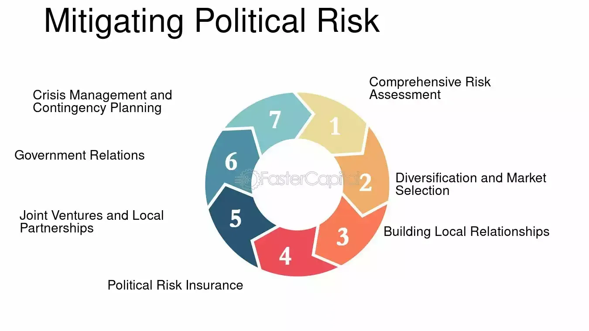

In today's dynamic business environment, managing risks is essential for ensuring both short-term stability and long-term growth. Various types of risks, including business management risks, political risks, and trading-specific risks such as those associated with algorithmic trading, require careful analysis and strategic planning. Understanding these risks allows organizations to craft effective management strategies that not only mitigate potential losses but also enhance profitability.

Business management risks arise from various organizational operations, including financial management and strategic decision-making, which, if not properly managed, can hinder growth and efficiency. Political risks involve the potential for losses due to political instability or changes in government policies, which can impact business activities, especially those of multinational companies operating in diverse regulatory environments. These risks, if unaddressed, can lead to significant financial setbacks.

Algorithmic trading, a modern enhancement to financial markets, while improving speed and accuracy, also introduces unique risks. Technical failures, market risks from high volatility, and cybersecurity threats can result in disruptions and financial losses. By employing robust strategies and advanced tools, businesses can manage these trading-specific risks and operate more effectively.

This article explores strategies and tools to mitigate these risks, illustrating how businesses can implement them to not only safeguard their operations but also to capitalize on growth opportunities. Through a comprehensive approach to risk management that intersects business operations and trading activities, organizations can cultivate resilience and enhance their ability to navigate a complex and ever-evolving global market landscape.

## Table of Contents

## Understanding Business Management and Political Risks

Business management risks are inherent elements of any organizational operation, encompassing various dimensions such as financial management, strategic decision-making, operational efficiency, and human resources. These risks can arise from internal inefficiencies, market dynamics, and the inability to adapt to changing business environments. Effective management of these risks requires integrating robust risk assessment frameworks that can predict and mitigate potential threats to the organization’s strategic objectives.

Political risks, on the other hand, pertain to the uncertainties and potential losses businesses might face due to political instability or shifts in government policies. Such risks are particularly significant in the global market, where changes in the political landscape can adversely affect operations, profitability, and strategic initiatives. Companies operating in multiple countries must navigate a complex array of political factors, including legislative changes, shifts in trade policies, and fluctuating diplomatic relationships.

Organizations should develop comprehensive plans to identify, anticipate, and mitigate these risks. Strategies may range from conducting thorough geopolitical analyses to forecasting regulatory shifts that could impact operational frameworks. For instance, changes in tax legislation, trade tariffs, or labor laws can have significant financial implications for businesses. Multinational corporations, in particular, face an array of political risks, including expropriation, where a government might take control of a company’s assets; nationalization, where private assets are converted into public assets; and adverse changes in foreign investment policies, which can threaten the viability of overseas investments.

Proactive management and strategic foresight are crucial in mitigating the adverse impacts of these risks. This can include maintaining flexibility in business operations, allowing for rapid adjustment to changing political climates. Companies might also negotiate terms of compensation with host countries, providing a legal avenue for seeking redress in the event of political destabilization. Additionally, diversifying operations across multiple geographies can buffer against the concentration of risk in any one region, thereby reducing potential disruptions from localized political events.

Ultimately, the integration of political risk considerations into broader business strategies can safeguard organizational assets and promote resilience amid geopolitical [volatility](/wiki/volatility-trading-strategies). For effective risk mitigation, businesses must leverage a combination of predictive analytics, cross-functional collaboration, and agile decision-making processes focused on protecting long-term interests in diverse political environments.

## The Rise of Algorithmic Trading and Its Associated Risks

Algorithmic trading, also known as algo-trading or automated trading, has radically reshaped the landscape of financial markets. This approach utilizes computer algorithms to execute trades at speeds and frequencies that surpass traditional human trading capabilities. The primary advantage of [algorithmic trading](/wiki/algorithmic-trading) lies in its ability to enhance the efficiency, speed, and accuracy of trade executions. By automating trading decisions, algorithms can swiftly respond to market conditions, capitalize on opportunities, and minimize human error.

Despite its advantages, algorithmic trading presents inherent risks and challenges. Technical failures pose a significant risk, as systems can malfunction, leading to erroneous transactions and substantial trading losses. Market risks are exacerbated by high volatility, where algorithmic strategies may inadvertently amplify price fluctuations, leading to greater market instability. The complexity of algorithmic code introduces further risks, as errors or unforeseen interactions within the code can result in sizable financial losses.

High-frequency trading ([HFT](/wiki/high-frequency-trading-strategies)), a subset of algorithmic trading, is characterized by executing a large number of orders at extremely high speeds. HFT strategies are predominantly reliant on sophisticated algorithms to profit from inefficiencies within the market. However, the rapid and massive [volume](/wiki/volume-trading-strategy) of trades can lead to dramatic and rapid price movements, increasing the risk of systemic disruptions.

Cybersecurity threats compound the risks associated with algorithmic trading. Trading platforms and systems are attractive targets for cybercriminals, who may attempt to exploit vulnerabilities to manipulate trades or steal sensitive information. The integrity and performance of trading algorithms are at risk in such scenarios, necessitating robust security measures.

Effective risk management in algorithmic trading is vital to mitigate these potential challenges. One crucial approach is rigorous [backtesting](/wiki/backtesting), wherein trading algorithms are tested against historical data to evaluate their performance and detect potential weaknesses. Real-time monitoring is essential, allowing for the detection and correction of anomalies as they occur. Fail-safe mechanisms, such as circuit breakers, can be employed to halt trading activity temporarily in response to unexpected market conditions or technical issues.

Overall, while algorithmic trading offers significant benefits in terms of efficiency and performance, it requires comprehensive risk management strategies to address the multifaceted risks it brings. Adopting a holistic approach to managing these risks ensures that algorithmic trading can be conducted safely and effectively, maintaining the integrity of financial markets.

## Effective Strategies for Risk Management in Algorithmic Trading

Risk management in algorithmic trading is a multifaceted process that focuses on mitigating trading risks by employing a range of strategic approaches. At its core, comprehensive backtesting and simulation of trading algorithms is indispensable. This practice involves applying historical market data to evaluate and refine the performance of trading strategies before they are deployed in live markets. By doing so, traders can detect potential weaknesses or inefficiencies in algorithms, ensuring they function optimally under various market conditions.

Real-time monitoring, coupled with well-devised contingency plans, is essential to swiftly address unexpected market movements or technical issues. This proactive approach allows traders to adapt strategies in response to sudden changes in volatility or unforeseen system errors. Implementing automated alerts and monitoring systems can significantly enhance the capability to react in real-time, enabling traders to minimize potential losses.

Setting clear risk limits and utilizing appropriate position-sizing strategies are key components of effective risk management. By defining the maximum acceptable loss for each trade, traders can constrain excessive exposure to market risks. Position-sizing strategies ensure that capital allocation aligns with an individual's risk tolerance and market conditions, thereby sustaining a balanced and diversified trading portfolio.

Diversification remains a critical risk management strategy in algorithmic trading. By spreading investments across various assets, sectors, or geographical markets, traders reduce the impact of adverse price movements in any single category. This approach fosters stability and capital preservation by not putting all trading capital at risk in one area.

Regulatory compliance is another crucial aspect of risk management in algorithmic trading. Adhering to legal standards not only prevents financial penalties and reputational damage but also promotes transparent and fair trading practices. Familiarity with regulations and continuous compliance checks are necessary to navigate the complex landscape of financial markets.

The deployment of advanced technologies, such as [machine learning](/wiki/machine-learning) and blockchain, is revolutionizing risk management strategies. Machine learning algorithms can analyze vast datasets to identify patterns and predict market movements, thereby enhancing decision-making processes. Blockchain technology, with its immutable and transparent nature, aids in securing transaction records and ensuring data integrity. These technologies collectively contribute to building robust and resilient trading systems.

In summary, integrating these strategies offers algorithmic traders a comprehensive toolkit to identify, assess, and mitigate risks effectively, thereby safeguarding their operations against the unpredictable dynamics of financial markets.

## Integrating Political Risk Management with Business Strategies

Political risk management should be seamlessly integrated into a business's core strategies to ensure resilience against unpredictable political environments. As global markets expand, the potential for political instability and its effects on business operations cannot be underestimated. Effective political risk management can help organizations not only to protect their assets but also to capitalize on global opportunities with minimized uncertainty.

Investing in political risk insurance is a reasonable approach for multinational corporations operating in high-risk regions. This form of insurance provides a safety net by protecting investments against events such as expropriation, currency inconvertibility, and political violence. By transferring some of the financial risks to insurers, businesses can mitigate potential losses resulting from unforeseen political events.

A thorough analysis of market entry conditions is paramount. Companies should conduct extensive due diligence to understand the political landscape, regulatory environment, and local economic conditions before entering a new market. Flexible operational strategies, such as adaptable supply chains and diversified sourcing, can help mitigate political risks. For instance, maintaining short-term and long-term strategic plans allows businesses to adapt quickly to regulatory changes or political shifts.

Negotiating terms of compensation with host countries is another effective strategy. Establishing clear agreements regarding compensation can provide legal recourse in case of political destabilization that impacts business operations. This includes negotiating contracts that outline rights and responsibilities and incorporating dispute resolution mechanisms.

Diversification of geographic presence is a fundamental strategy to reduce exposure to political risks. By not relying heavily on one particular region, businesses can distribute their operations and investments across multiple countries, diminishing the impact of adverse political events in any single location. This strategy not only protects the business against localized risks but also opens up opportunities for market expansion across different regions.

In conclusion, by integrating political risk management into their overall business strategy, companies can better navigate the complexities of international markets and enhance their long-term sustainability. This proactive approach allows organizations to not only defend against potential threats but also leverage political complexities as opportunities for strategic advantage.

## Conclusion

Effective risk management in both business operations and trading is crucial for the resilience and sustainability of any organization. In today's rapidly changing global environment, businesses must be equipped to handle a multitude of risks—ranging from political instabilities to technological failures in algorithmic trading systems. By integrating comprehensive risk management practices that specifically address political and algorithmic trading risks, organizations can lay a foundation for sustained growth and profitability.

Balancing risk and return while adhering to regulatory standards is central to thriving amid uncertainties. Regulatory compliance not only mitigates legal and financial repercussions but also acts as a framework within which businesses can safely navigate market volatilities. For example, implementing appropriate position-sizing strategies and setting stringent risk limits within trading platforms can help optimize performance without exposing organizations to excessive threats.

In the context of algorithmic trading, leveraging advanced technologies alongside rigorous backtesting and real-time monitoring is essential. By employing machine learning algorithms, companies can process vast datasets to predict market trends with greater accuracy. Moreover, real-time oversight ensures that any anomalies or unexpected market movements are addressed promptly, mitigating potential financial losses.

Ultimately, businesses that prioritize and continuously refine their risk management frameworks are better positioned to handle the challenges posed by an unpredictable global market landscape. This proactive approach not only secures short-term operational capacity but also fortifies long-term strategic goals, ensuring that organizations remain competitive and resilient, regardless of external pressures. In conclusion, effective risk management is not just a protective measure but an integral component of strategic planning that enables businesses to capitalize on opportunities while cushioning against potential adversities.

## References & Further Reading

[1]: Pazarskis, M., Vogiatzoglou, M., & Koutoupis, A. (2016). ["Political Risk and Business Performance in Multinational Enterprises: International Evidence"](https://www.academia.edu/126666481/Recovery_after_a_Demerger_Evidence_from_Romanian_Companies). International Journal of Business and Management, 11(1), 46. 

[2]: Dunning, J. H. (2008). ["Multinational Enterprises and the Global Economy"](https://books.google.com/books/about/Multinational_Enterprises_and_the_Global.html?id=Hz6S4BGmGxUC). Edward Elgar Publishing.

[3]: Fabozzi, F. J., & Focardi, S. M. (2013). ["Algorithmic and High-Frequency Trading"](https://pages.stern.nyu.edu/~bdonefer/presscites/HFTMMI.pdf). CFA Institute Research Foundation.

[4]: MacKenzie, D. A. (2021). ["Trading at the speed of light: How ultrafast algorithmic trading transforms markets"](https://www.amazon.com/Trading-Speed-Light-Algorithms-Transforming/dp/0691211388). Princeton University Press.

[5]: Leins, S. (2020). ["Stories of Capitalism: Inside the Role of Financial Analysts"](https://press.uchicago.edu/ucp/books/book/chicago/S/bo27442087.html). University of Chicago Press.