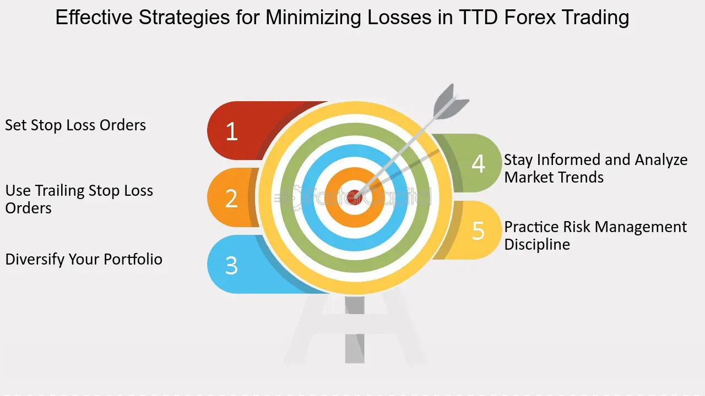

## Table of Contents

## What is forex trading and why is it important to minimize losses?

Forex trading, also known as foreign exchange trading, is when people buy and sell different currencies to make money. It happens all over the world, all the time, because different countries use different money. For example, you might trade US dollars for Euros if you think the Euro will become more valuable. People and big companies do this to make profits or to protect their money from changes in currency values.

It's really important to minimize losses in forex trading because the market can be very unpredictable. If you lose a lot of money, it can be hard to get it back. By keeping losses small, you can keep trading and have more chances to make money later. Also, if you lose too much, you might not have enough money left to keep trading. So, being careful and using strategies to limit losses helps you stay in the game longer and increases your chances of success.

## What are the common causes of forex losses for beginners?

One common reason beginners lose money in forex trading is because they don't know enough about it. They might not understand how the market works or what makes currency values go up and down. They might also not have a good plan for when to buy and sell, which is really important. Without a plan, they might make quick decisions based on feelings instead of thinking things through, and that can lead to big losses.

Another reason is that beginners often use too much leverage. Leverage lets you borrow money to trade more than you actually have, but it can be risky. If the market moves against you, you can lose a lot more money than you started with. Beginners might not know how to manage this risk properly, so they end up losing more than they can afford. It's important to start small and learn how to use leverage safely before trying to trade with a lot of money.

Lastly, many beginners don't manage their money well. They might risk too much money on a single trade, hoping to make a big profit quickly. But if that trade goes wrong, they can lose a lot. Good money management means only risking a small amount of your money on each trade, so even if you lose, you can keep trading. Not doing this can lead to big losses and can even make someone stop trading altogether.

## How can setting stop-loss orders help in managing forex losses?

Setting stop-loss orders is a really helpful way to manage losses in [forex](/wiki/forex-system) trading. A stop-loss order is like a safety net that you set up before you start trading. You decide at what price you want to sell your currency if it starts to lose value. This way, if the market moves against you, your trade will automatically close before you lose too much money. It's like setting a limit on how much you're willing to lose on a single trade, which helps you keep your trading money safe.

Using stop-loss orders is important because it helps you stick to your trading plan. When you're trading, it's easy to get caught up in the moment and hope that the market will turn around. But if you have a stop-loss order in place, you don't have to make quick decisions based on your emotions. It takes the pressure off and lets you focus on finding new trading opportunities instead of worrying about losing more money. By setting stop-loss orders, you can trade more calmly and increase your chances of staying in the game longer.

## What role does leverage play in forex trading and how can it be used to minimize losses?

Leverage in forex trading is like borrowing money to trade more than you actually have. It lets you control a big amount of money with just a little bit of your own. For example, if you have $1,000 and use 100:1 leverage, you can trade like you have $100,000. This can help you make bigger profits if the market moves in your favor. But it's also risky because if the market goes against you, you can lose a lot more than your initial money.

To use leverage to minimize losses, you need to be careful and smart about it. One way is to use less leverage than what's offered. Instead of using the maximum leverage, you might choose a lower amount, like 10:1 or 20:1. This way, you're not risking as much money on each trade. Another way is to always use stop-loss orders when you trade with leverage. A stop-loss order will automatically close your trade if it starts losing too much money, which helps you keep your losses small even when you're using borrowed money. By being careful with how much leverage you use and always setting stop-loss orders, you can trade with leverage but still protect yourself from big losses.

## How important is it to have a trading plan to minimize forex losses?

Having a trading plan is super important if you want to minimize losses in forex trading. A trading plan is like a roadmap that tells you when to buy and sell, how much money to risk on each trade, and what to do if things don't go as planned. Without a plan, you might make decisions based on your feelings instead of thinking things through. This can lead to big losses because the market can be really unpredictable. By following a plan, you can stay calm and make better choices, which helps you keep your losses small and increases your chances of making money in the long run.

A good trading plan also helps you manage your money better. It tells you how much of your trading money you should risk on each trade, usually a small percentage like 1% or 2%. This way, even if you lose on a trade, you won't lose too much of your money. Over time, this careful approach can help you stay in the game longer and have more chances to make profitable trades. So, having a solid trading plan is key to minimizing losses and being successful in forex trading.

## What are the key technical analysis tools beginners should use to avoid significant losses?

Technical analysis tools help beginners understand what's happening in the forex market and make better trading decisions. One important tool is the moving average, which shows the average price of a currency over a certain time. It helps you see the overall trend, so you can decide if it's a good time to buy or sell. Another useful tool is the Relative Strength Index (RSI), which tells you if a currency is overbought or oversold. If the RSI is high, it might be time to sell because the price could go down soon. If it's low, it might be a good time to buy because the price could go up.

Another key tool is the support and resistance levels. These are like invisible lines on a chart where the price often stops and changes direction. If you know where these levels are, you can set your stop-loss orders just below support or above resistance to limit your losses. The last tool to mention is the candlestick chart, which shows the price movement in a clear way. By looking at the patterns in the candlesticks, you can guess where the price might go next and make smarter trades. Using these tools together can help beginners avoid big losses and trade more confidently.

## How can fundamental analysis be utilized to minimize losses in forex trading?

Fundamental analysis is about looking at the big picture stuff that can affect currency values, like a country's economy, interest rates, and political events. By keeping an eye on these things, you can guess which way a currency might move. For example, if a country's economy is doing well, its currency might get stronger. But if there's a big problem, like a political crisis, the currency could get weaker. By understanding these factors, you can make better trading decisions and avoid getting caught off guard by big changes in the market.

Using [fundamental analysis](/wiki/fundamental-analysis) can also help you plan your trades more carefully. If you know that a country is about to release important economic data, you can prepare for how it might affect the currency. You might decide to wait until after the data is out before making a trade, or you might set your stop-loss orders at levels that take into account possible big moves in the market. By being aware of what's going on in the world and how it might affect currencies, you can trade more safely and minimize your losses.

## What are the psychological factors that contribute to forex losses and how can they be managed?

One big reason people lose money in forex trading is because of their feelings. It's easy to get scared or too excited when trading, which can make you do things you wouldn't normally do. For example, if you see your money going down, you might panic and sell too soon, even if it's better to wait. Or, if you're doing well, you might get too confident and take big risks, which can lead to big losses. These feelings can make it hard to stick to your trading plan and can cause you to make bad decisions.

To manage these feelings, it's important to stay calm and follow your plan. One way to do this is to practice mindfulness, which means paying attention to what you're feeling and thinking without letting it control you. You can also take breaks when you feel stressed, and talk to other traders about what you're going through. It's also a good idea to keep a trading journal where you write down your thoughts and feelings before and after each trade. This can help you see patterns in your behavior and learn how to handle your emotions better. By managing your feelings, you can make smarter choices and minimize your losses in forex trading.

## How can diversification across different currency pairs help in reducing forex losses?

Diversification in forex trading means spreading your money across different currency pairs instead of putting it all into one. This can help reduce your losses because if one currency pair does badly, you might still make money from the others. It's like not putting all your eggs in one basket. If you only trade one currency pair and it goes down, you could lose a lot of money. But if you trade several different pairs, a loss in one might be balanced out by gains in others.

For example, if you're trading the EUR/USD and it starts to lose value, but you also have trades in GBP/JPY and AUD/CAD, those other pairs might be doing well. This way, even if you lose money on the EUR/USD, your overall losses might be smaller because your other trades could be making money. Diversification helps you manage risk better and gives you more chances to make profits, which can help you stay in the game longer and minimize your losses over time.

## What advanced risk management strategies should experienced traders use to minimize forex losses?

Experienced traders can use advanced risk management strategies like position sizing and hedging to minimize forex losses. Position sizing means deciding how much money to risk on each trade based on how much you have in total and how risky the trade is. A common way to do this is to risk only a small percentage of your trading money on each trade, like 1% or 2%. This way, even if you lose, you won't lose too much of your money. Hedging is another strategy where you open trades that go against each other to protect yourself from big losses. For example, if you have a trade betting that the EUR/USD will go up, you might also open a trade betting that it will go down. If the EUR/USD goes down, your first trade loses money, but your second trade makes money, so your overall loss is smaller.

Another important strategy is using multiple time frame analysis. This means looking at the same currency pair on different time frames, like hourly, daily, and weekly charts, to get a better understanding of the market. By doing this, you can see both the short-term and long-term trends, which can help you make better trading decisions and set more accurate stop-loss orders. Combining these advanced strategies can help experienced traders manage their risks better and minimize their losses in forex trading.

## How can algorithmic trading and automation help in minimizing forex losses for expert traders?

Algorithmic trading and automation can really help expert traders minimize their losses in forex trading. These tools let traders use computer programs to make trades based on set rules and strategies. This means that trades happen automatically, without the trader having to watch the market all the time. Because these programs follow the rules exactly, they can help take emotions out of trading. Emotions like fear or excitement can make traders do things they shouldn't, like selling too soon or risking too much. By using algorithms, traders can stick to their plan and make sure they're not making quick, bad decisions.

Another way algorithmic trading helps is by letting traders analyze a lot of data really quickly. Expert traders can program their algorithms to look at things like price movements, economic reports, and other market indicators. The computer can spot patterns and trends that might be hard for a person to see. This can help traders find the best times to buy and sell, and set their stop-loss orders more accurately. By using all this data to make smart trades, algorithmic trading can help traders manage their risks better and keep their losses small.

## What are the latest trends and technologies that can assist in minimizing forex losses?

One of the latest trends in forex trading that can help minimize losses is the use of [artificial intelligence](/wiki/ai-artificial-intelligence) (AI) and [machine learning](/wiki/machine-learning). These technologies can analyze huge amounts of data really fast, finding patterns and trends that might be hard for humans to see. AI can also learn from past trades, getting better at predicting what might happen in the market. This means traders can make smarter decisions about when to buy and sell, and set their stop-loss orders more accurately. By using AI, traders can manage their risks better and keep their losses small.

Another important trend is the rise of social trading platforms. These platforms let traders copy the trades of experienced traders automatically. This can be really helpful for people who are new to forex trading or who want to learn from experts. By following the trades of successful traders, you can see how they manage their risks and minimize losses. Social trading can also make it easier to diversify your trades across different currency pairs, which helps spread out the risk and can lead to smaller losses overall.

## What is the significance of loss prevention in forex trading?

Loss prevention in forex trading is vital to safeguarding traders from substantial financial losses. The foreign exchange market, characterized by its high [volatility](/wiki/volatility-trading-strategies) and rapid price movements, presents significant risks. Therefore, implementing strategic risk management measures is essential for traders to protect their investments and maintain a sustainable trading portfolio.

A critical aspect of loss prevention is the use of stop-loss orders. These orders enable traders to set predetermined price levels at which open positions will be automatically closed, preventing further losses. For example, if a trader buys a currency pair at a price of 1.1500 and sets a stop-loss order at 1.1450, the position will be automatically closed if the price drops to 1.1450, thus limiting the loss to 50 pips. This mechanism allows traders to manage their risk more effectively and avoid unexpected losses due to sudden market movements.

Understanding market fluctuations and the factors that drive price changes is another crucial element of loss prevention. Forex markets are influenced by various factors, including geopolitical events, economic indicators, and central bank policies. By staying informed and analyzing these factors, traders can anticipate potential market shifts and adjust their strategies accordingly. This proactive approach helps traders mitigate risks and make informed trading decisions.

Effective loss prevention not only protects traders from significant losses but also enhances long-term profitability and trading success. By incorporating disciplined risk management strategies, traders can sustain their capital over time and increase the potential for consistent returns. Moreover, loss prevention strategies contribute to maintaining emotional stability, allowing traders to follow their trading plans without succumbing to fear or greed.

To illustrate the significance of loss prevention mathematically, consider a simple risk-reward scenario. Assume a trader targets a reward-to-risk ratio of 2:1, aiming for a potential profit of two units for every one unit of risk. By consistently applying stop-loss orders and maintaining disciplined risk management, the trader can achieve long-term profitability even if only 50% of the trades are successful. This is calculated as follows:

$$
\text{Profit} = (\text{Win Rate} \times \text{Average Win}) - (\text{Loss Rate} \times \text{Average Loss})
$$

$$
= (0.5 \times 2) - (0.5 \times 1) = 1 - 0.5 = 0.5
$$

This simple formula demonstrates that maintaining a favorable risk-reward ratio and effective loss prevention can lead to positive outcomes over time, even with an equal win-loss rate.

In summary, loss prevention is a fundamental component of forex trading that protects traders from significant financial losses and supports long-term profitability. By understanding market dynamics, utilizing stop-loss orders, and maintaining disciplined risk management practices, traders can safeguard their investments and enhance their trading success.

## What are the key investment strategies for loss prevention?

Conducting thorough research and doing your homework is foundational for any successful forex trading endeavor. It is essential to understand market trends, economic indicators, and geopolitical factors that can influence currency movements. By equipping yourself with the necessary knowledge, you reduce the risks of unforeseen losses and increase your potential for achieving favorable outcomes.

Starting with a practice account, also known as a demo account, is a practical step for novice and experienced traders alike. This approach allows traders to simulate real market conditions without the associated financial risk. By using a practice account, one can develop strategies, test different [algorithmic trading](/wiki/algorithmic-trading) techniques, and gain valuable insights into market dynamics. It serves as a sandbox environment where mistakes become learning opportunities rather than costly missteps.

Leverage is a double-edged sword in forex trading, offering the potential for higher returns but also posing significant risks. Utilizing reasonable leverage is crucial in maintaining a balanced-risk portfolio. The formula for calculating leverage is:

$$
\text{Leverage} = \frac{\text{Total Position Size}}{\text{Equity}}
$$

For instance, with an equity of $1,000 and a position size of $10,000, leverage would be 10:1. High leverage can amplify losses, making it vital to carefully assess and control the leverage ratio to prevent overexposure to potential losses.

Diversification remains a key strategy for spreading risk across a variety of currencies and trading strategies. By not putting all eggs in one basket, traders can reduce the risk associated with any single asset or strategy. For instance, a diversified forex portfolio might include major currency pairs like EUR/USD, GBP/USD, and USD/JPY, alongside minor pairs and emerging market currencies. Additionally, incorporating different trading methodologies such as trend-following and mean-reversion can provide multiple avenues for profit and further hedge against losses.

Implementing these investment strategies thoughtfully can enhance the robustness of your algo trading system, helping to stabilize returns while protecting against downside risk.

## References & Further Reading

[1]: Bergstra, J., Bardenet, R., Bengio, Y., & Kégl, B. (2011). ["Algorithms for Hyper-Parameter Optimization."](https://dl.acm.org/doi/10.5555/2986459.2986743) Advances in Neural Information Processing Systems 24.

[2]: ["Advances in Financial Machine Learning"](https://www.amazon.com/Advances-Financial-Machine-Learning-Marcos/dp/1119482089) by Marcos Lopez de Prado

[3]: ["Evidence-Based Technical Analysis: Applying the Scientific Method and Statistical Inference to Trading Signals"](https://books.google.com/books/about/Evidence_Based_Technical_Analysis.html?id=MeoJAQAAMAAJ) by David Aronson

[4]: ["Machine Learning for Algorithmic Trading"](https://github.com/stefan-jansen/machine-learning-for-trading) by Stefan Jansen

[5]: ["Quantitative Trading: How to Build Your Own Algorithmic Trading Business"](https://www.amazon.com/Quantitative-Trading-Build-Algorithmic-Business/dp/1119800064) by Ernest P. Chan