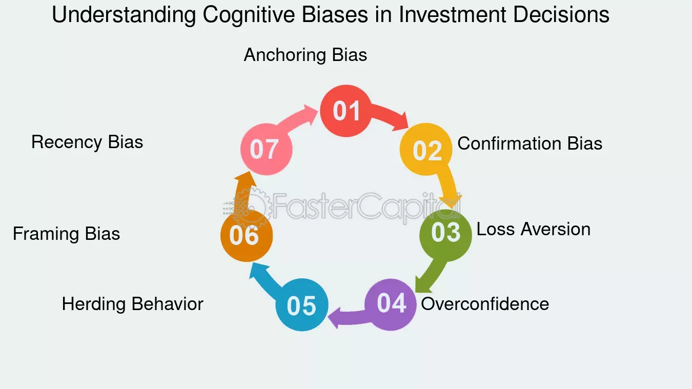

## Table of Contents

## What is present bias and how does it affect investment decisions?

Present bias is when people focus more on what they want right now instead of thinking about the future. It's like choosing to eat a piece of cake today even though you know you should save it for a special occasion later. This bias makes people value immediate rewards more than future benefits, even if the future benefits might be much better.

When it comes to investing, present bias can lead people to make choices that feel good right away but aren't the best for the long term. For example, someone might spend their money on things they want now instead of putting it into a savings account or investing in stocks that could grow over time. This can mean missing out on big gains in the future because they couldn't wait for the rewards that come with patience and long-term planning.

## Can you explain the concept of delayed gratification in the context of investing?

Delayed gratification in investing means choosing to wait for a bigger reward in the future instead of getting a smaller one right away. Imagine you have some money. You could spend it on something fun today, like a new video game or a fancy dinner. But if you invest that money instead, it might grow over time and be worth a lot more later. This is like planting a seed and waiting for it to grow into a big tree, instead of picking the fruit right away.

Choosing delayed gratification can be hard because it means saying no to things you want now. But in investing, it can lead to much better results. For example, if you put money into a retirement account every month, you might not see the benefits for many years. But when you finally retire, that money could have grown so much that it helps you live comfortably without working. It's all about being patient and thinking about the future, even when it's tempting to enjoy the present.

## What are some common examples of present bias in everyday investment choices?

One common example of present bias in everyday investment choices is when people choose to spend their money on things they want right now, like new clothes or gadgets, instead of putting that money into a savings account or investing it in stocks. They might think, "I want this new phone now, it will make me happy today," and forget about how much more money they could have in the future if they waited.

Another example is when people cash out their investments too soon because they see a small profit and want to enjoy it right away. For instance, someone might sell their stocks after they go up a little bit, thinking they can use the money for a vacation or a big purchase. But if they had waited longer, those stocks might have grown a lot more, giving them even bigger rewards down the road.

These choices show how present bias can make people focus on the short-term fun or relief instead of the long-term benefits that come with patience and smart investing.

## How can setting clear, long-term financial goals help mitigate present bias?

Setting clear, long-term financial goals can help people fight present bias by giving them a big picture to focus on. When you have a goal like saving for a house or retiring comfortably, it's easier to say no to spending money on things you want right now. You start thinking, "If I buy this new TV, it will take longer to reach my goal." This helps you make choices that are good for your future, not just for today.

Having these goals also makes it easier to stick with a plan. When you know exactly what you're working towards, like paying for your kids' college or taking a dream trip, it's like having a map to follow. You can see how each small choice, like putting money into your savings account every month, adds up over time. This way, the long-term reward feels more real and important than the short-term fun you might get from spending money now.

## What role does education and awareness play in overcoming present bias?

Education and awareness are key to beating present bias. When people learn about how present bias works and see real examples, they start to understand why they might choose short-term fun over long-term rewards. This knowledge helps them see their choices more clearly. For example, if someone knows that spending money now means less money for retirement, they might think twice before buying something they don't really need.

Awareness also helps people plan better. When they know about present bias, they can set up reminders or use tools like budgeting apps to keep their long-term goals in mind. This makes it easier to stick to their plans and resist the temptation of instant gratification. Over time, as people become more aware and educated, they get better at making choices that help them reach their big goals, instead of just focusing on what feels good right now.

## How can automated investment tools and robo-advisors help reduce the impact of present bias?

Automated investment tools and robo-advisors can help people fight present bias by taking the emotion out of investing. When you use these tools, you set up your investment plan once, and then the system does the work for you. This means you don't have to make decisions every day about whether to spend your money or invest it. The tool automatically puts money into your investments, so you're less likely to spend it on something you want right now.

These tools also help by keeping you focused on your long-term goals. They often come with features that show you how your money is growing over time and remind you why you're saving in the first place. This makes it easier to stick to your plan and not get distracted by short-term wants. By making investing easier and less emotional, automated tools and robo-advisors help you make choices that are better for your future.

## What are some behavioral strategies investors can use to counteract present bias?

One way investors can fight present bias is by setting up automatic savings plans. When you automatically move money from your paycheck into an investment account, you don't have to think about it every time. This helps you save without feeling the urge to spend the money on something you want right now. It's like putting your future self first without having to make a new choice each time.

Another strategy is to use mental tricks to focus on long-term goals. For example, you can imagine your future self enjoying the rewards of your investments, like a comfortable retirement or a big trip. This can make the long-term benefits feel more real and important than the short-term fun of spending money now. Also, breaking your big goals into smaller, achievable steps can help. If you know that saving a little each month will add up over time, it's easier to keep going and not give in to present bias.

## How does diversification of investments help in managing present bias?

Diversification of investments means spreading your money across different types of investments, like stocks, bonds, and real estate. This helps manage present bias because it makes your investment plan more stable and less risky. When you see your money spread out, it's easier to stick with your long-term goals instead of getting tempted to spend it all on something you want right now. If one part of your investment goes down, the other parts might still be doing well, which keeps you from panicking and selling everything to get some quick cash.

Having a diverse portfolio also helps you stay focused on the future. When you know your money is working in different ways, it's easier to see the big picture and not get distracted by short-term gains or losses. You start thinking about how all these different investments will grow over time, rather than just focusing on what you can get right away. This mindset helps you resist the urge to cash out early and enjoy the rewards of patience and long-term planning.

## Can you discuss the importance of regular portfolio reviews in mitigating present bias?

Regular portfolio reviews are important because they help investors stay on track with their long-term goals instead of getting caught up in what's happening right now. When you look at your investments regularly, you can see how they're doing over time and make sure they're still working towards what you want in the future. This helps you remember why you're investing in the first place, like saving for a house or retirement, and not just focus on short-term gains or losses.

These reviews also give you a chance to adjust your investments if needed, which can keep you from making quick decisions based on present bias. If you see that one part of your portfolio is doing really well, you might feel tempted to sell it and spend the money. But if you're reviewing your portfolio regularly, you can think about whether that's really the best move for your long-term goals. By keeping an eye on your investments and making thoughtful adjustments, you can better resist the urge to spend money on things you want right now and stay focused on what you want in the future.

## What advanced psychological techniques can be employed to combat present bias in high-stakes investment scenarios?

One advanced psychological technique to combat present bias in high-stakes investment scenarios is called "mental accounting." This involves mentally separating your money into different "accounts" based on their purpose. For example, you might have one account for short-term spending and another for long-term investments. By doing this, you can treat the money in your long-term investment account as "off-limits" for immediate spending, which helps you focus on the future rewards rather than the instant gratification of spending now. This technique can be particularly useful in high-stakes situations where the temptation to use the money for something else might be strong.

Another technique is "pre-commitment," where you make decisions in advance that are hard to change later. In high-stakes investments, you might set up rules or contracts that lock you into your long-term plan. For example, you could agree to invest a certain amount every month into a retirement account and make it difficult to withdraw that money early. This helps you stick to your long-term goals even when the pressure to spend the money now feels overwhelming. By planning ahead and making it harder to give in to present bias, you can better manage your investments in high-stakes scenarios.

## How do professional financial advisors tailor strategies to individual investors to address present bias?

Professional financial advisors help individual investors fight present bias by first understanding their personal goals and habits. They ask questions about what the investor wants in the future, like buying a house or retiring early, and then create a plan that matches those goals. This plan often includes setting up automatic investments, so the investor doesn't have to decide each time to put money into savings. The advisor also helps the investor see the big picture, reminding them why saving now is important for their future dreams.

Advisors also use different strategies to keep the investor on track. They might use tools like budgeting apps or regular meetings to check on progress and make adjustments. By keeping the investor focused on their long-term goals, advisors help them resist the urge to spend money on things they want right now. This personalized approach makes it easier for the investor to stick to their plan and enjoy the rewards of patience and smart investing in the future.

## What are the latest research findings on the effectiveness of various interventions designed to mitigate present bias in investment decisions?

Recent research shows that one effective way to reduce present bias in investment decisions is by using automatic savings plans. Studies have found that when people set up their money to go into savings or investments automatically, they are more likely to stick with their long-term goals. This is because they don't have to make a new decision every time, which helps them avoid the temptation to spend the money on something they want right now. For example, a study published in the Journal of Behavioral Finance showed that people who used automatic savings were more successful in saving for retirement compared to those who had to manually save each time.

Another finding from recent research is that education and awareness programs can also help. When people learn about present bias and how it affects their choices, they are better able to make decisions that benefit their future. A study in the Journal of Economic Psychology found that participants who went through a financial education program were more likely to invest in long-term options rather than spending on immediate rewards. These programs often include tips on how to set goals and reminders about the importance of delayed gratification, which helps people stay focused on their long-term financial plans.

## What is the role of present bias in investment decisions?

Present bias is a common cognitive bias that affects decision-making by causing individuals to weigh immediate rewards more heavily than future benefits. This inclination often leads to suboptimal investment decisions, as individuals prioritize short-term gratification over long-term financial gains.

In finance, present bias is closely linked to the concept of hyperbolic discounting. Unlike exponential discounting, where the present value of future benefits decreases at a consistent rate, hyperbolic discounting implies that individuals disproportionately devalue rewards that occur further in the future. The mathematical representation of hyperbolic discounting modifies the traditional exponential discounting model with:

$$
V = \frac{V_0}{1 + kT}
$$

where $V$ is the present value, $V_0$ is the value at time zero, $k$ is the discount rate, and $T$ is the time delay. This formula illustrates how individuals subject to hyperbolic discounting may choose a smaller-sooner reward over a larger-later reward, leading to potentially suboptimal choices.

Hyperbolic discounting significantly impacts investment strategies by shaping an investor's preference for short-term, high-yield investments. These options, while potentially rewarding in the immediate term, often come with higher risks or lower overall returns in comparison to long-term investments with cumulative benefits. Consequently, an investor with a present bias is more likely to overlook opportunities that promise substantial returns over a longer period, such as diversified stock portfolios, retirement plans, or real estate investments.

The tendency to focus on short-term gains can lead to poor diversification, increased trading frequency, and a higher likelihood of reacting to market [volatility](/wiki/volatility-trading-strategies), all of which can erode long-term investment value. Therefore, understanding and mitigating the effects of present bias is crucial for adopting sound investment practices and making rational financial decisions that align with long-term objectives.

## References & Further Reading

[1]: Laibson, D. (1997). ["Golden Eggs and Hyperbolic Discounting."](https://academic.oup.com/qje/article-abstract/112/2/443/1870925) The Quarterly Journal of Economics, 112(2), 443-477.

[2]: Benartzi, S., & Thaler, R. H. (1995). ["Myopic Loss Aversion and the Equity Premium Puzzle."](https://www.jstor.org/stable/2118511) The Quarterly Journal of Economics, 110(1), 73-92.

[3]: Barberis, N., & Thaler, R. (2003). ["A Survey of Behavioral Finance."](https://www.semanticscholar.org/paper/A-Survey-of-Behavioral-Finance-Barberis-Thaler/a4ab7d7161deac0f532d121b1614cf7b97d90e78) Handbook of the Economics of Finance, Volume 1, Part B, 1053-1128.

[4]: Shleifer, A., & Summers, L. H. (1990). ["The Noise Trader Approach to Finance."](https://www.aeaweb.org/articles?id=10.1257/jep.4.2.19) Journal of Economic Perspectives, 4(2), 19-33.

[5]: Thaler, R. H. (1981). ["Some Empirical Evidence on Dynamic Inconsistency."](https://www.sciencedirect.com/science/article/pii/0165176581900677) Economics Letters, 8(3), 201-207.