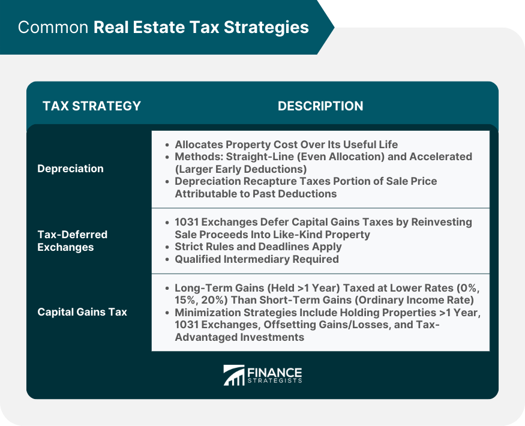

## Table of Contents

## What is tax liability in the context of real estate sales?

Tax liability in the context of real estate sales refers to the amount of money a person has to pay in taxes when they sell a property. When you sell a house or any piece of real estate, you might have to pay taxes on the profit you make from the sale. This profit is called capital gain. The tax you owe on this gain is your tax liability.

The amount of tax you have to pay depends on several things, like how long you owned the property and how much profit you made. If you owned the property for more than a year, you might pay a lower tax rate on your profit. But if you owned it for less than a year, you might pay a higher rate. It's important to know these rules because they can affect how much money you keep after selling your property.

## How can holding onto a property for more than a year affect the tax rate on its sale?

When you sell a property, the tax you pay on the profit can be different depending on how long you owned it. If you owned the property for more than a year before selling it, you might pay a lower tax rate on the profit. This is called a long-term capital gain. The government thinks that if you hold onto something for a long time, you should be rewarded with a lower tax rate when you sell it.

On the other hand, if you sell the property within a year of buying it, the profit is considered a short-term capital gain. Short-term gains are taxed at a higher rate, which is the same as your regular income tax rate. So, holding onto a property for more than a year can save you money on taxes because the tax rate for long-term gains is usually lower than the rate for short-term gains.

## What is the primary residence exclusion and how can it be used to reduce tax liability?

The primary residence exclusion is a tax rule that helps people save money when they sell their home. If you live in your home for at least two out of the last five years before you sell it, you can exclude a big part of the profit from taxes. For single people, you can exclude up to $250,000 of the profit, and for married couples filing together, you can exclude up to $500,000. This means you don't have to pay taxes on that part of the money you make from selling your home.

Using the primary residence exclusion can really lower your tax bill. Let's say you bought your home for $300,000 and sold it for $600,000. Your profit would be $300,000. If you qualify for the exclusion, you wouldn't have to pay taxes on the first $250,000 (or $500,000 if you're married filing jointly) of that profit. So, you'd only pay taxes on any profit over that amount. This rule can make a big difference in how much money you get to keep after selling your home.

## Can you explain the concept of a 1031 exchange and its benefits for tax deferral?

A 1031 exchange, also called a like-kind exchange, is a way to swap one investment property for another without paying taxes on the profit right away. When you sell an investment property, you usually have to pay taxes on any money you made from the sale. But with a 1031 exchange, you can delay paying those taxes if you use the money to buy another similar property. This means you can keep more of your money to reinvest in new properties.

The main benefit of a 1031 exchange is that it lets you defer your tax liability. Instead of paying taxes on your profit now, you can use that money to buy a new property, which can help you grow your investments faster. But remember, you eventually have to pay taxes when you sell the new property and don't do another 1031 exchange. So, it's a way to delay paying taxes, not avoid them forever.

## What are the rules and timelines associated with a 1031 exchange?

To do a 1031 exchange, you need to follow some important rules and timelines. First, you have to find a new property to buy within 45 days after you sell your old property. This is called the identification period. You need to tell the person handling your exchange which property or properties you want to buy. You can pick up to three properties, or more if their total value isn't more than double what you sold your old property for.

After you identify the new property, you have to finish buying it within 180 days from when you sold your old property. This is called the exchange period. It's really important to stick to these timelines because if you miss them, you won't be able to do the 1031 exchange and you'll have to pay taxes on your profit right away. Also, the new property you buy has to be similar to the one you sold, which means it should be used for the same kind of investment.

Using a 1031 exchange can be a good way to grow your investments without paying taxes right away, but it can be tricky to follow all the rules and meet the deadlines. It's a good idea to work with a professional who knows about 1031 exchanges to help you do everything correctly.

## How can installment sales be used to manage tax liability on real estate?

Installment sales can help you manage your tax liability when you sell real estate by spreading out the tax payments over time. Instead of getting all the money from the sale at once and paying a big tax bill that year, you can get paid in smaller amounts over several years. You only pay taxes on the profit you receive each year, which can lower your tax bill each year and help you keep more money in your pocket.

To do an installment sale, you need to have a written agreement with the buyer that says how much they will pay you each year. The profit you make from the sale is divided up based on how much money you get each year. This way, if you sell a property for a big profit, you don't have to pay all the taxes on that profit in one year. It's a good way to manage your taxes, but it's important to follow the rules and keep good records of all the payments you receive.

## What are the potential tax implications of selling a rental property versus a personal residence?

When you sell a personal residence, you might not have to pay much in taxes. If you lived in the house for at least two of the last five years, you can use the primary residence exclusion. This means you don't have to pay taxes on up to $250,000 of your profit if you're single, or up to $500,000 if you're married filing jointly. So, if you make a big profit when you sell your home, you might not owe any taxes on it at all. But, if your profit is more than the exclusion amount, you'll have to pay taxes on the extra money.

Selling a rental property is different. You can't use the primary residence exclusion for a rental property, so you'll have to pay taxes on all of your profit. If you owned the rental property for more than a year, the profit is considered a long-term capital gain, and you'll pay a lower tax rate on it. But if you owned it for less than a year, it's a short-term capital gain, and you'll pay a higher tax rate. Also, you might be able to reduce your tax bill by deducting things like depreciation recapture, which is when you have to pay back some of the tax benefits you got while you owned the property.

## How can capital improvements impact the tax basis of a property and ultimately affect tax liability?

When you make capital improvements to a property, like adding a new room or a swimming pool, it can change the tax basis of that property. The tax basis is the original cost of the property plus any improvements you make. So, if you spend money on making the property better, you add that amount to the original cost. This means your tax basis goes up. When you sell the property, a higher tax basis can lower your profit because you subtract the tax basis from the sale price to find out how much money you made.

Having a higher tax basis because of capital improvements can help you pay less in taxes when you sell. Let's say you bought a house for $200,000 and spent $50,000 on improvements. Your tax basis would be $250,000. If you sell the house for $300,000, your profit would be $50,000 ($300,000 - $250,000). If you didn't make those improvements, your profit would be $100,000 ($300,000 - $200,000). So, by increasing your tax basis with capital improvements, you can lower your profit and pay less in taxes.

## What are the differences between short-term and long-term capital gains taxes in real estate?

When you sell a property, the tax you pay on the profit you make can be different depending on how long you owned the property. If you owned it for less than a year, the profit is called a short-term capital gain. Short-term capital gains are taxed at the same rate as your regular income tax. This means if you're in a high income tax bracket, you'll pay a higher tax rate on your profit. For example, if your regular income tax rate is 24%, you'll pay 24% on your short-term capital gain from selling the property.

On the other hand, if you owned the property for more than a year, the profit is called a long-term capital gain. Long-term capital gains are taxed at a lower rate than short-term gains. The tax rate for long-term capital gains can be 0%, 15%, or 20%, depending on your income. Most people pay 15%, which is lower than many regular income tax rates. So, by holding onto a property for more than a year, you can save money on taxes because you'll pay a lower rate on your profit.

## How can depreciation recapture affect the taxes owed on the sale of a rental property?

When you sell a rental property, you might have to pay extra taxes because of something called depreciation recapture. Depreciation is when you claim a bit of the property's value as a tax deduction each year you own it. This helps lower your taxes while you own the property. But when you sell, the IRS wants some of that money back. They call this depreciation recapture, and it's taxed at a special rate of 25%. So, if you claimed $50,000 in depreciation over the years, you'd have to pay 25% of that $50,000, or $12,500, in taxes when you sell.

This extra tax can make a big difference in how much you owe when you sell your rental property. Let's say you bought a rental property for $200,000 and sold it for $300,000. Your profit would be $100,000. But if you claimed $50,000 in depreciation, you'd have to add the $12,500 in depreciation recapture to your taxes. So, instead of just paying taxes on the $100,000 profit, you'd also have to pay $12,500 more because of the depreciation you claimed. It's important to know about depreciation recapture so you can plan for it when you sell your rental property.

## What advanced strategies like cost segregation can be used to minimize tax liability on commercial real estate?

Cost segregation is a smart way to save on taxes when you own commercial real estate. It's a method where you break down the cost of your property into different parts, like the building itself, the land, and things inside the building like carpeting or appliances. By doing this, you can claim bigger tax deductions sooner. Normally, you'd spread out the cost of the building over many years, but with cost segregation, you can write off the cost of things that don't last as long, like carpeting, much faster. This means you can lower your taxes right away and keep more money in your pocket.

Using cost segregation can really help if you're planning to sell your commercial property later. When you sell, you might have to pay back some of the tax benefits you got from depreciation, which is called depreciation recapture. But if you used cost segregation, you might have already taken bigger deductions, so the amount you have to pay back could be less. Plus, if you do a 1031 exchange and buy another property, you can start using cost segregation again on the new property to keep saving on taxes. It's a good idea to work with a tax professional who knows about cost segregation to make sure you do it right and get the most out of it.

## How can working with a tax professional or financial advisor help in planning and reducing tax liability on real estate sales?

Working with a tax professional or financial advisor can make a big difference when you're planning to sell real estate. They know all the rules and can help you figure out the best way to lower your taxes. For example, they can help you decide if you should do a 1031 exchange to delay paying taxes, or if you should use the primary residence exclusion to not pay taxes on part of your profit. They can also help you keep track of all the costs and improvements you've made to your property, which can increase your tax basis and lower your profit when you sell.

These experts can also guide you on how to use strategies like cost segregation or installment sales to manage your taxes better. They'll help you understand how things like depreciation recapture might affect your taxes when you sell a rental property. By working with someone who knows a lot about taxes, you can plan ahead and make smart choices that help you keep more of the money you make from selling your property.

## What is the understanding of tax liability in real estate gains?

Tax liability in real estate gains arises when an investor sells a property and realizes a profit from the transaction. This profit, commonly referred to as capital gain, is subject to taxation under the U.S. tax code. Understanding how capital gains tax applies is critical for investors to effectively manage their tax burden.

**Capital Gains Tax Explanation**

Capital gains tax is levied on the profit realized from the sale of a capital asset, such as real estate. The gain is calculated as the difference between the selling price and the original purchase price of the property, adjusted for improvements and depreciation taken during ownership. The formula for calculating capital gain is:

$$
\text{Capital Gain} = \text{Selling Price} - (\text{Purchase Price} + \text{Capital Improvements} - \text{Depreciation Taken})
$$

The impact of capital gains tax on real estate transactions is significant, as it directly affects the net profit an investor can derive from the sale. Consequently, understanding the nuances of capital gains taxation is essential for optimizing returns on real estate investments.

**Short-term vs. Long-term Capital Gains Taxes**

Capital gains taxes are categorized based on the duration for which the asset was held. Short-term capital gains apply to assets held for one year or less, whereas long-term capital gains apply to assets held for more than one year. This distinction is crucial as the tax rates for these two categories differ:

1. **Short-term Capital Gains Tax**: These are taxed at ordinary income tax rates, which vary from 10% to 37% in the United States, depending on the taxpayer's income bracket. Since these rates are typically higher, investors often avoid short-term holdings unless absolutely necessary.

2. **Long-term Capital Gains Tax**: Generally taxed at reduced rates of 0%, 15%, or 20%, depending on the investor's taxable income. These lower rates incentivize longer-term investments and contribute significantly to an investor's overall tax efficiency in real estate transactions.

The preference for long-term holdings underscores the importance of strategic tax planning, enabling investors to benefit from more favorable tax treatments. In practice, determining whether a gain qualifies as short-term or long-term can influence decision-making processes in property sales, with investors aiming to benefit from reduced long-term capital gains tax rates whenever feasible.

## What are effective tax strategies for real estate investors?

When approaching real estate investments, tax strategies play a crucial role in reducing liabilities and enhancing overall profitability. Implementing effective strategies involves a comprehensive understanding of various techniques designed to optimize tax outcomes.

**Tax-Loss Harvesting**

Tax-loss harvesting involves selling underperforming or loss-incurring properties to offset capital gains from profitable investments. This strategy effectively lowers the taxable income, allowing investors to minimize tax liabilities. The key is to ensure compliance with IRS rules, particularly the "wash-sale rule," which prohibits repurchasing a substantially identical asset within 30 days of the sale.

**1031 Exchanges**

Section 1031 of the Internal Revenue Code allows investors to defer capital gains taxes by reinvesting proceeds from the sale of real estate into a like-kind property. This tax deferral strategy is particularly beneficial for those looking to upgrade their investment portfolio without immediate tax implications. Investors must adhere to strict timelines for identifying and acquiring replacement properties to qualify for this exchange. The procedure requires identifying potential replacement properties within 45 days of the original sale and completing the acquisition within 180 days.

**Owner-Occupied Exclusions**

For those who own and reside in a property, substantial tax benefits exist under the owner-occupied exclusion clause. The IRS provides an exclusion of up to $250,000 for single filers and $500,000 for married couples filing jointly on the sale of a principal residence. To qualify, the property must have been owned and used as the primary residence for at least two of the five years preceding the sale.

**Depreciation Benefits and Recapture**

Depreciation is a powerful tool for real estate investors, allowing them to deduct the cost of property wear and tear over time. This annual deduction can significantly reduce taxable income. However, investors must be cautious of depreciation recapture, which occurs when a property is sold for more than its depreciated value. The recaptured amount is taxed as ordinary income, but being aware of these potential taxes enables investors to plan accordingly. To calculate depreciation on a residential rental property, the Modified Accelerated Cost Recovery System (MACRS) is used, typically over a 27.5-year period for residential rental properties:

$$
\text{Annual Depreciation Deduction} = \frac{\text{Cost of the Property} - \text{Land Value}}{27.5}
$$

Incorporating these tax strategies requires careful planning and a solid understanding of applicable tax regulations, but the benefits can significantly enhance the financial outcomes of real estate investments.

## References & Further Reading

1. **IRS Publications**: To gain a comprehensive understanding of tax liabilities and strategies associated with real estate investments, access IRS publications such as [Publication 544](https://www.irs.gov/publications/p544), which details the sale of property and discusses the implications of capital gains and losses. Additionally, [Publication 523](https://www.irs.gov/publications/p523) provides detailed information on selling your home and potential tax exclusions and credits.

2. **IRS Form Guidelines**: The usage of specific forms is essential for accurate tax reporting. For detailed instructions on completing real estate-related tax forms, refer to [Form 8949](https://www.irs.gov/forms-pubs/about-form-8949) for sales and other dispositions of capital assets and [Form 4797](https://www.irs.gov/forms-pubs/about-form-4797) for sales of business property.

3. **1031 Exchange Resources**: Learn about tax-deferral strategies like the 1031 exchange through resources provided by financial advisory firms or through detailed IRS instructions on [Like-Kind Exchanges](https://www.irs.gov/newsroom/like-kind-exchanges-real-estate-tax-tips).

4. **Depreciation and Recapture**: For a deeper understanding of property depreciation and its implications on tax liabilities, explore resources like [IRS Publication 946](https://www.irs.gov/publications/p946) which covers how to depreciate property.

5. **Algorithmic Trading Introduction**: For insights into algorithmic trading and its potential benefits for real estate investments, consider foundational texts such as "Algorithmic Trading: Winning Strategies and Their Rationale" by Ernest P. Chan. Additionally, online courses and materials from platforms like Coursera or edX can provide valuable knowledge on integrating algorithmic strategies into investment portfolios.

6. **Expert Blogs and Financial Articles**: Regularly updated financial blogs and articles can provide recent insights and real-world applications of tax strategies and algorithmic trading in real estate. Websites like Investopedia and MarketWatch often feature expert analyses that can be beneficial.

7. **Recommended Books**: Books such as "The Tax Tactical Investor: Real Estate Edition" can serve as a comprehensive guide to mastering tax strategies tailored for real estate investors, blending traditional tax understanding with modern investment approaches.

8. **Professional Financial Advisors**: Consultation with certified financial planners or CPAs specializing in real estate can provide tailored advice, ensuring compliance and optimal tax strategy implementation. Reputable firms offer resources and initial consultations that might be invaluable for specific investment needs.

By utilizing these resources, investors can enhance their understanding and application of effective tax strategies in real estate, ensuring seamless integration with modern financial tools like [algorithmic trading](/wiki/algorithmic-trading).

