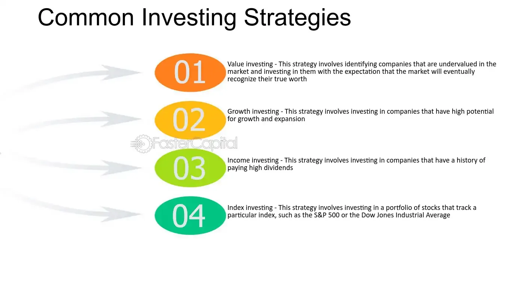

## Table of Contents

## What is Wall Street and why is it important for investors?

Wall Street is a famous street in New York City where many big financial companies have their offices. It's also the name people use to talk about the whole U.S. financial market. When people say "Wall Street," they're usually talking about the stock market, where people buy and sell parts of companies called stocks.

Wall Street is important for investors because it's where they can buy and sell stocks to try to make money. If an investor thinks a company will do well, they might buy its stock, hoping its value will go up. If the stock's value does go up, the investor can sell it for more than they paid, making a profit. Wall Street is also important because it helps companies get money they need to grow by selling stocks to investors. This way, everyone can benefit: companies grow, and investors can make money if they choose the right stocks.

## How can beginners start investing in Wall Street?

Beginners can start investing in Wall Street by first learning the basics of how the stock market works. They should understand what stocks are, how to buy and sell them, and the risks involved. A good way to start is by reading books, watching online videos, or taking a beginner's course on investing. It's also important to set clear goals for what you want to achieve with your investments, whether it's saving for retirement, buying a house, or just growing your money over time.

Once you feel ready, you can open a brokerage account with a reputable online broker. This is like opening a bank account, but for buying and selling stocks. You'll need to deposit some money into this account to start investing. It's wise to start small, maybe by investing in a few well-known companies or in a diversified fund like an index fund, which spreads your money across many different stocks. Remember, investing always comes with risks, so never invest money you can't afford to lose. As you gain more experience, you can slowly increase the amount you invest and explore more advanced strategies.

## What are the basic financial instruments available on Wall Street?

On Wall Street, there are several basic financial instruments that people can invest in. The most common one is stocks, which are pieces of ownership in a company. When you buy a stock, you're buying a small part of that company. If the company does well, the value of your stock might go up, and you could make money. Another common instrument is bonds. Bonds are like loans you give to a company or the government. They promise to pay you back with interest over time. They're usually seen as safer than stocks but might not grow as much in value.

There are also mutual funds and exchange-traded funds (ETFs). These are collections of stocks or bonds that you can buy all at once. They help spread out your risk because you're not putting all your money into one company. Mutual funds are managed by professionals who decide which stocks or bonds to buy, while ETFs usually follow a specific index, like the S&P 500. Lastly, options are another type of financial instrument. Options give you the right, but not the obligation, to buy or sell a stock at a certain price before a certain date. They can be riskier and are usually used by more experienced investors.

## What are the key economic indicators to watch when investing on Wall Street?

When you're investing on Wall Street, it's good to keep an eye on key economic indicators that can tell you how the economy is doing. One important indicator is the Gross Domestic Product (GDP), which shows how much all the goods and services in the country are worth. If GDP is growing, it usually means the economy is doing well, and that can be good for stocks. Another indicator to watch is the unemployment rate. When fewer people are out of work, it often means companies are doing well and might make more money, which can be good for their stock prices. Inflation is also important because it shows how prices are changing. If inflation is too high, it can hurt the value of money and make it harder for companies to grow.

Other indicators to pay attention to are interest rates, which are set by the Federal Reserve. When interest rates go up, borrowing money becomes more expensive, which can slow down the economy. On the other hand, when interest rates are low, borrowing is cheaper, and the economy might grow faster. The Consumer Confidence Index is also useful because it shows how people feel about their financial future. If people feel good, they're more likely to spend money, which can help businesses and the stock market. Keeping track of these indicators can help you make smarter choices about when to buy or sell stocks.

## How does one develop a diversified investment portfolio on Wall Street?

To develop a diversified investment portfolio on Wall Street, you should spread your money across different types of investments. This means not putting all your eggs in one basket. For example, instead of buying stocks from just one company or one industry, you can buy stocks from different companies and industries. You can also mix in other types of investments like bonds, which are safer, and mutual funds or ETFs, which hold a bunch of different stocks or bonds. By doing this, if one part of your portfolio doesn't do well, other parts might still do okay, helping to balance out your overall returns.

Another way to diversify is by investing in different countries or regions. This can protect you from problems that might only affect one country's economy. For example, if the U.S. economy is struggling, your investments in Europe or Asia might still be doing well. You can also think about investing in different sectors, like technology, healthcare, or energy. Over time, as you learn more about investing, you can adjust your portfolio to match your goals and how much risk you're willing to take. Remember, the key to a good diversified portfolio is to keep it balanced and spread out, so you're not too dependent on any one investment.

## What are common investment strategies for Wall Street, and how do they differ?

There are several common investment strategies on Wall Street, and each one has its own way of trying to make money. One strategy is called "buy and hold," where investors buy stocks and keep them for a long time, like years or even decades. They believe that over time, good companies will grow and their stock prices will go up. Another strategy is called "value investing," where investors look for companies that they think are underpriced. They buy these stocks hoping that other people will eventually see the value and the price will go up. Then there's "growth investing," where investors focus on companies that are growing fast and are expected to keep growing. They're willing to pay more for these stocks because they think the growth will make up for it.

Another popular strategy is "dividend investing," where investors buy stocks of companies that pay regular dividends, which are like little payments to shareholders. They use these dividends as a steady income stream. "Momentum investing" is a bit different; it's about buying stocks that have been going up in price and selling them when they start to go down. Investors using this strategy think that stocks that are going up will keep going up for a while. Each of these strategies has its own risks and rewards. For example, buy and hold can be less risky over the long term, but it might not give you quick profits. On the other hand, momentum investing can give quick gains but is riskier because stock prices can change suddenly.

## How can investors use technical analysis to make decisions on Wall Street?

Technical analysis is a way for investors to make decisions on Wall Street by looking at charts and patterns of stock prices. Instead of focusing on a company's business, like how much money it makes or what it sells, technical analysis looks at how the stock's price has moved in the past. Investors use this to try to guess where the price might go next. They look for patterns, like when a stock's price goes up and down in a certain way, or when it breaks through a certain price level. These patterns can help them decide when to buy or sell a stock.

For example, if a stock's price has been going up and then starts to go down, an investor might see a pattern that tells them the price might keep going down. They could decide to sell the stock before it loses more value. On the other hand, if they see a pattern that shows the price might start going up again, they might buy the stock, hoping to make money as the price rises. Technical analysis uses tools like moving averages, which smooth out price changes over time, and indicators like the Relative Strength Index (RSI), which can show if a stock is overbought or oversold. By using these tools, investors try to make smarter choices about when to buy and sell stocks on Wall Street.

## What role does fundamental analysis play in Wall Street investing?

Fundamental analysis is a way for investors on Wall Street to decide if a stock is a good buy by looking at the company's basic details. Instead of just looking at the stock's price history, fundamental analysis looks at things like how much money the company makes, how much it owes, and how fast it's growing. Investors use this information to figure out what the company is really worth, which they call its "intrinsic value." If the stock's price is lower than its intrinsic value, they might think it's a good buy because the stock could go up in price to match its true worth.

This kind of analysis helps investors make long-term decisions. They might look at the company's financial reports, like its income statement, balance sheet, and cash flow statement. They also check out the company's business model, its competition, and even the overall economy. By doing all this, investors try to see if the company is strong and likely to do well in the future. Fundamental analysis is especially important for strategies like value investing and growth investing, where understanding the company's real value and potential for growth is key to making smart investment choices.

## How can investors manage risk when participating in Wall Street markets?

Managing risk when investing on Wall Street is important to protect your money. One way to do this is by diversifying your investments. This means not putting all your money into just one stock or one type of investment. Instead, spread your money across different stocks, bonds, and maybe even different countries. If one investment doesn't do well, others might still be okay, which can help balance out your losses. Another way to manage risk is by setting clear goals and knowing how much risk you're willing to take. This helps you choose investments that match what you want to achieve and how much you can afford to lose.

It's also smart to keep an eye on your investments and the market. This doesn't mean you should check your stocks every day and panic if they go down a bit. Instead, look at the big picture and be ready to make changes if things aren't going as planned. Using tools like stop-loss orders can help too. A stop-loss order is like a safety net that automatically sells your stock if it drops to a certain price, so you don't lose too much money. Lastly, learning about the companies you invest in and understanding economic indicators can help you make better decisions and manage risk more effectively.

## What advanced trading strategies are used by expert investors on Wall Street?

Expert investors on Wall Street often use advanced trading strategies like algorithmic trading and high-frequency trading. Algorithmic trading involves using computer programs to buy and sell stocks based on a set of rules. These rules can be based on things like price patterns or economic indicators. High-frequency trading is a type of algorithmic trading where computers make lots of trades very quickly, sometimes in just a few seconds. These strategies can help investors take advantage of small changes in the market and make profits faster than they could by trading manually.

Another advanced strategy is options trading. Options give investors the right, but not the obligation, to buy or sell a stock at a certain price before a certain date. Expert investors use options to bet on whether a stock's price will go up or down, and they can use different combinations of options to create complex strategies. For example, they might use a "straddle" to make money whether the stock goes up or down a lot, or a "spread" to limit their risk while still trying to make a profit. These strategies require a good understanding of the market and can be riskier, but they also offer the chance for bigger rewards.

Lastly, some expert investors use hedging strategies to manage risk. Hedging is like buying insurance for your investments. For example, if an investor owns a lot of stock in one company, they might buy options or other investments that will go up in value if the stock goes down. This way, if the stock loses value, the hedge can help make up for some of the loss. Hedging can be complex and might cost money, but it's a way for investors to protect their portfolios from big drops in the market.

## How do global events and policies impact Wall Street, and how should investors adapt?

Global events and policies can have a big impact on Wall Street. When something big happens in the world, like a war, a natural disaster, or a change in a country's laws, it can shake up the stock market. For example, if there's a war in a country that produces a lot of oil, the price of oil might go up, which can affect companies that use oil and their stock prices. Also, if a country changes its laws about taxes or trade, it can make some companies more or less profitable, which can move their stock prices too. Investors need to keep an eye on these events because they can change how their investments do.

To adapt to these changes, investors should stay informed about what's happening around the world. They can read news, watch videos, or follow experts who talk about how global events might affect the market. If they think a big event is going to hurt their investments, they might decide to sell some of their stocks or buy different ones that won't be affected as much. They can also use strategies like diversification, which means spreading their money across different types of investments, to help protect themselves from big changes in one area. By staying flexible and ready to adjust their plans, investors can better handle the ups and downs caused by global events and policies.

## What are the latest trends and technologies influencing Wall Street, and how can investors leverage them?

One of the biggest trends on Wall Street right now is the use of artificial intelligence (AI) and machine learning. These technologies help investors make better decisions by looking at huge amounts of data and finding patterns that humans might miss. For example, AI can predict how a stock might move based on news articles, social media posts, and past price changes. This can help investors buy or sell at the right time. Another trend is the rise of robo-advisors, which are computer programs that manage your investments for you. They use algorithms to create and adjust your portfolio, often at a lower cost than traditional financial advisors. Investors can use these tools to get personalized advice and manage their money more easily.

Another important trend is the growing focus on sustainable and socially responsible investing. More and more investors want to put their money into companies that are good for the environment and society. This has led to the popularity of ESG (Environmental, Social, and Governance) investing, where investors look at how companies handle issues like climate change, worker rights, and corporate ethics. By choosing to invest in companies with strong ESG scores, investors can support causes they care about while still trying to make money. To leverage these trends, investors can use online platforms and apps that offer ESG ratings and AI-driven insights, helping them make smarter and more ethical investment choices.

## References & Further Reading

[1]: Bergstra, J., Bardenet, R., Bengio, Y., & Kégl, B. (2011). ["Algorithms for Hyper-Parameter Optimization."](https://dl.acm.org/doi/10.5555/2986459.2986743) Advances in Neural Information Processing Systems 24.

[2]: ["Advances in Financial Machine Learning"](https://www.amazon.com/Advances-Financial-Machine-Learning-Marcos/dp/1119482089) by Marcos Lopez de Prado

[3]: ["Evidence-Based Technical Analysis: Applying the Scientific Method and Statistical Inference to Trading Signals"](https://www.amazon.com/Evidence-Based-Technical-Analysis-Scientific-Statistical/dp/0470008741) by David Aronson

[4]: ["Machine Learning for Algorithmic Trading"](https://github.com/stefan-jansen/machine-learning-for-trading) by Stefan Jansen

[5]: ["Quantitative Trading: How to Build Your Own Algorithmic Trading Business"](https://www.amazon.com/Quantitative-Trading-Build-Algorithmic-Business/dp/1119800064) by Ernest P. Chan