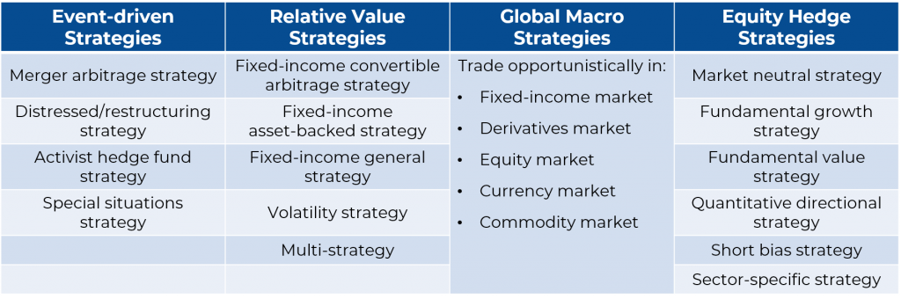

## Table of Contents

## What is a hedge fund and how does it differ from other investment vehicles?

A hedge fund is a type of investment fund that pools money from investors and uses different strategies to try to make money. These strategies can be riskier than those used by other funds, like mutual funds. Hedge funds are usually only available to wealthy people or big organizations because they often require a lot of money to invest.

Hedge funds differ from other investment vehicles, like mutual funds or exchange-traded funds (ETFs), in a few ways. First, hedge funds can use more complex and risky strategies, such as borrowing money to invest or betting that certain investments will go down in value. Second, hedge funds have fewer rules and regulations than other funds, which gives them more freedom but also more risk. Lastly, hedge funds often charge higher fees than other investment vehicles, which can eat into the returns for investors.

## What are the primary objectives of hedge funds?

The main goal of hedge funds is to make money for their investors. They do this by using different strategies to try to earn higher returns than what you might get from regular investments like stocks or bonds. Hedge funds often aim to make money no matter what the market is doing, whether it's going up or down. This is different from many other funds that might only do well when the market is doing well.

To achieve their goals, hedge funds use a variety of methods. They might borrow money to invest more than they have, or they might bet against certain investments, hoping they will lose value so the [hedge fund](/wiki/hedge-fund-trading-strategies) can profit. Because of these strategies, hedge funds can be riskier but also have the potential for higher rewards. The managers of hedge funds are always looking for new ways to beat the market and make money for their investors.

## Can you explain the basic concept of risk management in hedge funds?

Risk management in hedge funds is all about trying to keep the fund safe while still making money. Hedge fund managers use different ways to watch and control the risks they take. They look at how much they could lose on each investment and try to balance that with how much they could gain. They also use tools like stop-loss orders, which automatically sell an investment if it starts to lose too much money, to help protect the fund.

Another important part of risk management is spreading out the investments. Hedge fund managers try not to put all their money into one type of investment or one area of the market. By spreading out their investments, they hope to reduce the chance that one bad investment will hurt the whole fund. This way, if one investment does poorly, the others might still do well and help balance things out.

## What are the common strategies used by hedge funds to generate returns?

Hedge funds use many different strategies to make money. One common strategy is called "long/short equity." This means the fund buys stocks they think will go up in value (long) and sells stocks they think will go down in value (short). By doing both, they hope to make money no matter if the market goes up or down. Another strategy is "market neutral," where the fund tries to balance their long and short positions so that the overall risk is low, but they can still make money from the difference in performance between the stocks they picked.

Another popular strategy is "[global macro](/wiki/global-macro-strategy)," where the fund bets on big economic changes around the world. They might invest in currencies, commodities, or bonds based on what they think will happen in the global economy. "Event-driven" strategies are also common, where the fund tries to make money from big events like mergers, acquisitions, or company restructurings. They buy stocks or other investments that they think will do well because of these events.

Some hedge funds use "[arbitrage](/wiki/arbitrage)" strategies, where they try to take advantage of small price differences in the market. For example, they might buy a stock on one exchange where it's cheaper and sell it on another where it's more expensive. "Multi-strategy" funds mix different strategies together to try to spread out their risk and make money in different ways. All these strategies have different levels of risk and potential reward, and hedge fund managers choose the ones they think will work best for their fund.

## How do hedge funds utilize leverage and what are the associated risks?

Hedge funds use leverage to try to make more money. Leverage means borrowing money to invest more than they have. For example, if a hedge fund has $100, they might borrow another $100 to invest $200 total. If their investments go up in value, they make more money because they have more money invested. But if the investments go down, they lose more money because they have to pay back the borrowed money, plus interest.

Using leverage can be very risky. If the investments don't do well, the losses can be much bigger than if the hedge fund only used their own money. This can lead to big financial problems for the fund and its investors. Also, if the market changes quickly, the hedge fund might have to sell investments at a bad time to pay back the borrowed money, which can make the losses even worse. So, while leverage can help hedge funds make more money, it also makes their investments much riskier.

## What is the role of short selling in hedge fund strategies?

Short selling is a key strategy that hedge funds use to make money. It's when a hedge fund borrows a stock or other investment and sells it, hoping the price will go down. If the price does drop, the hedge fund can buy the investment back at the lower price, return it to the lender, and keep the difference as profit. This way, hedge funds can make money even when the market is going down, not just when it's going up.

Short selling can be risky though. If the price of the investment goes up instead of down, the hedge fund loses money. They have to buy the investment back at a higher price to return it, which means they lose the difference. Also, there's no limit to how much the price can go up, so the potential losses can be very big. But, hedge funds use short selling as a way to balance out their other investments and try to make money no matter what the market is doing.

## How do hedge funds employ market neutral strategies?

Hedge funds use market neutral strategies to try to make money without taking big risks from the overall market going up or down. They do this by balancing their investments so that they have an equal amount of money betting that some stocks will go up and others will go down. For example, if they think Stock A will go up, they buy it. At the same time, if they think Stock B will go down, they sell it short. By doing this, they hope to make money from the difference in how these stocks perform, not from the overall market movement.

The goal of a [market neutral strategy](/wiki/market-neutral-strategy) is to keep the fund safe from big market swings. If the market goes up, the gains from the stocks they bought might be balanced out by losses from the stocks they sold short. If the market goes down, the losses from the stocks they bought might be balanced out by gains from the stocks they sold short. This way, the hedge fund tries to make steady profits without being too affected by what the market is doing overall.

## What are event-driven strategies and how do hedge funds capitalize on them?

Event-driven strategies are when hedge funds try to make money from big events that can change the value of a company. These events can be things like mergers, where two companies join together, acquisitions, where one company buys another, or even when a company goes bankrupt or restructures. Hedge funds look for these events and try to guess how they will affect the companies involved. If they think a company's stock will go up because of an event, they will buy it. If they think it will go down, they might sell it short.

Hedge funds capitalize on these events by carefully studying what might happen and then making their investments. For example, if Company A is going to buy Company B, the hedge fund might buy shares of Company B because they think the price will go up once the deal is done. Or, if a company is about to go bankrupt, the hedge fund might sell its stock short because they think the price will drop. By focusing on these events, hedge funds try to make money from the changes that happen, no matter what the overall market is doing.

## Can you describe the use of global macro strategies in hedge funds?

Global macro strategies are when hedge funds try to make money by betting on big changes in the world's economy. They look at things like what countries are doing with their money, how much things like oil or gold cost, and even what's happening with interest rates. If they think a country's money will get stronger, they might buy that country's currency. If they think the price of oil will go up, they might buy oil. They use these guesses about the world to decide where to put their money.

This strategy can be risky because it's hard to predict what will happen in the world. But if the hedge fund guesses right, they can make a lot of money. For example, if they think a country's economy will do well, they might invest in that country's stocks or bonds. If they're right, and the economy does well, the value of those investments goes up, and the hedge fund makes money. Global macro strategies let hedge funds try to make money no matter what the stock market is doing, as long as they can predict big world events correctly.

## How do hedge funds implement quantitative and algorithmic trading strategies?

Hedge funds use quantitative and [algorithmic trading](/wiki/algorithmic-trading) strategies by using computers and math to make decisions about buying and selling investments. They collect a lot of data about things like stock prices, how much people are buying and selling, and even news events. Then, they use special math formulas, called algorithms, to look at this data and figure out the best times to buy or sell. These algorithms can find patterns that people might miss, and they can make trades very quickly, sometimes in just a few seconds.

These strategies help hedge funds try to make money in a more systematic way. Instead of guessing what might happen, they rely on numbers and patterns. For example, if an algorithm sees that a certain stock always goes up after a good earnings report, it might tell the hedge fund to buy that stock right before the report comes out. But, even though these strategies use a lot of math and technology, they can still be risky. If the patterns change or the data is wrong, the hedge fund could lose money. So, while quantitative and algorithmic trading can be powerful tools, they need to be used carefully.

## What are the regulatory considerations and compliance requirements for hedge funds?

Hedge funds have to follow certain rules and regulations to make sure they are doing things the right way. In many countries, hedge funds are watched by groups like the Securities and Exchange Commission (SEC) in the United States. These groups make rules that hedge funds have to follow, like how much they can borrow and what they have to tell their investors. Hedge funds also need to make sure they are following laws about how they handle money and keep it safe. If they don't follow these rules, they could get in big trouble, like having to pay fines or even being shut down.

Another important part of running a hedge fund is making sure they follow rules about who can invest. In many places, only rich people or big organizations can put money into hedge funds. This is because hedge funds can be risky, and the rules are there to protect people who might not understand the risks. Hedge funds also have to be careful about how they talk about their investments. They can't lie or say things that aren't true to get people to invest. So, hedge funds need to be very careful to follow all these rules and make sure they are doing everything the right way.

## How do hedge funds measure and evaluate their performance against benchmarks?

Hedge funds measure and compare their performance using different ways. One common way is to look at how much money they made compared to a benchmark, which is like a standard to measure against. For example, they might compare their returns to a stock market index like the S&P 500. If the hedge fund made more money than the S&P 500, they did better than the market. They also look at things like the Sharpe Ratio, which shows how much extra return they got for the risk they took. A higher Sharpe Ratio means they did a good job of making money without taking too much risk.

Another way hedge funds check their performance is by looking at their alpha. Alpha is a number that shows how much better the hedge fund did compared to what you would expect just from the market. If a hedge fund has a positive alpha, it means they made more money than you would expect just from the market going up. They also look at their beta, which shows how much their returns move with the market. A low beta means the hedge fund's performance isn't tied too closely to the market, which is good if they want to make money no matter what the market is doing. By using these measures, hedge funds can see if they are doing a good job and making money for their investors.

## References & Further Reading

[1]: Pardo, R. (2011). ["The Evaluation and Optimization of Trading Strategies."](https://onlinelibrary.wiley.com/doi/book/10.1002/9781119196969) Wiley Trading.

[2]: Lopez de Prado, M. (2018). ["Advances in Financial Machine Learning."](https://www.amazon.com/Advances-Financial-Machine-Learning-Marcos/dp/1119482089) Wiley.

[3]: Chan, E. P. (2009). ["Quantitative Trading: How to Build Your Own Algorithmic Trading Business."](https://github.com/ftvision/quant_trading_echan_book) Wiley.

[4]: Aronson, D. R. (2007). ["Evidence-Based Technical Analysis: Applying the Scientific Method and Statistical Inference to Trading Signals."](https://www.amazon.com/Evidence-Based-Technical-Analysis-Scientific-Statistical/dp/0470008741) Wiley.

[5]: Nagel, S., et al. (2004). ["Hedge Funds: Performance, Risk, and Capital Formation."](https://www.jstor.org/stable/pdf/25094489.pdf) National Bureau of Economic Research.