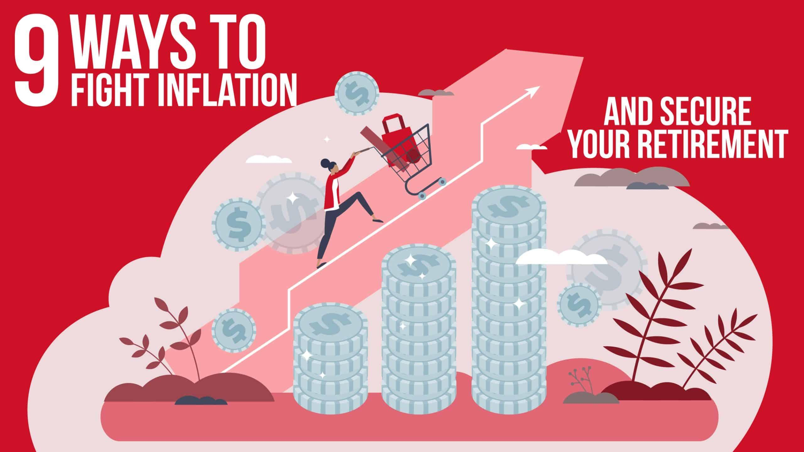

## Table of Contents

## What is inflation and how does it affect older investors?

Inflation is when the prices of things we buy, like food and gas, go up over time. It means that the money we have can buy less stuff than before. Imagine if a candy bar cost $1 last year, but now it costs $1.10. That's inflation. The government and banks try to keep inflation at a steady rate, but sometimes it can go up a lot, which can be tough for everyone.

For older investors, inflation can be a big worry. Many older people live on a fixed income, like pensions or savings, which don't always go up with inflation. So, if prices rise, their money can't buy as much. This can make it hard to pay for everyday things. Older investors often put their money in safe places like bonds or savings accounts, but these might not grow fast enough to keep up with inflation. This means they might need to find other ways to invest their money to make sure it keeps its value.

## Why is it important for older investors to consider inflation in their investment strategy?

It's really important for older investors to think about inflation when planning how to use their money. As people get older, they often have a set amount of money coming in each month from things like pensions or savings. If inflation goes up, the prices of things like food, medicine, and housing also go up. But their income might not change. This means their money won't go as far as it used to, making it harder to pay for the things they need.

To keep up with inflation, older investors need to make sure their investments grow enough to cover the rising costs. Safe investments like savings accounts or bonds might not grow fast enough to beat inflation. That's why they might need to look at other types of investments, like stocks or real estate, that could grow more over time. By planning carefully and choosing the right investments, older investors can help make sure their money keeps its value even when prices go up.

## What are some basic investment options that can help older investors keep up with inflation?

One good option for older investors to keep up with inflation is to invest in stocks. Stocks can grow faster than inflation over time. They can be riskier than other investments, but if you pick good companies, your money can grow a lot. You might want to look at big, stable companies that pay dividends, which are like little bonuses that can help your money grow even more. Another way to invest in stocks is through a mutual fund or an exchange-traded fund ([ETF](/wiki/etf-trading-strategies)), which spreads your money across many different stocks and can be less risky.

Another option is real estate. Buying property can be a good way to keep up with inflation because property values often go up over time. You can also rent out the property to get extra income, which can help with rising costs. If buying a whole property is too much, you can invest in a real estate investment trust (REIT), which is like a fund that owns and manages properties. This can be a simpler way to get into real estate without having to deal with all the work of being a landlord.

Lastly, consider Treasury Inflation-Protected Securities (TIPS). These are special bonds from the government that are designed to keep up with inflation. The value of TIPS goes up with inflation, so they can help protect your money. They're not as exciting as stocks or real estate, but they're very safe and can be a good part of a plan to keep your money's value over time.

## How can older investors diversify their portfolios to combat inflation?

Older investors can diversify their portfolios to fight inflation by mixing different types of investments. Instead of putting all their money in one place, like just savings accounts or bonds, they can spread it out. For example, they might put some money in stocks, which can grow faster than inflation over time. They could choose stocks from big, stable companies that pay dividends. This way, they get some extra money that can help keep up with rising prices. Another part of their money could go into real estate, either by buying property or investing in a real estate investment trust (REIT). Real estate often goes up in value and can provide rental income, which helps with inflation.

Another way to diversify is by investing in Treasury Inflation-Protected Securities (TIPS). TIPS are special bonds that automatically adjust with inflation, so they help protect the value of your money. While they might not grow as fast as stocks or real estate, they are very safe and can be a good part of a balanced plan. By having a mix of stocks, real estate, and TIPS, older investors can better protect their money from losing value due to inflation. This way, they can make sure their income keeps up with the rising costs of things they need.

## What role do Treasury Inflation-Protected Securities (TIPS) play in an older investor's strategy?

Treasury Inflation-Protected Securities, or TIPS, are a special type of bond from the government that can help older investors fight inflation. These bonds are designed to keep up with rising prices. When inflation goes up, the value of TIPS goes up too. This means that the money older investors have in TIPS won't lose its value over time, even if everything else gets more expensive. TIPS are very safe because they are backed by the government, so there's less risk of losing money.

In an older investor's strategy, TIPS can play a big role in keeping their money's value. Older people often live on a fixed income, like pensions or savings, which might not grow with inflation. By putting some of their money in TIPS, they can make sure at least part of their income keeps up with rising costs. TIPS won't grow as fast as some other investments like stocks or real estate, but they provide a steady and safe way to protect against inflation. This can give older investors peace of mind, knowing that their money will still be worth something even as prices go up.

## How can real estate investments help older investors fight inflation?

Real estate investments can be a good way for older investors to fight inflation. When you buy property, its value often goes up over time. This means that even if other things get more expensive because of inflation, the value of your property can keep up or even grow faster. If you rent out the property, you can get extra money every month. This rental income can help pay for the things you need, even when prices are going up. So, real estate can be a way to make sure your money keeps its value and you have enough to live on.

Another way to invest in real estate without buying a whole property is through a real estate investment trust (REIT). A REIT is like a big fund that owns and manages lots of properties. When you invest in a REIT, you get a share of the money it makes from rents and property sales. This can be a simpler way to get into real estate without all the work of being a landlord. Like owning property directly, investing in a REIT can help your money grow and keep up with inflation. It's a good option for older investors who want to protect their money's value over time.

## What are the benefits and risks of investing in commodities for older investors?

Investing in commodities, like gold, oil, or agricultural products, can help older investors fight inflation. Commodities often go up in price when inflation rises. This means that if you have some of your money in commodities, it can keep up with or even outpace the rising costs of other things. For example, gold is often seen as a safe investment during times of inflation because its value tends to stay strong. So, putting some money into commodities can be a way to make sure your savings don't lose value over time.

However, investing in commodities also comes with risks. The prices of commodities can go up and down a lot, which can be stressful and risky, especially for older investors who might not want to take big chances with their money. If the price of a commodity drops suddenly, you could lose money. Also, it can be hard to know when to buy or sell commodities because their prices can be affected by many things, like weather, politics, or changes in the economy. So, while commodities can help protect against inflation, older investors need to be careful and maybe not put all their money in them.

## How should older investors adjust their asset allocation to better combat inflation?

Older investors should think about spreading their money across different types of investments to fight inflation. They might want to put some money in stocks, especially from big, stable companies that pay dividends. Stocks can grow faster than inflation over time, helping their money keep its value. Another good idea is to invest in real estate. Buying property or investing in a real estate investment trust (REIT) can help because property values often go up with inflation. They can also get extra income from renting out the property, which can help pay for things that get more expensive.

Another part of their money could go into Treasury Inflation-Protected Securities (TIPS). TIPS are special bonds that automatically adjust with inflation, so they help protect the value of the money. While they might not grow as fast as stocks or real estate, they are very safe and can be a good part of a balanced plan. Older investors should also think about putting some money in commodities, like gold, which can go up in price when inflation rises. But they need to be careful because commodities can be risky and their prices can change a lot. By mixing these different investments, older investors can better protect their money from losing value because of inflation.

## What advanced strategies can older investors use to hedge against inflation?

Older investors can use a strategy called "laddering" with bonds to fight inflation. This means they buy bonds that come due at different times. For example, they might buy some bonds that pay back in one year, some in two years, and some in three years. This way, they can get their money back at different times and reinvest it at new, higher rates if inflation goes up. It helps them keep up with rising prices because they can always have some money ready to put into new investments that might pay more.

Another advanced strategy is to use inflation swaps. This is a bit more complicated, but it can be very useful. In an inflation swap, older investors agree with someone else to exchange payments based on inflation rates. If inflation goes up, they get more money from the swap, which helps their money keep its value. This can be a good way to protect against big jumps in inflation, but it's important to work with a financial advisor because inflation swaps can be tricky to understand and manage.

## How can older investors use dividend growth stocks to outpace inflation?

Older investors can use dividend [growth stocks](/wiki/growth-stocks) to fight inflation by [picking](/wiki/asset-class-picking) stocks from companies that not only pay dividends but also increase those dividends over time. Dividends are like little bonuses that companies pay to their shareholders. When a company raises its dividends, it means the money older investors get from these stocks goes up. If the dividends grow faster than inflation, the money keeps its value and can even grow more. This can help older investors keep up with the rising costs of things they need.

To make this work, older investors should look for big, stable companies that have a good history of increasing their dividends. These companies are often in industries that do well even when the economy changes. By putting some of their money into these dividend growth stocks, older investors can get a steady income that goes up over time. This can be a smart way to make sure their money doesn't lose value because of inflation.

## What are the tax implications of different investment strategies aimed at combating inflation for older investors?

When older investors choose different ways to fight inflation, they need to think about taxes too. If they invest in stocks that pay dividends, they will have to pay taxes on the money they get from those dividends. But the good news is that dividends from most stocks are taxed at a lower rate than regular income. This can help older investors keep more of their money. Also, if they sell stocks and make a profit, they might have to pay capital gains tax. But if they hold onto the stocks for more than a year, the tax rate on those gains is usually lower, which can be a good thing.

Investing in real estate can also have tax benefits. If older investors rent out a property, they can deduct things like mortgage interest, property taxes, and maintenance costs from their income taxes. This can lower the amount of taxes they have to pay. But if they sell the property and make a profit, they will have to pay capital gains tax on that profit. Another option, like investing in Treasury Inflation-Protected Securities (TIPS), is taxed differently. The interest from TIPS is usually taxed as regular income, but the part of the return that comes from inflation adjustments is only taxed when the bond is sold or matures. So, older investors need to think about these tax rules when planning their investments to fight inflation.

## How can older investors incorporate inflation expectations into their long-term financial planning?

Older investors need to think about inflation when planning for the future. Inflation means prices go up over time, so the money they have now might not buy as much later. To keep up with inflation, they should look at different ways to invest their money. They might put some money in stocks, especially from big companies that pay growing dividends. These dividends can help their money grow faster than inflation. Real estate is another good choice because property values often go up with inflation, and they can get extra income from renting it out.

Another way to plan for inflation is by using Treasury Inflation-Protected Securities (TIPS). These special bonds from the government adjust with inflation, so the money in TIPS keeps its value even when prices rise. Older investors should also think about spreading their money across different types of investments. This way, if one type doesn't do well, others might help balance it out. By planning carefully and choosing the right mix of investments, older investors can make sure their money keeps up with inflation and they can still afford the things they need as they get older.

## How does inflation impact retirement savings and how can it be understood?

Inflation is the rate at which the general level of prices for goods and services rises and subsequently erodes purchasing power. Historically, inflation has had a significant impact on the economy by diminishing the value of money over time. For instance, an item that costs $100 today may cost considerably more in the future if inflation is prevalent. This erosion of purchasing power affects all aspects of financial planning, including retirement savings.

The average inflation rate varies across different time periods and geographies, but in the United States, it has historically hovered around 3% per year. This seemingly small percentage can have a profound impact on retirement savings over the long haul. For retirement savings, safeguarding purchasing power is crucial. The primary concern is that inflation reduces the real value of fixed-income investments, such as bonds or savings accounts, thereby affecting retirees who rely on these investments for a stable income.

To illustrate this impact mathematically, consider the formula for future value (FV) with inflation factored in:

$$
FV = PV \times (1 + i)^n
$$

Where:
- $FV$ is the future value of the money.
- $PV$ is the present value or initial amount.
- $i$ represents the inflation rate.
- $n$ is the number of years.

For a retiree, understanding this formula is critical. If inflation averages 3% and a retiree needs $40,000 a year in today's dollars, in 30 years, they would require approximately $94,423 to maintain the same purchasing power.

To effectively combat inflation, the return on investment (ROI) should ideally exceed the average inflation rate. For instance, if inflation is 3%, a retiree might aim for an ROI of 5-7% to not only preserve purchasing power but also grow their savings. Diversifying across asset classes that typically outpace inflation, such as equities, can help achieve this ROI target. Achieving an ROI that outpaces inflation requires strategic investment planning, including a consideration of risk tolerance and investment horizon, which can help ensure that a retiree's savings retain their value over time.

## What are some investment tips for older investors facing inflation?

Inflation can erode the purchasing power of retirement savings, making it essential for older investors to employ sound investment strategies. One of the primary ways to combat inflation is to explore traditional investment avenues such as bonds, stocks, and mutual funds.

**Bonds, Stocks, and Mutual Funds**

Bonds, particularly government and high-quality corporate bonds, are often considered a stable investment. They provide fixed interest payments, which can offer relatively stable returns. However, their fixed-income nature might not always keep pace with inflation, so they are often combined with other investment types.

Stocks represent a more dynamic option, as they tend to provide higher returns compared to bonds, albeit with increased [volatility](/wiki/volatility-trading-strategies). Investing in a diversified portfolio of stocks can potentially deliver growth that outpaces inflation. Within the stock market, dividend-paying stocks are particularly advantageous for older investors. These stocks offer regular dividend payments, generating passive income that can help offset inflation's impact on purchasing power.

Mutual funds, which pool money from numerous investors to purchase a diversified portfolio of stocks and/or bonds, provide another avenue for achieving diversification. Through mutual funds, investors can gain access to a wide array of asset classes and investment strategies, thus potentially reducing the risk associated with individual securities.

**Diversified Portfolio**

A diversified portfolio is crucial in mitigating risk and overcoming inflation. By spreading investments across various asset classes, industries, and geographical areas, investors can reduce the impact of poor performance in any one sector. This approach not only minimizes risk but also increases the potential for returns that exceed inflation rates.

The concept of diversification can be formulated mathematically through the Modern Portfolio Theory (MPT), which suggests that an optimal portfolio can be constructed to maximize returns for a given level of risk. The risk-return profile of a portfolio is typically represented as:

$$
E(R_p) = \sum_{i=1}^{n} w_i E(R_i)
$$

where $E(R_p)$ is the expected return of the portfolio, $w_i$ is the weight of the $i^{th}$ asset in the portfolio, and $E(R_i)$ is the expected return of the $i^{th}$ asset. MPT also takes into account the correlations between asset returns to achieve diversification benefits.

**Dividend-Paying Stocks**

Dividend-paying stocks play a pivotal role in generating passive income. Companies that consistently pay dividends are often financially stable and have a track record of profitability. These dividends provide a regular income stream, which can be reinvested or used as cash flow to supplement other retirement income sources. Furthermore, dividends can potentially increase over time, offering a hedge against inflation by growing the income that investors receive.

For older investors, maintaining a balanced approach that includes dividend-paying stocks, bonds, and mutual funds can create a robust strategy to combat inflation. By leveraging the income potential of dividends, the stability of bonds, and the growth opportunities in stocks, investors can preserve and potentially grow their purchasing power in the face of inflationary pressures.

## What are Additional Strategies to Hedge Against Inflation?

Real estate has long been considered a viable strategy to hedge against inflation. As inflation increases, property values and rental income tend to rise, providing a natural counterbalance to the erosion of purchasing power. The benefit of investing in real estate, especially for older investors, lies in its potential to generate steady rental income, which can increase over time in line with inflation. This makes real estate a strategic component for a well-rounded retirement portfolio.

Considering the role of social welfare programs, Social Security remains a critical pillar for retirement income security. It is shielded against inflation through cost-of-living adjustments (COLAs), which ensure that benefits rise with the Consumer Price Index (CPI). Such adjustments help maintain the purchasing power of retirees despite inflationary pressures. Additionally, defined-benefit plans, where available, often include inflation-adjusted provisions that can further safeguard against rising prices. These plans offer retirees a predictable income stream, often inclusive of cost-of-living adjustments, which can significantly bolster financial security against inflation's impact.

Delaying retirement can also serve as a powerful strategy to combat inflation. Postponing retirement years may enhance Social Security benefits. Each additional year one works can lead to an increase in the monthly benefit amount due to deferred retirement credits. Furthermore, continued employment provides more time for investments to grow and accumulate, which can be especially beneficial when compounded returns outpace inflation rates:

$$

    FV = PV \times (1 + r)^n 
$$

Here, $FV$ represents the future value of the investment, $PV$ is the present value or initial investment, $r$ is the rate of return, and $n$ is the number of years the investment compounds.

However, delaying retirement also has its downsides. It may not be feasible for everyone due to health concerns or job availability. Additionally, the emotional and psychological readiness for retirement can differ significantly among individuals. Thus, while delaying can maximize benefits, it requires careful consideration of personal circumstances and financial needs. Balancing immediate financial security with long-term inflation protection remains paramount for older investors strategizing against inflation.

## References & Further Reading

[1]: ["Advances in Financial Machine Learning"](https://www.amazon.com/Advances-Financial-Machine-Learning-Marcos/dp/1119482089) by Marcos Lopez de Prado

[2]: ["Machine Learning for Algorithmic Trading"](https://github.com/stefan-jansen/machine-learning-for-trading) by Stefan Jansen

[3]: ["Quantitative Trading: How to Build Your Own Algorithmic Trading Business"](https://github.com/LucindaYa/quant-resources/blob/master/Quantitative%20Trading%20How%20to%20Build%20Your%20Own%20Algorithmic%20Trading%20Business.pdf) by Ernest P. Chan

[4]: ["Evidence-Based Technical Analysis: Applying the Scientific Method and Statistical Inference to Trading Signals"](https://www.amazon.com/Evidence-Based-Technical-Analysis-Scientific-Statistical/dp/0470008741) by David Aronson

[5]: Bergstra, J., Bardenet, R., Bengio, Y., & Kégl, B. (2011). ["Algorithms for Hyper-Parameter Optimization."](https://dl.acm.org/doi/10.5555/2986459.2986743) Advances in Neural Information Processing Systems 24.