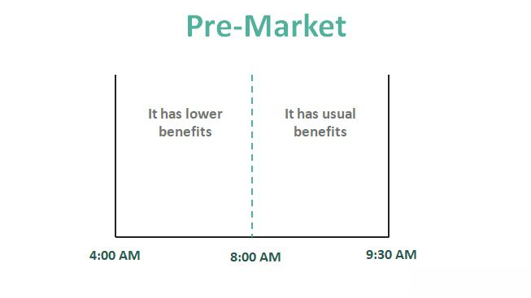

In the evolving world of stock trading, after-hours and pre-market trading have become essential tools for active traders and investors aiming to enhance their investment strategies. These trading sessions, occurring outside the standard trading hours of 9:30 a.m. to 4 p.m. Eastern Time (ET), present unique opportunities for market participants to react swiftly to news and events. However, they also pose significant challenges, often marked by heightened volatility and constraints on liquidity due to lower trading volumes.

After-hours trading typically takes place between 4 p.m. and 8 p.m. ET, while pre-market trading occurs from 4 a.m. to 9:30 a.m. ET. During these periods, traders and investors can capitalize on price movements prompted by after-market earnings reports, geopolitical events, or economic indicators released outside regular market hours. The ability to engage in trading during these sessions can be crucial for those looking to quickly respond to dynamic market conditions or secure advantageous entry and exit points.



Algorithmic trading, which involves utilizing computer algorithms to execute trades based on pre-defined criteria, serves as a powerful approach to navigating these unconventional trading hours. By automating the trading process, algorithmic systems can efficiently manage large volumes of data, execute trades at optimal prices, and mitigate risks associated with low liquidity environments. This technological advancement aids traders in overcoming the challenges posed by after-hours and pre-market sessions, enabling more informed decision-making and potentially enhancing portfolio performance.

In this article, we explore the intricacies of after-hours and pre-market trading, assess viable strategies for maximizing trading outcomes, and examine how the integration of algorithmic trading can assist investors in leveraging these extended hours effectively. Understanding and exploiting these unique trading sessions can be instrumental in achieving superior investment results.

## Table of Contents

## Understanding After-Hours and Pre-Market Trading

After-hours trading is conducted from 4 p.m. to 8 p.m. Eastern Time (ET) after the official market has closed. Pre-market trading, on the other hand, is available from 4 a.m. to 9:30 a.m. ET, prior to the market's opening bell. These extended trading sessions cater to investors seeking to react promptly to breaking news and events that transpire beyond the constraints of regular market hours. This capability provides an avenue for potentially capitalizing on price fluctuations that occur as a result.

The flexibility offered by after-hours and pre-market trading is particularly advantageous in swiftly altering market environments. For instance, significant economic announcements or unforeseen corporate developments released outside standard trading periods can influence investor sentiment and subsequently drive fluctuations in asset prices. Engaging in trading activities during these sessions enables investors to align their strategies according to current information, potentially reaping benefits before the market response during normal hours.

Despite the apparent advantages, extended trading hours present considerable challenges. One of the primary concerns is the reduced [liquidity](/wiki/liquidity-risk-premium) characteristic of these periods. With fewer active participants in after-hours and pre-market sessions compared to regular hours, the bid-ask spreads often widen. This situation can escalate transaction costs and negatively impact the profitability of trades. Furthermore, low liquidity intensifies the risk of price [volatility](/wiki/volatility-trading-strategies). As market participants process new information with limited trading [volume](/wiki/volume-trading-strategy), abrupt price shifts can arise, posing challenges for traders seeking stability.

In conclusion, while the extended trading sessions offer opportunities to respond to time-sensitive events, they are accompanied by risks like diminished liquidity and heightened volatility. Investors must weigh these factors when deciding to trade outside the bounds of standard market hours.

## Influence of Economic Indicators and News Releases

Economic indicators and corporate earnings reports significantly influence stock prices during after-hours and pre-market trading. These trading sessions, taking place outside the traditional market hours, provide an opportunity for investors to react swiftly to newly released data, potentially leading to substantial price movements.

Economic indicators, such as Gross Domestic Product (GDP), unemployment rates, or inflation figures, are essential for assessing the overall health of an economy. These indicators often get released early in the morning or after regular trading hours, enabling market participants to interpret and react before the standard market opens. For instance, a higher-than-expected GDP growth rate can signal economic strength, possibly boosting investor confidence and causing prices to surge during pre-market trading.

Similarly, corporate earnings announcements are pivotal events. Companies often choose to release earnings reports after the market closes to avoid immediate price swings that can occur during regular trading hours. These reports provide insights into a company's financial health and future prospects. Positive earnings surprises, where reported earnings surpass analysts' expectations, can lead to a sudden spike in stock prices during after-hours trading. Conversely, earnings that fall short of expectations can result in sharp declines.

The critical nature of these data releases means they often set the tone for the subsequent trading day. Investors and traders closely monitor such announcements, making pre-market and after-hours trading sessions particularly sensitive periods that may feature sharp price movements. These sessions require careful strategy and risk management, given their associated volatility and liquidity constraints. In sum, understanding the timing and impact of economic indicators and corporate earnings is crucial for engaging effectively in after-hours and pre-market trading.

## Strategies for After-Hours and Pre-Market Trading

In after-hours and pre-market trading, strategic approaches are essential for managing risks and capturing opportunities. Traders often employ a combination of fundamental and technical analysis to make informed decisions.

News trading remains a cornerstone strategy for these sessions. This approach involves closely monitoring real-time news feeds to react swiftly to events that can sway market sentiment. Given the lack of liquidity and heightened price sensitivity during these hours, breaking news can lead to substantial price movements, presenting both opportunities and challenges for traders.

Technical analysis can be particularly useful in these sessions, as traders rely on historical price data and chart patterns to anticipate future movements. Key technical indicators such as moving averages, Relative Strength Index (RSI), and Bollinger Bands might be utilized to identify potential entry and [exit](/wiki/exit-strategy) points. For instance, a [breakout](/wiki/breakout-trading) strategy, which identifies and trades on significant price movements beyond established support or resistance levels, can be beneficial when market activity is mostly dominated by news catalysts.

Given the reduced liquidity typical of after-hours markets, using limit orders is a widely recommended practice. Unlike market orders, which execute at any current price, limit orders allow traders to specify the maximum price they are willing to pay for a buy or the minimum price they are willing to accept for a sell. This strategy helps mitigate the risks associated with large bid-ask spreads and price slippage, providing greater control over trade execution and protecting against unfavorable price changes.

Here is how one might set up a basic limit order in Python using a hypothetical trading API:

```python
def place_limit_order(symbol, quantity, limit_price, order_type='buy'):
    try:
        # Hypothetical method to place a limit order
        response = trading_api.place_order(
            symbol=symbol,
            quantity=quantity,
            price=limit_price,
            order_type='limit',
            side=order_type
        )
        return response
    except Exception as e:
        print(f"An error occurred: {e}")

# Example usage
response = place_limit_order('AAPL', 10, 150.00)
print(response)
```

This code snippet demonstrates the use of a limit order, where the trader specifies the stock symbol, order quantity, limit price, and order type. The objective is to ensure that the trade is executed only within the price boundaries set by the trader, thereby minimizing unexpected losses in volatile market conditions.

Overall, a well-rounded strategy integrating both real-time news and technical analysis, coupled with prudent order placement, can help traders navigate the nuanced landscape of after-hours and pre-market trading.

## The Role of Algorithmic Trading

Algorithmic trading is a method of executing orders using automated pre-programmed trading instructions that account for variables such as timing, price, and volume. This approach leverages complex algorithms capable of processing vast amounts of data at high speed, thus enabling traders to execute orders more efficiently in after-hours markets, which are characterized by lower liquidity and increased volatility.

One of the primary advantages of [algorithmic trading](/wiki/algorithmic-trading), particularly during after-hours sessions, is its capability to handle and analyze large datasets quickly. This ability not only supports the identification of market trends that human traders might miss but also provides a means to capitalize on these trends promptly. Algorithms employ a variety of quantitative strategies, ranging from simple moving averages and mean reversion techniques to more sophisticated models like statistical [arbitrage](/wiki/arbitrage) and [machine learning](/wiki/machine-learning)-based predictions.

In mathematically expressing some of these strategies, consider the example of a simple moving average (SMA) that might be used within an algorithm. The SMA can be defined as:

$$
\text{SMA}_n = \frac{1}{n} \sum_{i=0}^{n-1} P_{t-i}
$$

where $P_{t-i}$ represents the price at time $t-i$ and $n$ is the period over which the average is calculated. Algorithms can use such calculations to generate buy or sell signals based on price movements relative to the moving average.

Algorithmic trading can also execute orders by segmenting them in a way that minimizes market impact. For instance, an algorithm might use a time-weighted average price (TWAP) strategy, which spreads a large order over a specified time period to match the average market price. This is particularly useful in after-hours trading, where large orders can disproportionately affect the market price.

Moreover, these algorithms can be programmed with a variety of triggers—whether they are price thresholds, time intervals, or indicators derived from technical analysis—that determine when to place trades. This programmable nature allows for the execution of trading strategies based on predefined criteria tailored to specific market conditions, enhancing the ability to respond promptly to rapidly changing after-hours market environments.

In Python, for example, a simple algorithmic strategy might be programmed as follows:

```python
import numpy as np
import pandas as pd

# Example price data
prices = pd.Series([100, 102, 101, 105, 107, 110])

# Calculate Simple Moving Average
def calculate_sma(prices, window):
    return prices.rolling(window=window).mean()

sma_3 = calculate_sma(prices, window=3)

# Simulated trading signal based on SMA
buy_signal = prices > sma_3

print("Prices:\n", prices)
print("SMA:\n", sma_3)
print("Buy Signals:\n", buy_signal)
```

This code snippet calculates a 3-period simple moving average and derives trading signals based on whether the price is above the moving average.

Overall, algorithmic trading reduces the complexity inherent in after-hours trading by leveraging technology to make data-driven decisions swiftly and accurately, offering a higher level of precision and control over trading operations.

## Pros and Cons of After-Hours Trading

After-hours trading offers several advantages for investors, chiefly among them the capability to respond to news events immediately. For example, corporate earnings reports and significant economic data releases frequently occur outside standard market hours, creating potential opportunities for traders to capture price movements before the regular trading session commences. The ability to trade during these times allows investors to capitalize on after-hours news, potentially gaining a competitive edge over those who wait for the market to open.

Another advantage is the increased accessibility to a range of opportunities. After-hours trading enables participation in global financial markets by accommodating international events and announcements that might not align with the standard trading hours of one's local market. This flexibility can be particularly beneficial for investors looking to trade in foreign markets or those who wish to hedge their positions against overnight developments.

Moreover, the potential for significant price movements is a distinguishing characteristic of after-hours trading. Due to the lower volume and fewer participants, stocks can experience more considerable price swings in reaction to news events. While this volatility presents risks, it also offers the possibility of substantial returns for those who can accurately predict market direction.

However, these benefits come with certain drawbacks. One primary concern is the low liquidity typically observed during after-hours trading. With fewer participants in the market, the number of buy and sell orders is reduced, making it more challenging to execute large trades without impacting the stock price. This low liquidity can lead to more significant bid-ask spreads, increasing the cost of trading. Wider spreads mean that buyers and sellers might need to accept prices further from the current market price, which can reduce potential profits or increase losses.

High volatility is another important consideration. The same factors that contribute to the potential for significant price movements also lead to unpredictable market behavior. Reduced liquidity can amplify price changes, and sudden movements can occur due to even relatively minor news or data updates. Traders must be prepared for this unpredictability, which can lead to quick gains or abrupt losses.

The combination of low liquidity and high volatility also contributes to the challenges of placing and executing trades effectively. Limit orders are often recommended to help mitigate some risks, yet even these cannot entirely eliminate the challenges posed by the after-hours market environment. Consequently, traders must thoroughly understand the intricacies of after-hours trading and maintain a risk management strategy to protect their investments.

## Conclusion

After-hours and pre-market trading offer investors the opportunity to engage with the market beyond conventional hours. These sessions provide the advantage of immediate response to significant news and events, often leading to noticeable price movements. However, they also come with inherent challenges, such as reduced liquidity and higher volatility, which necessitate a cautious approach.

The integration of algorithmic trading into after-hours and pre-market sessions has transformed how investors can approach these opportunities. By leveraging sophisticated algorithms, traders can execute rapid, data-driven decisions that mitigate some of the drawbacks associated with extended hours trading. These algorithms can process large volumes of information and execute trades based on predefined criteria, enhancing the efficiency and precision of trading strategies.

For investors, a comprehensive understanding and strategic utilization of after-hours and pre-market trading can be advantageous. By carefully balancing the potential benefits with the associated risks, and by incorporating advanced tools like algorithmic trading, investors can significantly enhance their portfolio performance. Ultimately, success in these trading sessions depends on a well-informed, tactical approach that capitalizes on timely market information and robust execution methodologies.

## References & Further Reading

[1]: Bergstra, J., Bardenet, R., Bengio, Y., & Kégl, B. (2011). ["Algorithms for Hyper-Parameter Optimization."](https://papers.nips.cc/paper/4443-algorithms-for-hyper-parameter-optimization) Advances in Neural Information Processing Systems 24.

[2]: ["Advances in Financial Machine Learning"](https://www.amazon.com/Advances-Financial-Machine-Learning-Marcos/dp/1119482089) by Marcos Lopez de Prado

[3]: ["Evidence-Based Technical Analysis: Applying the Scientific Method and Statistical Inference to Trading Signals"](https://www.amazon.com/Evidence-Based-Technical-Analysis-Scientific-Statistical/dp/0470008741) by David Aronson

[4]: ["Machine Learning for Algorithmic Trading"](https://github.com/stefan-jansen/machine-learning-for-trading) by Stefan Jansen

[5]: ["Quantitative Trading: How to Build Your Own Algorithmic Trading Business"](https://www.amazon.com/Quantitative-Trading-Build-Algorithmic-Business/dp/1119800064) by Ernest P. Chan