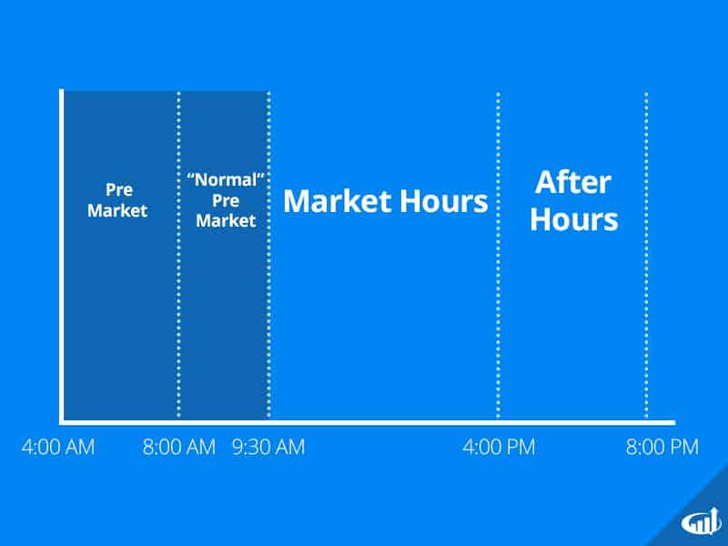

## Table of Contents

## What is pre-market trading and how does it differ from regular trading hours?

Pre-market trading is when people can buy and sell stocks before the regular market opens. In the United States, the regular market opens at 9:30 AM Eastern Time, but pre-market trading can start as early as 4:00 AM. This early trading lets investors react to news or events that happen overnight or before the market opens. Not all stocks can be traded during pre-market, and the trading volume is usually lower than during regular hours.

Regular trading hours are different because they happen when the market is officially open, from 9:30 AM to 4:00 PM Eastern Time. During these hours, more people are trading, so there are more buyers and sellers, which usually means prices move more smoothly. Also, all stocks that are listed on the market can be traded during these hours. Pre-market trading can be riskier because there are fewer people trading, which can make prices jump around more.

## What is after-hours trading and what are its key characteristics?

After-hours trading is when people can buy and sell stocks after the regular market closes. In the United States, the regular market closes at 4:00 PM Eastern Time, but after-hours trading can go on until 8:00 PM. This allows investors to react to news or events that happen after the market closes. Like pre-market trading, not all stocks can be traded during after-hours, and the trading volume is usually lower than during regular hours.

The key characteristics of after-hours trading include lower [liquidity](/wiki/liquidity-risk-premium), which means fewer people are trading, so it can be harder to buy or sell stocks quickly. This can lead to bigger price swings because there are fewer buyers and sellers to balance out the market. Also, because fewer people are watching the market, it can be riskier. Investors need to be careful and understand that the prices during after-hours might not be the same when the regular market opens the next day.

## What are the basic rules and regulations for trading outside of regular market hours?

Trading outside of regular market hours, like in pre-market and after-hours sessions, has some basic rules you need to know. First, not every stock can be traded during these times. Usually, only stocks from big companies are available. Also, you need to use a special type of order called a "limit order" instead of a "market order." A limit order lets you set a specific price you're willing to buy or sell at, which helps protect you from big price swings that can happen when fewer people are trading.

Another important rule is that trading outside regular hours can be riskier. There are fewer people buying and selling, so it can be harder to find someone to trade with. This means the price of a stock can change a lot more than during regular hours. Also, the prices you see after hours might not be the same when the market opens the next day. Because of these risks, it's a good idea to be careful and maybe not trade as much money as you would during regular hours.

Lastly, different trading platforms might have their own rules for trading outside regular hours. Some might let you trade earlier or later than others, and some might have different fees. It's important to check with your broker to understand what times you can trade and any extra costs you might have to pay. Always make sure you understand the rules before you start trading outside of regular market hours.

## How can beginners safely participate in pre-market and after-hours trading?

For beginners, safely participating in pre-market and after-hours trading means understanding the risks and taking steps to manage them. These trading sessions can be more volatile because fewer people are trading, which can lead to big price swings. To stay safe, beginners should start by using limit orders, which let you set a specific price to buy or sell a stock. This can protect you from sudden changes in price. Also, it's a good idea to trade only with money you can afford to lose, since the risks are higher outside regular hours.

Another important tip for beginners is to do a lot of research before trading outside regular hours. Check the news and any events that might affect the stock you're interested in, because these can cause big price changes. It's also smart to start small, trading just a little bit of money until you get used to how things work. Finally, make sure to use a reliable trading platform and understand their rules for pre-market and after-hours trading. This way, you can trade more safely and confidently.

## What are the common strategies used by traders during pre-market and after-hours sessions?

Traders often use pre-market and after-hours sessions to react quickly to news and events that happen outside regular trading hours. For example, if a company announces good earnings after the market closes, traders might buy the stock during after-hours to get it at a lower price before everyone else starts buying when the market opens. They might also use these times to get ahead of the market by setting up trades that will happen as soon as the regular market opens. This way, they can take advantage of any big price moves that happen at the start of the day.

Another common strategy is to use limit orders to manage risk. Since trading outside regular hours can be more volatile, traders set specific prices at which they are willing to buy or sell. This helps them avoid big losses if the price suddenly changes a lot. Some traders also look for stocks that are moving a lot during pre-market or after-hours and try to make quick profits from these movements. They might buy a stock that's going up and sell it quickly for a small profit, or do the opposite if they think a stock will keep going down.

## How do economic reports and news releases impact pre-market and after-hours trading?

Economic reports and news releases can have a big impact on pre-market and after-hours trading. When important news comes out, like a company's earnings report or a big economic update, it can make stock prices move a lot during these times. Traders watch these reports closely because they want to be the first to react. For example, if a company announces better-than-expected earnings after the market closes, traders might start buying the stock during after-hours, hoping to get it at a good price before everyone else jumps in when the market opens.

These reactions can cause big price swings because fewer people are trading during pre-market and after-hours sessions. If a lot of traders decide to buy or sell a stock at the same time because of a news release, the price can change quickly. This can be good for traders who want to take advantage of these moves, but it can also be risky. Since the prices during these times might not be the same when the regular market opens, traders need to be careful and use strategies like limit orders to manage their risks.

## What are the risks associated with trading outside of regular market hours and how can they be mitigated?

Trading outside of regular market hours, like in pre-market and after-hours sessions, can be risky. One big risk is lower liquidity, which means there are fewer people buying and selling stocks. This can make it harder to find someone to trade with and can lead to bigger price swings. If you try to buy or sell a stock and there aren't many people trading, the price can change a lot more than during regular hours. Another risk is that the prices you see during these times might not be the same when the market opens the next day. This can happen because fewer people are watching the market, and big news or events can cause quick changes in stock prices.

To mitigate these risks, you can use limit orders instead of market orders. A limit order lets you set a specific price you're willing to buy or sell at, which can protect you from sudden price changes. It's also smart to only trade with money you can afford to lose, since the risks are higher outside regular hours. Doing your research before trading is important too. Check the news and any events that might affect the stock you're interested in, because these can cause big price changes. Starting small and trading just a little bit of money until you get used to how things work can also help you stay safe.

## How can advanced traders use technical analysis in pre-market and after-hours trading?

Advanced traders can use technical analysis in pre-market and after-hours trading to spot trends and make smart decisions. They look at charts and use tools like moving averages, support and resistance levels, and [volume](/wiki/volume-trading-strategy) indicators to see how a stock is moving. Even though there are fewer people trading during these times, the prices can still give important clues. For example, if a stock is moving up a lot in pre-market, it might be because of good news, and the trader can use technical analysis to decide if it's a good time to buy or if the price might keep going up when the market opens.

Using technical analysis during these times can be tricky because the prices can change a lot more than during regular hours. But advanced traders can still find it useful. They might look at how a stock is moving compared to its usual patterns to see if it's likely to keep going the same way or change direction. They can also use this information to set up trades that will happen as soon as the market opens, trying to get ahead of other traders. By understanding how to read these charts and use technical tools, advanced traders can make better choices and maybe even make more money, even though it's riskier to trade outside regular hours.

## What role do market makers and liquidity providers play in pre-market and after-hours trading?

Market makers and liquidity providers are really important for pre-market and after-hours trading. They help make sure there are enough buyers and sellers even when fewer people are trading. Market makers are like middlemen who are always ready to buy or sell stocks. This helps keep the market running smoothly, even outside regular hours. Without them, it would be harder for traders to find someone to trade with, and the prices could jump around a lot more.

Liquidity providers also help by adding more stocks to the market. They make it easier for traders to buy and sell because there are more options available. This can make trading outside regular hours a bit less risky because there's more action happening. Both market makers and liquidity providers play a big role in making sure that pre-market and after-hours trading can happen without too many problems.

## How can traders leverage volatility in pre-market and after-hours sessions for potential gains?

Traders can make money from the big price swings that happen during pre-market and after-hours trading. When fewer people are trading, prices can move a lot more than during regular hours. Traders can use this to their advantage by buying stocks that are going up quickly and selling them for a profit soon after. They might also sell stocks that are dropping fast, hoping to buy them back later at a lower price. It's like trying to catch a wave at just the right time to ride it to the shore.

To do this well, traders need to be quick and careful. They should use limit orders to set a specific price they're willing to buy or sell at, which can help them avoid big losses if the price suddenly changes a lot. It's also important to keep an eye on the news and any events that might affect stock prices during these times. By understanding why prices are moving and using the right tools, traders can try to make gains from the ups and downs in pre-market and after-hours sessions.

## What advanced tools and platforms are available for effective pre-market and after-hours trading?

For effective pre-market and after-hours trading, advanced traders can use special tools and platforms. One popular platform is thinkorswim by TD Ameritrade. It has lots of tools like real-time charts, technical indicators, and the ability to set up custom alerts. This helps traders see what's happening with stocks even when the market is closed. Another useful platform is [Interactive Brokers](/wiki/interactive-brokers-api)' Trader Workstation, which lets traders trade around the world and gives them access to a lot of data and research tools. Both of these platforms make it easier to trade outside regular hours because they give traders the information they need to make smart decisions.

Another helpful tool is Level II quotes, which show more details about who's buying and selling stocks. This can be really useful during pre-market and after-hours sessions because it helps traders see where the price might be heading. Some traders also use algorithmic trading software, like TradeStation, which can automatically buy and sell stocks based on certain rules. This can be good for taking advantage of quick price changes without having to watch the market all the time. By using these advanced tools and platforms, traders can better handle the ups and downs of trading outside regular market hours.

## How do expert traders adjust their strategies based on pre-market and after-hours trading data?

Expert traders use pre-market and after-hours trading data to make smarter choices. They look at how stocks are moving before and after the regular market to guess what might happen when it opens. For example, if a stock is going up a lot in pre-market because of good news, they might decide to buy it early to get a better price. They also watch for big price swings and use this information to set up trades that will happen as soon as the market opens. By understanding these early moves, they can get ahead of other traders and maybe make more money.

They also change their trading plans based on what they see in these sessions. If a stock is moving a lot after hours, they might use tools like limit orders to protect themselves from sudden changes. They might also decide to trade less money if things seem too risky. By keeping an eye on pre-market and after-hours data, expert traders can adjust their strategies to take advantage of opportunities and avoid big losses.

## What is the Role of Algorithmic Trading?

Algorithmic trading is a method of executing orders using automated pre-programmed trading instructions that account for variables such as timing, price, and volume. This approach leverages complex algorithms capable of processing vast amounts of data at high speed, thus enabling traders to execute orders more efficiently in after-hours markets, which are characterized by lower liquidity and increased [volatility](/wiki/volatility-trading-strategies).

One of the primary advantages of [algorithmic trading](/wiki/algorithmic-trading), particularly during after-hours sessions, is its capability to handle and analyze large datasets quickly. This ability not only supports the identification of market trends that human traders might miss but also provides a means to capitalize on these trends promptly. Algorithms employ a variety of quantitative strategies, ranging from simple moving averages and mean reversion techniques to more sophisticated models like statistical [arbitrage](/wiki/arbitrage) and [machine learning](/wiki/machine-learning)-based predictions.

In mathematically expressing some of these strategies, consider the example of a simple moving average (SMA) that might be used within an algorithm. The SMA can be defined as:

$$
\text{SMA}_n = \frac{1}{n} \sum_{i=0}^{n-1} P_{t-i}
$$

where $P_{t-i}$ represents the price at time $t-i$ and $n$ is the period over which the average is calculated. Algorithms can use such calculations to generate buy or sell signals based on price movements relative to the moving average.

Algorithmic trading can also execute orders by segmenting them in a way that minimizes market impact. For instance, an algorithm might use a time-weighted average price (TWAP) strategy, which spreads a large order over a specified time period to match the average market price. This is particularly useful in after-hours trading, where large orders can disproportionately affect the market price.

Moreover, these algorithms can be programmed with a variety of triggers—whether they are price thresholds, time intervals, or indicators derived from technical analysis—that determine when to place trades. This programmable nature allows for the execution of trading strategies based on predefined criteria tailored to specific market conditions, enhancing the ability to respond promptly to rapidly changing after-hours market environments.

In Python, for example, a simple algorithmic strategy might be programmed as follows:

```python
import numpy as np
import pandas as pd

# Example price data
prices = pd.Series([100, 102, 101, 105, 107, 110])

# Calculate Simple Moving Average
def calculate_sma(prices, window):
    return prices.rolling(window=window).mean()

sma_3 = calculate_sma(prices, window=3)

# Simulated trading signal based on SMA
buy_signal = prices > sma_3

print("Prices:\n", prices)
print("SMA:\n", sma_3)
print("Buy Signals:\n", buy_signal)
```

This code snippet calculates a 3-period simple moving average and derives trading signals based on whether the price is above the moving average.

Overall, algorithmic trading reduces the complexity inherent in after-hours trading by leveraging technology to make data-driven decisions swiftly and accurately, offering a higher level of precision and control over trading operations.

## References & Further Reading

[1]: Bergstra, J., Bardenet, R., Bengio, Y., & Kégl, B. (2011). ["Algorithms for Hyper-Parameter Optimization."](https://papers.nips.cc/paper/4443-algorithms-for-hyper-parameter-optimization) Advances in Neural Information Processing Systems 24.

[2]: ["Advances in Financial Machine Learning"](https://www.amazon.com/Advances-Financial-Machine-Learning-Marcos/dp/1119482089) by Marcos Lopez de Prado

[3]: ["Evidence-Based Technical Analysis: Applying the Scientific Method and Statistical Inference to Trading Signals"](https://www.amazon.com/Evidence-Based-Technical-Analysis-Scientific-Statistical/dp/0470008741) by David Aronson

[4]: ["Machine Learning for Algorithmic Trading"](https://github.com/stefan-jansen/machine-learning-for-trading) by Stefan Jansen

[5]: ["Quantitative Trading: How to Build Your Own Algorithmic Trading Business"](https://www.amazon.com/Quantitative-Trading-Build-Algorithmic-Business/dp/1119800064) by Ernest P. Chan